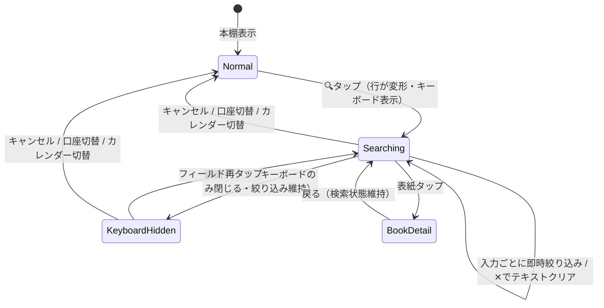

# BookBank 本棚内検索 仕様書

作成日: 2026-07-07
更新日: 2026-07-08（実装確定に伴い 3.1/3.2/3.4/5/7/8 を更新）
ステータス: 実装済み（R2 同乗・S）
関連文書: `DESIGN_SYSTEM.md` / `docs/implementation-roadmap.md`（リリース位置づけは第10章）

> **AI実装エージェントへ**: `docs/agent-implementation-guide.md` を先に読むこと。
> **確定判断（初版からの上書き）**: (1) 検索対象はタイトル・著者のみ（メモ・シリーズ名・出版社は初期スコープ外）。(2) 0件時はオンライン検索（登録）への導線を出す（初版の「誘導しない」を上書き）。E-B（フィルター行インライン展開）・1文字ごとの即時絞り込みは初版どおり採用。

---

## 1. 目的と位置づけ

**自分の本棚から本を素早く見つける**ためのローカル検索。冊数が増えるほど（特に100冊超）グリッドのスクロールだけでは目的の本に到達できなくなる問題を解決する。

### 1.1 既存の「書籍検索」との区別（最重要の設計制約）

| | 書籍検索（既存 `BookSearchView`） | 本棚内検索（本仕様） |
|--|--|--|
| 目的 | **登録するため**の検索（外部APIから探す） | **見つけるため**の検索（所有本から探す） |
| データ源 | 楽天/Google/NAVER API（ネットワーク） | ローカルの `UserBook`（オフライン完結） |
| 画面形式 | 専用画面へ遷移・検索バー＋**リスト**表示 | 本棚に**とどまり**、**グリッドをその場で絞り込む** |
| 実行タイミング | 検索ボタン/Enterで実行（API呼び出し） | **1文字ごとの即時絞り込み**（ライブ検索） |
| 結果タップ | 登録フロー（口座・価格） | `UserBookDetailView`（既存の本の詳細） |

**UIを分ける理由**: 「検索バー＋リスト」の形は登録検索の記号として既に学習されている。本棚内検索が同じ見た目だと「これは新しい本を探す画面だ」と誤認され、登録済みの本を二重登録しようとする混乱を招く。本棚内検索は**画面遷移せず・リスト化もせず・本棚のグリッドがそのまま絞られる**体験にすることで、機能の違いを見た目の違いとして伝える。

---

## 2. エントリポイント（起動方法）

### 2.1 案の比較

| 案 | 方式 | 長所 | 短所 |
|----|------|------|------|
| E-A | 標準の `.searchable`（ナビゲーションバー下に検索バー） | 実装最小 | 見た目が登録検索の検索バーと酷似し、1.1節の区別方針に反する。テーマカラー背景との馴染みも悪い |
| E-B | **フィルター行に虫眼鏡ボタンを追加し、タップでフィルター行全体が検索フィールドに変形（インライン展開）** | 本棚のUI文法（ピル行）の中で完結。フィルターと検索が同じ場所＝「本棚を絞る道具」という意味の一貫性 | フィルター行のレイアウト切替の実装が必要 |
| E-C | カレンダーボタンと並ぶ丸グラスボタン＋モーダルシートで検索 | ボタン様式は既存と揃う | シートに出た瞬間「別画面」になり、その場絞り込みの良さが消える |

**推奨 (仮): E-B（フィルター行のインライン展開）**。

### 2.2 レイアウト仕様（E-B）

**通常時**（現行のフィルター行に虫眼鏡を追加）:

```
[すべて 128] [お気に入り 12] [メモ 34]   ←スクロール      (🔍) (📅)
```

- 虫眼鏡ボタン: カレンダーボタンの**左隣**。同じ丸グラス様式（40×40・`passbookCircleGlass(tint: actionButtonGlassTint)`・アイコン20px・色は `calendarToggleIconColor` と同じ判定）
- SFSymbol: `magnifyingglass`

**検索時**（虫眼鏡タップで同じ行が変形。`.easeInOut(duration: 0.2)` で遷移）:

```
[🔍 (テキストフィールド…………………) ✕]  キャンセル
```

- フィルターピル群とカレンダーボタンは非表示になり、行全体が検索フィールドになる
- 検索フィールド: 高さ40・角丸カプセル・`strokeBorder(bookshelfControlColor.opacity(0.3))`・背景 `bookshelfControlColor.opacity(0.08)`。文字色/プレースホルダは `bookshelfControlColor`（テーマ色背景でも視認できる本棚専用の配色。**登録検索の角丸10pxグレー検索バーとは意図的に異なる形**にする）
- プレースホルダ: 「本棚から探す（タイトル・著者名）」（`bookshelf.search.placeholder`）
- `✕`（クリア）: 入力があるときのみ表示。タップでテキストのみクリア（検索モードは維持）
- 「キャンセル」テキストボタン: 検索モードを終了し通常のフィルター行へ戻る（テキストもクリア）
- 展開と同時にキーボードフォーカス（`@FocusState`）
- キーボード外タップで閉じる（DESIGN_SYSTEM 17章のルール。ただし**検索モード自体は維持**し、キーボードだけ閉じる）

---

## 3. 検索の挙動

### 3.1 対象フィールドとマッチング

| 対象 | フィールド | 備考 |
|------|-----------|------|
| タイトル | `UserBook.title` | 主対象 |
| 著者 | `UserBook.author` | 主対象 |

- **確定スコープ: タイトル・著者のみ**。シリーズ名・出版社・メモは**初期スコープ外**。特にメモ検索は将来のメモ帳機能とセットで実装するため、今回は含めない（メモのみマッチのバッジ表示も本スコープ外）
- **部分一致**（contains）。複数語（空白区切り）は **AND条件**（全語がいずれかのフィールドにマッチ）
- **正規化**: 小文字化＋**ひらがな⇔カタカナ同一視**＋全角/半角・大文字/小文字・濁点等のゆれを吸収し、**空白を除去**（「東野圭吾」＝「東野 圭吾」を同一視）。実装は `String.applyingTransform(.hiraganaToKatakana)` ＋ `folding(options: [.caseInsensitive, .widthInsensitive, .diacriticInsensitive])` ＋ 空白除去（純関数 `ShelfSearchMatcher` に集約）。「murakami / MURAKAMI / ムラカミ / むらかみ / ﾑﾗｶﾐ」等が同一の正規形になる。空白でのクエリ語分割（AND）は正規化前に行うため影響しない
- 漢字の読み検索（「はるき」→「春樹」）・長音符のゆれ吸収は**初期スコープ外**（読み仮名データを持っていないため。将来検討）

### 3.2 実行タイミングと性能

- **1文字ごとの即時絞り込み**。データはローカル（`passbookBooks` 配列）なので、1,000冊規模でも同期フィルタで十分
- 対象がタイトル＋著者のみのため、毎キーストロークの全冊正規化でも軽量な文字列操作 O(n) で1フレーム内に収まる（確定: まずはインライン計算。実測でフレーム落ちする場合のみ正規化キーのキャッシュ／デバウンスを追加）
- 世代管理・非同期は**不要**（オンライン検索と違いネットワークが無く、同期で完結するため）

### 3.3 既存フィルターとの合成

- 検索は既存のフィルター（お気に入り・メモあり）と**AND合成**する。合成順: 口座 → お気に入り/メモフィルター → 検索語
- ただし検索モード中はフィルターピルが非表示（2.2節）のため、**検索開始時点のフィルター状態を維持したまま**検索が重なる。検索モードを閉じるとフィルター状態はそのまま残る
- 並び順は本棚と同じ `registeredAt` 降順を維持する（関連度ソートはしない。「本棚が絞られる」というメンタルモデルを守る）

### 3.4 結果表示

- **本棚グリッド（4カラム・`BookCoverView`）をそのまま絞り込む**。行レイアウトへの切替はしない（1.1節）
- 検索フィールド直下に件数を表示: 「12冊」（`bookshelf.search.result_count`・`%lld`）。`.caption`・`bookshelfControlColor.opacity(0.7)`
- メモマッチバッジは**本スコープ外**（メモを検索対象にしないため。メモ検索実装時に併せて導入）
- 0件時（確定）: `magnifyingglass` 60px＋「見つかりませんでした」（`bookshelf.search.empty_title`）＋「タイトル・著者から検索できます」（`bookshelf.search.empty_message`）に加え、**オンライン検索（登録）への導線**を出す（`bookshelf.search.online_cta`「オンラインで検索して登録」→ `BookSearchDestination(passbook: registrationPassbook)` へ遷移）。登録先口座が無い場合（`registrationPassbook == nil`）は導線を出さない。※本項は仕様初版の「登録検索への誘導はしない」を上書きする確定判断
- 結果タップ → `UserBookDetailView`（既存の `NavigationLink` のまま）。詳細から戻ると**検索状態は維持**されている

### 3.5 スコープと画面状態

- 検索対象は**表示中の口座の本**（総合口座なら全冊、個別口座ならその口座のみ）。現行 `passbookBooks` の定義に従う
- 口座切替（C-2のパスリセット）・タブ切替で検索モードは**リセット**（テキストクリア＋通常行へ）
- カレンダー表示モード中は検索ボタンを表示しない（カレンダーは日付軸の探索であり、テキスト検索と混ぜない）

---

## 4. 状態遷移



---

## 5. ローカライズ

`Localizable.xcstrings` に追加（5言語: ja / en / ko / zh-Hans / zh-Hant）:

| キー | ja | en |
|------|----|----|
| `bookshelf.search.placeholder` | 本棚から探す（タイトル・著者名） | Search your shelf (title, author) |
| `bookshelf.search.result_count` | %lld冊 | %lld books |
| `bookshelf.search.empty_title` | 見つかりませんでした | No results |
| `bookshelf.search.empty_message` | タイトル・著者から検索できます | Search by title or author |
| `bookshelf.search.online_cta` | オンラインで検索して登録 | Search online to register |
| `common.cancel`（既存） | キャンセル | Cancel |

ko / zh-Hans / zh-Hant も同時追加済み（既存キーのトーンに合わせて翻訳）。

---

## 6. アクセシビリティ・細部

- 検索フィールドに `accessibilityLabel("本棚から探す")`。虫眼鏡ボタンに `accessibilityLabel("本棚内を検索")`（カレンダーボタンと区別）
- Dynamic Type: フィールドの高さは40固定だがフォントは `.body` 追従。件数・空状態は既存トークンどおり
- 検索モードの展開/収納アニメーションは `.easeInOut(duration: 0.2)`（標準トークン）。Reduce Motion 有効時はクロスフェードのみ
- キーボードの `submitLabel` は `.done`（ライブ検索なので検索ボタン不要）

---

## 7. 実装ノート

| 変更対象 | 内容 |
|---------|------|
| `Views/BookshelfView.swift` | `@State isSearching` / `shelfSearchText` / `@FocusState` の追加。`filterSection` の条件分岐（通常行⇔検索行）。`userBooks` に検索語フィルターを合成。0件時のオンライン導線。カレンダー切替時のリセット（口座切替は既存の `.id` リセットで担保） |
| 新規 `Utils/ShelfSearchMatcher.swift` | 正規化（カナ同一視・幅/ケース/濁点無視）・AND部分一致。**純関数・ユニットテスト対象**（実装済み） |
| `Localizable.xcstrings` | 5章のキー追加（実装済み） |

- SwiftData の `@Query` 述語では検索しない（カナ正規化・複数フィールドOR・メモ判定を述語で書くと複雑化する。取得済み配列のメモリ内フィルタで十分）
- クラウド移行（リポジトリ抽象化）後も、検索はViewに渡されたDTO配列に対するメモリ内フィルタのまま成立する（Firestoreクエリ化は不要）

### テスト項目

1. 正規化: 「murakami / MURAKAMI / ムラカミ / むらかみ / ﾊﾙｷ」等の同一視、大文字/小文字英字、全角英数、濁点/アクセント（`ShelfSearchMatcher` の純関数ユニットテストで実施済み）
2. AND複数語: 「村上 1Q84」でタイトル＋著者の横断マッチ（実施済み）
3. フィルター（お気に入り）＋検索の合成
4. カレンダー切替でのリセット、詳細から戻った時の維持
5. 0件表示（オンライン導線）・件数表示・空文字（全件表示に戻る）

---

## 8. 対象外（本仕様でやらないこと）

- 漢字の読み仮名検索（3.1節）・あいまい一致（typo許容）・関連度ソート
- **メモ検索・シリーズ名/出版社検索**（3.1節。メモは将来のメモ帳機能とセットで実装）
- 検索履歴・保存済み検索
- 読了リスト内検索・通帳画面の検索（同じ `ShelfSearchMatcher` を使えば横展開可能。要望が出てから）

---

## 9. 将来の接続点

- **ノードグラフ（`node-graph-feature-design.md`）**: グラフ画面にも「本を探してフォーカス」導線が将来ほしくなる。`ShelfSearchMatcher` を共用できるよう、Viewに依存しない純関数として切り出しておく（7章）
- キーワード正規化ロジックはノード設計書の抽出パイプライン（NFKC等）と方針を揃えるが、**実装は共有しない**（あちらは名詞抽出・IDFを含む別物。過度な共通化をしない）

---

## 10. リリース位置づけ

`docs/implementation-roadmap.md` の **R2（v1.4.0・検索改修）に同乗**することを推奨 (仮)。

- 理由: (a) 検索まわりのテスト・リグレッション確認を1回にまとめられる、(b) 「登録検索の改善＋本棚内検索の新設」でリリースノートが「検索が良くなった」という1つの物語になる
- 依存は無いため、R2が重くなりすぎる場合は**単独リリース（v1.3.2等）に切り出してよい**（本機能はローカル完結・小規模で、他のどのフェーズにも影響しない）
