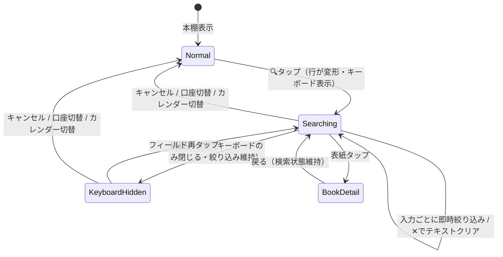

# BookBank 本棚内検索 仕様書

作成日: 2026-07-07
ステータス: 仕様（実装時に不備・矛盾を発見した場合は指摘・修正すること）
関連文書: `DESIGN_SYSTEM.md` / `docs/implementation-roadmap.md`（リリース位置づけは第10章）

> **AI実装エージェントへ**: `docs/agent-implementation-guide.md` を先に読むこと。本書の (仮) 推奨は確定仕様として実装する。

---

## 1. 目的と位置づけ

**自分の本棚から本を素早く見つける**ためのローカル検索。冊数が増えるほど（特に100冊超）グリッドのスクロールだけでは目的の本に到達できなくなる問題を解決する。

### 1.1 既存の「書籍検索」との区別（最重要の設計制約）

| | 書籍検索（既存 `BookSearchView`） | 本棚内検索（本仕様） |
|--|--|--|
| 目的 | **登録するため**の検索（外部APIから探す） | **見つけるため**の検索（所有本から探す） |
| データ源 | 楽天/Google/NAVER API（ネットワーク） | ローカルの `UserBook`（オフライン完結） |
| 画面形式 | 専用画面へ遷移・検索バー＋**リスト**表示 | 本棚に**とどまり**、**グリッドをその場で絞り込む** |
| 実行タイミング | 検索ボタン/Enterで実行（API呼び出し） | **1文字ごとの即時絞り込み**（ライブ検索） |
| 結果タップ | 登録フロー（口座・価格） | `UserBookDetailView`（既存の本の詳細） |

**UIを分ける理由**: 「検索バー＋リスト」の形は登録検索の記号として既に学習されている。本棚内検索が同じ見た目だと「これは新しい本を探す画面だ」と誤認され、登録済みの本を二重登録しようとする混乱を招く。本棚内検索は**画面遷移せず・リスト化もせず・本棚のグリッドがそのまま絞られる**体験にすることで、機能の違いを見た目の違いとして伝える。

---

## 2. エントリポイント（起動方法）

### 2.1 案の比較

| 案 | 方式 | 長所 | 短所 |
|----|------|------|------|
| E-A | 標準の `.searchable`（ナビゲーションバー下に検索バー） | 実装最小 | 見た目が登録検索の検索バーと酷似し、1.1節の区別方針に反する。テーマカラー背景との馴染みも悪い |
| E-B | **フィルター行に虫眼鏡ボタンを追加し、タップでフィルター行全体が検索フィールドに変形（インライン展開）** | 本棚のUI文法（ピル行）の中で完結。フィルターと検索が同じ場所＝「本棚を絞る道具」という意味の一貫性 | フィルター行のレイアウト切替の実装が必要 |
| E-C | カレンダーボタンと並ぶ丸グラスボタン＋モーダルシートで検索 | ボタン様式は既存と揃う | シートに出た瞬間「別画面」になり、その場絞り込みの良さが消える |

**推奨 (仮): E-B（フィルター行のインライン展開）**。

### 2.2 レイアウト仕様（E-B）

**通常時**（現行のフィルター行に虫眼鏡を追加）:

```
[すべて 128] [お気に入り 12] [メモ 34]   ←スクロール      (🔍) (📅)
```

- 虫眼鏡ボタン: カレンダーボタンの**左隣**。同じ丸グラス様式（40×40・`passbookCircleGlass(tint: actionButtonGlassTint)`・アイコン20px・色は `calendarToggleIconColor` と同じ判定）
- SFSymbol: `magnifyingglass`

**検索時**（虫眼鏡タップで同じ行が変形。`.easeInOut(duration: 0.2)` で遷移）:

```
[🔍 (テキストフィールド…………………) ✕]  キャンセル
```

- フィルターピル群とカレンダーボタンは非表示になり、行全体が検索フィールドになる
- 検索フィールド: 高さ40・角丸カプセル・`strokeBorder(bookshelfControlColor.opacity(0.3))`・背景 `bookshelfControlColor.opacity(0.08)`。文字色/プレースホルダは `bookshelfControlColor`（テーマ色背景でも視認できる本棚専用の配色。**登録検索の角丸10pxグレー検索バーとは意図的に異なる形**にする）
- プレースホルダ: 「本棚から探す」（`bookshelf.search.placeholder`）
- `✕`（クリア）: 入力があるときのみ表示。タップでテキストのみクリア（検索モードは維持）
- 「キャンセル」テキストボタン: 検索モードを終了し通常のフィルター行へ戻る（テキストもクリア）
- 展開と同時にキーボードフォーカス（`@FocusState`）
- キーボード外タップで閉じる（DESIGN_SYSTEM 17章のルール。ただし**検索モード自体は維持**し、キーボードだけ閉じる）

---

## 3. 検索の挙動

### 3.1 対象フィールドとマッチング

| 対象 | フィールド | 備考 |
|------|-----------|------|
| タイトル | `UserBook.title` | 主対象 |
| 著者 | `UserBook.author` | 主対象 |
| シリーズ名 | `UserBook.seriesName` | |
| 出版社 | `UserBook.publisher` | |
| メモ | `UserBook.memo` | 「あの感想を書いた本」を探せるのが本棚内検索の独自価値 |

- **部分一致**（contains）。複数語（空白区切り）は **AND条件**（全語がいずれかのフィールドにマッチ）
- **正規化**: NFKC正規化＋小文字化＋**ひらがな⇔カタカナ同一視**（「はるき」で「ハルキ」「春樹」のうちカナ表記にヒット）。全角/半角・大文字/小文字のゆれを吸収する。実装は `String.applyingTransform(.hiraganaToKatakana)` ＋ `folding(options: [.caseInsensitive, .widthInsensitive, .diacriticInsensitive])`
- 漢字の読み検索（「はるき」→「春樹」）は**初期スコープ外**（読み仮名データを持っていないため。将来検討）

### 3.2 実行タイミングと性能

- **1文字ごとの即時絞り込み**。データはローカル（`passbookBooks` 配列）なので、1,000冊規模でも同期フィルタで十分（正規化済み検索キーは本ごとに1回だけ生成してキャッシュする。`onChange(of: allUserBooks)` で無効化）
- デバウンスは**入れない**（ネットワークも重い計算もないため。実測でフレーム落ちする場合のみ 100ms を検討）

### 3.3 既存フィルターとの合成

- 検索は既存のフィルター（お気に入り・メモあり）と**AND合成**する。合成順: 口座 → お気に入り/メモフィルター → 検索語
- ただし検索モード中はフィルターピルが非表示（2.2節）のため、**検索開始時点のフィルター状態を維持したまま**検索が重なる。検索モードを閉じるとフィルター状態はそのまま残る
- 並び順は本棚と同じ `registeredAt` 降順を維持する（関連度ソートはしない。「本棚が絞られる」というメンタルモデルを守る）

### 3.4 結果表示

- **本棚グリッド（4カラム・`BookCoverView`）をそのまま絞り込む**。行レイアウトへの切替はしない（1.1節）
- 検索フィールド直下に件数を表示: 「12冊」（`bookshelf.search.result_count`・`%lld`）。`.caption`・`bookshelfControlColor.opacity(0.7)`
- **メモだけにマッチした本**（タイトル・著者等にはマッチしない）には表紙の右上にメモバッジ（`note.text` 12px・グラス小円）を付ける。「なぜこの本が出たのか」の最低限の説明（タイトルマッチは自明なのでバッジ不要）
- 0件時: 既存の空状態パターン（DESIGN_SYSTEM 12章）に従い、`magnifyingglass` 60px＋「見つかりませんでした」＋「タイトル・著者・メモから検索できます」。**登録検索への誘導はしない**（「持っていないなら登録」への横断導線は誤登録の混乱の元。将来必要ならA/Bで検討）
- 結果タップ → `UserBookDetailView`（既存の `NavigationLink` のまま）。詳細から戻ると**検索状態は維持**されている

### 3.5 スコープと画面状態

- 検索対象は**表示中の口座の本**（総合口座なら全冊、個別口座ならその口座のみ）。現行 `passbookBooks` の定義に従う
- 口座切替（C-2のパスリセット）・タブ切替で検索モードは**リセット**（テキストクリア＋通常行へ）
- カレンダー表示モード中は検索ボタンを表示しない（カレンダーは日付軸の探索であり、テキスト検索と混ぜない）

---

## 4. 状態遷移



---

## 5. ローカライズ

`Localizable.xcstrings` に追加（5言語: ja / en / ko / zh-Hans / zh-Hant）:

| キー | ja | en |
|------|----|----|
| `bookshelf.search.placeholder` | 本棚から探す | Search your shelf |
| `bookshelf.search.result_count` | %lld冊 | %lld books |
| `bookshelf.search.empty_title` | 見つかりませんでした | No results |
| `bookshelf.search.empty_message` | タイトル・著者・メモから検索できます | Search by title, author, or memo |
| `common.cancel`（既存） | キャンセル | Cancel |

ko / zh-Hans / zh-Hant は実装時に翻訳（既存キーのトーンに合わせる）。

---

## 6. アクセシビリティ・細部

- 検索フィールドに `accessibilityLabel("本棚から探す")`。虫眼鏡ボタンに `accessibilityLabel("本棚内を検索")`（カレンダーボタンと区別）
- Dynamic Type: フィールドの高さは40固定だがフォントは `.body` 追従。件数・空状態は既存トークンどおり
- 検索モードの展開/収納アニメーションは `.easeInOut(duration: 0.2)`（標準トークン）。Reduce Motion 有効時はクロスフェードのみ
- キーボードの `submitLabel` は `.done`（ライブ検索なので検索ボタン不要）

---

## 7. 実装ノート

| 変更対象 | 内容 |
|---------|------|
| `Views/BookshelfView.swift` | `@State isSearching` / `searchText` / `@FocusState` の追加。`filterSection` の条件分岐（通常行⇔検索行）。`userBooks` に検索語フィルターを合成。口座・カレンダー切替時のリセット |
| 新規 `Utils/ShelfSearchMatcher.swift`（または `BookshelfView` 内） | 正規化（NFKC・カナ同一視・幅/ケース無視）・AND部分一致・検索キーキャッシュ。**純関数にしてユニットテスト対象にする** |
| `Views/BookCoverView.swift` | メモマッチバッジのオプション引数（デフォルト非表示・既存呼び出しに影響なし） |
| `Localizable.xcstrings` | 5章のキー追加 |

- SwiftData の `@Query` 述語では検索しない（カナ正規化・複数フィールドOR・メモ判定を述語で書くと複雑化する。取得済み配列のメモリ内フィルタで十分）
- クラウド移行（リポジトリ抽象化）後も、検索はViewに渡されたDTO配列に対するメモリ内フィルタのまま成立する（Firestoreクエリ化は不要）

### テスト項目

1. 正規化: 「ハリー」＝「はりー」＝「ﾊﾘｰ」、大文字/小文字英字、全角英数
2. AND複数語: 「村上 1Q84」でタイトル＋著者の横断マッチ
3. メモのみマッチでバッジ表示・タイトルマッチでバッジなし
4. フィルター（お気に入り）＋検索の合成
5. 口座切替・カレンダー切替でのリセット、詳細から戻った時の維持
6. 0件表示・件数表示・空文字（全件表示に戻る）

---

## 8. 対象外（本仕様でやらないこと）

- 漢字の読み仮名検索（3.1節）・あいまい一致（typo許容）・関連度ソート
- 検索履歴・保存済み検索
- 読了リスト内検索・通帳画面の検索（同じ `ShelfSearchMatcher` を使えば横展開可能。要望が出てから）
- 登録検索への横断導線（3.4節）

---

## 9. 将来の接続点

- **ノードグラフ（`node-graph-feature-design.md`）**: グラフ画面にも「本を探してフォーカス」導線が将来ほしくなる。`ShelfSearchMatcher` を共用できるよう、Viewに依存しない純関数として切り出しておく（7章）
- キーワード正規化ロジックはノード設計書の抽出パイプライン（NFKC等）と方針を揃えるが、**実装は共有しない**（あちらは名詞抽出・IDFを含む別物。過度な共通化をしない）

---

## 10. リリース位置づけ

`docs/implementation-roadmap.md` の **R2（v1.4.0・検索改修）に同乗**することを推奨 (仮)。

- 理由: (a) 検索まわりのテスト・リグレッション確認を1回にまとめられる、(b) 「登録検索の改善＋本棚内検索の新設」でリリースノートが「検索が良くなった」という1つの物語になる
- 依存は無いため、R2が重くなりすぎる場合は**単独リリース（v1.3.2等）に切り出してよい**（本機能はローカル完結・小規模で、他のどのフェーズにも影響しない）
