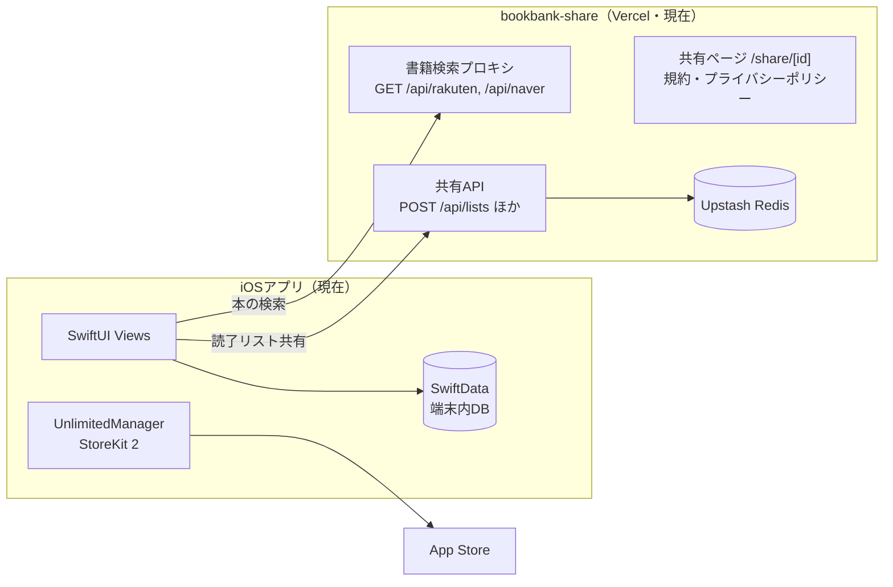
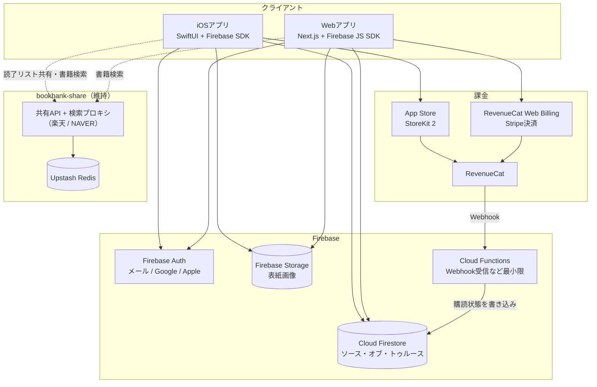
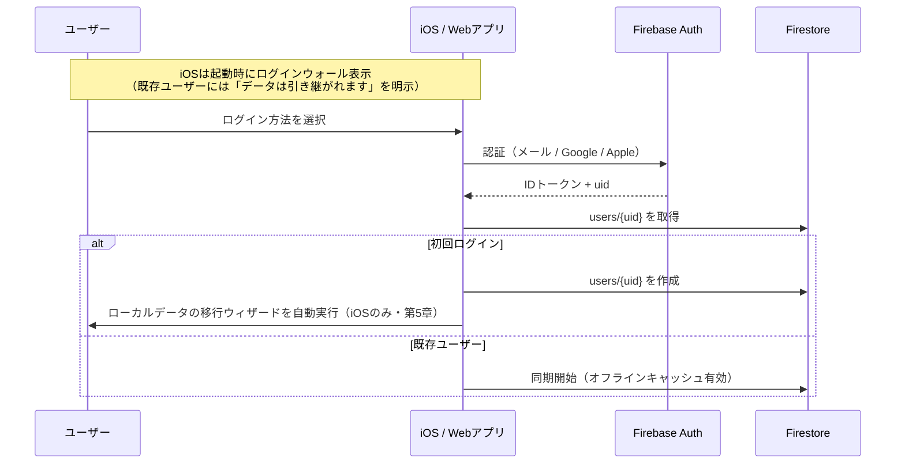
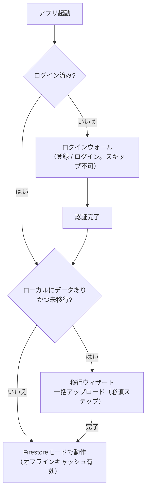
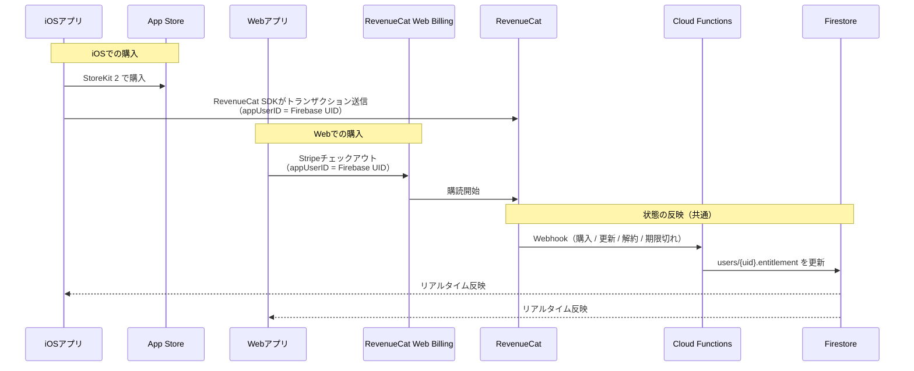
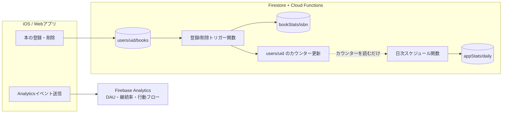

# BookBank クラウド移行アーキテクチャ設計書

作成日: 2026-07-04
ステータス: 事前設計（実装時に不備・矛盾を発見した場合は指摘・修正すること）

> **AI実装エージェントへ**: `docs/agent-implementation-guide.md` を先に読むこと。本書の (仮) 前提は確定仕様として実装する。実行順序は `docs/implementation-roadmap.md`（Phase 2はR6として着手前のタスク分解・承認が必須）。無料/Unlimited境界は付録Bではなく `docs/monetization-model-design.md` 第7章が正。Firebase/App Store Connect等のコンソール作業は人間タスク（ガイド第5章）。

---

## 0. この設計書の前提（補完した仮定の一覧）

依頼内容には未定義の論点が含まれていたため、以下の推奨案を **(仮)** として補完した上で設計している。
実装前に方針が変わった場合は、該当する章を必ず更新すること。

| # | 論点 | 補完した前提 (仮) |
|---|------|------------------|
| 1 | 既存買い切りユーザーの扱い | 恒久的にUnlimited扱いを継続。ログイン時にStoreKitの購入履歴を検証し、アカウントに永続エンタイトルメントを付与（Web版でも有効） |
| 2 | 月額¥500の提供範囲 | Webだけでなく **iOSにも同時新設**（同一サブスクリプショングループに追加） |
| 3 | Web課金の決済基盤 | **RevenueCat**（iOS StoreKit 2 + RevenueCat Web Billing）で購読状態を一元管理 |
| 4 | Apple課金とアカウントの紐付け | 購入時に `appAccountToken` へFirebase UIDを設定。ログイン必須のため購入は常にアカウントに紐付く |
| 5 | 無料/有料の機能差 | 現行の制限軸（口座3・読了リスト3・詳細エクスポート・カスタムカラー）を維持。**クラウド同期とWeb利用は無料ユーザーにも開放** |
| 6 | ログインの必須/任意 | **必須**（確定方針）。アップデート後の初回起動でログインウォールを表示し、既存ユーザーも登録に誘導。登録完了後にローカルデータを自動でクラウドへ移行する |
| 7 | メール認証の方式 | Firebase Authの「メール+パスワード」+ Google + Apple。同一メールの重複はアカウントリンクで統合 |
| 8 | 同期アーキテクチャ | **Firestoreをソース・オブ・トゥルース**とし、iOSはFirestoreのオフラインキャッシュを利用。SwiftDataとの双方向同期は行わず、SwiftDataは移行元データの読み取り専用となる（ログイン必須のためローカルモードの恒久維持は不要） |
| 9 | ID戦略 | 全エンティティにUUIDを導入するSwiftDataマイグレーションを先行実施 |
| 10 | 競合解決 | last-write-wins（`updatedAt` 比較）。個人用途で同時編集はほぼ発生しないため |
| 11 | 表紙画像バイナリ | Firebase Storageへアップロード（JPEG圧縮・長辺1024px上限）し、FirestoreにはURLのみ保持 |
| 12 | Webアプリの構成 | Next.js + Vercelホスティング + Firebase JS SDK |
| 13 | 既存共有機能との関係 | 読了リスト共有（Vercel + Upstash Redis）は当面現状維持。アフィリエイト公開機能はFirestoreベースで新規実装 |
| 14 | Vercel側APIの仕様 | 別リポジトリ `bookbank-share`（`/Users/37/AYAME-Cursor/bookbank-share`）のコードを確認済み。共有APIのほか楽天・NAVER検索プロキシも同居している（第1.1節・第6.4節） |
| 15 | SwiftDataの `Subscription` モデル | 実質未使用のため廃止し、Firestore上のエンタイトルメント情報（RevenueCat連携）に置き換え |
| 16 | 利用状況の解析基盤 | **Firebase Analytics**（行動解析）+ **Cloud Functions + Firestore集計コレクション**（書籍統計）。用途は当面運営者の内部分析とし、将来のランキング機能等に転用できる構造にする。BigQueryは規模が必要になるまで導入しない（第9章） |
| 17 | 法務ドキュメントの改訂 | 利用規約・プライバシーポリシー（`bookbank-share` の `lib/legal-content.ts`・5言語）を各フェーズのリリースと同時に改訂。**特定商取引法に基づく表記はWeb課金開始時に新設**（第10章） |

---

## 1. 背景と現状整理

### 1.1 現行構成



- **データ**: SwiftDataに5モデル（`Passbook` / `UserBook` / `ReadingList` / `MonthlyMemo` / `Subscription`）。すべて端末内に保存され、バックアップ手段はMarkdownエクスポートのみ
- **課金**: `UnlimitedManager` が StoreKit 2 の `Transaction.currentEntitlements` をデバイス内で確認して判定。**サーバー側のレシート検証は存在しない**
  - 商品: `com.bookbank.platinum.yearly`（年額¥3,600）/ `com.bookbank.platinum.lifetime`（買い切り¥9,000）
  - Unlimited特典: 口座4つ以上・読了リスト4つ以上・詳細Markdownエクスポート・カスタムカラー
- **Vercel側（別リポジトリ `bookbank-share`）**: Next.js（App Router）+ Upstash Redis。役割は共有だけでなく3つある
  - **共有API**: `POST /api/lists` で読了リストを保存し共有URLを返す。`readingListId` → 共有IDのマッピングをRedisに持ち、同じリストは毎回同じURLになる。TTLは30日。`GET /api/lists/[id]` と共有ページ `/share/[id]`、OG画像生成 `/api/og/[id]` も提供
  - **書籍検索プロキシ**: `GET /api/rakuten`（楽天Books API）と `GET /api/naver`（NAVER Books API）。APIキーをサーバー側で付与するプロキシで、iOSの `RakutenBooksService` / `NaverBooksService` がこれを利用中
  - **静的ページ**: 利用規約・プライバシーポリシー（日英韓中の多言語）
- **認証**: なし。完全に匿名・ローカル完結

### 1.2 クラウド移行にあたっての課題

1. **安定したIDが無い**: 各モデルにUUIDフィールドが無く、SwiftDataの `persistentModelID` に依存している。これは端末内でしか意味を持たないため、クラウド上のドキュメントIDとして使えない
2. **`ReadingList` の並び順が脆弱**: 本の並び順を「タイトル+作成日時のハッシュ」で管理しており、タイトル変更で並び順が壊れる。クラウド移行と同時にUUIDベースへ刷新すべき
3. **課金判定がデバイス内完結**: Webアプリから購読状態を参照できない。サーバー側で購読状態を持つ仕組みが必須
4. **表紙画像のバイナリ**: 手動登録時の画像が `coverImageData`（バイナリ）で端末内に保存されており、クラウド用のストレージ設計が必要

---

## 2. 技術スタック選定と理由

### 2.1 全体像（移行後）



### 2.2 Firebase採用の妥当性検証

**結論: 妥当。** 主な理由は以下の通り。

| 観点 | 評価 |
|------|------|
| 認証 | Firebase Authがメール / Google / Appleの3プロバイダーを標準サポート。自前実装ゼロで要件を満たせる |
| iOS/Web両対応 | Swift SDK・JS SDKともに公式提供。オフラインキャッシュも両方で動作 |
| 運用負荷 | サーバーレスでインフラ管理不要。非エンジニア + AI支援での運用に最適 |
| コスト | 個人アプリ規模なら無料枠（Sparkプラン相当の読み書き量）にほぼ収まる見込み |
| 拡張性 | アフィリエイト公開機能（公開読み取り）もセキュリティルールで自然に表現できる |

**比較検討した代替案**:

- **CloudKit（SwiftData + iCloud同期）**: iOSだけなら最有力だが、**Webアプリからのフルアクセスが実質不可能**（CloudKit JSは制約が多く、Google/メール認証とも統合できない）。Webアプリ要件がある時点で不採用
- **Supabase**: 技術的には十分可能だが、PostgreSQLのスキーマ・マイグレーション管理が必要になり、Firebaseより運用の学習コストが高い。日本語情報量・AIの支援精度もFirebaseが上
- **自前API（Vercel + DB）**: 認証・同期・オフライン対応をすべて自作することになり、非エンジニア運用の前提と矛盾。不採用

**Firebaseの注意点**（第11章で詳述）:

- Firestoreは読み書き回数課金のため、「全件を頻繁に読む」実装をするとコストが跳ねる
- ベンダーロックイン（ただし個人アプリ規模では移行コストより開発速度を優先してよい）

### 2.3 RevenueCat採用の理由 (仮)

課金の要件は「iOS（StoreKit 2）とWebの両方で購入でき、購読状態を両方から参照できる」こと。これを自前で実現するには、

1. App Store Server Notifications V2 を受けるサーバー実装（JWS署名検証含む）
2. Stripe等のWeb決済 + Webhook処理
3. 両者の購読状態をマージしてFirestoreに反映するロジック

がすべて必要になり、非エンジニア運用には過大。**RevenueCatはこの3つを肩代わりするマネージドサービス**であり、以下の理由で採用する。

- iOS側はStoreKit 2をそのまま使い、RevenueCat SDKが購入情報を自動収集（既存の `UnlimitedManager` の構造を大きく変えずに済む）
- Web Billing（Stripe決済の埋め込み）で月額¥500のWeb課金を実装できる
- 「Entitlement（権利）」という抽象化で、年額・月額・買い切りのどれで購入しても `unlimited` という1つのフラグに集約できる
- Webhook → Cloud Functions → Firestoreの連携が定型パターンとして確立している
- 無料枠: 月間トラッキング収益 $2,500 まで無料。現在の規模では無料で運用可能

**代替案（不採用）**: Stripe + App Store Server Notificationsの自前実装。月々の固定費はゼロにできるが、レシート検証・Webhook・状態マージの実装/保守がすべて自己責任になる。規模が拡大しRevenueCatの手数料（収益の1%前後）が気になり始めた段階で再検討すればよい。

### 2.4 技術スタック一覧（移行後）

| レイヤー | 技術 | 備考 |
|---------|------|------|
| iOSアプリ | Swift / SwiftUI / StoreKit 2 | 既存のまま |
| iOSローカルDB | Firestoreオフラインキャッシュ（SwiftDataは移行元の読み取り専用） | 第5章参照 |
| Webアプリ | Next.js（App Router）+ TypeScript | Vercelにホスティング |
| 認証 | Firebase Auth | メール+パスワード / Google / Apple |
| データベース | Cloud Firestore | ソース・オブ・トゥルース |
| 画像ストレージ | Firebase Storage | 表紙画像（手動登録分） |
| サーバー処理 | Cloud Functions for Firebase | RevenueCat Webhook受信・アカウント削除処理・解析集計（第9章）の3つに限定 |
| 課金 | RevenueCat（iOS: StoreKit 2 / Web: Web Billing） | エンタイトルメント一元管理 |
| 解析 | Firebase Analytics + Firestore集計コレクション | 利用状況の内部分析（第9章）。BigQueryは将来検討 |
| 既存 `bookbank-share` | Next.js on Vercel + Upstash Redis | 共有API・書籍検索プロキシ（楽天/NAVER）・規約ページ。当面現状維持（第6.4節） |

---

## 3. データモデル設計（Firestoreスキーマ案）

### 3.1 設計方針

- **ユーザーのデータはすべて `users/{uid}` のサブコレクションに置く**。セキュリティルールが「自分のデータだけ読み書き可」の1行で済み、事故が起きにくい
- **リレーションはドキュメントIDの参照で表現**する（Firestoreに外部キーは無い）。`UserBook` は `passbookId` を文字列で持つ
- **アフィリエイト公開機能を見越して、公開データはトップレベルコレクション `publicShelves` に分離**する。「私有データ」と「公開データ」を最初から別の場所に置くことで、後から公開機能を足してもセキュリティルールが単純なまま保てる
- ドキュメントIDには**クライアント生成のUUID**を使う（SwiftData側に導入するUUIDと同一値。移行の突合が容易になる）

### 3.2 コレクション構造

```
users/{uid}                              ... ユーザープロフィール・購読状態
├── passbooks/{passbookId}               ... 口座
├── books/{bookId}                       ... 登録書籍
├── readingLists/{listId}                ... 読了リスト
└── monthlyMemos/{yyyy-MM}               ... 月別メモ

bookStats/{isbn}                         ... 書籍別の登録集計（運営分析用・第9章）
appStats/daily/{yyyy-MM-dd}              ... 全体統計の日次スナップショット（運営分析用・第9章)

publicShelves/{slug}                     ... 【将来】アフィリエイト公開本棚
└── books/{bookId}                       ... 公開用に複製した書籍データ
```

### 3.3 各ドキュメントのフィールド定義

#### `users/{uid}`

```
displayName        string?      表示名（共有・公開時に使用）
photoURL           string?      プロフィール画像
createdAt          timestamp
updatedAt          timestamp
migratedFromLocal  boolean      ローカルデータ移行済みか
settings           map          テーマ等のアプリ設定（将来）
-- 集計用カウンター（Cloud Functionsのトリガーが維持。日次集計のフルスキャン回避用・第9章）--
bookCount          number       登録書籍数
totalValue         number       登録時価格の合計
-- 購読状態（Cloud FunctionsがRevenueCat Webhookから書き込む。クライアントは読み取り専用）--
entitlement        map {
  isUnlimited        boolean    Unlimited権利の有無
  source             string     "yearly" | "monthly" | "lifetime" | "none"
  expiresAt          timestamp? サブスクの期限（lifetimeはnull）
  store              string     "app_store" | "web_billing"
  updatedAt          timestamp
}
-- アフィリエイト拡張（将来。最初からフィールドだけ予約）--
affiliate          map? {
  rakutenAffiliateId  string?
  amazonAssociateTag  string?
}
```

#### `users/{uid}/passbooks/{passbookId}`

SwiftData `Passbook` との対応:

```
name          string       ← Passbook.name
type          string       ← Passbook.type ("overall" | "custom")
sortOrder     number       ← Passbook.sortOrder
isActive      boolean      ← Passbook.isActive
colorIndex    number?      ← Passbook.colorIndex
customColorHex string?     ← Passbook.customColorHex
createdAt     timestamp    ← Passbook.createdAt
updatedAt     timestamp    ← Passbook.updatedAt
```

#### `users/{uid}/books/{bookId}`

SwiftData `UserBook` との対応:

```
-- 書籍マスター情報 --
title            string     ← UserBook.title
author           string?    ← UserBook.author
isbn             string?    ← UserBook.isbn
publisher        string?    ← UserBook.publisher
publishedYear    number?    ← UserBook.publishedYear
seriesName       string?    ← UserBook.seriesName
price            number?    ← UserBook.price
imageURL         string?    ← UserBook.imageURL（楽天等の外部URL）
coverImagePath   string?    ← UserBook.coverImageData の移行先
                              Firebase Storage のパス（例: users/{uid}/covers/{bookId}.jpg）
bookFormat       string?    ← UserBook.bookFormat
pageCount        number?    ← UserBook.pageCount
source           string     ← UserBook.source ("api" | "manual")
-- ユーザー固有情報 --
memo             string?    ← UserBook.memo
isFavorite       boolean    ← UserBook.isFavorite
priceAtRegistration number? ← UserBook.priceAtRegistration
currencyCode     string?    ← UserBook.currencyCode
registeredAt     timestamp  ← UserBook.registeredAt
createdAt        timestamp  ← UserBook.createdAt
updatedAt        timestamp  ← UserBook.updatedAt
-- リレーション --
passbookId       string     ← UserBook.passbook（ドキュメントID参照）
```

> **設計メモ**: `UserBook.readingLists`（逆参照）はFirestoreでは持たない。読了リスト側が `bookIds` を持てば十分で、逆参照の二重管理は不整合の元になるため。

#### `users/{uid}/readingLists/{listId}`

SwiftData `ReadingList` との対応:

```
title           string     ← ReadingList.title
description     string?    ← ReadingList.listDescription
colorIndex      number?    ← ReadingList.colorIndex
bookIds         array<string>  ← ReadingList.books + bookOrderData を統合
                              並び順どおりのbookId配列（順序と所属を1フィールドで表現）
createdAt       timestamp  ← ReadingList.createdAt
updatedAt       timestamp  ← ReadingList.updatedAt
```

> **設計改善**: 現行の「タイトル+作成日時ハッシュ」による並び順管理（`bookOrderData`）は廃止し、UUIDの配列 `bookIds` に一本化する。タイトルを変更しても並び順が壊れなくなる。

#### `users/{uid}/monthlyMemos/{yyyy-MM}`

SwiftData `MonthlyMemo` との対応。ドキュメントIDを `"2026-07"` 形式にすることで、year/monthの複合検索が不要になる:

```
year        number     ← MonthlyMemo.year
month       number     ← MonthlyMemo.month
text        string     ← MonthlyMemo.text
updatedAt   timestamp  ← MonthlyMemo.updatedAt
```

#### `bookStats/{isbn}`【運営分析用・第9章】

書籍別の登録集計。ユーザーが本を登録/削除したとき、Cloud Functionsのトリガーがカウンターを増減する。「どの本がよく読まれているか」の分析と、将来の「人気の本ランキング」機能の土台になる。

```
title            string     書籍タイトルのスナップショット（初回登録時にコピー）
author           string?    著者名のスナップショット
imageURL         string?    表紙URLのスナップショット
registeredCount  number     この本を登録しているユーザー数（登録で+1、削除で-1）
updatedAt        timestamp
```

> ISBNの無い手動登録本は集計対象外とする（同一書籍の判定ができないため）。タイトル文字列での名寄せは精度が低く、分析ノイズになるので行わない。

#### `appStats/daily/{yyyy-MM-dd}`【運営分析用・第9章】

全体統計の日次スナップショット。スケジュール実行のCloud Functionsが1日1回書き込む。

```
totalUsers       number     総ユーザー数
totalBooks       number     総登録冊数
avgBooksPerUser  number     1ユーザーあたり平均冊数
avgTotalValue    number     1ユーザーあたり平均資産額（円）
unlimitedUsers   number     Unlimited会員数
createdAt        timestamp
```

> 集計は全ユーザーの `books` サブコレクションをフルスキャンするのではなく、`users/{uid}` のカウンターフィールド（`bookCount` / `totalValue`）を読むだけで済ませる（コスト対策・第9章）。

#### `publicShelves/{slug}`【将来のアフィリエイト公開機能】

Phase 0〜5 では実装しないが、スキーマとセキュリティルールの「席」だけ確保しておく:

```
ownerUid       string      公開したユーザー
title          string      公開本棚のタイトル
description    string?
displayName    string?     公開時の表示名
isPublished    boolean     公開/非公開
affiliateMode  string      "rakuten" | "amazon" | "none"
viewCount      number      閲覧数（収益レポート用）
createdAt      timestamp
updatedAt      timestamp

publicShelves/{slug}/books/{bookId}
  title, author, imageURL, affiliateURL, sortOrder, ...
  ※ 私有データのスナップショットを複製して公開する（私有データを直接公開しない）
```

> **なぜ複製するか**: 私有の `users/{uid}/books` を直接公開すると、セキュリティルールが複雑化し「メモなど見せたくない情報」の漏洩リスクが生まれる。公開時に必要なフィールドだけをコピーする方式なら、公開データに何が含まれるかが明示的になる。

### 3.4 セキュリティルール方針

```
// 疑似コード
match /users/{uid} {
  allow read, write: if request.auth.uid == uid;
  // entitlement フィールドはクライアントから書き込み不可
  // （Cloud Functions（Admin SDK）のみが更新）
  match /{subcollection}/{docId} {
    allow read, write: if request.auth.uid == uid;
  }
}
match /publicShelves/{slug} {
  allow read: if resource.data.isPublished == true;  // 誰でも閲覧可
  allow write: if request.auth.uid == resource.data.ownerUid;
  match /books/{bookId} {
    allow read: if true;
    allow write: if request.auth.uid ==
      get(/databases/$(database)/documents/publicShelves/$(slug)).data.ownerUid;
  }
}
match /bookStats/{isbn} {
  allow read, write: if false;  // Cloud Functions（Admin SDK）のみ。
                                // 将来ランキング機能を出す場合のみ read を開放
}
match /appStats/{document=**} {
  allow read, write: if false;  // Cloud Functions（Admin SDK）のみ
}
```

`entitlement` の保護は「`users/{uid}` の update 時に `entitlement` フィールドが変更されていないこと」をルールで検証する（またはentitlementを別サブコレクションに分離する。実装時にシンプルな方を選ぶ）。

---

## 4. 認証フロー設計

### 4.1 プロバイダー構成

| プロバイダー | 位置づけ | 備考 |
|-------------|---------|------|
| メール + パスワード | 主軸 | 一般ユーザーに最も馴染む。パスワードリセットはFirebase Auth標準機能 |
| Google | 主軸 | Web版で特に利用率が高い想定 |
| Apple | iOS審査要件 | サードパーティログインを提供するiOSアプリはSign in with Apple必須（App Store Review Guideline 4.8） |

### 4.2 サインインフロー

ログインは**必須**。iOSではアップデート後の初回起動時にログインウォールを表示し、既存ユーザーも登録に誘導する（第5章）。



### 4.3 同一メールアドレスの扱い（アカウントリンク）

「Googleで登録した後、同じメールアドレスでメール+パスワード登録しようとする」ケースが必ず発生する。

- Firebase Authの設定は「**1つのメールアドレスにつき1アカウント**」（デフォルト）を維持する
- 既存アカウントと衝突した場合（`account-exists-with-different-credential` エラー）は、「このメールアドレスは○○ログインで登録済みです」と案内し、正しいプロバイダーでログイン後、設定画面から他プロバイダーを**リンク**できるようにする
- Apple IDの「メールを非公開」（`privaterelay.appleid.com`）を選んだ場合はメールが一致せず別アカウントになり得る。これは仕様として許容し、FAQに記載する

### 4.4 iOS実装の要点

- `AuthenticationServices`（Sign in with Apple）+ `GoogleSignIn` SDK + Firebase Auth SDK
- 認証状態は `AuthManager`（`@Observable`・`UnlimitedManager` と同パターン）で一元管理
- **アカウント削除機能が必須**（App Store審査要件）: Firestoreデータ・Storage画像・Authアカウントを削除するCloud Functionを用意し、アプリ内から呼べるようにする

### 4.5 Web実装の要点

- Firebase JS SDK の `signInWithPopup`（Google）/ `signInWithEmailAndPassword` / Apple（OAuthProvider経由）
- Next.jsでは認証状態をクライアントサイドで管理し、SSRが必要なページのみFirebase Admin SDKでIDトークン検証（初期リリースではクライアントレンダリング中心で十分）

---

## 5. iOS→クラウド移行戦略

### 5.1 基本方針

設計判断の柱は2つ。

1. **「SwiftDataとFirestoreの双方向同期は作らない」**。双方向同期は競合解決・削除の伝播・部分失敗の処理など、専門チームでも苦労する難物であり、非エンジニア + AI支援の体制で保守できる代物ではない
2. **「ログインは必須」**（前提6・確定方針）。アップデート後の初回起動でログインウォールを表示し、登録完了 → ローカルデータの移行完了までアプリ本体には進めない。移行後は全ユーザーがFirestoreのみを使う

この2つにより、データストアは**Firestore一本**になる。オフライン対応はFirestore SDKの**オフラインキャッシュ（標準機能）**に任せ、SwiftDataは「移行元データの読み取り」だけに使う。移行は「登録直後にローカルデータを一括アップロードする」**一方通行・一回きり**の処理となる。



**ログインウォールのUX配慮**（既存ユーザーの不安と離脱を防ぐ）:

- ウォール画面で「**アップデート前のデータは消えていません。登録するとそのままクラウドに引き継がれます**」と明示する（データが消えたと誤解させない）
- クラウド化のメリット（機種変更でもデータが残る・複数端末・Web版）を簡潔に訴求してから登録ボタンを見せる
- オフラインで起動した場合は「インターネットに接続してください」画面を表示する（初回のログイン・移行はネットワーク必須。一度ログイン済みなら、以降はオフラインキャッシュで起動できる）
- 登録完了までローカルデータは**絶対に削除しない**

### 5.2 リポジトリ層の抽象化

現在のViewは `@Query` でSwiftDataを直接参照している。これを**リポジトリプロトコル**経由に改修する。

```swift
// 概念コード
protocol BookRepository {
    func observeBooks(passbookId: String?) -> AsyncStream<[BookDTO]>
    func addBook(_ book: BookDTO) async throws
    func updateBook(_ book: BookDTO) async throws
    func deleteBook(id: String) async throws
}

final class FirestoreBookRepository: BookRepository { ... }  // 最終的な本番実装
```

- 抽象化の目的は、ローカル/クラウドの恒久的な切替ではなく **View層とデータストアの分離**（テストのしやすさ、Firestore差し替えの準備）。最終形の本番実装は `FirestoreBookRepository` の1つだけになる
- 抽象化を先行リリースする期間（第8章 Phase 1）は、暫定のSwiftData実装をリポジトリの背後に置いて従来通り動作させる。クラウド移行リリース（Phase 2）で `FirestoreBookRepository` に差し替えた後、SwiftDataへのアクセスは移行ウィザード専用のリーダー（`LocalDataReader` のような読み取り専用コンポーネント）だけに縮小する
- View層は `BookDTO`（プレーンな構造体）だけを扱い、SwiftDataの `@Model` に直接依存しない形へ段階的にリファクタリングする
- この改修が移行プロジェクト全体で**最も工数が大きい**（全Viewの `@Query` 置き換え）。**見た目・挙動を一切変えないリファクタリングとして単独リリース**する（第8章 Phase 1）

### 5.3 移行の前提: UUID導入（Phase 0）

クラウド移行に着手する前に、SwiftDataの軽量マイグレーションで全モデルにUUIDを追加する。

```swift
// 各モデルに追加
var uuid: String = UUID().uuidString
```

- `ReadingList` の並び順も「stableIDハッシュの配列」から「UUIDの配列」へ移行する（既存データは `orderedBooks` の現在の並びを読み取ってUUID配列に変換）
- このUUIDがそのままFirestoreのドキュメントIDになるため、**移行の突合・再実行（リトライ）が安全になる**（同じUUIDに上書きするだけで二重登録が起きない）

### 5.4 移行ウィザードの仕様

ログイン（登録）完了後、ローカルにデータがあり `users/{uid}.migratedFromLocal != true` の場合に**必須ステップとして自動実行**する。スキップはできず、移行が完了するまでアプリ本体には進めない（中途半端な状態で使い始めて「本が半分しかない」と誤解されるのを防ぐため）。

1. **概要表示**: 「○冊の本、○個の口座をクラウドに移行します」
2. **アップロード**: Firestoreの `WriteBatch`（500件単位）で `passbooks` → `books` → `readingLists` → `monthlyMemos` の順に書き込み。表紙画像（`coverImageData`）はJPEG圧縮（長辺1024px・品質0.8）してStorageへ並列アップロード
3. **進捗表示**: 「本を移行中… 120 / 450」のようなプログレスバー
4. **検証**: アップロード後に件数を照合し、一致したら `migratedFromLocal = true` を書き込み
5. **失敗時**: どこで失敗しても「再試行」で最初からやり直せる（UUID上書きなので冪等）。通信断で中断してもローカルデータは無傷なので、次回起動時に同じウィザードから再開する。移行が完了するまでSwiftDataのデータは**削除しない**

> **2台目以降の端末**: すでに `migratedFromLocal == true`（別の端末で移行済み）の場合、ローカルデータがあっても移行はせず、「この端末のローカルデータは使用されません（クラウドのデータを表示します）」と案内する。異なる端末のデータ同士のマージは行わない（マージは競合解決が必要になり、双方向同期と同じ難しさを持ち込むため）。

### 5.5 SwiftDataの扱い（移行後）

| 期間 | SwiftDataの役割 |
|------|----------------|
| 旧バージョン（アップデート前） | 唯一のデータストア（現状通り） |
| クラウド移行リリース直後 | **移行元 + 読み取り専用のバックアップとして保持**。移行完了後もデフォルトでは端末に残す（クラウド側の問題発覚時の保険） |
| クラウド安定後（数バージョン後） | 移行済みユーザーのローカルデータを削除し、SwiftData関連コード自体をアプリから削除する。ログイン必須のため**ローカルモードを恒久維持する必要はない** |

> **注意**: ログアウトするとログインウォールに戻る（別アカウントでのログインは可能だが、ローカルデータでの利用はできない）。移行済みのローカルデータは移行時点のスナップショットであり、その後の編集は反映されていないことを、削除案内の際に明示する。

---

## 6. Webアプリの構成案

### 6.1 技術構成

- **Next.js（App Router）+ TypeScript + Vercelホスティング**
  - 理由: 既存の共有ページと同じVercel基盤に集約でき、AI支援の情報量が最も多いスタック
- **Firebase JS SDK**（Auth / Firestore / Storage）でクライアントから直接Firebaseへアクセス。**自前APIサーバーは作らない**（セキュリティルールで守る設計のため不要）
- スタイリングはTailwind CSS。`DESIGN_SYSTEM.md` のトークン（カラー、角丸2pxの表紙、YYYY.MM.DD日付、境界線なしリスト等）をTailwindのテーマ設定に転記して再現する

### 6.2 機能スコープ

| リリース | 機能 |
|---------|------|
| v1（閲覧中心） | ログイン、本棚・通帳・読了リストの閲覧、統計表示 |
| v1.5（操作） | 本の登録（検索API連携・手動登録）、編集、口座管理 |
| v2（課金） | 月額¥500 / 年額¥3,600 のWeb購入（RevenueCat Web Billing）、購読管理画面 |
| 将来 | アフィリエイト公開本棚（`publicShelves` の公開ページ + 管理画面） |

> **書籍検索API**: 楽天・NAVERの検索プロキシは `bookbank-share` に**実装済み**（`/api/rakuten`・`/api/naver`、CORS対応済みでブラウザから直接呼べる）。Webアプリはこれをそのまま利用すればよく、新規実装は不要。

### 6.3 ディレクトリ構成イメージ

```
bookbank-web/
├── app/
│   ├── (auth)/login/            # ログイン・登録
│   ├── (app)/passbooks/         # 通帳
│   ├── (app)/bookshelf/         # 本棚
│   ├── (app)/lists/             # 読了リスト
│   ├── (app)/stats/             # 統計
│   └── (app)/settings/          # アカウント・購読管理
│                                # 書籍検索は bookbank-share の /api/rakuten・/api/naver を利用
├── lib/firebase.ts              # Firebase初期化
├── lib/repositories/            # Firestoreアクセス層（iOSのRepositoryと同じ構造）
└── tailwind.config.ts           # DESIGN_SYSTEM.md のトークンを反映
```

### 6.4 既存 `bookbank-share`（Vercel + Upstash）との棲み分け

`bookbank-share` は共有API・書籍検索プロキシ・利用規約ページの3役を担っており、**新Webアプリを作ってもそのまま必要**である。

- **読了リスト共有**（`POST /api/lists`、Redis TTL 30日）は**当面現状維持**。匿名・期限付き共有というユースケースはログイン不要のままが望ましく、Firestoreへ移す動機が薄い
- **書籍検索プロキシ**（`/api/rakuten`・`/api/naver`）はiOS・新Webアプリの両方が共用する。APIキー（楽天/NAVER）の管理場所もここに一元化されたまま維持する
- 将来アフィリエイト公開機能を実装する際、「共有」も `publicShelves` ベースの恒久URLに統合することを検討する（その時点でRedisの共有データは廃止できるが、検索プロキシは残る）
- 新Webアプリは別リポジトリで開始するか、`bookbank-share` に統合するかは実装時に判断する。**統合する場合はドメイン・Vercelプロジェクトが1つになり管理が楽になる**ため、統合を第一候補とする（既存の `/share/[id]`・`/api/*` のURLを壊さないことが条件）

---

## 7. 課金・購読状態の管理設計

### 7.1 プラン構成（新体系）

| プラン | 価格 | 購入経路 | 備考 |
|--------|------|---------|------|
| 無料 | ¥0 | - | 口座3・読了リスト3まで、詳細エクスポート/カスタムカラー不可 |
| Unlimited 月額 | ¥500 | iOS（新設）+ Web（新設） | Webリリースと同時に開始 (仮: iOSにも同時新設) |
| Unlimited 年額 | ¥3,600 | iOS（既存継続）+ Web（新設） | Product ID: `com.bookbank.platinum.yearly` |
| Unlimited 買い切り | ¥9,000 | **新規販売停止** | 既存購入者は恒久Unlimited (仮) |

- iOS月額の Product ID は既存の命名に合わせ `com.bookbank.platinum.monthly` とし、既存のサブスクリプショングループ `platinum_group` に追加する（同一グループ内ならユーザーが月額⇔年額をApp Store側でアップグレード/ダウングレードできる）
- 買い切り `com.bookbank.platinum.lifetime` はApp Store Connectで「販売停止（Remove from Sale）」にする。**既存購入者の `Transaction.currentEntitlements` には引き続き現れるため、権利判定は壊れない**

### 7.2 購読状態の一元管理（RevenueCat）

「Unlimitedかどうか」の判定は、RevenueCatの **Entitlement `unlimited`** に集約する。



**各クライアントの判定ソース**:

| クライアント | 一次ソース | 補助 |
|-------------|-----------|------|
| iOS | RevenueCat SDK（`CustomerInfo.entitlements["unlimited"]`） | オフライン時はSDKのキャッシュ |
| Web | Firestore `users/{uid}.entitlement`（Webhook経由） | RevenueCat JS SDKでも取得可 |

### 7.3 アカウントとの紐付け

- RevenueCatの `appUserID` に **Firebase UID** を設定する。これによりiOSで買ってもWebで買っても同じユーザーの権利になる
- StoreKit 2 の `appAccountToken` にもUIDから導出したUUIDを設定し、Appleのトランザクションとアカウントの対応をApple側にも記録する
- **ログイン必須のため、購入は常にログイン済み状態で発生する**。RevenueCatの匿名ID運用やエイリアス統合の考慮は不要で、RevenueCat SDKの初期化時に必ず `appUserID = Firebase UID` を渡すだけでよい（未ログイン購入というエッジケースが存在しないのは、ログイン必須方針の大きな利点）

### 7.4 既存ユーザーの移行

1. **買い切り購入者 (仮: 恒久Unlimited)**: アップデート後、ログインウォールで登録した時点でRevenueCat SDKが端末内のトランザクション履歴（lifetime）をUIDに紐付けて送信する。Firestoreの `entitlement.source = "lifetime"`（`expiresAt = null`）となり、Web版でもUnlimitedになる
2. **年額購入者**: 同様に自動で引き継がれる。更新・解約はApp Store側の操作のまま変わらない
3. **アップデートしない（旧バージョンを使い続ける）ユーザー**: 旧バージョンのデバイス内判定（StoreKit直接）がそのまま機能し続ける。何も失わないが、クラウド機能は使えない

### 7.5 iOS実装の変更点

- `UnlimitedManager` を RevenueCat SDK（`Purchases`）ベースに改修する。公開プロパティ（`isUnlimited` / `hasActiveYearlySubscription` / `products` / `purchase()` / `restorePurchases()`）の**インターフェースは維持**し、呼び出し側のView（`AccountListView`、`MainTabView`、`MarkdownExporter` 等9ファイル）は無変更で済ませる
- Paywall（`UnlimitedPaywallView`）は「月額¥500 / 年額¥3,600」の2択に改修（買い切りカードを削除。「おすすめ」バッジは年額へ移動）

### 7.6 サブスクリプション管理

- iOS購入分: App Storeのサブスクリプション管理画面へ誘導（既存実装のまま）
- Web購入分: RevenueCat Web Billingのカスタマーポータル（解約・カード変更）へ誘導
- 設定画面では `entitlement.store` を見て、どちらの管理画面へ誘導するか切り替える

---

## 8. 実装フェーズ分割案

各フェーズは**単独でリリース可能**な粒度で分割し、前のフェーズが安定してから次へ進む。

> **ログイン必須方針の影響**: 「ログイン機能だけ任意として先行リリースする」段階は成立しない（必須なのに同期するものが無い中途半端な状態になるため）。認証 + Firestore + 移行ウィザード + ログイン必須化は、**1つの大型リリース（Phase 2）で同時に出す必要がある**。その分、Phase 2 のテストを最重点で行う。

| Phase | 内容 | リリース形態 | ユーザーへの見え方 |
|-------|------|-------------|------------------|
| **0** | UUID導入マイグレーション（全SwiftDataモデル）、`ReadingList` 並び順のUUID化 | iOSアップデート | 変化なし（内部改修） |
| **1** | リポジトリ層の抽象化（View層の `@Query` 置き換え。背後は暫定SwiftData実装のまま）| iOSアップデート | 変化なし（内部改修）※最大工数 |
| **2** | **大型リリース**: Firebase Auth + ログインウォール（メール/Google/Apple）+ Firestore/Storageリポジトリ + 移行ウィザード + アカウント削除機能。**ログイン必須化はこの1回で完結**。Firebase Analytics + 解析集計関数（第9章）もここで導入。**同時に必須**: プライバシーポリシー・利用規約の改訂 + App Privacy更新（第10章） | iOSアップデート | 初回起動でアカウント登録を求められ、既存データがクラウドへ移行される。以降は複数端末同期が有効 |
| **3** | Webアプリ v1（閲覧中心）→ v1.5（登録・編集） | Web新規リリース | ブラウザで本棚が使える |
| **4** | RevenueCat導入（iOS `UnlimitedManager` 改修 + Webhook + Firestore反映）、iOS月額¥500新設、買い切り販売停止、Paywall改修。**同時に**: 利用規約へ有料プラン条項を追記（第10章） | iOSアップデート | 課金体系の刷新 |
| **5** | Web課金（RevenueCat Web Billing）、購読管理画面。**同時に必須**: 特定商取引法に基づく表記の新設（第10章） | Webアップデート | Webだけで完結して購読できる |
| **将来** | アフィリエイト公開本棚（`publicShelves`）、共有機能のFirestore統合 | iOS + Web | 本棚の公開とリンク収益化 |

**順序の意図**:

- Phase 0（UUID）を最初に置くのは、後続のすべてがUUIDに依存するため。また小さい変更なので、SwiftDataマイグレーションの練習台としてリスクが低い
- Phase 1（リポジトリ抽象化）を「見た目が変わらないリリース」として独立させることで、Phase 2 の大型リリースから純粋なリファクタリング分を切り離し、リグレッションの原因切り分けを容易にする
- 課金改修（Phase 4）をクラウド移行（Phase 2）の後に置くのは、アカウント紐付け（UID）が先に存在しないとRevenueCatの一元管理が機能しないため
- Phase 4と5の間で「iOSは新体系・Webは閲覧のみ」という期間が生じるが、価格は同一なので混乱は小さい

**Phase 2（大型リリース）のリスク緩和策**:

- **TestFlightで移行テストを徹底する**: 実データ量（数百冊 + 手動表紙画像）での移行、通信断での中断→再開、2台目端末でのログインを必ず検証する
- **段階的ロールアウト**を使う（App Store Connectの7日間かけた自動段階リリース）。問題発覚時は一時停止し、修正版を出す
- 万一に備え、**旧バージョンの動作は壊さない**（サーバー側に旧バージョンを止める仕組みは無いため、旧バージョンユーザーはローカルのまま使い続けられる）

---

## 9. 利用状況の解析設計

### 9.1 目的と方針 (仮)

クラウド保存への切り替えにより、初めて利用状況をデータとして把握できるようになる。用途は**当面は運営者の内部分析**（プロダクト改善・プラン設計の判断材料）とし、将来「人気の本ランキング」などのユーザー向け機能やアフィリエイト施策に転用できるデータ構造にしておく。

- 解析は**個人を特定しない統計処理に限定**し、その旨をプライバシーポリシーに明記する（第10章）
- 個々のユーザーの本棚の中身を運営者が閲覧する運用はしない（技術的には管理者権限で可能だが、ポリシーとして行わない）

### 9.2 収集する指標

| 指標 | 実現方法 |
|------|---------|
| 総ユーザー数・総登録冊数 | `appStats/daily`（日次スナップショット） |
| 1ユーザーあたり平均冊数・平均資産額 | `appStats/daily`（`users/{uid}` のカウンターを集計） |
| よく読まれている本（ISBN別登録数） | `bookStats/{isbn}`（登録/削除トリガーでカウント） |
| Unlimited会員数・転換率 | `appStats/daily` + RevenueCatダッシュボード |
| DAU・継続率・画面別利用状況 | Firebase Analytics（自動収集 + カスタムイベント） |

### 9.3 実現方式

役割分担は「**行動の解析はFirebase Analytics、コンテンツの統計はFirestore集計コレクション**」。



1. **Firebase Analytics**（iOS SDK / Web SDK）: DAU・継続率・OS別比率などは自動収集。加えて主要アクションにカスタムイベントを設計する

```
book_registered   { source: "api" | "manual", has_isbn: bool }
book_deleted      {}
list_created      {}
list_shared       {}
paywall_shown     { trigger: "passbook_limit" | "list_limit" | "export" | "color" }
purchase_completed { plan: "monthly" | "yearly" }
migration_completed { book_count: number }
```

2. **Firestoreトリガー関数**: `users/{uid}/books/{bookId}` の作成/削除で発火し、(a) `bookStats/{isbn}` の `registeredCount` を増減、(b) `users/{uid}` の `bookCount` / `totalValue` を更新する
3. **日次スケジュール関数**: 全 `users` ドキュメントのカウンターを合計して `appStats/daily/{yyyy-MM-dd}` に書き込む（`books` のフルスキャンはしない）

### 9.4 閲覧方法と将来拡張

- **当面**: Firebaseコンソール（Analyticsダッシュボード + Firestoreの `bookStats` / `appStats` を直接閲覧）で十分
- **将来**: Webアプリに管理者専用ダッシュボード（グラフ表示）を追加可能。人気の本ランキングをユーザー向け機能として出す場合は、`bookStats` のセキュリティルールで read を開放するだけでよい設計になっている
- **BigQuery連携**（Analytics/Firestoreのエクスポート）は、コホート分析など高度な分析が必要になった段階で有効化する。最初からは入れない（(仮)・運用負荷の観点）

### 9.5 プライバシー配慮

- 集計結果（`bookStats` / `appStats`）には**uidや個人情報を含めない**。「誰が」ではなく「何冊・何人」だけを持つ
- Firebase Analyticsは広告目的のトラッキングを行わない設定で使う（Google Signals無効・広告IDの収集なし）。このため**ATT（App Tracking Transparencyの許可ダイアログ）は不要**（アプリ外へのトラッキングに該当しないため）
- App Storeのプライバシーラベル（App Privacy）には「分析目的のデータ収集あり」を正しく申告する（第10章）

---

## 10. 法務ドキュメントの更新

法務文書は `bookbank-share` の `lib/legal-content.ts` で5言語（日英韓・簡体字・繁体字）管理されている。**現行のプライバシーポリシーは「アカウント登録やログインを必要としません」「データはすべてiOS端末内にのみ保存されます」と明記しており、クラウド移行後はこのままだと虚偽表示になる**。各フェーズのリリースと同時（理想は直前）の改訂が必須である。

### 10.1 プライバシーポリシー（Phase 2 と同時・必須）

追加・変更が必要な項目:

| 項目 | 記載内容 |
|------|---------|
| アカウント情報の収集 | メールアドレス、認証プロバイダー情報（Google/Apple）、表示名 |
| クラウド保存 | 読書記録・口座情報等をGoogle Firebase（Cloud Firestore / Storage）に保存すること、保管場所（Googleのサーバー） |
| 利用状況の統計的解析 | **登録書籍の傾向・利用状況を個人を特定できない統計データとして解析し、サービスの改善・新機能開発に利用すること**（第9章の根拠となる記載） |
| 利用するサードパーティ | Google Firebase（認証・DB・解析）、RevenueCat（課金管理）、Stripe（Web決済・Phase 5で追記）、楽天/NAVER（書籍検索・既存） |
| データの削除 | アカウント削除機能によりクラウド上の全データが削除されること |
| 既存記載の修正 | 「ログイン不要」「端末内にのみ保存」の記載を削除・書き換え |

### 10.2 利用規約（Phase 2 と同時）

| タイミング | 追加する条項 |
|-----------|-------------|
| Phase 2 | アカウント（登録義務・認証情報の管理責任・不正利用時の措置・アカウント削除）、データの取り扱い（統計的利用への同意）、サービスの変更・中断・終了、禁止事項の更新 |
| Phase 4〜5 | 有料プラン（月額/年額の内容・**自動更新であること**・解約方法・日割り返金なし等）、買い切りプラン既存購入者の権利継続 |

### 10.3 特定商取引法に基づく表記（Phase 5 と同時・新設必須）

- **iOS内課金のみの間は不要**（販売者はAppleであり、Appleの表記でカバーされる）
- **Web課金（RevenueCat Web Billing = 自社Stripeアカウントでの直販）を開始すると、自社が販売者になるため表記が法的に必須**
- `bookbank-share`（または統合後のWebアプリ）に `/tokushoho` ページを新設し、購入フローから1クリックで到達できるようにする
- 記載事項: 販売業者名（株式会社アヤメ）、代表者、所在地、連絡先、販売価格（月額¥500 / 年額¥3,600・税込表記）、支払時期・方法、サービス提供時期、解約・返金の条件

### 10.4 App Privacy（App Storeプライバシーラベル）の更新（Phase 2 の審査提出時）

- 現状想定の「データ収集なし」から、以下の申告に変更が必要:
  - 連絡先情報（メールアドレス）: アカウント機能に利用・ユーザーに紐付く
  - ユーザーコンテンツ（読書記録）: アプリ機能に利用・ユーザーに紐付く
  - 利用状況データ（Analytics）: 分析に利用・ユーザーに紐付かない（匿名）
- 申告漏れは審査リジェクトやストア掲載停止の原因になるため、Phase 2 のチェックリストに含める

### 10.5 改訂の運用

- 文言の変更はすべて `lib/legal-content.ts` の5言語分を同時に更新する（日本語だけ直して他言語が古いまま、を防ぐ）
- `lastUpdated` フィールドを必ず更新し、大きな変更（クラウド保存開始・課金変更）はアプリ内お知らせでも告知する

---

## 11. リスクと注意点

### 11.1 データ移行

- **移行の部分失敗**: UUID上書きによる冪等設計 + 「完了検証まではローカルを消さない」原則で緩和（5.4節）。それでも移行ウィザードは実機テストを最重点に行うこと
- **`coverImageData` の巨大化**: 手動登録画像が多いユーザーは移行に時間がかかる。圧縮 + 並列アップロード + 進捗表示で体感を改善。Wi-Fi接続を推奨する案内を出す

### 11.2 コスト

- **Firestoreの読み取り課金**: 「本棚を開くたびに全冊読む」実装だと読み取り回数が膨らむ。オフラインキャッシュ + リアルタイムリスナー（差分のみ受信）を基本とし、統計画面などの集計はクライアント側キャッシュを活用する
- **Storage容量**: 無料ユーザーの画像アップロードが無制限だと費用リスクになる。圧縮（長辺1024px）を必須とし、必要なら無料プランに手動表紙の枚数上限を設ける（実装時に判断）
- **RevenueCatの手数料**: 無料枠（月$2,500）超過後は収益の約1%。超える頃には十分な収益があるため許容

### 11.3 課金・審査

- **買い切り廃止の告知**: 販売停止前にアプリ内・ストア説明文で告知し、「既存購入者はそのまま使える」ことを明記する（問い合わせ・低評価レビュー対策）
- **Apple審査（外部課金への誘導禁止）**: iOSアプリ内から「Webなら¥500で買えます」等の案内・リンクを出すことはガイドライン違反（3.1.1）。Web課金の存在はiOSアプリ内で言及しないこと
- **月額⇔年額の切替**: 同一サブスクリプショングループに入れることでApple側が按分処理してくれるが、RevenueCat上のエンタイトルメントが一瞬切れないかをサンドボックスで必ず検証する
- **価格整合**: 月額¥500×12 = ¥6,000 > 年額¥3,600 で年額が明確に有利。意図した価格設計であることをPaywallで訴求する（「年額なら40%お得」）

### 11.4 認証・ログイン必須化

- **強制ログインによる既存ユーザーの離脱・低評価リスク**: 今まで登録なしで使えたアプリが突然登録を要求すると、一定数の離脱と低評価レビューは避けられない。緩和策:
  - ウォール画面の最上部で「**データは消えていません。登録すると引き継がれます**」を明示（5.1節）
  - 登録の手間を最小化（Apple/Googleならワンタップ、メール登録も入力は最小限に）
  - クラウド化のメリット（機種変更対応・複数端末・Web版）を先に見せてから登録を求める
  - リリースノート・アプリ内お知らせで事前告知する
- **Apple審査ガイドライン5.1.1（ログイン強制の正当性）**: 「アカウントベースの機能が主でないアプリはログインなしで使わせること」という規定がある。本アプリはクラウド同期・複数端末・Web連携が中核機能になるため要件を満たすと考えられるが、審査で指摘された場合に備え、レビューノートに「全データがユーザーアカウントに紐づくクラウド同期アプリである」ことを説明できるようにしておく
- **初回起動はネットワーク必須になる**: オフラインでは登録も移行もできないため、「インターネットに接続してください」画面を用意する（5.1節）。一度ログインすれば以降はオフラインキャッシュで利用可能
- **Apple「メールを非公開」問題**: 同一人物がプロバイダー違いで別アカウントになるケースは根絶できない。「別アカウントになってしまった」問い合わせに備え、FAQとアカウントリンク導線を用意する（4.3節）
- **アカウント削除**: 審査必須要件。Firestore・Storage・Auth・RevenueCat（`deleteUser` は不要、購入履歴はApple側に残る）の削除範囲を明確にし、「削除してもApp Store購入は復元可能」であることを説明する。ログイン必須のため、削除後はログインウォールに戻る

### 11.5 法務・コンプライアンス

- **法務ドキュメントの更新漏れ**: 実装より先にプライバシーポリシー・規約の改訂が公開されていないと、「ログイン不要・端末内保存のみ」という現行記載のまま実態と食い違う虚偽表示状態になる。Apple審査でもポリシーと実装の不一致はリジェクト理由になる。**各フェーズのリリースチェックリストの先頭に法務更新を置く**（第10章）
- **特商法表記の出し忘れ**: Web課金（Phase 5）を表記なしで開始すると特定商取引法違反になる。Web購入フローの実装とセットで必ず公開する（10.3節）
- **App Privacyの申告漏れ**: Analytics導入・アカウント収集を始めたのにプライバシーラベルが「収集なし」のままだと審査リジェクト・掲載停止リスク（10.4節）

### 11.6 運用・体制

- **ベンダーロックイン**: Firebase/RevenueCatへの依存が深まるが、個人開発の速度と運用負荷軽減のメリットが上回ると判断。エクスポート機能（既存のMarkdownダウンロード）がユーザー側のデータ避難路として機能する
- **`bookbank-share` は共有以外の役割も持つ**: 書籍検索プロキシ（楽天/NAVERのAPIキー管理）と利用規約ページが同居している。「共有機能を将来Firestoreへ統合したらプロジェクトごと廃止できる」わけではない点に注意（6.4節）

---

## 付録A: 既存コードとの対応表

| 既存（iOS） | 移行後 |
|------------|--------|
| `Passbook` / `UserBook` / `ReadingList` / `MonthlyMemo`（SwiftData） | Firestore `users/{uid}` サブコレクション（第3章）。SwiftDataは移行元として一時保持後、将来削除 |
| `Subscription`（SwiftData・実質未使用） | 廃止。`users/{uid}.entitlement` に置き換え |
| `UnlimitedManager`（StoreKit 2直接） | RevenueCat SDKベースに改修（公開インターフェース維持） |
| `com.bookbank.platinum.yearly`（¥3,600） | 継続 |
| `com.bookbank.platinum.lifetime`（¥9,000） | 新規販売停止・既存権利は維持 |
| （新規）`com.bookbank.platinum.monthly`（¥500） | iOS/Web両方で新設 |
| `ShareService` → `bookbank-share` 共有API | 当面維持（Redis TTL 30日）。将来 `publicShelves` へ統合検討 |
| `RakutenBooksService` / `NaverBooksService` → `bookbank-share` 検索プロキシ | 維持。新Webアプリも同じプロキシを共用 |
| `ReadingList.bookOrderData`（stableIDハッシュ） | 廃止。`bookIds`（UUID配列）に一本化 |

## 付録B: 無料/Unlimited機能差（移行後・現行踏襲）

| 機能 | 無料 | Unlimited |
|------|------|-----------|
| 口座数 | 3まで | 無制限 |
| 読了リスト数 | 3まで | 無制限 |
| Markdownエクスポート | タイトル・著者のみ | 詳細情報含む |
| カスタムカラー | 不可 | 可 |
| クラウド保存・複数端末同期 | **可（新規・全員開放）** | 可 |
| Webアプリ利用 | **可（新規・全員開放）** | 可 |

> ログインは全ユーザー必須（前提6）のため、無料プランでもアカウント登録が前提。「全員開放」はアカウント登録済みユーザー全員という意味。
