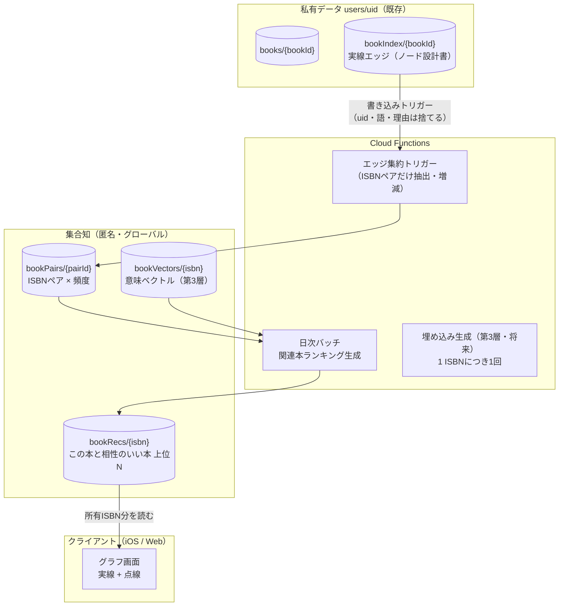
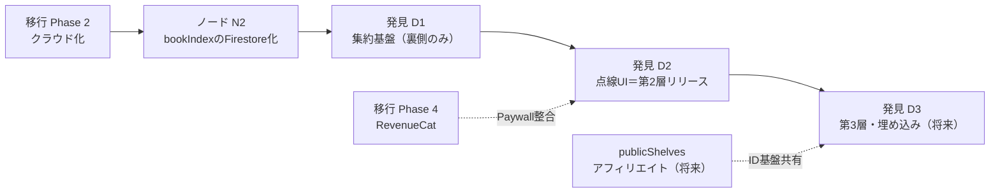

# BookBank 発見機能（点線・集合知・思考のつながり）設計書

作成日: 2026-07-07
ステータス: 事前設計（実装時に不備・矛盾を発見した場合は指摘・修正すること）
関連文書:

- `docs/cloud-migration-architecture.md`（クラウド移行設計書。以下「移行設計書」）
- `docs/node-graph-feature-design.md`（ノード機能設計書＝実線の層。以下「ノード設計書」）
- `DESIGN_SYSTEM.md`

> **AI実装エージェントへ**: `docs/agent-implementation-guide.md` を先に読むこと。本書の (仮) 推奨は確定仕様として実装する（G-B / R-B / P-C / V-B / CS-B / T-B）。無料/Unlimited境界は本書第9章ではなく `docs/monetization-model-design.md` 第7章が正（発見機能はUnlimited専用・「1冊無料」は廃止済み）。

---

## 0. ビジョンと前提

### 0.1 3層構造

本機能は、ノード機能（実線＝自分の本棚内の確定したつながり）の上に「発見」の層を重ねる。

| 層 | 線 | 意味 | データ源 |
|----|----|------|---------|
| **第1層** | 実線 | 所有・確定。自分の本棚の本同士が著者・シリーズ・言葉でつながる | 自分の本棚（ノード設計書で設計済み） |
| **第2層** | 点線 | 未所有・可能性。**BookBankユーザー全体の集合知**から、まだ持っていない相性のいい本が現れる | 全ユーザーの匿名化された「結びつきの事実」 |
| **第3層** | 点線 | 思考の響き合い。ジャンル・言葉の一致を超え、主題・問いのレベルで本が結びつく（王国の小説⇔マネジメント本） | 埋め込みベクトル（意味空間） |

**体験の核**: 実線のグラフ（自分の思考）の縁に、点線で「まだ出会っていない本」が静かに浮かぶ。点線の先の本を手に取る（登録する）と、点線が実線に変わり、グラフ＝思考が一回り育つ。「本棚が思考として育つ」ビジョンの、**成長の次の一手を指し示す**機能である。

### 0.2 確定している方針

| # | 方針 |
|---|------|
| 1 | 集合知は**本棚データのみ**から作る。個人情報は一切取得・保存しない |
| 2 | 集合知に集約するのは「**どの本とどの本が結びついたか**」という事実（書籍識別子ペアと頻度など）のみ。**メモの中身・共有語・誰のものか**は集合知に送らない。各ユーザーの私的な結びつきは匿名の事実としてのみ集約される |
| 3 | 第3層は埋め込みベクトルで捉える。**つながりの理由は言葉でラベリングしない**（理由の非明示は発見の余韻を守る意図的な設計） |
| 4 | 点線の本は既存ノードグラフの中に、実線＝所有・確定、点線＝未所有・可能性として**色を変えて**表示する |

### 0.3 補完した仮定の一覧（既存設計書と同形式）

| # | 論点 | 補完した前提 (仮) |
|---|------|------------------|
| D1 | 集合知の書籍識別子 | **ISBN-13**。ISBNの無い本（手動登録の一部）は集合知の対象外とする（移行設計書 `bookStats` の方針「タイトル名寄せはしない」と同一。第2章） |
| D2 | 集約対象のエッジ | 第1層の実線エッジのうち、**両端がISBNを持つもの全て**（著者・シリーズ・単語エッジの区別なく「結びついた事実」として1票。種別・スコア・reasonsは送らない＝方針2の帰結） |
| D3 | 集合知への提供 | 全ユーザー（無料含む）の本棚から集約する。**設定でオプトアウト可能**にする（第6章プライバシー設計） |
| D4 | 点線提案の対象 | 「本棚に無いISBN」。同じ本の判定はISBN完全一致のみ（版違い・文庫化の名寄せは初期スコープ外） |
| D5 | 提案の更新頻度 | リアルタイム性は不要。**日次バッチ**で十分（発見は「静かに現れる」体験であり、即時性は価値でない） |
| D6 | 第3層の埋め込み入力 | **書誌データのみ**（タイトル・著者・出版社・シリーズ・検索APIの内容紹介文）。ユーザーのメモは埋め込みに使わない（方針1・2の技術的保証を単純にするため。第4章） |

---

## 1. 全体像



- **私有データと集合知は物理的に別のコレクション階層**（`users/{uid}` 配下 vs トップレベル）。移行設計書 3.1節「私有データと公開データを最初から別の場所に置く」の原則をそのまま踏襲する
- クライアントが直接読むのは事前計算済みの `bookRecs` のみ。`bookPairs` の生データはクライアントに開放しない（コストとプライバシーの両面。第2章）

---

## 2. 論点1: 集合知データベースの構造

### 2.1 満たすべき制約

- 個人情報ゼロ（uid・メモ語・エッジ理由を含めない）＝方針1・2
- クライアントがグローバルデータを直接書けない構造（汚染耐性）
- 移行設計書 2.4節「Cloud Functionsは最小限（Webhook受信・削除処理・解析集計の3つ）」との整合 → **本機能は「解析集計」の系譜に位置づけ、既存の `bookStats` トリガー（移行設計書 9.3節）の拡張として実装する**。Functionsの役割カテゴリを増やさない
- Firestore読み書き課金への配慮（移行設計書 11.2節）

### 2.2 案の比較

| 案 | 仕組み | プライバシー | 汚染耐性 | コスト | 実装難易度 |
|----|--------|-------------|---------|--------|-----------|
| G-A | **クライアントが直接 `bookPairs` をincrement** | uidは書き込まれないが、ルール上「認証済みなら誰でも任意ペアを加算できる」 | **低**（改造クライアントで任意の本を持ち上げ可能） | 読み書きとも安い | ★☆☆ |
| G-B | **Firestoreトリガー関数で集約**: `users/{uid}/bookIndex/{bookId}` の作成/更新/削除をトリガーに、変更前後のエッジ差分からISBNペアの票を増減。関数内でuid・keywords・reasonsを参照せずISBNペアだけ抽出 | **高**（グローバル側は Admin SDK のみ書き込み可。uidは関数のスコープ外に出ない） | **高**（1ユーザーの本棚からは同一ペア最大1票。差分更新で削除時は減算） | 書き込みは本の追加・編集時のみ。既存の `bookStats` トリガーと同一イベントに同居可能 | ★★☆ |
| G-C | **日次スケジュール関数で全ユーザーの `bookIndex` をフルスキャンして再集計** | 高 | 高 | **スキャンコストがユーザー数×冊数に比例して恒常発生**。移行設計書 9.3節が「フルスキャンはしない」と明記した方針に反する | ★★☆ |
| G-D | **クライアントが匿名の「提出箱」コレクションに書き、関数が検証して集約後に削除** | 中（提出箱に一時的にuid由来の書き込み元情報が残る） | 中 | 提出箱の書き込み+削除で2倍 | ★★★ |

### 2.3 推奨 (仮): G-B（`bookIndex` トリガーでの差分集約）

- ノード設計書 N2 で `bookIndex` がFirestoreに保存されるようになる（C-C方式）ため、**その書き込みイベントをそのまま集約の入力にできる**。クライアントに追加実装ゼロ
- トリガー関数の処理: `change.before.edges` と `change.after.edges` を比較し、追加されたペア・消えたペアを算出 → 両端のISBNを `books` から引き（`bookIndex` にはbookIdしか無いため、ISBNは `bookIndex` に非正規化して持たせる。ノード設計書 7.2節に `isbn string?` フィールドを追記する）→ `bookPairs` を `FieldValue.increment(±1)` で更新
- **1ユーザー1票の保証**: 同一ユーザーの本棚内で同じISBNペアが複数エッジ経路で結びついても、`bookIndex.edges` 上は1本なので自然に1票になる。本の削除・エッジ消滅時は減算されるため、票は常に「現在そのペアを結びつけている本棚の数」を表す
- **k-匿名性**: `bookRecs` 生成時（第2.4節）に **票数 `count >= 3` (仮)** のペアだけを提案候補にする。「この2冊を結びつけているのは世界で1人」という事実が他ユーザーから観測できないようにする

### 2.4 集約結果の提供方法（クライアントが読む形）

| 案 | 形 | 読み取りコスト | 備考 |
|----|----|--------------|------|
| R-A | クライアントが `bookPairs` を直接クエリ | 所有ISBN×ペア数で読み取りが膨らむ。ルールも複雑化（count>=3の条件読み） | 不採用 |
| R-B | **日次バッチが `bookRecs/{isbn}`（この本と相性のいい本 上位N件）を事前計算**し、クライアントは所有ISBN分だけ読む | **所有ISBN数 = N docs で確定**。オフラインキャッシュにも乗る | 移行設計書 9.3節の `appStats` 日次バッチと同じ運用型 |

**推奨 (仮): R-B**。日次バッチは「前日に票が動いたISBN」だけ再計算する（`bookPairs` 更新時に `dirtyIsbns` へマークしておく）ことでフルスキャンを避ける。

---

## 3. 論点2: 相性スコアの算出

### 3.1 第2層（共起ベース）のスコア

「よく一緒に結びつけられている」を数値化する際の最大の敵は**人気本バイアス**（ベストセラーは何とでも共起する）。

| 案 | 定義 | 特徴 |
|----|------|------|
| P-A | **生の共起数** `count(A,B)` | 実装最易。人気本が全ての本の推薦上位を占拠し、「自分の本棚らしさ」が消える |
| P-B | **Jaccard係数** `count(A,B) / (own(A) + own(B) - count(A,B))` | 人気補正あり。ただし所有数（own）の分母が大きい本は不当に沈む |
| P-C | **リフト値（PMI系）** `count(A,B) / (own(A) × own(B))` に上限クリップ | 「偶然以上に一緒に現れる度合い」を測る。ニッチ同士の強い結びつきが浮かぶ＝**発見機能の意図に最も合う**。ただし票数が少ないペアで値が暴れるため、票数下限（k-匿名性の3票）と平滑化が必須 |
| P-D | 行列分解・学習ベースの協調フィルタリング | 精度上限は高いが、学習基盤の運用が個人開発体制に過大 |

**推奨 (仮): P-C（リフト値）を基本に、`score = lift × log(1 + count)` で票数の信頼度を加味**。`own(X)`（Xを所有する本棚数）は既存の `bookStats/{isbn}.registeredCount`（移行設計書 9.3節）をそのまま分母に使える。新しい集計を増やさない。

### 3.2 第2層と第3層の役割分担

| | 第2層（共起） | 第3層（埋め込み） |
|--|--------------|------------------|
| 答える問い | 「この本を結びつけた人たちは、他に何を結びつけたか」 | 「この本と**意味的に響き合う**本は何か」 |
| 得意 | 実際の読書行動に裏打ちされた提案。ハズレが少ない | ジャンル横断の飛躍（王国の小説⇔マネジメント本）。集合知が無くても計算できる |
| 苦手 | データが無いペアは永遠に出ない（コールドスタート）。人気の重力圏に閉じがち | 「意味は近いが読書体験としては繋がらない」ノイズ。ベクトル品質に依存 |
| 位置づけ | **提案の主軸**（フェーズD1〜） | **飛躍枠**（フェーズD3・将来） |

**統合方法 (仮)**: `bookRecs/{isbn}` の上位N件（N=20）を「共起由来」で埋め、第3層導入後は**そのうち固定の数枠（例: N中4枠）を埋め込み由来の「遠い本」に予約**する。スコアを線形合成して混ぜる案（`α×共起 + β×類似度`）は、異なる尺度の正規化チューニングが難しく挙動が説明不能になるため採らない。**枠を分ける方式は「たまに遠くから来る一冊」という体験のリズムを設計者が直接制御できる**。各推薦に `source: "cooccur" | "embedding"` を持たせる（UI上は区別を表示しない＝理由の非明示。内部の品質分析にのみ使う）。

---

## 4. 論点3: 埋め込みの計算場所とコスト（第3層）

### 4.1 前提の整理

- 理由を非明示にする方針（0.2 方針3）のため、**説明可能性の制約から解放されている**。語の一致に縛られる必要がなく、多言語を単一の意味空間に落とせるモデルをそのまま使える（ノード設計書がW-Eを見送った理由「なぜつながったかを説明できない」は、この層では制約にならない）
- 埋め込み入力は**書誌データのみ**（前提D6）: `title + author + seriesName + publisher +（あれば）検索APIの内容紹介文`。メモを使わないため、埋め込みは「ユーザーごと」ではなく「**書籍（ISBN）ごとに全世界で1回**」で済む——これがコスト構造を決定づける

### 4.2 案の比較

| 案 | 計算場所・モデル | 多言語(5言語) | コスト | 品質 | 実装難易度 |
|----|----------------|--------------|--------|------|-----------|
| V-A | **オンデバイス `NLEmbedding`**（Apple） | 文埋め込みの対応言語が限定的（韓国語・中国語のセンテンス埋め込みは非対応または品質未知数）。**言語間で空間が揃わない**（日本語の本と英語の本の距離が定義できない） | ゼロ | 低〜中 | ★★☆ |
| V-B | **クラウドの多言語embedding API**（Gemini `text-embedding` / OpenAI `text-embedding-3-small` 等）でISBNごとに事前計算し、`bookVectors/{isbn}` に保存 | **多言語を単一空間に埋め込める**（クロスリンガル対応が公称されているモデルを選定） | 1 ISBNあたり1回・数百トークン。**10万冊でも数百円〜数千円のオーダー**（一回きり） | 高 | ★★☆ |
| V-C | オープンソース多言語モデル（multilingual-E5等）をCloud Run等で自前ホスト | 可 | 推論サーバーの常時運用費・保守 | 高 | ★★★ |
| V-D | 端末でCore ML化した多言語モデルを実行 | 可 | ゼロ（端末負荷） | 中〜高 | ★★★（モデル変換・アプリサイズ+数百MB） |

### 4.3 推奨 (仮): V-B（クラウドAPIでISBNごとに1回・事前計算）

- **トリガー**: `bookStats/{isbn}` の新規作成時（＝世界で初めてその本が登録された時）に埋め込み生成関数を実行し、`bookVectors/{isbn}` に保存。既存の解析集計トリガー（移行設計書 9.3節）への追記であり、Functionsの役割カテゴリは増えない
- **類似検索**: Firestoreの**ベクトル検索（KNN）**を `bookVectors` に対して使う。ただし検索を実行するのは日次バッチ（`bookRecs` 生成時に埋め込み枠を埋める）のみで、クライアントからのベクトル検索はさせない（コスト固定化）
- 内容紹介文は楽天Books API（`itemCaption`）/ Google Books（`description`）から取得できる場合のみ使い、無ければタイトル・著者・出版社のみで埋め込む（品質は落ちるが方式は変わらない）
- V-Aを採らない理由: 言語間で空間が揃わない時点で「翻訳書・多言語本棚でこそ活きる第3層」の価値が出ない。V-C/V-Dは個人開発の運用負荷に対して過大
- **APIキーの管理**: embedding APIのキーはCloud Functionsの環境変数のみに置き、クライアントには一切埋め込まない

---

## 5. 論点4: コールドスタート

ユーザー数が少ない初期は `bookPairs` の票がほぼ全て3票未満（k-匿名性の閾値未満）となり、第2層は沈黙する。

### 5.1 案の比較

| 案 | 手法 | 長所 | 短所 |
|----|------|------|------|
| CS-A | **何も出さない**（データが貯まるまで点線を非表示） | 誠実。実装ゼロ | 機能をリリースした意味がない。「育つ」体験の起点が作れない |
| CS-B | **著者・シリーズの決定的フォールバック**: 所有本の著者・シリーズ名で既存の検索プロキシ（`bookbank-share` の `/api/rakuten` 等）を叩き、未所有の同著者・同シリーズ本を点線候補にする | 集合知ゼロでも確実に「意味のある点線」が出る。既存インフラ（検索プロキシ）の再利用で新規サーバー実装なし。同シリーズの「まだ持っていない巻」は**実用性が極めて高い** | ジャンル横断の飛躍は無い（それは第2・3層の役割）。検索API呼び出しが増える（キャッシュ必須） |
| CS-C | **外部書誌データベースで共起の種を輸入**（openBD・版元ドットコム等のジャンルコード、国会図書館の分類） | 初日から「それらしい」推薦 | 「BookBankユーザーの集合知」という物語が薄まる。外部データのライセンス・鮮度管理が増える。日本の書誌に偏り5言語方針と不整合 |
| CS-D | **第3層（埋め込み）を先行させる** | 集合知不要で意味的提案が出る | 第3層は最後の将来フェーズとする方針（ユーザー指定）と矛盾。埋め込み枠の「飛躍」はハズレ耐性が必要で、共起の実績で信頼を作ってからの方が受容されやすい |
| CS-E | **閾値の段階運用**: 初期はk-匿名性を守れる範囲で票閾値を低く（3票）、ユーザー増加後に引き上げ | 集合知の立ち上がりを早める | 閾値3は既に下限（これ以上は下げられない）。補助策にしかならない |

### 5.2 推奨 (仮): CS-B を恒久的な基礎層とし、集合知（第2層）を票が貯まったペアから段階的に上書き

- 点線候補の優先順位: **① 同シリーズの未所有巻（最強・確実） → ② 集合知の共起推薦（3票以上のもの） → ③ 同著者の未所有本 → ④（第3層導入後）埋め込みの飛躍枠**
- CS-Bはコールドスタート対策であると同時に、**集合知が育った後も「シリーズの次の巻」という最頻ニーズを担う恒久層**になる（使い捨ての暫定実装にしない）
- 検索プロキシ呼び出しは日次1回・著者/シリーズごとにキャッシュ（`users/{uid}/discoveryCache`。第7章）し、楽天APIのレート制限（約1req/秒）を尊重する
- CS-C（外部書誌DB）は不採用 (仮)。ただし将来、韓国語・中国語圏ユーザーが増えて楽天検索のカバレッジ不足が顕在化したら、NAVER検索プロキシ（実装済み）の併用を同じCS-Bの枠組みで足す

---

## 6. プライバシー設計（技術的保証）

方針1・2「本棚データのみ・個人情報非取得・メモ内容非送信」を、運用の注意ではなく**構造**で保証する。

| 保証 | 実現手段 |
|------|---------|
| 集合知にuidが入らない | `bookPairs` / `bookRecs` / `bookVectors` のスキーマに**uid・端末ID・タイムゾーン等のフィールドがそもそも存在しない**（第7章）。集約関数はincrementのみ行い、書き込み元を記録しない |
| メモの中身・共有語が出ない | 集約トリガーが読むのは `bookIndex.edges[].to` と `isbn` のみ。`keywords` / `reasons` フィールドは**関数コード内で参照しない**（コードレビュー観点として明記）。第3層の埋め込み入力は書誌データのみ（前提D6）で、ユーザー生成テキストは一切パイプラインに入らない |
| クライアントが集合知を汚染できない | セキュリティルールで `bookPairs` / `bookVectors` は read/write とも全面拒否、`bookRecs` は read のみ許可。書き込みはAdmin SDK（Functions）のみ |
| 個の再識別の防止 | k-匿名性: 票数3未満のペアは `bookRecs` に載せない（2.3節）。`bookRecs` にも票数の生値は載せず、正規化スコアのみ（「この2冊を結びつけた人数」を外から数えられない） |
| ユーザーの拒否権 | 設定に「**つながりの匿名共有**」トグルを追加 (仮・前提D3)。OFFのユーザーは `users/{uid}.settings.shareAnonymousLinks = false` とし、集約トリガーが冒頭でチェックしてスキップ。OFFでも点線の**受信**（bookRecs閲覧）は可能とする（提供と受益を非対称にしてよいか実装前に再確認） |
| 法務文書 | 移行設計書 第10章のプライバシーポリシー改訂項目「利用状況の統計的解析」に、「**登録書籍の組み合わせ傾向を個人を特定できない形で集計し、本の提案機能に利用する**」を追記する。Phase D1リリースと同時（第9章） |

> **残余リスクの明示**: 「AとBを結びつけた本棚が存在する」という事実自体は集合知に残る（方針2で許容済み）。極端にニッチな2冊の組み合わせは理論上、本人には自分の寄与だと分かるが、第三者からは3票閾値により識別できない。

---

## 7. データモデル（Firestoreスキーマ）

移行設計書 3.2節・ノード設計書 7.1節への追加。**集合知はトップレベル（`users/` の外）に置き、私有データと物理分離する**。

### 7.1 コレクション構造

```
users/{uid}
├── ...（既存）
├── bookIndex/{bookId}                   ... ノード設計書 7.2節に isbn フィールドを追記
└── discoveryCache/{isbn}                ... 【新規・私有】点線候補のキャッシュ（端末表示用）

bookPairs/{pairId}                       ... 【新規・集合知】ISBNペアの票数（クライアント読み書き不可）
bookRecs/{isbn}                          ... 【新規・集合知】相性のいい本 上位N（クライアント読み取りのみ可）
bookVectors/{isbn}                       ... 【新規・第3層】書誌埋め込み（クライアント読み書き不可）
```

### 7.2 `bookPairs/{pairId}`【集合知・Functions専用】

ドキュメントID: `"{isbnA}_{isbnB}"`（ISBN-13を辞書順に整列して連結。1ペア1ドキュメントを保証）。

```
isbnA        string     辞書順で小さい方
isbnB        string     辞書順で大きい方
count        number     このペアを現在結びつけている本棚の数（increment/decrement）
dirty        boolean    前回のbookRecs生成後に票が動いたか（日次バッチの差分対象マーク）
updatedAt    timestamp
```

### 7.3 `bookRecs/{isbn}`【集合知・クライアント読み取り可】

日次バッチが生成。クライアントは所有ISBNの分だけ読む。

```
recs         array<map> [{           上位N件（N=20）スコア降順
  isbn: string                         相手のISBN
  title: string                        表示用スナップショット（bookStatsからコピー）
  author: string?
  imageURL: string?
  score: number                        0..1 正規化スコア（票数の生値は含めない）
  source: string                       "cooccur" | "embedding"（UI非表示・品質分析用）
}]
computedAt   timestamp
schemaVersion number                  スコア式改訂時の再計算判定用
```

> 表示用スナップショット（title等）を内包するのは、点線ノード描画のために相手の書誌を追加読み取りしなくて済ませるため（読み取りコスト: 所有ISBN数で確定）。スナップショット元は `bookStats/{isbn}`（移行設計書 9.3節。title/author/imageURLを既に持つ）。

### 7.4 `bookVectors/{isbn}`【第3層・Functions専用】

```
embedding    vector     多言語embedding（次元数はモデル選定時に確定。768等）
inputDigest  string     埋め込み入力テキストのハッシュ（書誌更新時の再計算判定）
model        string     使用モデル名+バージョン（モデル更新時の全量再計算判定）
lang         string     書誌の主要言語（品質分析用）
createdAt    timestamp
```

### 7.5 `users/{uid}/discoveryCache/{isbn}`【私有】

クライアントが組み立てた「この本棚向けの点線候補」のキャッシュ。ドキュメントIDは**提案される側（未所有本）のISBN**。

```
title        string       表示用（bookRecs / 検索APIから）
author       string?
imageURL     string?
anchorIsbns  array<string>  どの所有本から点線が伸びるか（複数可）
tier         string       "series" | "cooccur" | "author" | "embedding"（5.2節の優先順位）
score        number
state        string       "active" | "dismissed" | "registered"
                          （dismissed = ユーザーが「表示しない」にした本。再提案しない）
fetchedAt    timestamp
```

> `dismissed` を私有側に持つことで、「消したのにまた出る」という体験の破綻を防ぐ。集合知側には一切フィードバックしない（「誰かがこの提案を拒否した」という情報も送らない）。

### 7.6 セキュリティルール（移行設計書 3.4節への追加）

```
// 疑似コード
match /bookPairs/{pairId}   { allow read, write: if false; }  // Functions のみ
match /bookVectors/{isbn}   { allow read, write: if false; }  // Functions のみ
match /bookRecs/{isbn}      { allow read: if request.auth != null;
                              allow write: if false; }        // 読み取りのみ開放
// users/{uid}/discoveryCache は既存の包括ルール（本人のみ）で自動的にカバーされる
```

### 7.7 ノード設計書への波及変更

- `bookIndex/{bookId}` に `isbn string?` を追記（集約トリガーがbookIdからISBNを引く追加読み取りを不要にする非正規化。ノード設計書 7.2節の改訂）
- `graphMeta/current` は変更なし

---

## 8. グラフUI/UX（点線の層）

ノード設計書 第8章のグラフ（宇宙的ビジュアル: 黒背景 #1A1A1A に表紙ノードが浮かぶ）に発見の層を重ねる。**基調は「静かに提示する」**（方針3）。点線が主張しすぎるとグラフが広告面に堕ちる。

### 8.1 視覚言語（DESIGN_SYSTEM.md トークンとの対応）

| 要素 | 実線（所有・確定） | 点線（未所有・可能性) |
|------|-------------------|---------------------|
| エッジ | `Color.primary.opacity(0.15〜0.4)`・実線1〜3px（ノード設計書 8.2節のまま） | **破線**（`StrokeStyle(dash: [4, 6])`）・`opacity(0.25)` 固定・1px。スコアで太さを変えない（可能性に序列を見せない） |
| ノード | 表紙サムネイル・角丸2px・2:3、ドット時は口座テーマカラー | 表紙を **`opacity(0.45)`** で淡く + **破線の輪郭**（角丸2px）。ドット時は塗りなしの破線円（口座色を持たない＝まだどの口座にも属さない） |
| 選択時の影 | `black.opacity(0.5), radius: 20, y: 8` | 同トークンだが `opacity(0.25)` に減衰（浮遊感を残す） |
| 表示数 | エッジ上位k=8/ノード | **画面内の点線ノードは同時に最大6個 (仮)**。ビューポート内の所有ノードに紐づく最上位候補から順に出す。ズームアウト（全体表示）では点線層を自動非表示（毛玉化防止・ノード設計書 5.2節の過密対策と整合） |
| レイヤートグル | 「著者・シリーズ・ことば」チップ（既存） | 同列に「**発見**」チップを追加（カプセル型・`Color.primary.opacity(0.1)`）。OFFで点線層を完全に消せる |
| 登録の瞬間 | - | 点線ノードを登録すると、**破線輪郭→実線・表紙が不透明化・点線エッジが実線に置き換わる**アニメーション（`.easeInOut(duration: 0.2)` 標準トークン起点＋物理シミュレーションへの編入）。この機能の感情的クライマックスであり、最も磨き込む箇所 |

**理由の非明示（方針3）の徹底**: 点線エッジ・点線ノードのどこにも「なぜ」を表示しない。実線層の「`村上春樹` でつながっています」（ノード設計書 8.2節）とは対照的な無言のデザインとし、この非対称自体を発見の層の記号にする。

### 8.2 論点5: 点線の動線（タップ後の体験）

| 案 | 体験 | 評価 |
|----|------|------|
| T-A | タップで即・登録確認ダイアログ | 速いが乱暴。「可能性を眺める」静けさと合わない |
| T-B | **カルーセルポップアップ（既存トークン: 角丸24px・`.ultraThinMaterial`）で書誌を表示**し、アクションを並べる | 実線ノードのタップ（ノード設計書 8.2節）と同じ器で、中身だけ「未所有」仕様に変える。学習コストゼロ |
| T-C | 既存の書籍検索画面へ遷移して検索結果として見せる | 実装は軽いがグラフの世界観から現実に引き戻される。文脈（どの本から伸びた点線か）も失われる |

**推奨 (仮): T-B**。ポップアップの構成:

1. **書誌表示**: 表紙（140×210・角丸2px・詳細影トークン）・タイトル・著者・出版社。価格は検索プロキシから取得できた場合のみ表示（`FormattedPriceText` の既存通貨表示に従う）
2. **主アクション「本棚に登録」**（プライマリボタントークン: カプセル・青背景・白文字）: 既存の登録フロー（口座選択・価格確認）をシート表示で再利用。ISBNがあるので `BookSearchService` のISBN検索で正規の書誌を引いてから `saveBook` 相当を通す（検索画面と同じ重複チェック・価格手入力フォールバックが効く）
3. **副アクション「表示しない」**（テキストボタントークン）: `discoveryCache.state = "dismissed"`
4. **将来アクション「購入する」**: アフィリエイトリンク（楽天）。**`publicShelves` のアフィリエイト機能（移行設計書 3.3節・将来Phase）と同じアフィリエイトID基盤を使うが、こちらは運営者のアフィリエイトIDによる収益化**（ユーザーのIDを使う publicShelves とは目的が異なる点に注意）。iOSアプリ内からの外部購入リンクはAppleガイドライン上、物理書籍の購入は許容範囲だが、**実装時に最新のガイドライン（3.1.3(e)等）を必ず再確認**し、リスクがあればWeb版のみに載せる

> 点線→登録の転換率（`discovery_book_registered` イベント）はこの機能のKPIそのもの。Firebase Analyticsのカスタムイベント（移行設計書 9.3節）に `discovery_shown` / `discovery_dismissed` / `discovery_book_registered { tier }` を追加する（**語やISBNは送らない**。tierと件数のみ）。

---

## 9. 無料/Unlimitedでの位置づけ

ノード設計書 第9章（グラフ本体=Unlimited・書籍詳細の上位3件=無料）に積む形。

| 機能 | 無料 | Unlimited |
|------|------|-----------|
| 点線レイヤー（グラフ内の発見） | 不可（グラフ本体がUnlimited限定のため自動的に不可） | **可** |
| 書籍詳細の「この本の先にある本」 | **1冊だけ表示** (仮)（点線の存在を知る入口。タップでPaywall） | 全件表示 + 登録動線 |
| 集合知への匿名提供 | **プランに関係なく提供**（オプトアウト可・前提D3） | 同左 |

- **無料ユーザーも集合知に貢献する**（データの厚みは全ユーザーの利益）一方、受益の大半はUnlimitedに置く。この非対称は「匿名の事実のみ・オプトアウト可」で正当化するが、心理的な不公平感が問い合わせになる可能性は残る（リスク章）
- Paywallトリガーイベントに `paywall_shown { trigger: "discovery" }` を追加

---

## 10. 実装フェーズ分割案

クラウド移行Phase（0 UUID → 1 リポジトリ抽象化 → 2 クラウド大型 → 3 Web → 4 RevenueCat → 5 Web課金）、ノードPhase（N0 精度検証 → N1 iOSオンデバイス → N2 Firestore保存化 → N3 Web）との前後関係:



| Phase | 内容 | 前提 | リリース形態 |
|-------|------|------|-------------|
| **D0（設計スパイク）** | 自分の実データでCS-B（同シリーズ未所有巻・同著者）の候補品質を検証。点線UIのプロトタイプ（静止データ）で「静かさ」の調整。k-匿名性閾値・スコア式の机上検証 | ノードN1完了後（実線グラフが存在すること） | リリースなし |
| **D1（集約基盤・裏側のみ）** | `bookIndex` に `isbn` 追記 / 集約トリガー関数 / `bookPairs` / 日次バッチ + `bookRecs` / オプトアウト設定 / **プライバシーポリシー改訂（第6章・リリースに先行必須）**。UIは出さず**票を貯め始める**（点線リリース時に集合知が最低限育っているように） | ノード**N2**（bookIndexのFirestore化）完了後。＝移行Phase 2完了後 | iOSアップデート（見た目変化なし）+ Functions |
| **D2（点線リリース＝第2層）** | 点線レイヤーUI / `discoveryCache` / CS-Bフォールバック（シリーズ・著者） / カルーセルポップアップと登録動線 / Paywall導線 / Analyticsイベント | D1から**1〜2ヶ月以上**空ける（票の蓄積期間・仮）。移行Phase 4以降ならPaywall文言も新課金体系で統一できる | iOSアップデート（Unlimited新特典として訴求） |
| **D3（第3層・埋め込み。将来）** | `bookVectors` 生成関数 / 日次バッチに埋め込み枠（20枠中4枠）を追加 / モデル選定と多言語品質検証 | D2の転換率データで「発見が使われている」ことを確認してから。**最後の将来フェーズ**（ユーザー指定方針） | Functions + バッチ改修のみ（アプリ側は `source` を区別しないため原則無改修） |
| **将来** | 購入アクション（アフィリエイト）/ Web版の点線表示（ノードN3に追従）/ 版違い・翻訳書の名寄せ | publicShelves基盤 / N3 | - |

**順序の意図**:

- D1を「UIなしで先行」させるのは、コールドスタート（第5章)を時間で緩和する唯一の手段が「早く集め始める」ことだから
- D2をCS-Bフォールバック込みでリリースするため、集合知が薄くても点線は初日から意味を持つ
- D3を最後に置くのはユーザー指定方針であると同時に、埋め込み枠の「ハズレ」を許容してもらうには共起提案で信頼残高を作っておく必要があるため（5.1節 CS-D の考察）

---

## 11. リスクと注意点

### 11.1 プライバシー

- **再識別リスク**: k-匿名性（3票閾値）と票数生値の非公開（7.3節）で防ぐが、閾値は集合知の成長とともに引き上げを検討（`schemaVersion` で再計算可能な設計にしてある）
- **「メモを読まれている」誤解**: メモ由来の実線エッジが集合知に票として入るため、「メモの内容が送られている」と誤解される余地がある。設定画面のオプトアウト項目に「**送信されるのは本の組み合わせのみで、メモや語は送信されません**」を明記し、プライバシーポリシーにも同じ粒度で書く
- **削除の伝播**: アカウント削除（移行設計書 4.4節の削除Function）時、`bookIndex` の削除トリガーで `bookPairs` の票が自然に減算される設計だが、**大量ドキュメント削除時のトリガー実行保証**（Firestoreの一括削除はトリガーを飛ばす場合がある）を実装時に必ず検証する。取りこぼしは票の過大計上として残るため、整合性回復バッチ（低頻度・全量再集計）を年次で回す運用を用意する

### 11.2 集合知の悪用・汚染耐性

- **書き込み経路の一本化**: クライアントは集合知に書けない（ルールで全面拒否・7.6節）。汚染するには実際に本棚を作る必要がある
- **シビル攻撃（複数アカウントで特定本のペアを持ち上げる）**: 1ユーザー1票 + 3票閾値により、最低3アカウントで本棚と実線エッジを作り込む必要がありコストが高い。さらに `bookRecs` 生成時に**異常検知（特定ISBNペアの急増率チェック）**を日次バッチに組み込み、閾値超は保留リストに入れて手動確認する (仮・初期は簡易実装でよい)
- **アカウント作成の敷居**: ログイン必須方針（移行設計書・前提6）により匿名の書き捨てアカウントでの汚染は既に一定の敷居がある

### 11.3 コールドスタート・体験品質

- **初期の点線がCS-B（著者・シリーズ）ばかりになる**: それ自体は実用的だが「集合知による発見」の物語とはギャップがある。訴求文言は初期は「まだ出会っていない本が現れる」に留め、「みんなの本棚から」の訴求はD2以降に票が育ってから解禁する
- **人気本の重力**: リフト値（P-C）で補正するが、日次バッチのログで推薦分布（同一ISBNが全ユーザーの推薦に出る率）を監視する
- **提案のハズレによる信頼毀損**: `dismissed` の尊重（再提案しない）と、点線の同時表示数を絞る（最大6個）ことで「ノイズだ」と感じさせない。dismissed率をtier別に計測し、tierごとの品質を定量評価する

### 11.4 コスト

- **集約トリガーの書き込み増**: 本1冊の追加でエッジ8本 → 最大8ペアのincrement。既存の `bookStats` トリガーと同一イベントで処理し、関数呼び出し回数は増やさない
- **埋め込みコスト（D3）**: ISBNごと1回・全世界共有のため増分は新刊登録分のみ。モデル更新（全量再計算）だけが大口支出で、実施判断は明示的に行う（自動でモデルを追いかけない）
- **Firestoreベクトル検索**: 日次バッチからのみ実行しコストを固定化（4.3節)。KNNの次元・件数上限などFirestoreの制約は実装時点の最新仕様を確認する

### 11.5 整合性・スコープ

- **ノード設計書への波及**（7.7節）: `bookIndex.isbn` の追記はノードN2の実装前に反映すること（後から足すと全量再計算が1回増える）
- **無料ユーザーの貢献と受益の非対称**（第9章）: 問い合わせ・レビューでの指摘に備え、FAQに「匿名の統計にのみ使われ、オフにもできる」ことを記載
- **理由の非明示という賭け**: 「なぜこの本？」という問い合わせは必ず来る。それでも表示しないのが設計意図（発見の余韻）なので、FAQには方針として書く。ただしdismissed率が異常に高い場合は、非明示が「不信」に転じているシグナルとして方針ごと再検討する

---

## 付録A: 既存設計書との接点まとめ

| 既存設計 | 本設計での扱い |
|---------|---------------|
| 移行設計書 2.4節「Functions最小限」 | 集約・バッチ・埋め込みはすべて既存の「解析集計」カテゴリの拡張として実装（新カテゴリを作らない） |
| 移行設計書 9.3節 `bookStats/{isbn}` | リフト値の分母（`registeredCount`）・`bookRecs` の書誌スナップショット元・埋め込み生成のトリガー元として再利用 |
| 移行設計書 9.5節・第10章 | プライバシー方針（uid非含有・統計限定）を集合知にも適用。ポリシー改訂はD1リリース前に必須 |
| 移行設計書 3.3節 `publicShelves` | 将来の「購入する」アクションのアフィリエイトID基盤と関係（ただし収益の帰属が異なる。8.2節） |
| ノード設計書 7.2節 `bookIndex` | 集約トリガーの入力。`isbn` フィールドを追記（波及変更） |
| ノード設計書 8.2節 グラフUI | 同じ画面に点線レイヤーを重ねる。トグルチップ・カルーセルポップアップ・アニメーショントークンを共有 |
| ノード設計書 第9章 無料/Unlimited | 「書籍詳細の上位3件無料」に対応する形で「この本の先にある本 1冊無料」を追加 |
| `bookbank-share` 検索プロキシ | CS-Bフォールバック（同著者・同シリーズ検索）と点線ノードの書誌・価格取得に再利用 |
