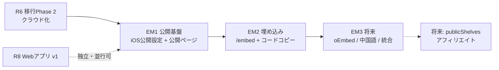

# BookBank 読了リスト公開ページ・埋め込み機能 設計書

作成日: 2026-07-07
ステータス: 事前設計（実装時に不備・矛盾を発見した場合は指摘・修正すること）
関連文書:

- `docs/cloud-migration-architecture.md`（移行設計書。第3章スキーマ・6.4節 bookbank-share 棲み分け・11.2節コスト方針）
- `docs/monetization-model-design.md`（無料/Unlimited境界の正・第7章）
- `docs/implementation-roadmap.md`（リリース順序の正）
- `docs/node-graph-feature-design.md` / `docs/discovery-feature-design.md`（将来接続: 公開グラフ・publicShelves）
- `DESIGN_SYSTEM.md`
- 別リポジトリ `bookbank-share`（`/Users/37/AYAME-Cursor/bookbank-share`。現行の共有実装）

> **AI実装エージェントへ**: `docs/agent-implementation-guide.md` を先に読むこと。本書の (仮) 推奨は確定仕様として実装する（F-B / R-B / U-B / M-A / 通貨T-A準拠）。前提は**クラウド移行Phase 2（R6）完了後**であり、それ以前に本機能の実装に着手しないこと。既存の `/share/[id]`・`/api/lists` のURLと挙動は一切変更しない。無料/Unlimited境界の最終確定は `docs/monetization-model-design.md` 側で行う（本書 第10章は推奨の提示に留まる）。

---

## 0. この設計書の前提

### 0.1 目的（プロダクト上の位置づけ）

**参照イメージはSpotify**。Spotifyがプレイリストを公開ページとして見せ、Webに埋め込め、非ログインでも閲覧できてアプリへ誘導する——その読書版を作る。

- 単位は**読了リスト（ReadingList）**。ユーザーが読了リストを公開し、note・ブログ等にiframeで埋め込める
- **主目的は新規ユーザー獲得**。「今月読んだ本」のような記事に読了リストが埋め込まれ、読者がBookBankを知る集客チャネルにする。**本書のすべての設計判断はこの目的を軸に行う**（例: 閲覧の摩擦ゼロ > 公開者の高度なカスタマイズ、CTAの常設 > ミニマリズム）
- 移行設計書 3.3節の `publicShelves`（アフィリエイト公開本棚）構想の**手前の第一歩**。アフィリエイト・収益化は本書のスコープに含めない

### 0.2 確定している方針

| # | 方針 |
|---|------|
| 1 | 公開単位は読了リスト（ReadingList） |
| 2 | **動的更新**。公開ページ・埋め込みは常に最新の読了リストを反映する（スナップショットではない） |
| 3 | **金額表示ON/OFFトグル**をリスト単位で提供する |
| 4 | **メモは公開しない**。各本のメモ（感想）は公開ページ・埋め込みに一切出さない |
| 5 | 非ログインで閲覧可能。閲覧者にBookBankへの導線（CTA）を常設する |
| 6 | 前提はクラウド移行後（移行Phase 2 / R6完了後）。Firestoreをsource of truthとし、移行前の暫定実装は設計しない |
| 7 | 既存の共有機能（`/share/[id]`・Redis）の現行URLを壊さない |
| 8 | 公開ページ・埋め込みページのUI文言は**日本語・英語・韓国語の3言語を初期（EM1）から対応**する。BookBankが現在韓国展開に注力しており、韓国のブロガー（NAVERブログ・ブックスタグラム等）による公開・埋め込みを集客チャネルとして初期から活かすため。言語判定は閲覧者のブラウザ言語（`Accept-Language`）に従い、フォールバックは英語。**本の内容（タイトル・著者）は元の言語のまま表示し、翻訳はしない**（UIシェルのみ3言語化） |

### 0.3 補完した仮定の一覧（既存設計書と同形式）

| # | 論点 | 補完した前提 (仮) |
|---|------|------------------|
| E1 | 「常に最新」の解像度 | **60秒程度のキャッシュ遅延を許容する**（ISR revalidate 60s・第6章）。埋め込みの閲覧体験で1分未満の遅延は「常に最新」と等価であり、Firestore読み取りコストを流量非依存にできる |
| E2 | 金額表示トグルのデフォルト | **ON**（既存の共有ページが常時金額表示であること、「読書は投資」がBookBankの差別化軸であることから。公開設定シートで明示的にOFFにできる） |
| E3 | 合計金額の通貨 | 公開時点の**公開者の表示通貨**を公開設定に保存し、サーバー側で為替換算して合計を表示（レートは日次キャッシュ）。各本の価格はF-1と同じ「本ごとの通貨」表示 |
| E4 | 公開範囲の粒度 | 「全体公開（URLを知っている人は誰でも）」のみ。限定公開・パスワード・フォロワー限定などのアクセス制御は作らない（集客目的と矛盾するため） |
| E5 | 公開者の表示名 | `users/{uid}.displayName` を公開設定シートで確認・編集してから公開する（未設定なら「読書家」等のプレースホルダ）。uid・メールアドレスは公開データに含めない |
| E6 | 閲覧数カウント | **本機能では計測・表示しない（実装しない）**。集客の主目的に対して閲覧数カウントは初期の価値が低く、CDNキャッシュ（ISR・第6章）と両立する計測の設計コストに見合わないため。`viewCount` フィールドの予約だけは残す（将来のpublicShelves の `viewCount` との一貫性のため） |
| E7 | 公開停止の挙動 | `isPublished = false` で公開ページ・埋め込みとも「このリストは非公開です」表示（HTTP 404）。**publicIdは保持**し、再公開すると同じURLが復活する（貼られた埋め込みのリンク切れを一時停止で確定させない） |
| E8 | リストの削除 | 公開中リストを削除したら公開ポインタも削除し、URLは恒久404。埋め込み側には「リストが見つかりません」を表示 |
| E9 | Web側の実装先 | **`bookbank-share` リポジトリに同居**させる（新リポジトリを作らない）。移行設計書 6.4節「統合を第一候補とする」に従う。既存 `/share/[id]`・`/api/*` は無変更 |
| E10 | 読了リスト数の上限 | 現行の無料3つ上限の見直しは**本書のスコープ外**（`monetization-model-design.md` 側で判断）。本書は「公開できるのは自分の読了リスト」とだけ定義する |

---

## 1. 背景と現状整理

### 1.1 既存の共有機能（bookbank-share）の実像

| 観点 | 現行の共有（`/share/[id]`） | 本機能の要件 |
|------|---------------------------|-------------|
| データ源 | iOSがPOSTした**スナップショット**（Upstash Redis） | Firestoreの最新データ（**動的**） |
| 寿命 | TTL 30日（`readingListId` 起点の再共有で同一URL維持） | **恒久**（公開している限り） |
| 更新 | ユーザーが共有し直すまで更新されない | リスト編集が自動反映 |
| 認証 | 匿名（アカウント不要） | 公開者はログイン済み（R6後は全員ログイン必須）。閲覧者は非ログイン |
| メモ | ペイロードに含まれない（送っていない） | 公開しない（**構造的に保証**する） |
| 金額 | 常時表示（F-1で通貨対応済み: 本ごとの `currencyCode` + 合計 `totalCurrencyCode`） | リスト単位でON/OFF |
| 埋め込み | 考慮なし（iframe用ページ・フレーム制御ヘッダーなし） | iframe埋め込みが一級の要件 |

現行実装の資産として再利用できるもの: 共有ページのビジュアル（テーマ背景・サムネイルグリッド・本の行・F-1の通貨テーブル `CURRENCY_TABLE` / `formatMoney`）、OG画像生成（`/api/og/[id]` の構成）、5言語の法務ページ。

### 1.2 Spotifyモデルの分解（何を作れば「あれ」になるのか）

| Spotifyの要素 | 本機能での対応物 |
|--------------|-----------------|
| 公開プレイリストページ（`open.spotify.com/playlist/...`） | 公開ページ `/list/{publicId}` |
| 埋め込みプレイヤー（iframe） | 埋め込みページ `/embed/list/{publicId}` |
| 「埋め込みコードをコピー」 | iOSの公開設定シート＋公開ページのコピーボタン |
| リンク貼付でのリッチプレビュー（OGP/oEmbed） | OGP（初期）＋oEmbed discovery（第2フェーズ・第5章） |
| 非ログイン閲覧＋「アプリで開く」CTA | 公開・埋め込き両ページのCTA（App Storeリンク） |
| 常に最新のプレイリスト内容 | ISRキャッシュつきSSR（第6章） |

---

## 2. 論点1: 実装基盤 — 既存共有（Redis）の拡張か、Firestoreベースの新設か

### 2.1 案の比較

| 案 | 方式 | 動的更新 | 恒久性 | 既存URL互換 | 実装難易度 |
|----|------|---------|--------|------------|-----------|
| F-A | **既存Redis共有を拡張**: TTLを撤廃し、iOSがリスト編集のたびに再POSTして上書き | 擬似的（クライアントが送信し続ける限り）。オフライン編集・Web編集（R8以降）が反映されない穴が構造的に残る | Redisを恒久ストレージ化することになる（揮発前提のKVSに恒久データを置く設計矛盾） | 保てる | ★★☆ |
| F-B | **Firestoreベースで新設**: 公開ポインタ `publicLists/{publicId}` を新設し、公開ページはFirestoreの私有データをサーバー側で読む（第3章）。既存 `/share/[id]` は現状維持 | **真に動的**（source of truthを直接読む） | Firestore＝恒久 | 保てる（新URLを別に切る） | ★★☆ |
| F-C | **publicShelves を前倒し実装**して読了リストを載せる | publicShelvesは「公開時に必要フィールドを複製する」スナップショット設計（移行設計書 3.3節）であり、動的更新と根本的に相容れない。単位も本棚であってリストではない | ○ | 保てる | ★★★ |

### 2.2 推奨 (仮): F-B（Firestoreベース新設・既存共有は現状維持）

- **動的更新の要件がRedisスナップショット方式と根本的に相容れない**のが決定打。F-Aの「編集のたびに再POST」は、Web版（R8）での編集・複数端末編集が増えるほど反映漏れの穴が広がり、「常に最新」の約束を守れない
- 既存共有は「匿名・期限付き・スナップショット」という別ユースケースとして**当面現状維持**（移行設計書 6.4節の方針そのまま）。本機能リリース後、iOSの共有導線を公開URLベースへ統合するかは**将来判断**とし、初期は両方が併存する（リスク章 12.4節）
- F-Cを採らない理由: publicShelvesの複製方式は「アフィリエイトURL等の公開専用フィールドを持つ・公開時点の状態を固定したい」という別要件のための設計。本機能が動的参照方式の運用実績を作ることは、将来publicShelvesを実装する際の判断材料（複製 vs 参照）にもなる

---

## 3. 論点2: 公開データの読み取り経路 — メモ非公開と動的更新の両立

「私有データ（`users/{uid}/...`）にはメモが含まれる」「公開は動的」「閲覧者は非ログイン」の3条件をどう両立するかが本設計の核心。

### 3.1 案の比較

| 案 | 方式 | メモ非公開の保証 | 動的更新 | Firestoreコスト | 実装難易度 |
|----|------|----------------|---------|----------------|-----------|
| R-A | **私有データを直接公開**: セキュリティルールで `isPublished` なリストと参照先booksの公開readを許可し、閲覧者ブラウザがFirestore JS SDKで直接読む | **不可**。Firestoreルールはフィールド単位のread制御ができず、閲覧者に `memo` を含むドキュメント全体が渡る。方針4に違反 | ○ | 閲覧数×(1+N) readsが青天井 | ★★☆ |
| R-B | **SSR＋サーバー側フィールドフィルタ**: `bookbank-share`（Next.js）のサーバーコンポーネントがFirebase **Admin SDK**で私有データを読み、公開して良いフィールドだけを整形してHTMLにする。閲覧者はFirestoreに一切アクセスしない。ISRキャッシュ（第6章）でread回数を流量から切り離す | **高**。公開フィールドの許可リスト（第7.4節）をサーバーコードの1箇所で管理。`memo` はHTTPレスポンスに存在すらしない | ○（キャッシュ窓60秒） | **公開リスト数×キャッシュ失効頻度で有界**（閲覧数に比例しない） | ★★☆ |
| R-C | **Cloud Functionsで公開ミラー複製**: リスト・本の更新トリガーで `publicLists/{publicId}/books` へメモ抜きの複製を同期し、ミラーを公開readにする | 高（ミラーにメモを書かない） | ○（トリガー遅延数秒） | ミラー書き込みが編集のたびに発生＋閲覧readは青天井（R-Aと同じ問題が残る） | ★★★（削除・並び替え・部分失敗の同期保守） |

### 3.2 推奨 (仮): R-B（SSR＋Admin SDK＋フィールド許可リスト）

- **OGPのためにSSRはどのみち必須**。SNS・noteにURLを貼ったときのリンクカード（タイトル・表紙グリッドのOG画像）は集客目的の生命線であり、クローラーはJSを実行しないため、公開ページはサーバーレンダリングが前提になる。R-BはそのSSRに読み取りとフィルタを同居させるだけで、**新しい実行環境を増やさない**
- Cloud Functionsを増やさない: 移行設計書 2.4節「Functionsは最小限」との整合。R-Cのミラー同期は「Webhook受信・削除処理・解析集計・チケット適用」のどのカテゴリにも属さない新カテゴリになるうえ、双方向同期に近い保守負担（移行設計書 5.1節が最も避けたもの）を持ち込む
- **Admin SDKの鍵の管理**: サービスアカウント鍵は `bookbank-share` のVercel環境変数のみに置く（既存の楽天/NAVER/Redisキーと同じ管理方式）。コード・クライアントに一切埋め込まない。鍵の発行はFirebaseコンソールでの人間タスク（実装ガイド 第5章に追記）
- 移行設計書 6.1節「自前APIサーバーは作らない」との関係: あの方針は**ログイン済みWebアプリ**（セキュリティルールで守れる領域）の話。非ログイン公開ページはルールで守れない（R-Aの通り）ため、サーバー側フィルタが唯一の技術的保証になる。`bookbank-share` は既にAPIサーバーとして稼働しており、新設ではない

---

## 4. 論点3: URL・ID設計

### 4.1 案の比較

| 案 | URL | 長所 | 短所 |
|----|-----|------|------|
| U-A | `/share/{id}` に相乗り（既存共有と同一パス空間） | URLが1系統 | Redis由来の旧IDとFirestore由来の新IDが同じパスに混在し、「壊さない」約束の検証が複雑化。寿命の異なる2機能が同じ見た目になり混乱 |
| U-B | **新パス**: 公開ページ `/list/{publicId}`・埋め込み `/embed/list/{publicId}` | 既存と完全分離（互換リスク・ゼロ）。`/embed/` プレフィックスは将来 `/embed/shelf/…`（publicShelves）等に拡張できる階層 | パスが2系統になる（ユーザーには見えない実装事情なので許容） |
| U-C | ユーザー命名のslug（`/list/@name/summer-books`） | 可読・SEO向き | slugの一意性・変更・不適切文字列の管理が発生。表示名変更でURLが壊れる。集客初期に必要な要素ではない |

**推奨 (仮): U-B**。`publicId` は**nanoid（21文字・URL-safe）**をiOSが公開時に生成する。推測不能であること自体には意味を置かない（全体公開なので）が、連番でないことで「他人のリストを列挙する」行為を防ぐ。

- **恒久URL**: 一度発行した `publicId` はリストが存在する限り不変（E7）。公開停止→再公開でも同じURL
- 公開ページから埋め込みページへの関係は「同じデータの2つの表示」であり、IDは共通

### 4.2 ルーティング一覧（bookbank-share への追加）

```
app/
├── list/[publicId]/page.tsx        ... 【新規】公開ページ（フルページ・OGP付き）
├── embed/list/[publicId]/page.tsx  ... 【新規】埋め込みページ（コンパクト・iframe専用）
├── api/og/list/[publicId]/route.tsx ... 【新規】公開ページ用OG画像（既存 /api/og/[id] の構成を流用）
└── （既存: share/[id]・api/lists・api/og/[id] ... 無変更）
```

---

## 5. 論点4: 埋め込み方式

### 5.1 案の比較

| 案 | 方式 | 対応プラットフォーム | 実装コスト |
|----|------|--------------------|-----------|
| M-A | **iframe直貼り**: 「埋め込みコードをコピー」で `<iframe src=".../embed/list/{id}" ...>` を提供 | HTML編集できる場所すべて（WordPress・はてなブログ・自社サイト等）。**noteはiframe不可**（後述） | ★☆☆ |
| M-B | **oEmbed**: `/api/oembed` エンドポイント＋公開ページに discovery `<link>` を置く | WordPress等はURL貼付だけで自動展開（discovery対応）。note・X等は**プロバイダ登録制**のため、エンドポイントを作っても展開されない | ★★☆ |
| M-C | **script埋め込み**（`<script src=".../embed.js">` がDOMを描画） | iframeより柔軟なレイアウト | 埋め込み先のCSPで弾かれやすく、ブログサービスはscriptタグ自体を禁止していることが多い。保守も重い |

### 5.2 推奨 (仮): M-A を初期スコープ、M-B（discovery分のみ）を第2フェーズ

- **iframe＋OGPで主要ケースを覆う**: HTML編集可能なブログはiframeで完全な埋め込み。noteのようにiframeを許さないサービスでも、URLを貼れば**OGPリンクカード**（タイトル＋表紙グリッドのOG画像）が出る。カードのクリック先が公開ページなので、集客チャネルとしては成立する（「note内でインライン表示」はnoteが対応プロバイダを開放しない限り技術的に不可能。これはSpotifyとの差として受け入れる）
- oEmbedはWordPress系の「URL貼るだけ」体験を足す小さな追加（JSONを返すAPIルート1本＋`<link rel="alternate" type="application/json+oembed">`）なので、初期リリースの反応を見てから足す
- 埋め込みコードの標準形:

```html
<iframe
  src="https://bookbank-share.vercel.app/embed/list/{publicId}"
  width="100%" height="420" frameborder="0" loading="lazy"
  title="BookBank 読了リスト"></iframe>
```

### 5.3 フレーム制御ヘッダー（埋め込みを許すための必須設定）

- `/embed/list/*` のレスポンスには **`X-Frame-Options` を付けない**・`Content-Security-Policy: frame-ancestors *` を明示する（どのサイトからでもiframe可能に）。Next.jsはデフォルトで `X-Frame-Options` を付けないため、`next.config.ts` の `headers()` で `/embed/:path*` にCSPを明示追加する形になる
- 公開ページ `/list/*` と既存ページのヘッダーは**変更しない**（埋め込みを想定するのは `/embed/` のみ。クリックジャッキング面の露出を最小化）
- 埋め込みページ内のリンク（CTA・各本）はすべて `target="_blank"`（iframe内遷移で埋め込み元の記事を壊さない）

---

## 6. 論点5: 動的更新とFirestore読み取りコスト

### 6.1 コスト構造の設計

移行設計書 11.2節「読み取り課金」への配慮。埋め込みは**流量を制御できない**（人気記事に貼られたら閲覧が跳ねる）ため、読み取り回数を閲覧数から切り離すことが必須。

| 案 | 方式 | コスト特性 |
|----|------|-----------|
| C-A | 毎リクエストでFirestoreを読む（`cache: no-store`） | 閲覧数×(ポインタ1＋リスト1＋本N) reads。バズで青天井 |
| C-B | **ISR（`revalidate = 60`）**: 生成済みHTMLをVercel CDNが配信し、60秒経過後の最初のアクセスでだけ再生成（＝Firestore read） | **1公開リストあたり最大 (2ページ＋OG画像) × (N+2) reads/分で有界**。閲覧ゼロのリストはreadゼロ（オンデマンド） |
| C-C | 公開時に静的生成＋編集時に再ビルドフック | 「編集」をiOS/Web全経路で検知してVercelへ通知する仕組みが必要になり、F-A（再POST方式）と同じ穴を持つ |

**推奨 (仮): C-B（ISR revalidate 60秒）**。「常に最新」は前提E1のとおり60秒窓で解釈する。60秒は「編集直後に自分で確認したら反映されている」体感と、コスト有界性のバランス点（実測して30〜300秒の範囲で調整可。数値は定数1箇所で管理）。

### 6.2 読み取りの内訳（1回の再生成あたり）

```
publicLists/{publicId}              1 read   … 公開状態・設定の確認
users/{uid}/readingLists/{listId}   1 read   … タイトル・説明・bookIds（並び順）
users/{uid}/books/{bookId} × N      N reads  … bookIdsの各本（`getAll` でバッチ取得）
為替レート                            0 read   … 外部API・サーバー内で24hキャッシュ（E3）
```

- N はリストの冊数。現行の共有と同規模（数十冊）を想定。`bookIds` 配列が上限500冊を超えるリストは想定しない（Firestoreの `getAll` と1MB制限の範囲内）
- 埋め込みページ・公開ページ・OG画像は同じ取得ロジックを共有し（`lib/publicList.ts` に集約）、Next.jsの`fetch`/React `cache` でリクエスト内の重複読みを排除する

---

## 7. データモデル（Firestoreスキーマ）

### 7.1 設計方針

- 移行設計書 3.1節「公開データはトップレベルコレクションに分離」に従い、公開状態は `publicLists/{publicId}` に置く。ただしpublicShelvesと違い**本の複製は持たない**（動的参照・第3章R-B）。`publicLists` は「publicId → どのユーザーのどのリストか＋公開設定」だけを持つ**ポインタ**である
- 私有データ（`users/{uid}/...`）のスキーマ変更は `readingLists` への1フィールド追加のみに抑える

### 7.2 コレクション構造（移行設計書 3.2節への追加）

```
users/{uid}
├── readingLists/{listId}            ... 既存 + publicId フィールド追記
└── （他は変更なし）

publicLists/{publicId}               ... 【新規】公開ポインタ（本の複製は持たない）
```

### 7.3 各ドキュメントのフィールド定義

#### `publicLists/{publicId}`【公開ポインタ・所有者のみ書き込み可】

```
ownerUid          string      公開したユーザー（ルール検証・SSRの参照解決に使用）
listId            string      users/{ownerUid}/readingLists/{listId} への参照
isPublished       boolean     公開/非公開（E7: falseでも文書は消さない）
showPrice         boolean     金額表示トグル（デフォルトtrue・E2）
displayName       string?     公開時の表示名（users/{uid}.displayName のスナップショット。E5）
totalCurrencyCode string      合計金額の表示通貨（公開時点の表示通貨・E3）
viewCount         number      スキーマ予約のみ（常に0）。本機能では計測・表示しない（E6）
createdAt         timestamp
updatedAt         timestamp
```

> **displayNameをスナップショットにする理由**: 表示名は公開の同意単位（「この名前で公開する」）であり、後からプロフィール変更が公開済みページへ勝手に波及しない方が安全側。リスト内容と違い動的更新の対象にしない。

#### `users/{uid}/readingLists/{listId}` への追記（移行設計書 3.3節の改訂）

```
publicId          string?     公開ポインタのID（未公開ならnull。リスト詳細UIの状態表示用）
```

### 7.4 SSRの公開フィールド許可リスト（メモ非公開の技術的保証）

サーバーコード（`lib/publicList.ts`）は、Firestoreから読んだ本のドキュメントを**以下の許可リストに通してから**ページに渡す。`memo` はこのリストに存在しないため、HTTPレスポンスに含まれる経路が構造的に無い（発見設計書 第6章「運用の注意ではなく構造で保証」と同じ考え方）。

```
公開する: title / author / imageURL / coverImagePath（Storage公開URL化）
         / publisher / publishedYear / seriesName / bookFormat
         / priceAtRegistration / currencyCode（showPrice=true のときのみ）
         / registeredAt（yyyy.MM.dd 表示用）
公開しない: memo / isFavorite / passbookId / source / pageCount / isbn
           / price / createdAt / updatedAt
```

> `isbn` を出さないのは、公開ページのスクレイピングで「ユーザーの蔵書ISBNリスト」を機械収集される面を減らすため（タイトル・著者は表示物なので防げないが、構造化IDをわざわざ渡さない）。将来アフィリエイトを載せる際に再検討する。

### 7.5 セキュリティルール（移行設計書 3.4節への追加）

```
// 疑似コード
match /publicLists/{publicId} {
  // 閲覧者はFirestoreを直接読まない（SSRがAdmin SDKで読む・第3章R-B）ため
  // read はオーナーの管理用途のみに限定する
  allow read: if request.auth.uid == resource.data.ownerUid;
  allow create: if request.auth.uid == request.resource.data.ownerUid
                && request.resource.data.viewCount == 0;
  allow update: if request.auth.uid == resource.data.ownerUid
                && request.resource.data.ownerUid == resource.data.ownerUid   // 移譲禁止
                && request.resource.data.viewCount == resource.data.viewCount; // 改ざん禁止
  allow delete: if request.auth.uid == resource.data.ownerUid;
}
// users/{uid}/readingLists.publicId は既存の包括ルール（本人のみ）でカバーされる
```

- **公開readをルールで開けない**のがR-B方式の利点: 匿名クライアントからのFirestore直接アクセス面がゼロになり、読み取りコストの青天井リスク（6.1節 C-A）もルール上塞がる
- Admin SDK（SSR）はルールをバイパスして読む。これが唯一の公開読み取り経路

---

## 8. 公開ページ・埋め込みページのUI/UX

### 8.1 公開ページ `/list/{publicId}`（フルページ）

既存の共有ページ（`app/share/[id]/page.tsx`）のビジュアルを土台に流用する。テーマ背景（テーマカラーのグラデーション＋光源＋ノイズ）・サムネイルグリッド（5列×2段・`aspect-[2/3]`・角丸2px）・本の行（表紙47×70・タイトル`.text-sm`・著者`.text-xs`）・通貨表示（F-1の `CURRENCY_TABLE`/`formatMoney`・記号前置）をそのまま再現し、以下を変更する:

| 要素 | 共有ページ（現行） | 公開ページ（本機能） |
|------|-------------------|---------------------|
| データ源 | Redisスナップショット | Firestore（SSR・ISR 60s） |
| 金額 | 常時表示 | `showPrice` に従う（OFF時は金額列・合計とも非表示） |
| 公開者 | `ownerName`（現状常にnull） | `displayName` を「◯◯さんの読了リスト」としてヘッダー表示 |
| CTA | 「読書銀行を開設する」（`/` へ。App Store URLへの差し替えTODOが現行コードに残っている） | **App Storeへの直接リンク**（URLは既存共有ページのTODOと同じもの。人間タスク・付録B）＋「BookBankで読了リストを作る」文言。集客目的なのでCTAはファーストビューとフッターの2箇所 |
| 追加要素 | - | 「埋め込みコードをコピー」ボタン（公開者以外にも表示してよい——埋め込みの再拡散こそチャネル拡大） |

- OGP: `generateMetadata` でタイトル「{リスト名} | BookBank」・説明「{displayName}さんの読了リスト（N冊）」・OG画像 `/api/og/list/{publicId}`（既存OG画像の構成流用。**金額はOG画像に含めない**——`showPrice` に関わらず。スクリーンショット的に拡散される画像に金額を焼き込まない安全側の判断）
- 多言語（**確定方針・前提0.2の方針8**）: 公開ページのUI文言（CTA・「◯◯さんの読了リスト」・「非公開です」等）は**日本語・英語・韓国語の3言語を初期（EM1）から対応**する。韓国展開に注力しており、韓国のブロガー（NAVERブログ・ブックスタグラム等）経由の集客を初期から活かすため。言語判定は閲覧者の `Accept-Language` ヘッダーに従い、対応外の言語は**英語にフォールバック**。UI文言の辞書は `bookbank-share` 内の1ファイル（法務ページ `lib/legal-content.ts` と同様の管理方式）に集約する。**本の内容（タイトル・著者）は元の言語のまま表示し、翻訳はしない**（UIシェルのみ3言語化）。なお `Accept-Language` で出し分けるページはキャッシュが言語別に分かれる（`Vary` 相当の分岐）ため、ISRの実装方式（第6章）はミドルウェアでの言語別パス解決等、キャッシュと両立する形を実装時に選ぶこと。中国語（簡体字・繁体字）の追加は反応を見て判断

### 8.2 埋め込みページ `/embed/list/{publicId}`（iframe専用・コンパクト）

Spotifyの埋め込みプレイヤー相当。**高さ420px（デフォルト）の固定レイアウト**で、iframe内スクロールを本のリスト部分だけに限定する。

```
┌─────────────────────────────────────┐
│ [テーマカラー帯]                        │
│  リスト名（.font-bold）                 │
│  ◯◯さんの読了リスト・N冊 [合計金額]      │ ← showPrice=OFFなら金額非表示
├─────────────────────────────────────┤
│  表紙 タイトル/著者        [価格]        │ ← この部分のみ縦スクロール
│  表紙 タイトル/著者        [価格]        │    行: 表紙47×70・角丸2px
│  ...                                  │
├─────────────────────────────────────┤
│  [BookBank ロゴ]   [App Storeで開く →] │ ← 常設フッター（スクロール外・固定）
└─────────────────────────────────────┘
```

- DESIGN_SYSTEMトークンとの対応: 表紙2:3・角丸2px（グリッド規約）、日付を出す場合は `yyyy.MM.dd`、リスト境界線なし、テーマカラーは `PassbookColor` 準拠のhex（共有ページの `THEME_HEX` 流用）
- フッターのロゴ＋CTAは**閲覧者が最初に見る「BookBankの顔」**。埋め込みの世界観を壊さない小ささで、ただし必ず視界に入る固定配置とする
- ダークモード: `prefers-color-scheme` に追従（既存共有ページと同じ実装）。埋め込み先の背景色は制御できないため、カード全体に自前の背景色と角丸（12px・DESIGN_SYSTEMのカード角丸）を持たせて「浮いた1枚のカード」として自立させる
- 多言語: 埋め込みページのUI文言（「◯◯さんの読了リスト」・「App Storeで開く」等）も公開ページと同じ**日英韓3言語対応**（`Accept-Language` 判定・英語フォールバック・8.1節と同じ辞書を共用）。本のタイトル・著者は元の言語のまま

### 8.3 iOS側: 公開設定シート

エントリポイントは読了リスト詳細（`ReadingListDetailView`）のツールバーメニューに「公開設定」を追加。既存の「共有」ボタンとは**別項目**として併置する（12.4節の混乱リスクに注意しつつ、初期は明確に分ける）。

シート構成（DESIGN_SYSTEM 8章「標準シートモーダル」・`NavigationStack`＋inline title）:

1. **公開トグル**: ON にすると `publicId` を生成（初回のみ）し `publicLists/{publicId}` を作成、`isPublished = true`
2. **表示名**: `users/{uid}.displayName` を初期値にした編集フィールド（公開時にスナップショット保存・E5）
3. **金額を表示**: トグル（デフォルトON・E2）。変更は即時 `publicLists` へ反映（次のISR再生成から反映される旨の注記は不要——60秒窓は説明しない）
4. **公開URL**: 表示＋「コピー」＋共有シート（`ShareLink`）
5. **埋め込みコード**: 「埋め込みコードをコピー」ボタン（5.2節の標準形をクリップボードへ）
6. **公開停止**: フッターにテキストボタン（`.destructive` ではなく通常色——データ削除ではないため）

- ローカライズ: シートの全文言を `Localizable.xcstrings` に5言語で追加（`readinglist.publish.*` 系のキー命名）
- Analytics（移行設計書 9.3節の体系に追加）: `list_published {}` / `list_unpublished {}` / `embed_code_copied {}`（publicId・リスト内容は送らない）

---

## 9. 通貨・金額表示の詳細

- **各本の価格**: F-1と同一仕様（本ごとの `currencyCode` で記号前置表示・`CURRENCY_TABLE` はJPY/USD/TWD/CNY/KRWの5通貨・未知/未設定はJPYフォールバック）
- **合計**: `publicLists.totalCurrencyCode`（公開時点の表示通貨）へサーバー側で換算合計する。レートはiOSの `ExchangeRateService` と同じ外部レートAPIを `bookbank-share` サーバー内で取得し**24時間キャッシュ**（E3）。レート取得失敗時は前回キャッシュ→それも無ければ**合計行を非表示**にする（誤った桁の合計を出すくらいなら出さない。B-1の教訓）
- `showPrice = false` のとき: 各本の価格列・合計・OG画像とも金額要素を完全に出さない（「¥0」や「-」で埋めない）

---

## 10. 無料/Unlimitedでの位置づけ（推奨のみ・最終確定は monetization 側）

| 案 | 境界 | 集客目的との整合 |
|----|------|-----------------|
| B-A | **公開・埋め込みとも全ユーザー開放** | **最良**。公開者が増えるほど埋め込み＝集客面が増える。機能自体が広告なので、課金壁で公開者を絞るのは目的と自己矛盾 |
| B-B | 公開は無料・埋め込みコードはUnlimited | 埋め込みこそ集客の主経路なので本末転倒 |
| B-C | 公開リスト数に無料上限（例: 1つ） | 既存の「読了リスト3つまで」制限が実質の上限として既に効いている。二重の枠は複雑化するだけ |

**推奨 (仮): B-A（全ユーザー開放）**。Unlimitedの価値はノード/発見（monetization設計書 第7章)が担っており、本機能は「無料の間口を広げて集客する」側に全振りしてよい。なお読了リスト数の無料上限（現行3つ）の見直しは本書スコープ外（E10）——公開機能が使われ始めると「リストをもっと作りたい」圧力が生まれるため、`monetization-model-design.md` 側で「リスト上限とUnlimitedの関係」を再訪する判断材料になる、という接続だけ指摘しておく。

> 採用時は monetization設計書 第7章の表に「読了リストの公開・埋め込み | 可（全員開放） | 可」の1行を追加する（本書承認後の波及修正）。

---

## 11. 実装フェーズ分割案

前提はR6（移行Phase 2）完了。ロードマップ上はR8（Web v1）と同じ「R6後なら着手可能」の位置にあり、R8と並行または先行できる（依存: Firestoreスキーマ＋Auth。R8のWebアプリ本体には依存しない）。



| Phase | 内容 | 前提 | リリース形態 |
|-------|------|------|-------------|
| **EM1（公開基盤）** | `publicLists` スキーマ＋ルール / iOS公開設定シート（トグル・表示名・金額トグル・URLコピー） / `bookbank-share` に Admin SDK導入＋`lib/publicList.ts`（許可リストフィルタ）＋公開ページ `/list/[publicId]`（ISR 60s）＋OG画像 / **UI文言の日英韓3言語対応**（`Accept-Language` 判定・英語フォールバック・言語別キャッシュと両立する実装方式の選定。8.1節） / 為替レートのサーバーキャッシュ / 法務: 利用規約に「公開機能」条項（公開コンテンツの責任・禁止事項）、プライバシーポリシーに「ユーザーが明示的に公開した情報の扱い」を追記（5言語） | R6 | iOSアップデート＋Web同時 |
| **EM2（埋め込み）** | `/embed/list/[publicId]`（コンパクトUI・3言語対応はEM1の辞書を共用・frame-ancestorsヘッダー・target=_blank） / iOS・公開ページ双方に「埋め込みコードをコピー」 / note・WordPress・はてな・NAVERブログでの実地確認 | EM1 | Webのみ＋iOS小改修 |
| **EM3（将来・順不同）** | oEmbed discovery（WordPress自動展開） / UI文言への中国語（簡体字・繁体字）追加 / iOS共有ボタンとの統合（既存Redis共有の役割終了判断＝移行設計書 6.4節の「将来統合」の実行） / publicShelvesへの接続（アフィリエイト） | EM2＋反応の実測 | - |

**順序の意図**: EM1とEM2を分けるのは、公開ページ（OGPリンクカード）だけでも集客チャネルとして先に機能し始めるため。埋め込みの実地検証（各ブログサービスのiframe挙動）はEM2で腰を据えて行う。

> ロードマップへの反映: 本書承認後、`implementation-roadmap.md` のR8前後に「EM1/EM2」を追記し、将来フェーズ表の `publicShelves` 行に「EM系の動的参照方式の運用実績を複製方式の判断材料にする」旨を注記する。

---

## 12. リスクと注意点

### 12.1 プライバシー・データ露出

- **メモの漏洩が最大の事故**: 許可リスト方式（7.4節）で構造的に防ぐが、実装時のコードレビュー観点として「`memo` / `isFavorite` / `passbookId` がレスポンスに含まれないこと」のテスト（公開ページHTML・埋め込みHTML・OG画像入力の3経路）を必ず書く
- **公開の同意の明確さ**: 公開トグルの直下に「リスト名・本のタイトル・著者・表紙（・金額）が誰でも見られる状態になります。メモは公開されません」を明記する（オンにした後で気づく事故を防ぐ）
- **表紙画像のStorage URL**: 手動登録本の `coverImagePath` は私有Storageパス。公開時はStorageの公開読み取りをどうするかが論点になる——署名付きURL（期限あり・ISR再生成ごとに再発行）を推奨 (仮)。Storageルールで `users/{uid}/covers/*` を公開readにするのは他の非公開本の表紙も露出するため不可
- **削除の徹底**: アカウント削除Function（移行設計書 4.4節）の削除対象に `publicLists`（ownerUid一致分）を追加する（波及修正・実装ガイド第5章の削除範囲にも追記）

### 12.2 コスト・パフォーマンス

- **ISR窓の外側は無防備ではない**: revalidate 60sでも、公開リスト数が数千になれば分あたりreadsは積み上がる。`publicLists` の総数・再生成頻度をVercel/Firebaseのダッシュボードで監視し、閾値超で revalidate を延ばす（定数1箇所）
- **言語別キャッシュの倍率**: UI文言の3言語対応（方針8）により、言語別パスで出し分ける実装ではキャッシュエントリと再生成が最大3倍になる。6.1節の有界性（閲覧数非依存）は保たれるが、上限見積もりは「×言語数」で読むこと。実装時はFirestore読み取り（`lib/publicList.ts`）を言語非依存の1回に共通化し、言語で分かれるのはHTML生成だけにする
- **OG画像のfetch**: 表紙画像を都度外部fetchするOG生成はエッジ実行時間を食う。既存 `/api/og/[id]` と同様の実装で始め、重い場合は表紙点数を絞る（現行12枚上限を踏襲）
- **為替レートAPIの障害**: 9章のとおり「出さない」フォールバックで誤表示だけは防ぐ

### 12.3 悪用・コンテンツリスク

- **公開機能は初のUGC公開面**: 不適切なリスト名・説明文が「BookBankのドメイン上のページ」として公開される。初期対応: (a) 利用規約の禁止事項に公開コンテンツ条項を追加（EM1の法務タスク）、(b) `publicLists` に `disabled boolean`（運営の緊急非公開フラグ・Admin SDKでのみ操作）を予約しておく (仮)、(c) 通報導線はページフッターの連絡先リンクで代替（専用フォームは反応を見て）
- **列挙・スクレイピング**: nanoidで列挙は困難。ISBN非公開（7.4節）で機械収集の価値も下げる

### 12.4 体験の整合性

- **「共有」と「公開」の併存による混乱**: 初期は共有（30日スナップショットURL）と公開（恒久動的URL）が並ぶ。メニュー文言で区別し（「共有（画像やリンクを送る）」/「公開（Webページ・埋め込み）」）、FAQに違いを記載。EM3で統合を判断するまでの経過措置と割り切る
- **公開停止の伝わり方**: 埋め込み済みのiframeが「非公開です」表示に変わる。公開停止ダイアログで「貼り付け先の埋め込みも見られなくなります」を明示する
- **60秒キャッシュと編集反映**: 「編集したのに公開ページが変わらない」問い合わせは60秒窓で自然解消するため、UI上は何も説明しない（E1）。サポート用にFAQへ1行だけ書く

### 12.5 既存機能・審査

- **既存URL互換**: `/share/[id]`・`/api/lists`・OG画像・検索プロキシに一切触れない（方針7）。EM1のリリース前チェックリストに既存共有のスモークテスト（POST→ページ表示）を含める
- **Apple審査**: 公開ページ・埋め込みはWeb側の機能でありIAP関連の審査リスクは無い。iOS側の公開設定UIも機能解放ではなく無料機能のため問題ない。将来アフィリエイト（EM3以降・スコープ外）を載せる際に3.1.1/3.1.3を再確認する

---

## 付録A: 既存コードとの対応表

| 既存 | 本機能での扱い |
|------|---------------|
| `bookbank-share/app/share/[id]/page.tsx` | **無変更**。ビジュアル（テーマ背景・グリッド・行・`CURRENCY_TABLE`/`formatMoney`）を公開ページへ流用（コピーまたは共通化。共通化する場合も既存ページの出力が変わらないこと） |
| `bookbank-share/app/api/lists/route.ts`・`lib/redis.ts` | **無変更**（既存共有はそのまま稼働） |
| `bookbank-share/app/api/og/[id]/route.tsx` | 構成を流用して `/api/og/list/[publicId]` を新設（既存は無変更） |
| `bookbank-share/next.config.ts` | `headers()` で `/embed/:path*` に `frame-ancestors *` を追加（5.3節） |
| iOS `ReadingListDetailView` | ツールバーに「公開設定」を追加（既存の共有ボタンは維持・12.4節） |
| iOS `ShareService` | 無変更（既存共有用のまま）。公開設定は新設の `PublicListRepository`（R4のリポジトリパターン準拠・Firestore実装）が担う |
| Firestore `users/{uid}/readingLists/{listId}` | `publicId` フィールド追記（7.3節・移行設計書 3.3節の改訂） |
| Firestore セキュリティルール | `publicLists` のルール追加（7.5節・移行設計書 3.4節の改訂） |
| アカウント削除 Cloud Function | 削除対象に `publicLists` を追加（12.1節・移行設計書 4.4節の改訂） |
| `users/{uid}.displayName`（移行設計書 3.3節） | 公開時の表示名の初期値として利用（E5） |
| F-1の通貨対応（`CURRENCY_TABLE`/`formatMoney`） | 公開・埋め込みページの価格表示にそのまま再利用（第9章） |
| `docs/monetization-model-design.md` 第7章 | 採用時に「公開・埋め込み: 全員開放」の行を追加（第10章・本書承認後の波及修正） |
| `docs/implementation-roadmap.md` | EM1/EM2の追記・publicShelves行への注記（第11章・本書承認後の波及修正） |
| 移行設計書 6.4節「共有の将来統合」 | EM3の「iOS共有ボタンとの統合判断」がその実行にあたる |

## 付録B: 人間にしかできない作業（実装ガイド第5章への追加分）

| Phase | 人間タスク |
|-------|-----------|
| EM1 | Firebaseサービスアカウント鍵の発行とVercel環境変数への設定 / 法務文書（公開機能条項・5言語）の最終確認 / 公開・埋め込みページUI文言（日英韓3言語）の翻訳最終確認 / App Storeリンク先の確認 |
| EM2 | note・WordPress・はてなブログ・NAVERブログ等での実地埋め込み確認（各サービスのアカウントが必要） |
