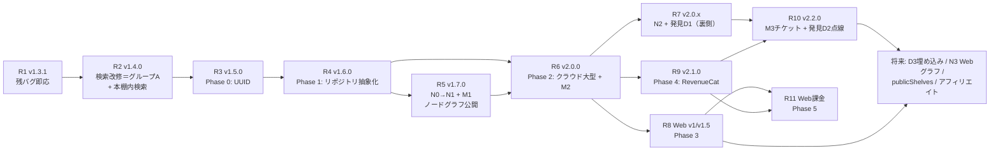

# BookBank 実装ロードマップ（統合版）

作成日: 2026-07-07
ステータス: 計画（各リリースの着手時に内容を再確認し、ズレがあれば本書を更新すること）

> **AI実装エージェントへ**: 実装に着手する前に必ず `docs/agent-implementation-guide.md` を読むこと（(仮)の解釈・スコープ規律・テスト・人間タスクの扱いを定めている）。

本書は以下5文書に散らばる実装項目を、**リリース単位の実装計画**として1本に統合したもの。各文書の設計内容は変更しない（矛盾が生じた場合は元文書を正とし、本書を直す）。

| 元文書 | 記号 |
|--------|------|
| `docs/bug-review-2026-07-06.md` | A-1〜G-8（バグ） |
| `docs/cloud-migration-architecture.md` | Phase 0〜5（移行） |
| `docs/node-graph-feature-design.md` | N0〜N3（ノード） |
| `docs/discovery-feature-design.md` | D0〜D3（発見） |
| `docs/monetization-model-design.md` | M1〜M3（マネタイズ） |
| `docs/bookshelf-search-spec.md` | 本棚内検索（S） |

---

## 1. 全体依存関係

**クリティカルパス**: R2（検索の土台を綺麗にする）→ R3 → R4 → R6（クラウド）。ノード（R5）はR4の後ならR6と並行可能。発見の点線（R10）が最も依存が深い（R6＋R7＋R9）。

---

## 2. リリース計画

### R1: v1.3.1 — 残バグ即応（検索以外）

検索（グループA）に触れない独立バグを先に潰す。1〜2日規模。

| 項目 | 実装内容 | 対象 |
|------|---------|------|
| B-2 ✅ | Paywall価格を `product.displayPrice` ベースに変更（整数切り捨て＋「円」固定をやめる）。「¥3,600/年」の年額表記はロケール対応の書式で再構成。→ 完了 (2026-07-07)・年額サフィックスは通貨中立の `paywall.per_year` を新設 | `Views/UnlimitedPaywallView.swift` planCard |
| B-4 ✅ | Markdownエクスポートの合計行の通貨記号二重（「$12.99円」）を修正。`export.section_header` / `export.preview_heading` から通貨語を削除し `MoneyDisplay` に一本化。→ 完了 (2026-07-07) | `Utils/MarkdownExporter.swift` 59–65, 132–138行付近 ／ `Localizable.xcstrings` |
| B-6 ✅ | NAVER検索の `discount: "0"`（未販売・輸入書）を「0 won」ではなく価格不明として扱う。`toRakutenBook` の価格マッピングを「0超のみ採用」に変更し他プロバイダと統一。→ 完了 (2026-07-07) | `Services/NaverBooksService.swift` `NaverBookItem.toRakutenBook` |
| D-3 ✅ | 統計タブ: 年の本が全削除されたら `selectedYear` を `availableYears` 内へ自動補正。→ 完了 (2026-07-07) | `Views/StatisticsView.swift` |
| D-4 | カレンダー同日複数冊: 日セルタップで複数冊リスト（シートまたはポップアップ）を出す | `Views/BookshelfCalendarView.swift` |
| C-4 | 通帳ソートに第2キー（`createdAt`）を追加し同秒登録の並びを安定化 | `Views/PassbookDetailView.swift` `@Query` |
| F-1 | 共有ペイロードに `currencyCode` を追加し、Web側で通貨記号を出し分け（**iOS・Web両リポジトリ**。旧ペイロードとの後方互換: 通貨なしはJPY扱い） | iOS: `Services/ShareService.swift` ／ Web: `bookbank-share/app/share/[id]/page.tsx` |
| F-2 | Redis書き込み失敗時に200を返さない（5xx＋iOS側のエラートースト） | Web: `app/api/lists/route.ts`・`lib/redis.ts` |
| G-8 | 未使用キー `search_database.auto` を削除 | `Localizable.xcstrings` |

完了条件: 全ユニットテスト green・実機で共有→Webページの通貨表示確認（USD/KRWの本を含むリスト）。

### R2: v1.4.0 — 検索改修（グループA一括）+ 本棚内検索（新機能）

バグレビューが「v1.3.0の検索改修とまとめて」と指定した8件を、検索の非同期基盤の整理として一括対応。**以降のリリース（ノードの登録動線・発見のISBN検索再利用）がこの土台に乗る**ため、先送りしない。あわせて本棚内検索（`docs/bookshelf-search-spec.md`）を同乗させ、「検索がまるごと良くなる」1つのリリースにする。

| 項目 | 実装内容 |
|------|---------|
| A-1 / A-7 | 検索タスクの**世代管理**を導入（`searchGeneration` カウンター）。`performSearch` / `loadMoreResults` / `searchByISBN` / `enrichFormatsInBackground` は開始時の世代を持ち、完了時に世代が違えば結果を捨てる。新検索開始時に旧Taskをキャンセルし `isLoadingMore` / `isAutoLoadingForFilters` をリセット |
| A-2 | `searchByISBN` で `currentPage` / `canLoadMore` / `isLoadingMore` / `totalResultCount` をリセット |
| A-3 | 形態補完完了時の `updateFilteredResults()` を「並び保持のin-place更新」に変更（全件再ソートしない） |
| A-4 | `performSearch` のcatchでエラー状態を保持し、空状態UIを「0件」と「エラー＋再試行ボタン」に分岐 |
| A-5 | 楽天のローカル絞り込み後0件時の `hasMorePages` 判定を補正 |
| A-6 | `loadMoreResults` の重複排除をISBNなし書籍の安定ID（タイトル+著者+発売日ハッシュ）でも効かせる |
| A-8 | Googleの `hasMorePages` に `totalItems` 照合を追加 |
| G-1 / G-2 / G-3 / G-5 | ついでに検索系の軽微修正: Googleタイムスタンプ形式の発売日パース、`SalesDateParser` のタイムゾーン固定（JST基準）、`%lld` 統一、`displayProviderName` のローカライズ |
| **S: 本棚内検索** | 本棚のフィルター行に虫眼鏡→行がインライン検索フィールドに変形。所有本（タイトル・著者・シリーズ・出版社・メモ）のライブ絞り込み（NFKC＋カナ同一視・複数語AND）。グリッドをその場で絞る（登録検索とUIを意図的に分離）。`ShelfSearchMatcher` は純関数として切り出しユニットテスト。詳細は `docs/bookshelf-search-spec.md` |

対象: `Views/BookSearchView.swift`・`Services/RakutenBooksService.swift`・`Services/GoogleBooksService.swift`・`Services/BookSearchService.swift`・`Views/BookshelfView.swift`・新規 `Utils/ShelfSearchMatcher.swift`
完了条件: 高速連続検索（かな入力途中の再検索）で結果混入なし・機内モードでエラーUI表示・楽天/Google/NAVERの3プロバイダーでページング動作確認・本棚内検索の正規化/合成/リセットのテスト（仕様書7章のテスト項目）green。
※ グループAが想定より重い場合、本棚内検索は依存ゼロのため単独リリース（v1.4.1等）へ切り出してよい（仕様書10章）。

### R3: v1.5.0 — 移行Phase 0（UUID導入）

| 項目 | 実装内容 |
|------|---------|
| UUID追加 | 全SwiftDataモデル（`Passbook` / `UserBook` / `ReadingList` / `MonthlyMemo`）に `var uuid: String = UUID().uuidString` を軽量マイグレーションで追加 |
| 並び順刷新 | `ReadingList.bookOrderData`（タイトル+作成日時ハッシュ）を廃止し、UUID配列 `bookIds` へ移行（既存データは `orderedBooks` の現在の並びを読み取って変換） |
| 残バグ | G-4（L10nのバンドル解決フォールバック）・G-6（`Color.luminance`）をこの回で回収 |

完了条件: 既存データ入りの実機アップデートでデータ無損失・リスト並び順維持を確認。マイグレーションのユニットテスト追加。

### R4: v1.6.0 — 移行Phase 1（リポジトリ抽象化・最大工数）

| 項目 | 実装内容 |
|------|---------|
| プロトコル定義 | `BookRepository` / `PassbookRepository` / `ReadingListRepository` / `MonthlyMemoRepository`（`observe〜` は `AsyncStream`、DTOはプレーン構造体） |
| View改修 | 全Viewの `@Query` をリポジトリ経由に置き換え（背後は暫定SwiftData実装）。View層は `BookDTO` 等のみを扱う |
| 検証 | **見た目・挙動を一切変えないリリース**。全画面のスクリーンショット比較＋既存テスト全通し |

> ノード設計書 第10章の要請どおり、**R5（ノード）はこのリリースの完了が前提**（`@Query` 直依存のコードを増やさないため）。

### R5: v1.7.0 — ノードN1 + マネタイズM1（グラフ公開・目玉リリース）

事前に **N0スパイク**（リリースなし・1〜2週間）: 実本棚データでシリーズ判定S-A+S-B・単語抽出W-C（NaturalLanguage+本棚内IDF）の精度を目視評価し、重み・閾値（エッジ上限k=8、キーワードM=30、IDF閾値25%）を確定。**この検証が終わるまでUI実装に着手しない**。

| 項目 | 実装内容 | 設計根拠 |
|------|---------|---------|
| 抽出パイプライン | 正規化（NFKC）→ `NLLanguageRecognizer` 言語判定 → `NLTagger` 名詞抽出 → 静的ストップワード（5言語辞書）→ 本棚内IDF。巻数パターン辞書（5言語）とシリーズクラスタリング | ノード設計書 2〜4章 |
| エッジ計算 | 転置インデックス経由でスコア計算（シリーズ1.0＋著者0.6＋共有語0.15×3上限）。本ごと上位8エッジ・スコア下限0.15 | ノード設計書 5章 |
| キャッシュ | `bookIndex` / `graphMeta` 相当の `Codable` 構造体をApplication SupportにJSON保存（SwiftDataモデルは追加しない）。増分計算対応 | ノード設計書 6.3・7.5節 |
| グラフ画面 | SwiftUI `Canvas` + 力学レイアウト。表紙ノード（2:3・角丸2px）⇔口座色ドットのズーム切替、エッジタップでreasons表示（トースト）、軸フィルターチップ、カルーセルポップアップ、空状態 | ノード設計書 8章 |
| M1: 冊数枠 | `NodeAccessPolicy`（`isUnlimited` ⇒ 無制限／それ以外 quota=10 定数）。最新10冊が枠内（登録日降順）、枠外はロックドット（灰・最大30個＋集約表示）。ステータスチップ「10/24冊」・枠外タップでPaywall・初回超過トースト | マネタイズ設計書 1章・4.4節 |
| 書籍詳細 | 「つながっている本」セクション（枠内の本のみ）。グラフの該当ノードへの遷移 | ノード設計書 8.1節・マネタイズM3前提 |
| 計測 | `graph_opened { node_count, edge_count }`・`paywall_shown { trigger: "node_quota" }`（語・ISBNは送らない） | 発見設計書 8.2節と同方針 |

完了条件: 1,000冊ダミーデータで初回計算が進捗表示つきで完走・60fps描画（500ノードまで）・5言語混在本棚での誤リンク率をN0基準内に確認。
**リリース訴求**: 「全ユーザー向け新機能（無料10冊枠）」として出す（Unlimited限定にしない。マネタイズ設計書 6.2節）。

### R6: v2.0.0 — 移行Phase 2（クラウド大型リリース）+ M2

移行設計書 第8章のとおり**1回で完結させる**（認証＋Firestore＋移行ウィザード＋ログイン必須化）。テスト最重点リリース。

| 項目 | 実装内容 |
|------|---------|
| 認証 | Firebase Auth（メール+パスワード / Google / Apple）・`AuthManager`（`@Observable`）・ログインウォール・アカウントリンク導線 |
| Firestore | `users/{uid}` 配下スキーマ（移行設計書 3.3節）・セキュリティルール・`FirestoreBookRepository` 等への差し替え（R4のプロトコルの背後実装を交換） |
| 移行ウィザード | `WriteBatch` 500件単位・表紙画像のJPEG圧縮→Storage並列アップロード・件数検証・冪等リトライ・2台目端末の分岐 |
| アカウント削除 | Cloud Function（Firestore＋Storage＋Auth削除）＋アプリ内導線（審査必須） |
| 解析基盤 | Firebase Analytics導入・`bookStats` / `appStats` トリガー＆日次関数（移行設計書 9章） |
| M2 | `users/{uid}.nodeBonus` スキーマ＋ルール（クライアント変更禁止・entitlementと同方式）をPhase 2のルール一式に同梱 |
| 法務（リリース前必須） | プライバシーポリシー・利用規約の改訂（5言語・`bookbank-share/lib/legal-content.ts`）＋App Privacy更新（移行設計書 10章） |

リスク緩和: TestFlightで実データ量の移行テスト・通信断リトライ・段階的ロールアウト（7日）。
完了条件: 移行後の冊数・金額・リスト並び・メモの完全一致検証スクリプトが通ること。

### R7: v2.0.x — ノードN2 + 発見D1（裏側のみ・見た目変化なし）

| 項目 | 実装内容 |
|------|---------|
| N2 | ノードのローカルJSONキャッシュを `users/{uid}/bookIndex/{bookId}` / `graphMeta/current` へ保存（構造は同一）。起動時の鮮度判定と増分計算・`staleBookIds` 処理。**`bookIndex` に `isbn` フィールドを含める**（発見設計書 7.7節の波及・後から足すと再計算1回増） |
| D1 | 集約トリガー関数（`bookIndex` 差分→`bookPairs` increment・uid/keywords/reasons不参照）・日次バッチ（`bookRecs` 生成・リフト値スコア・k-匿名3票閾値・dirty差分）・オプトアウト設定「つながりの匿名共有」・セキュリティルール（`bookPairs`/`bookVectors` 全面拒否・`bookRecs` read開放） |
| 法務 | プライバシーポリシーに「登録書籍の組み合わせ傾向の匿名集計」を追記（D1リリース前必須） |

**このリリースで点線UIは出さない**。票の蓄積期間を先に走らせる（発見設計書 10章の意図）。
完了条件: 2端末でのインデックス整合・本の削除→ペア減算の確認・集約関数がkeywordsを参照しないことのコードレビュー。

### R8: Web v1 → v1.5 — 移行Phase 3

| 項目 | 実装内容 |
|------|---------|
| Web v1（閲覧） | Next.js + Firebase JS SDK。ログイン・本棚/通帳/リスト/統計の閲覧。`DESIGN_SYSTEM.md` トークンのTailwind転記 |
| Web v1.5（操作） | 本の登録（`bookbank-share` の検索プロキシ共用）・編集・口座管理。Webでの本追加は `graphMeta.staleBookIds` に追記（iOS側が次回計算で取り込む） |
| F-3 | 共有GET APIへのCORSヘッダー追加（Webアプリからの利用に備えこの機会に回収） |

R6完了後ならR9と並行可能。リポジトリ統合（`bookbank-share` へ同居）は着手時に判断（移行設計書 6.4節）。

### R9: v2.1.0 — 移行Phase 4（RevenueCat・課金体系刷新）

| 項目 | 実装内容 |
|------|---------|
| RevenueCat | `UnlimitedManager` をRevenueCat SDKベースに改修（公開インターフェース維持・呼び出し側9ファイル無変更）。`appUserID = Firebase UID`・Webhook→Cloud Function→`users/{uid}.entitlement` |
| 商品改定 | iOS月額¥500新設（`com.bookbank.platinum.monthly`・既存グループに追加）・買い切り販売停止・既存lifetime購入者の権利自動引き継ぎ確認 |
| Paywall改修 | 月額/年額の2択化＋訴求に「ノードグラフ無制限・発見機能（近日）」を追加（マネタイズ設計書 5章） |
| 法務 | 利用規約に有料プラン条項（自動更新・解約方法）追記 |

完了条件: サンドボックスで月額⇔年額切替時のエンタイトルメント連続性・lifetime移行・Webhook反映を検証。

### R10: v2.2.0 — 発見D2（点線公開）+ マネタイズM3（チケット）

Unlimitedの価値を一気に厚くする「攻め」のリリース。**D1から1〜2ヶ月以上の蓄積期間を空ける**。

| 項目 | 実装内容 |
|------|---------|
| D2: 点線レイヤー | 破線エッジ・未所有ゴーストノード（表紙opacity 0.45＋破線輪郭）・同時最大6個・「発見」トグルチップ（無料ユーザーはロック表示→Paywall `trigger: "discovery"`）・CS-Bフォールバック（同シリーズ未所有巻→集合知→同著者）・`discoveryCache`（dismissed管理）・カルーセルポップアップ（登録動線＝R2の検索基盤でISBN再検索→保存）・点線→実線の転換アニメーション |
| M3: チケット | `bonusTickets` コレクション・適用callable Function（実在/期限/回数/1ユーザー1回・レート制限）・設定画面のコード入力＋ユニバーサルリンク/QRハンドリング・運営用コード発行手順書。**最初のキャンペーン企画とセットでリリース** |
| 計測 | `discovery_shown / discovery_dismissed / discovery_book_registered { tier }`・`ticket_redeemed { campaign_id, grant_books }` |
| 法務 | 利用規約に「コードの有償譲渡禁止」1行追記。審査ノートに「無料キャンペーンコード」説明 |

完了条件: 点線候補の優先順位ロジックのユニットテスト・dismissed再提案なし・チケット適用の冪等性（連打・再インストール）確認。

### R11: Web課金 — 移行Phase 5

RevenueCat Web Billing・購読管理画面・**特定商取引法に基づく表記の新設（同時必須）**。移行設計書 第10.3章のとおり。

### 将来フェーズ（順不同・着手判断待ち）

| 項目 | 前提 | 元文書 |
|------|------|--------|
| D3: 第3層（埋め込み） | D2の転換率実績を確認後。`bookVectors` 生成関数（多言語embedding API・ISBNごと1回）＋日次バッチに飛躍枠4/20を追加 | 発見設計書 4章・10章 |
| N3: Webグラフ | R8 + R7。`bookIndex` を読んで描画（d3-force）。計算はしない | ノード設計書 10章 |
| publicShelves（アフィリエイト公開本棚） | R8。グラフ掲載時はメモ由来語の除外処理必須 | 移行設計書 3.3節・ノード設計書 11.4節 |
| 点線の「購入する」アクション | publicShelves のアフィリエイト基盤＋Appleガイドライン再確認 | 発見設計書 8.2節 |
| B-5（Google価格の丸め誤差）・残る低優先バグ | 手が空いたとき | バグレビュー |
| SwiftData関連コードの削除 | R6の数バージョン後・クラウド安定確認後 | 移行設計書 5.5節 |

---

## 3. バグ対応の割り当てまとめ（バグレビュー全項目の行き先）

| バグ | 行き先 |
|------|--------|
| A-1〜A-8 | R2（検索改修で一括） |
| B-1 / B-3 | ✅ 対応済み |
| B-2 / B-4 / B-6 | R1 |
| B-5 | 将来（低優先） |
| C-1 / C-2 / C-3 | ✅ 対応済み |
| C-4 | R1 |
| D-0〜D-2 | ✅ 対応済み・不要化 |
| D-3 / D-4 | R1 |
| E-1 / E-2 | ✅ 対応済み |
| F-1 / F-2 | R1 |
| F-3 | R8（Webアプリ着手時に回収） |
| G-1 / G-2 / G-3 / G-5 | R2（検索系のついで） |
| G-4 / G-6 | R3（小粒のため同乗） |
| G-7 | ✅ 対応済み |
| G-8 | R1 |

---

## 4. 各リリース共通の運用チェックリスト

1. **法務先行**: ポリシー・規約の改訂が必要なリリース（R6・R7・R9・R10・R11）は、文書公開をリリースチェックリストの先頭に置く（移行設計書 11.5節）
2. **テスト**: `xcodebuild test` 全通し＋そのリリースの重点シナリオ（本書の各「完了条件」）を実機で確認
3. **段階的ロールアウト**: R6（クラウド）とR9（課金）は7日間の段階リリースを使用
4. **設計書の同期**: 実装中に設計と食い違いが出たら、実装を優先せず元文書を更新してから進む（5文書＋本書の整合を保つ）
5. **バージョンタグ**: リリースごとに `vX.Y.Z` タグ（既存運用どおり）

---

## 5. 直近のネクストアクション

1. **R1（v1.3.1）の着手**: 上記8項目。`bookbank-share` 側（F-1/F-2）は別リポジトリのため同時進行でPR分離
2. R2の設計メモ作成: 検索タスクの世代管理はグラフ・発見の登録動線からも使われる基盤になるため、`BookSearchView` の状態遷移図を書いてから実装に入る（本棚内検索は仕様書済み・`docs/bookshelf-search-spec.md`）
3. N0スパイクの準備: 自分の本棚のエクスポートデータ＋5言語テストデータの用意（R5の1〜2ヶ月前に開始）
