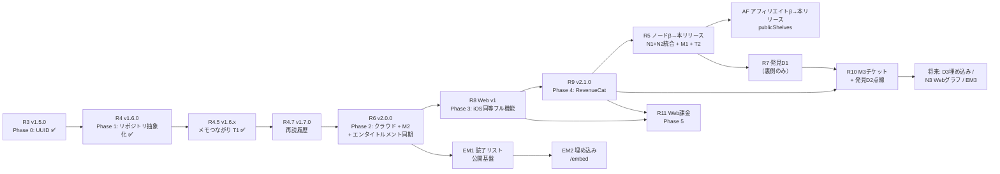

# BookBank 実装ロードマップ（統合版）

作成日: 2026-07-07
更新日: 2026-08-19（**R4.7 データ安全性**——専用移行前バックアップ・日付整合・編集の一括保存。実機移行確認のオーナーOKは維持）／2026-08-17（**R4.7 / v1.7.0 再読履歴を新設**——1冊の本に初回日＋複数の再読日を持たせ、通帳・カレンダー・統計・口座集計・口座Markdown・マンスリーログ共有を回数ベースにする。設計書 `docs/reread-history-spec.md`）／2026-08-17（**R4.6「スクリーンショットの画像候補」3枚目を4:5へ**——verticalMonth を 1:1 から 4:5（論理360×450・マスター1080×1350、トリミングなし）へ変更。1・2枚目は9:16、4枚目は1:1を維持。設計メモ `docs/monthly-log-share-design.md`）／2026-08-17（**R4.6「スクリーンショットの画像候補」縦横混在**——1・2枚目は縦長、3・4枚目は正方形。正方形マスターは1080×1080。正方形テンプレートはトリミングせず1:1を維持。設計メモ `docs/monthly-log-share-design.md`）／2026-08-16（**R4.6 日本語 LINE Seed を Google Fonts 公式 TTF へ差し替え**——2024年 App 用 OTF の広い縦メトリクスが行高の原因。`leading(.tight)` は効かず撤回。文字サイズと画面 padding は未変更。設計メモ `docs/typography-design.md`）／2026-08-16（**R4.6「スクリーンショットの画像候補」透明余白クロップ**——内部マスターは1080×1920のまま、外部PNGはアルファ境界＋24pxの可変サイズ。設計メモ `docs/monthly-log-share-design.md`）／2026-08-16（**R4.6「LINE Seed 全面移行」**——アプリ所有の文字を言語ごとの LINE Seed Regular/Bold へ統一。簡体字は PingFang SC。設計メモ `docs/typography-design.md`）／2026-08-16（**R4.6「スクリーンショットの画像候補」完了前補正**——カレンダーが実際に前面のときだけスクショ共有を開始し、表紙準備はキャッシュ優先＋同一URLの最大4件並列、共有セルは2:3。設計メモ `docs/monthly-log-share-design.md`）／2026-08-16（**R4.6「スクリーンショットの画像候補」実装**——本棚カレンダーのスクリーンショット直後、または月ヘッダーの共有ボタンから「マンスリーログを共有」を開き、透明PNG 4種をコピー／保存／共有できる。設計メモ `docs/monthly-log-share-design.md`）／2026-08-15（**リリース前の人間タスクをクローズ**——R4.5の5言語レビュー、書籍詳細シートの実機確認と `book.delete.action` の訳、通帳／本棚検索の実機確認、メモ一覧・本文検索・タブバー背景の実機確認をオーナーがOK）／2026-08-15（**R4.6「メモのノートページ」実装**——総合口座からメモ一覧へ辿り、プレーンテキストのカードをタップして本の詳細へ戻れるページを新設。装飾は描画せず `MemoPlainText.stripped(from:)` を再利用。設計メモ `docs/memo-list-design.md`）／2026-08-13（**R4.6〈v1.6.x UIパッチ枠〉を新設**——R4.5完了後〜R6の合間に発生する割り込みUI改善の置き場。1件目として「書籍詳細のヘッダー吸い付き型シート」を実装済みで登録。メモのノートページ・スクリーンショットの画像候補を候補として登録。ウィジェットはこの枠に入れず**R6完了後**へ〈App Groupのデータ受け渡しがFirestore移行で作り直しになるため・オーナー判断〉）／2026-08-13（**R1残件 A-9 / B-5 をクローズ**——オーナー判断。R1〈v1.3.1〉以降5リリース見送っても実運用で問題になっておらず実害なしと判断した。修正はしていないので、症状の記述はバグレビューに残す）／2026-08-13（**R4.5 完了**——ステップ9'の検収を締めた。N0エクスポートの衝突確認は誤装飾ゼロ〈担保範囲込みで設計メモ 7.1節〉。同乗予定だったUI改善はメモ編集ツールバーの新設に充当。残る人間タスクはUI文言の5言語レビュー〈訳の妥当性は未確認・R4.5の完了はブロックしないがストア公開前に必須〉）／2026-08-13（R4.5 T1のステップ5'〜8'完了と9'（検収）の進行状況を反映。`#` 時代のサジェストUI流用の注記を廃止後の現状に合わせて修正）／2026-08-10（**R4.5 メモ機能の方式転換をオーナーが確定**——`#タグ` を廃止し `[[ ]]` 一本化・メモ編集ツールバー新設。`[[ ]]` は「タグ」ではなく「本と本をつなぐ線」で、UIの言葉は「つなぐ／つながり」。`#` は未リリースのためユーザー影響ゼロ。設計メモを全面改訂し、R4.5の表をステップ5'〜9'へ再構成。ノード設計書0.2節に方針1〈自動生成〉との併存整理を追記）／2026-08-07（**共有IDのuuid化を R4.5 に含めることをオーナーが確定**——R4申し送り 10.1。サーバ側がID形式に依存していないことをオーナーが確認し、クライアント1行＋後片付けで済むことが確定した。メモタグT1とはコミットを分ける）／2026-08-07（**R4完了**——移行Phase 1〈リポジトリ抽象化〉の全7ステップが終了し、実機での全画面突合と目視スモークをオーナーが完了。完了マーク・完了条件・申し送り〈設計メモ第10章〉への参照を追加し、実施順とネクストアクションを R4.5 起点へ更新。**R4.5 着手時の最初の判断は共有IDのuuid化を含めるかどうか**）／2026-07-19（**Web優先へ全面改訂・オーナー確定**: Web v1をR6直後に前倒し・R9はWeb v1後に順次化・R6にエンタイトルメント同期を追加・R4.5メモタグ新設・R5ノードはβ→本リリース方式でWeb後へ・N0はラベル付け完了後にクローズし凍結）
ステータス: 計画（各リリースの着手時に内容を再確認し、ズレがあれば本書を更新すること）。**進捗: R4.7（v1.7.0 再読履歴）まで実装完了。次の大型リリースは R6（v2.0.0）**（R1 残件 A-9 / B-5 は 2026-08-13 にクローズ済み・下記5参照）。**R4.6（v1.6.x UIパッチ枠）は直列計画の外の随時枠**——View層で完結する割り込みUI改善だけを置き、R6の進行をブロックしない（2026-08-13 新設・下記R4.6参照）

> **AI実装エージェントへ**: 実装に着手する前に必ず `docs/agent-implementation-guide.md` を読むこと（(仮)の解釈・スコープ規律・テスト・人間タスクの扱いを定めている）。

本書は以下5文書に散らばる実装項目を、**リリース単位の実装計画**として1本に統合したもの。各文書の設計内容は変更しない（矛盾が生じた場合は元文書を正とし、本書を直す）。

| 元文書 | 記号 |
|--------|------|
| `docs/bug-review-2026-07-06.md` | A-1〜G-8（バグ） |
| `docs/cloud-migration-architecture.md` | Phase 0〜5（移行） |
| `docs/node-graph-feature-design.md` | N0〜N3（ノード） |
| `docs/discovery-feature-design.md` | D0〜D3（発見） |
| `docs/monetization-model-design.md` | M1〜M3（マネタイズ） |
| `docs/bookshelf-search-spec.md` | 本棚内検索（S） |
| `docs/embed-share-feature-design.md` | EM1〜EM3（読了リスト公開・埋め込み） |
| `docs/memo-tagging-design.md` | T1〜T2（メモつながり `[[ ]]`。旧称メモタグ・2026-08-10に方式転換） |

---

## 1. 全体依存関係

```mermaid
flowchart LR
    R3[R3 v1.5.0<br/>Phase 0: UUID ✅] --> R4[R4 v1.6.0<br/>Phase 1: リポジトリ抽象化 ✅]
    R4 --> R45[R4.5 v1.6.x<br/>メモつながり T1 ✅]
    R45 --> R47[R4.7 v1.7.0<br/>再読履歴]
    R47 --> R6[R6 v2.0.0<br/>Phase 2: クラウド + M2<br/>+ エンタイトルメント同期]
    R6 --> R8[R8 Web v1<br/>Phase 3: iOS同等フル機能]
    R8 --> R9[R9 v2.1.0<br/>Phase 4: RevenueCat]
    R9 --> R5[R5 ノードβ→本リリース<br/>N1+N2統合 + M1 + T2]
    R5 --> AF[AF アフィリエイトβ→本リリース<br/>publicShelves]
    R5 --> R7[R7 発見D1<br/>（裏側のみ）]
    R7 --> R10[R10 M3チケット<br/>+ 発見D2点線]
    R9 --> R10
    R6 --> EM1[EM1 読了リスト<br/>公開基盤] --> EM2[EM2 埋め込み<br/>/embed]
    R8 --> R11[R11 Web課金<br/>Phase 5]
    R9 --> R11
    R10 --> F[将来: D3埋め込み /<br/>N3 Webグラフ / EM3]
```

**実施順（2026-07-19 オーナー確定）**:

1. **R4 v1.6.0** ✅ 完了 (2026-08-07)
2. **R4.5 v1.6.x** ✅ 完了 (2026-08-13) — メモつながり（`[[ ]]`）T1 + 共有IDのuuid化（小リリース。UI改善の枠はメモ編集ツールバーの新設に充当）。リリース前の人間タスク（UI文言の5言語レビュー）は ✅ 完了 (2026-08-15)
3. **R4.7 v1.7.0** — 再読履歴。スキーマ変更があるため R4.6 には入れず、R6 の前に独立実施（設計書 `docs/reread-history-spec.md`）
4. **R6 v2.0.0** — クラウド + ログイン + エンタイトルメント同期
5. **R8 Web v1** — R6の段階ロールアウト中にVercelプレビューで並走、R6が100%到達した時点で全ユーザー公開（iOS同等のフル機能・日本語UIのみ）。**v1.1 韓国語版**（NAVER Webプロキシ含む）をv1公開後の最優先フォローアップとして実施
6. **R9 課金刷新** — **Web v1リリース後に順次実施**（並行しない）
7. **R5 ノードβ → 本リリース**（N1+N2統合 + M1 + T2タグエッジ）
8. **AF アフィリエイトβ → 本リリース**（publicShelves）
9. **R7 発見D1（裏側）→ R10 発見D2 + M3**（D1から1〜2ヶ月の蓄積後）
10. **R11 Web課金**

**クリティカルパス**: ~~R3浸透確認 → R4 → R4.5~~（いずれも完了） → **R4.7（v1.7.0 再読履歴）** → **R6** → R8（Web公開）。**以降も直列で進める**（ソロ運営で並行作業を増やさない方針・2026-07-19確定）。
**※ R4.6（v1.6.x UIパッチ枠・2026-08-13新設）はこの直列計画の外**——View層で完結する割り込みUI改善のみを置く随時枠で、依存関係図にも実施順にも入れない（詳細は下記R4.6）。EM1/EM2はR6完了後ならいつでも着手可能だが、時期はWeb v1公開後の隙間で判断する（同方針）。N0スパイクはラベル付け完了をもってクローズし、成果物（ハーネス・辞書・確定基準・結果メモ）はR5着手まで凍結。

---

## 2. リリース計画

### R1: v1.3.1 — 残バグ即応（検索以外）

検索（グループA）に触れない独立バグを先に潰す。1〜2日規模。

| 項目 | 実装内容 | 対象 |
|------|---------|------|
| B-2 ✅ | Paywall価格を `product.displayPrice` ベースに変更（整数切り捨て＋「円」固定をやめる）。「¥3,600/年」の年額表記はロケール対応の書式で再構成。→ 完了 (2026-07-07)・年額サフィックスは通貨中立の `paywall.per_year` を新設 | `Views/UnlimitedPaywallView.swift` planCard |
| B-4 ✅ | Markdownエクスポートの合計行の通貨記号二重（「$12.99円」）を修正。`export.section_header` / `export.preview_heading` から通貨語を削除し `MoneyDisplay` に一本化。→ 完了 (2026-07-07) | `Utils/MarkdownExporter.swift` 59–65, 132–138行付近 ／ `Localizable.xcstrings` |
| B-6 ✅ | NAVER検索の `discount: "0"`（未販売・輸入書）を「0 won」ではなく価格不明として扱う。`toRakutenBook` の価格マッピングを「0超のみ採用」に変更し他プロバイダと統一。→ 完了 (2026-07-07) | `Services/NaverBooksService.swift` `NaverBookItem.toRakutenBook` |
| D-3 ✅ | 統計タブ: 年の本が全削除されたら `selectedYear` を `availableYears` 内へ自動補正。→ 完了 (2026-07-07) | `Views/StatisticsView.swift` |
| D-4 ✅ | カレンダー同日複数冊: 日セルタップで複数冊リスト（シートまたはポップアップ）を出す。→ 完了 (2026-07-07)・`DaySelection`＋`.sheet` で一覧シート提示（`ca60088`）。**2026-08-17**: 一覧行を「表紙｜書名・著者｜右端に金額」へ補正し、書名・著者と金額を表紙に対して縦中央揃え（dismiss後pushは維持） | `Views/BookshelfCalendarView.swift` `dayCell` / `dayBooksSheet` |
| C-4 ✅ | 通帳ソートに第2キー（`createdAt`）を追加し同秒登録の並びを安定化。→ 完了 (2026-07-07)・`a172473` | `Views/PassbookDetailView.swift` `sortedBooks` |
| F-1 ✅ | 共有ペイロードに `currencyCode` を追加し、Web側で通貨記号を出し分け（**iOS・Web両リポジトリ**。旧ペイロードとの後方互換: 通貨なしはJPY扱い）。→ 完了 (2026-07-09)・iOS `0c343bb`＋Web `bookbank-share 9b27bb5`。Web側を `origin/main` へ push・Vercel デプロイで本番反映 | iOS: `Services/ShareService.swift` ／ Web: `bookbank-share/app/share/[id]/page.tsx` |
| F-2 ✅ | Redis書き込み失敗時に200を返さない（5xx＋iOS側のエラートースト）。→ 完了 (2026-07-09)・iOS `b7c7a83`＋Web `bookbank-share 2038d65`（`redis.set` 失敗時 `false`・書込失敗で500）。Web側を push・Vercel デプロイで本番反映 | Web: `app/api/lists/route.ts`・`lib/redis.ts` |
| G-8 ✅ | 未使用キー `search_database.auto` を削除。→ 当該キーは既に xcstrings に不在のため対応不要化（xcstrings未編集）。完了 (2026-07-08・R2ステップ7で確認) | `Localizable.xcstrings` |

完了条件: 全ユニットテスト green・実機で共有→Webページの通貨表示確認（USD/KRWの本を含むリスト）。

### R2: v1.4.0 — 検索改修（グループA一括）+ 本棚内検索（新機能） ✅ 完了 (2026-07-09)

バグレビューが「v1.3.0の検索改修とまとめて」と指定した8件を、検索の非同期基盤の整理として一括対応。**以降のリリース（ノードの登録動線・発見のISBN検索再利用）がこの土台に乗る**ため、先送りしない。あわせて本棚内検索（`docs/bookshelf-search-spec.md`）を同乗させ、「検索がまるごと良くなる」1つのリリースにした。**App Store v1.4.0（build 6）リリース済み。設計メモは `docs/r2-search-refactor-notes.md`。**

| 項目 | 実装内容 |
|------|---------|
| A-1 / A-7 ✅ | 検索タスクの**世代管理**を導入（`searchGeneration` カウンター）。`performSearch` / `loadMoreResults` / `searchByISBN` / `enrichFormatsInBackground` は開始時の世代を持ち、完了時に世代が違えば結果を捨てる。新検索開始時に旧Taskをキャンセルし `isLoadingMore` / `isAutoLoadingForFilters` をリセット。**（A-7のリセット漏れはステップ1の `beginNewSearch()`、A-1の世代管理＋タスクキャンセル＋`currentPage`先行インクリメント廃止はステップ2で完了 (2026-07-08)。手動リグレッション確認は別途）** |
| A-2 ✅ | `searchByISBN` で `currentPage` / `canLoadMore` / `isLoadingMore` / `totalResultCount` をリセット。→ `beginNewSearch(canLoadMore: false)` に集約 (2026-07-08・R2ステップ1) |
| A-3 ✅ | 形態補完完了時の `updateFilteredResults()` を「並び保持のin-place更新」に変更（全件再ソートしない）。完了 (2026-07-08・R2ステップ5)。フィルター中の新規該当本の取りこぼしは A-9 として別途 |
| A-4 ✅ | `performSearch` のcatchでエラー状態を保持し、空状態UIを「0件」と「エラー＋再試行ボタン」に分岐。→ `SearchPhase` enum 導入で完了 (2026-07-08・R2ステップ3) |
| A-5 ✅ | 楽天のローカル絞り込み後0件時の `hasMorePages` 判定を補正。→ サービス層は事実（生件数 `rawItemCount`・総件数）のみ返し、継続可否は View 側の純関数 `SearchPagination.canLoadMore`（累積生件数 < 総件数）で判定。境界条件のユニットテスト6件。完了 (2026-07-08・R2ステップ6) |
| A-6 ✅ | `loadMoreResults` の重複排除をISBNなし書籍の安定ID（タイトル+著者+発売日ハッシュ）でも効かせる。→ 既存 `RakutenBook.id` を再利用する `SearchResultDeduplicator` に統一（新規ハッシュ実装は不要・設計メモ4.6）。完了 (2026-07-08・R2ステップ4) |
| A-8 ✅ | Googleの `hasMorePages` に `totalItems` 照合を追加。→ A-5 と統一した View 側の総件数判定で総件数到達時に停止（20の倍数ちょうどの空ページ余分取得を解消）。サービスは生件数を事実として返すのみ。完了 (2026-07-08・R2ステップ6) |
| G-1 / G-2 / G-3 / G-5 ✅ | ついでに検索系の軽微修正: Googleタイムスタンプ形式の発売日パース、`SalesDateParser` のタイムゾーン固定（JST基準）、`%lld` 統一、`displayProviderName` のローカライズ。G-3・G-5はステップ3 (2026-07-08)、G-1・G-2はステップ6 (2026-07-08) で完了 |
| G-4 / G-6 / G-8 ✅ | **ステップ7で前倒し回収 (2026-07-08)**: G-4（L10nバンドル解決の正規化＋ja固定フォールバック）・G-6（`Color.luminance` の色空間対応）を実装（元はR3割り当て）。G-8（未使用キー削除）は対象キー不在のため対応不要化（元はR1割り当て）。これでグループGは全件完了 | `Utils/L10n.swift` / `Utils/Color+Luminance.swift` |
| **S: 本棚内検索** ✅ | 本棚のフィルター行に虫眼鏡→行がインライン検索フィールドに変形。所有本（**タイトル・著者のみ**）のライブ絞り込み（NFKC＋カナ同一視・空白無視・複数語AND）。0件時はオンライン検索（登録）への導線。`ShelfSearchMatcher` は純関数＋ユニットテスト。通帳からの本棚/カレンダー導線は本棚タブ切替に統一。詳細は `docs/bookshelf-search-spec.md`。完了 (2026-07-09) |

対象: `Views/BookSearchView.swift`・`Services/RakutenBooksService.swift`・`Services/GoogleBooksService.swift`・`Services/BookSearchService.swift`・`Views/BookshelfView.swift`・`Views/MainTabView.swift`・`Views/PassbookDetailView.swift`・新規 `Utils/ShelfSearchMatcher.swift`
完了条件: ✅ 達成（2026-07-09）。高速連続検索で結果混入なし・機内モードでエラーUI・3プロバイダのページング・本棚内検索の正規化/合成/リセットのテスト green・実機確認済み。
**未回収（R2外・低優先）**: A-9（形態フィルター中の補完取りこぼし）。→ 🔒 **クローズ（2026-08-13 オーナー判断・5リリース分の見送りにより実害なしと判断）**。症状はバグレビュー グループA に残してある。

### R3: v1.5.0 — 移行Phase 0（UUID導入） ✅ 完了 (2026-07-09)

**既存ユーザーの全データに触れる初のスキーマ変更**。「絶対にデータを壊さない」を最優先制約に、移行前バックアップ・整合性検証・実機検証の防御層を積んで3ステップで実装。**「見た目・挙動が一切変わらない内部改修リリース」**で、追加した `uuid` はR3時点ではどのViewからも参照しない「眠った土台」。設計メモは `docs/r3-uuid-migration-notes.md`。

| 項目 | 実装内容 |
|------|---------|
| ステップ1: 移行前バックアップ＋復元 ✅ | `ModelContainer` 生成**前**に store 一式（`default.store`＋`-shm`/`-wal`＋外部ストレージ）をバックアップし、生成失敗時はバックアップから復元して1回だけ再試行。空き容量不足はスキップ（前提10）。故障注入（破損ストア→復元→再試行成功）まで自動テスト。スキーマ非変更。完了 (2026-07-09・`Utils/StoreBackupManager.swift`) |
| ステップ2: UUID追加＋バックフィル ✅ | 4モデル（`Passbook` / `UserBook` / `ReadingList` / `MonthlyMemo`）に `var uuid: String = UUID().uuidString` を軽量マイグレーションで追加＋init明示代入。既存行はデフォルト式に頼らず、`UUIDBackfillMigration` が**空だけでなく重複も採番し直す**（全行同一値問題を回避）。`uuid` 以外（`updatedAt` 含む）は不変。整合性検証(a)件数一致・(b)uuid充足の通過時のみ完了フラグを立て、失敗は rollback／次回リトライ。完了 (2026-07-09・`Utils/UUIDBackfillMigration.swift`) |
| ステップ3: 並び順のUUID化 ✅ | `ReadingList.bookOrderData`（タイトル+作成日時ハッシュ）を廃止し UUID配列 `bookIds` へ移行。`ReadingListOrderMigration` が**旧 `orderedBooks` の解決順をそのまま uuid へ転記**（独自ソート・不整合修正を加えない）。検証(c)＝変換前後の完全一致（順序ずれ・欠落・重複を検出）通過時のみフラグ。`stableID` 廃止（全参照ゼロ確認）。全検証通過後に移行前バックアップを削除。完了 (2026-07-09・`Utils/ReadingListOrderMigration.swift`) |
| 残バグ | ~~G-4（L10nのバンドル解決フォールバック）・G-6（`Color.luminance`）~~ → **R2ステップ7で前倒し完了 (2026-07-08)**。この回での回収は不要 |

対象: `Models/Passbook.swift`・`UserBook.swift`・`ReadingList.swift`・`MonthlyMemo.swift`・`BookBankApp.swift`・新規 `Utils/StoreBackupManager.swift`・`Utils/UUIDBackfillMigration.swift`・`Utils/ReadingListOrderMigration.swift`
完了条件: ✅ 達成（2026-07-09）。既存データ入りの実機アップデートでクラッシュなし起動・本棚データ件数維持・リスト並び順維持（タイトル変更を挟んでも崩れない＝旧バグ解消）・口座/読了リスト/メモの無事を確認。マイグレーションの純関数・統合テスト green。
**人間タスク（リリース前）**: 数百冊＋手動表紙画像ありの実機での TestFlight アップデート検証（設計メモ 4.5節③）。
**別項目（R3外・保留）**: F-4（手動登録書影が共有ページに反映されない）はR3の変更とは無関係の既存制約で、R6のクラウドストレージ移行で根本解決（バグレビュー グループF参照）。

### R4: v1.6.0 — 移行Phase 1（リポジトリ抽象化・最大工数） ✅ 完了 (2026-08-07)

**設計メモは `docs/r4-repository-abstraction-notes.md`**（2026-07-11 作成・オーナー承認済み。実装順・ファイル一覧・リスクは同メモ第7章の7ステップが正）。着手はR3（v1.5.0）の本番浸透確認後。

| 項目 | 実装内容 |
|------|---------|
| プロトコル定義 ✅ | `BookRepository` / `PassbookRepository` / `ReadingListRepository` / `MonthlyMemoRepository`（`observe〜` は `AsyncStream`、DTOはプレーン構造体） |
| View改修 ✅ | 全Viewの `@Query` をリポジトリ経由に置き換え（背後は暫定SwiftData実装）。View層は `BookDTO` 等のみを扱う。**`@Query` ゼロ・`Views/` からの `@Model` 参照ゼロを `rg` で機械的に確認** |
| 検証 ✅ | **見た目・挙動を一切変えないリリース**。ユニットテスト136件全通過＋**実機での全画面スクリーンショット比較と目視スモークをオーナーが完了**（設計メモ 7.2 に対応表と実施結果） |

完了条件: ✅ 達成（2026-08-07）。ベースライン（2026-07-23撮影）との突合で全画面一致、承認済み挙動差分3件（本棚の第2キー順・エクスポート順2件）はいずれも想定内。実装中に検出した見た目の回帰2件（V-1 通帳シートの重なり／V-2 作成フローの白画面）はどちらも原因を確定させて修正済み。
**申し送り**: 設計メモ 第10章に集約。**最優先の判断は共有IDのuuid化を R4.5 へ前倒しするか R6 まで待つか**（設計メモ 8.3節-25・10.1。前提6の維持根拠が実質失われたため要再判断）。ほかに R4.5 候補2件（空シートが出うる2箇所・リスト作成フローの完了演出）とR6回収項目一式。
**人間タスク（リリース後）**: Xcode Organizer で `_KKMDBackingData.getValue` の再発ゼロを確認（設計メモ 8.4節）。

> ノード設計書 第10章の要請どおり、**R5（ノード）はこのリリースの完了が前提**（`@Query` 直依存のコードを増やさないため）。**この前提は満たされた（2026-08-07）**。

### R4.5: v1.6.x — メモつながり（`[[ ]]`）T1 + UI改善（新設・2026-07-19／**2026-08-10 方式転換**）✅ **完了 (2026-08-13)**

**設計メモは `docs/memo-tagging-design.md`**（**2026-08-10 全面改訂・承認済み**）。ユーザーが**意図して本をつなげられる**記法（`[[ ]]`）とメモ編集ツールバーを導入する。**当初の `#タグ` 記法は開発中に廃止**（未リリースのためユーザー影響ゼロ）——ツールバー新設で `#` のIME入力問題が解決し、記法を `[[ ]]` に一本化した（設計メモ 0.3節・9章）。

**前提条件（確定・転換後も維持）**: つながりは**メモ文字列内の記法でありスキーマ変更ゼロ**（`UserBook.memo` / `MonthlyMemo.text` は String のまま・タグ欄のようなデータ項目も作らない）。**R6のクラウド移行と干渉しない**（移行対象はプレーン文字列のまま・移行ウィザードの変更不要）。

| 項目 | 実装内容 |
|------|---------|
| ステップ5': パーサ置換 ✅ **完了 (2026-08-11)** | `[[ ]]` のパース（任意文字列・改行不可・トリム後1〜30文字・全角括弧可＝設計メモ 3.2節）。`#` 版パーサ（`702a657`〜`cee06e3` の一部）を置き換え、型を `MemoLink*` へリネーム。テスト書き換え |
| ステップ6': 表示 ✅ **完了 (2026-08-11)** | 書籍詳細・編集画面のどちらも `[[ ]]` の**記号を隠して中身だけ着色**＋**太字 `**`・行頭 `>` のみレンダリング**（設計メモ 4.6節）。編集画面のライブ装飾は `UITextView`（ステップ7'）。~~サジェストのトリガーを `[[` へ変更~~ → サジェストは 2026-08-12 に廃止（4.1節） |
| ステップ7': ツールバー ✅ **完了 (2026-08-12・新設は08-11)** | メモ編集欄の下に新設: つなぐ｜太字・引用・ページ番号｜**書式クリア・ひとつ戻す**（設計メモ 4.5節）。アイコン＋ラベル・区切り線つき、5言語ローカライズ込み。あわせて**引用の出典ページ**（囲みの枠外・右下）と**編集画面のライブ装飾**（記号を隠す＝`UITextView` への差し替え・4.6節）もここに入った。08-12の実機確認6回ぶんの指摘（トグル化・アクティブ表示・キャレット規則の集約ほか）を反映済み。残る実機確認項目は設計メモ 4.6節の記録を参照 |
| ステップ8': チップ行・絞り込み ✅ **完了 (2026-08-12)** | 書籍詳細のつながりチップ行（タップ導線はここ・設計メモ 4.4節）＋本棚の絞り込み（チップ方式・`normalFilterRow` の3タブは変更しない）。**あわせて「表記ゆれに気づく場所」を担う**（2026-08-12 オーナー確定・設計メモ 4.1節——入力サジェストを廃止したので、絞り込みのチップ一覧に `[[京都]]` と `[[きょうと]]` が別々に並ぶことがゆれの可視化になる）。**UIの置き場所・一致判定はオーナー確定のうえ実装済み（設計メモ 4.7節）**——一覧は本棚内検索の入力前・チップから飛ぶ先は総合口座・検索との橋渡しは部分一致（本棚内検索と同じ正規化）。ユニットテスト全件通過（iOS 26.5） |
| ステップ9': 検収 ✅ **完了 (2026-08-13)** | ドキュメント同期 ✅（設計メモ・本書・本棚内検索仕様・DEV_LOGの陳腐化洗い直し込み）・N0エクスポートで既存メモとの衝突確認 ✅（走査は `tools/memo-markup-check.py`・実行と目視判定はオーナー。**結果: 書籍421冊・メモあり16冊で検出52件、すべて意図した表示・誤装飾ゼロ**。ただし母数が小さく「大量の既存メモに対する安全性」までは担保しない——担保範囲込みで設計メモ 7.1節）・実機確認 ✅（1回にまとめず、ステップ7'・8'の各回で分割実施） |
| **共有IDのuuid化** ✅ **完了 (2026-08-07)** | R4申し送りからの持ち込み（`docs/r4-repository-abstraction-notes.md` 10.1）。`ShareService` が送る `readingListId` を `legacyShareId`（`persistentModelID` 文字列）から `uuid` へ。**再起動をまたぐと再共有のたびに別URLが発行される既存不具合の解消**。サーバ側の変更は不要（ID形式に依存していないことをオーナーが確認済み）。`ReadingListDTO.legacyShareId` と `ModelDTOMapping` の該当行を削除し、**アプリ本体の `persistentModelID` 使用は移行コードのみになった**。リリースノートは「共有リンクは常に最新の内容を表示します」に統一 |
| 雑務: UIテストの実行時間 ✅ 完了 (2026-08-07) | `BookBankUITestsLaunchTests.runsForEachTargetApplicationUIConfiguration` が Xcode テンプレートのまま `true` で、UI構成ごとに `testLaunch` を繰り返していた。1回ごとに5秒スプラッシュが乗るためスキーム全体のテストが15分近くかかり事実上回せない。`false` にして1回だけ実行する。**R4.5の主題とは無関係なので別コミット**（検収はこれまでどおりユニットテストで行う方針も変わらない） |
| 雑務: **iOS 26.2 のシミュレータでは `RepositoryFoundationTests` が落ちる**（2026-08-12 切り分け済み・**検収環境は 26.5 に固定**） | 26.2 で回すとクラス内の全テスト（49件）が `0.000` 秒で失敗する。単独実行でも同じで、原因は**テスト実行機のネイティブなクラッシュ**（`malloc: pointer being freed was not allocated`）。**同日 iOS 26.5 / iPhone 17 で全件回して184件全通過**（`RepositoryFoundationTests` 49件を含む）しているため、**ランタイム 26.2 に固有の事象**であり、コード側の不具合ではない（メモつながりの変更を退避しても 26.2 では同じアドレスで落ちる＝この変更とも無関係）。**検収は 26.5 で回す**。26.2 を使う必要が出たときに再調査する **26.2固有と言い切れる根拠（同じ調査を繰り返さないための記録）**: ①変更を `git stash` で退避した状態でも**同じアドレス**（`0x262552760`）で落ちた ②アサーション失敗ではなく**ネイティブクラッシュ**（テスト実行機ごと再起動し、全件が `0.000` 秒で失敗する） ③**SwiftDataのインメモリ容器を使うクラスだけが巻き添え**で、純関数系（`BookBankTests` / `MemoQuoteGeometryTests`）は 26.2 でも通る |
| UI改善 ✅ **メモ編集ツールバーに充当 (2026-08-11〜12)** | 当初はバックログから別途選定する予定だったが、**`#` を打たせる入力負担を解消するためにツールバーが必要になり、この枠をそこへ充てた**（ステップ7'。ツールバー新設が `#` → `[[ ]]` の方式転換を可能にした経緯は設計メモ 0.3節）。バックログ自体は残っており、以降のリリースで改めて選定する |

**人間タスク（リリース前）**: **UI文言の5言語レビュー** ✅ 完了 (2026-08-15 オーナー確認)。対象はR4.5で追加した新規文字列——① メモ編集ツールバーの6ボタンのラベル（つなぐ・太字・引用・ページ番号・書式クリア・ひとつ戻す） ② つながり一覧の見出し（`bookshelf.links.header`）と「もっと見る」（同 `.show_more`） ③ 0件表示の文言（`bookshelf.link_filter.empty`・検索0件画面の「本を登録する」） ④ 絞り込みチップまわりの新規文字列。訳の差し戻しはなし。

> `#` 時代の実装のうち、着色機構と集計は `[[ ]]` 版へ流用した。サジェストUIも一度は流用したが、**2026-08-12 に入力サジェストごと廃止**——表記ゆれは「一覧で気づいて直す」方針へ（破棄と流用の内訳は設計メモ 9章、廃止の経緯は同 4.1節）。
> T2（つながり共有エッジ＝ノードグラフとの連携・重み付け）は R5 ノードβに含める。**`[[ ]]` を先に出すことで、ノードβ到来時にはユーザーのつながりデータが蓄積済み**＝グラフ初日から「意図したつながり」が表示される順序を作る。

### R4.6: v1.6.x — UIパッチ枠（割り込みUI改善の置き場・2026-08-13 新設）

R4.5完了後〜R6の合間に発生する**小さなUI改善・体験改善の置き場**。R6（クラウド移行）は大型で
期間が読みにくいため、割り込みのUI変更が無記録で進むのを防ぐ——**この枠に登録してから着手する**。
直列計画（R6→R8→…）の外の随時枠で、1件ずつ v1.6.x のパッチとして独立に出せる粒度を保つ。

**入場条件（この枠に入れてよいもの）**:

- View層で完結する（スキーマ・DTO・リポジトリ・移行コードに触れない＝**R6のクラウド移行と干渉しない**）
- 1件ずつ独立して v1.6.x のパッチとして出せる粒度
- 着手は**オーナーの指示があったものだけ**（枠に登録されている＝着手承認ではない）

| 項目 | 状態 | 内容 |
|------|------|------|
| 書籍詳細のヘッダー吸い付き型シート | ✅ 実装済み (2026-08-13) | `UserBookDetailView` の自前ボトムシートを、展開時に物理画面最上端まで伸びてナビバーと一体化する方式へ変更（通帳の `PassbookDepositSheet` と同等の操作感。展開時ナビバーは左chevron／中央書影／右グラス編集）。あわせて右上の削除ボタンをメモ欄下の赤テキスト「この本を削除」へ移設（`book.delete.action` を5言語追加）。カレンダーの同日複数冊は、一覧シートのdismiss完了後に親のNavigationStackから詳細を開く方式へ変更（バグレビュー D-4 の後日変更・2026-08-13）。**2026-08-17**: 同日一覧の行を「表紙｜書名・著者｜右端に金額」へ補正し、書名・著者と金額を表紙に対して縦中央揃え（遷移は未変更）。**2026-08-15追補**: 本の詳細だけタブバー背景が不透明になる差を、`.toolbarBackground(.hidden, for: .tabBar)` で背景非表示にして対処した。**2026-08-18**: その指定だとタブメニュー下にページ背景色が塗られ、他ページの透けと揃わなかったため外した。タブバーは他ページと同じ標準の透け方。シート構造・高さ計算・ドラッグ挙動は変更していない。**2026-08-18（構造修正）**: 不透明の原因は ScrollView がレイアウト上タブバー領域まで届いていなかったこと。`bottomCoverage` による描画だけの手動延長をやめ、通帳の `PassbookDepositSheet` と同じ `.ignoresSafeArea(.container, edges: .bottom)` で容器を物理下端まで伸ばした。コンテンツ末尾の逃がしは `.contentMargins(.bottom, 90, for: .scrollContent)`。`.toolbarBackground(.hidden, for: .tabBar)` は再使用しない。折りたたみ⇔展開・上端計測・ナビバー一体化は維持。**リリース前の人間タスク**: 実機での見た目・操作感の確認と `book.delete.action` の訳の妥当性レビュー ✅ 完了 (2026-08-15 オーナー確認) |
| メモのノートページ | ✅ 実装済み (2026-08-15) | 本に書いたメモ（`UserBook.memo`）だけを一覧する独立ページ `MemoListView` を新設。総合口座の「口座管理」導線を「メモ一覧」へ差し替え、カードをタップすると紐づく本の詳細へpush。**一覧は装飾を描画せず、`MemoPlainText.stripped(from:)` によるプレーンテキストを全文表示する**（`[[ ]]`・`**`・行頭 `> ` を隠し、`p.数字` は数字ごと除去。`MemoFormattedText` は使わない）。並びは `observeBooks()` の正準順（`registeredAt` 降順・同値時 `createdAt` 降順）を維持。読み取りはリポジトリ経由のみ（View層に `@Query` / `@Model` なし）。**本文検索（2026-08-15追補）**: 右上の虫眼鏡からメモ本文を検索できる。対象はプレーン化後の本文だけ（タイトル・著者は検索しない）。照合は既存の `ShelfSearchMatcher` を再利用。設計メモ `docs/memo-list-design.md`。**実機確認** ✅ 完了 (2026-08-15 オーナー確認)。**R6申し送り**: 初回表示補完の `latestSnapshot` はSwiftData期限定の暫定APIなので、書籍購読をFirestoreへ置き換える際はこの画面も解体・追従対象 |
| 本棚検索UIの共通化（通帳からも検索） | ✅ 実装済み (2026-08-13〜14) | `BookshelfView` 内の本棚内検索UI（検索バー・つながり一覧・橋渡しチップ・件数・結果グリッド・0件表示）を共通コンポーネント `ShelfSearchView` へ切り出し（複製ではなく共通化・オーナー指示）。つながり解除チップと `linkFilter` は本棚タブの状態として残置（案C・オーナー承認）。入口と遷移は両ページで統一（2026-08-14 オーナー確定）: 入口は右上ツールバーのハンバーガー左隣の虫眼鏡（本棚のフィルター行の虫眼鏡は撤去。通帳シート展開中・カレンダー表示中・検索中は非表示）、遷移は両方ともインライン切替（通帳のシート提示は廃止→検索結果から詳細を直接push。カレンダー同日複数冊＝D-4後日変更の「dismiss後push」はシートのままなので残置）。検索対象は総合=全冊・カスタム=その口座の本。つながりチップは既存どおり総合口座へ切り替えて本棚を絞り込む。View層のみで完結（`ShelfSearchMatcher`・`MemoLinkIndex` は既存の純関数/集計を再利用）。**リリース前の人間タスク**: 実機での確認（入口の表示条件・検索の操作感・検索結果からのpush・カスタム口座での検索対象スコープ・通帳インライン検索中に裏のシート操作が効かないこと） ✅ 完了 (2026-08-15 オーナー確認) |
| スクリーンショットの画像候補 | ✅ 実装済み (2026-08-16) | 本棚カレンダー表示中のスクリーンショット、または各月ヘッダーの共有ボタンから「マンスリーログを共有」を全画面表示。対象月の本・金額・カレンダーから透明PNG 4種（calendarSummary / verticalMonth / largeMonth / minimalSummary）を生成し、コピー（PNG Data・アルファ保持）／写真保存（add-only）／iOS共有シートへ渡す。内部マスターは1080×1920、外部出力はアルファ境界＋24pxの可変サイズ。週始まりは `Calendar.current.firstWeekday`。共有画像の月名・曜日は英語固定、金額・冊数はアプリ言語。新しい observeBooks 購読・DTO・リポジトリは追加しない。**2026-08-16 完了前補正**: 自動表示は `showCalendarView` だけでなく `BookshelfCalendarView` が実際に前面のときだけ（詳細・検索・別タブ・既存モーダルでは出さない）。表紙準備完了直後にも前面を再確認し、離れたら Task をキャンセルして遅延表示しない。表紙はキャッシュ即時解決、ローカルは `loadCoverImage`、リモートだけ最大4件並列・同一URLは1回。共有セルは2:3。準備中は ProgressView。**2026-08-16 透明余白クロップ**: マスターは1080×1920のまま描画し、コピー／保存／共有へ渡すPNGだけ描画範囲＋24pxへ切り詰める。プレビューの9:16市松カードは維持。**2026-08-17 縦横混在**: 1・2枚目（calendarSummary / largeMonth）は縦長360×640・1080×1920のままトリミングする。3・4枚目（verticalMonth / minimalSummary）は正方形360×360・マスター1080×1080。正方形テンプレートはトリミングせず1:1を維持する。プレビューも各テンプレートのキャンバス比率に合わせ、外部PNGは流用しない。3枚目の月名はAugust基準の34pt、年は12ptへ行数によらず統一（長い月名だけ実測で縮小）。**2026-08-17 3枚目4:5**: verticalMonth を正方形から 4:5（論理360×450・マスター1080×1350、トリミングなし）へ変更。追加の縦90ptはカレンダーと上下余白へ使う。1・2枚目は9:16、4枚目は1:1を維持。設計メモ `docs/monthly-log-share-design.md`。**人間タスク**: 実機スクリーンショット検知、実機Xで写真へ重ねて拡大できること、Instagram Storiesへの貼り付けと透明PNG保持、4テンプレートで文字・影が切れていないこと、コピー／保存／その他が同じ見た目、5言語の文字収まり、英語月名・曜日のデザイン確認、App Store提出前の写真権限文言、4〜6行月の3枚目、写真アプリで3枚目が1080×1350・4枚目が1080×1080 |
| LINE Seed 全面移行 | ✅ 実装済み (2026-08-16) | アプリが所有する文字を、実効言語ごとの LINE Seed Regular/Bold へ統一（`AppTypography`）。日本語だけ Google Fonts 公式の 2025年版 TTF（v1.008、`LINESeedJP-Regular` / `LINESeedJP-Bold`）。英語・韓国語・繁体字は公式配布パッケージの OTF。簡体字は PingFang SC／システムフォント（TW は使わない）。2024年 App 用 JP OTF の広い縦メトリクスが行高の原因で、`leading(.tight)` は leading 0 のため実機で効かず撤回。文字サイズと画面 padding は未変更。ナビバー・メモ編集・マンスリーログ共有画像を含む。SF Symbols と OS 所有画面は対象外。旧 Inter / Fearlessly Authentic は削除。スキーマ・DTO・リポジトリは未変更。設計メモ `docs/typography-design.md`。**人間タスク**: 日本語行高・複数行・Dynamic Type・欠け／重なり／タップ、共有 PNG の日本語ラベル、繁体字 UI の行高、App Store 提出前の各フォントライセンス確認（埋め込みと共有画像への焼き込み。確認できていない言語を完了扱いにしない） |

**この枠に入れないもの**: **ウィジェット**——ウィジェット用のデータ受け渡しを App Group で作ると
R6のFirestore移行で作り直しになるため、**R6完了後に回す**（2026-08-13 オーナー判断。下記「将来フェーズ」に登録済み）。
同様に、スキーマやデータ層に触れる要望はこの枠に入れず、R6以降の該当リリースへ割り当てる。

### R4.7: v1.7.0 — 再読履歴（R6の前に独立実施・2026-08-17 新設）

1冊の `UserBook` に初回登録日＋複数の再読履歴を持たせる。本棚は1書影のまま、通帳・カレンダー・統計・口座集計・口座Markdown・マンスリーログ共有は読書回数分を冊数・金額に加算する。スキーマ変更があるため R4.6（View層完結のUIパッチ枠）には入れない。設計書 `docs/reread-history-spec.md`。

| 項目 | 状態 | 内容 |
|------|------|------|
| 再読履歴 | ✅ 実装完了 (2026-08-18) | `UserBook.rereads: [RereadRecord]?`（Codable配列・nil=履歴なし）。専用APIで追加・編集・削除。`updatedAt` は動かさない。過去の重複本は自動統合せず、追加先は `registeredAt` 昇順 → `createdAt` 昇順 → `id` 昇順。回数ベース: 通帳・カレンダー・統計・口座一覧／リスト行・口座Markdown・マンスリーログ共有。ユニーク本ベース据え置き: 本棚フィルター件数・読了リスト・共有・口座削除警告・`Passbook.bookCount` / `totalValue`。`N0SpikeExport.swift` は変更しない。`BookBankTests` は iPhone 17 / iOS 26.5 で exit 0。実機移行確認は ✅ 完了 (2026-08-19 オーナー確認)。**2026-08-19 データ安全性**: R3と分離した再読スキーマ移行前バックアップ（`didValidateRereadSchemaV1` / `PreRereadSchemaMigrationBackupV1`）。生成失敗時は R4.7 を優先し、無い／復元できない場合は R3 へ戻す（再試行は1回）。登録日・再読日の整合は `RereadDatePolicy`。編集保存は `saveBookEdits` で1回の `save()`。残る人間タスク: 5言語訳レビュー、受け入れ |

完了条件: `xcodebuild test -scheme BookBank -destination 'platform=iOS Simulator,name=iPhone 17' -only-testing:BookBankTests` が exit 0。旧スキーマのファイルベースfixtureを新スキーマで開き、既存データ保持と `rereads == nil` を確認する。

**人間タスク**: 新規文字列5言語の訳レビュー、受け入れ。実機での旧スキーマ→新スキーマ移行確認は ✅ 完了 (2026-08-19 オーナー確認)。**2026-08-19**: 移行前バックアップ・日付整合・編集の一括保存を追加（設計書 12章）。

### R5: v2.2.0（目安） — ノードβ → 本リリース（N1+N2統合 + M1 + T2）— Web v1・R9後

**実施時期（2026-07-19 オーナー確定）**: Web v1（R8）・課金刷新（R9）の後。**β版（TestFlight）→ 問題なければ本リリース**の2段で出す。

**N0スパイクの扱い** ✅ クローズ済み (2026-07-19): 評価ハーネス・5言語テストデータ・巻数/ストップワード辞書・合否基準の確定・実本棚ベースライン計算・シリーズ正解ラベル付けまで**2026-07-11〜19に完了**。**合否＝基準2〜5は実測クリア（誤結合0%・取りこぼし22.0%・単語のみエッジ2.9%・語抽出品質）、基準1（誤リンク率）は上界論証によりクリア（実測サンプリングはR5解凍時にタグエッジ込みで実施）**。パラメータは初期値のまま確定（`docs/n0-spike-results.md` 6章）。結果メモ・ハーネス・辞書はR5着手まで凍結、私有データ（7/11スナップショット＋正解ラベル＋レポート）はリポジトリ外バンドルへ退避。**R5着手時に凍結解除し、確定パラメータをそのまま定数化する**（設計書の (仮) 更新は解凍時）。

**N1+N2の統合（旧計画からの変更）**: 旧計画はN1（オンデバイス計算＋ローカルJSONキャッシュ）→N2（後からFirestore保存化）の2段だったが、R5がクラウド（R6）の後になったため、**最初から計算結果をFirestoreの `bookIndex` / `graphMeta` に保存する1段構成**にする。ローカルJSONキャッシュとその移行工程は丸ごと不要になる（ノード設計書 6.3節のC-C方式へ直行）。

| 項目 | 実装内容 | 設計根拠 |
|------|---------|---------|
| 抽出パイプライン | 正規化（NFKC）→ `NLLanguageRecognizer` 言語判定 → `NLTagger` 名詞抽出（en/zh-Hans。ja/koは単語分割フォールバック）→ 静的ストップワード（5言語辞書）→ 本棚内IDF。巻数パターン辞書（5言語）とシリーズクラスタリング。**N0で確定した辞書・パラメータを使用** | ノード設計書 2〜4章・N0結果メモ |
| T2: つながりエッジ | R4.5の `[[ ]]` を新しいエッジ軸として統合（重みは順序のみ確定: シリーズ1.0 > つながり > 著者0.6。具体値はノードβの実データで調整・ストップワード/IDF非適用・reasons表示はラベルそのもの）。`bookIndex.keywords` に `source: "link"` を追加 | `docs/memo-tagging-design.md` 5章 |
| エッジ計算 | 転置インデックス経由でスコア計算（シリーズ1.0＋著者0.6＋共有語0.15×3上限＋タグ）。本ごと上位8エッジ・スコア下限0.15 | ノード設計書 5章 |
| 保存（N2統合） | `users/{uid}/bookIndex/{bookId}` / `graphMeta/current` へ直接保存。起動時の鮮度判定と増分計算・`staleBookIds` 処理（Webで登録された本の取り込み）。**`bookIndex` に `isbn` フィールドを含める**（発見設計書 7.7節の波及） | ノード設計書 6.3・7章 |
| グラフ画面 | SwiftUI `Canvas` + 力学レイアウト。表紙ノード（2:3・角丸2px）⇔口座色ドットのズーム切替、エッジタップでreasons表示（トースト）、軸フィルターチップ、カルーセルポップアップ、空状態 | ノード設計書 8章 |
| **つながりのラベル一覧＋リネーム・統合**（**2026-08-12 オーナー確定・R4.5からの申し送り**） | `[[ ]]` のラベルを一覧し、そこから**リネーム**と**統合**（キーの異なる複数ラベルを1つへ寄せる）ができる手段。実装は該当する本のメモ本文の一括置換（つながりはスキーマを持たないため）。**磨き込みではなく必須要件**——T1が入力サジェストを廃止し「一覧で気づいて直す」方針にしたため、直す手段が無いと方針が完結しない（気づく場所はR4.5の絞り込みチップが担う） | ノード設計書 8.3節・`docs/memo-tagging-design.md` 5.3節 |
| M1: 冊数枠 | `NodeAccessPolicy`（`isUnlimited` ⇒ 無制限／それ以外 quota=10 定数）。最新10冊が枠内（登録日降順）、枠外はロックドット（灰・最大30個＋集約表示）。ステータスチップ「10/24冊」・枠外タップでPaywall・初回超過トースト | マネタイズ設計書 1章・4.4節 |
| 書籍詳細 | 「つながっている本」セクション（枠内の本のみ）。グラフの該当ノードへの遷移 | ノード設計書 8.1節・マネタイズM3前提 |
| 計測 | `graph_opened { node_count, edge_count }`・`paywall_shown { trigger: "node_quota" }`（語・ISBNは送らない） | 発見設計書 8.2節と同方針 |
| β運用 | TestFlight外部テストでβ配布（既存データでのグラフ生成・誤リンク報告の収集）→ 基準内なら本リリース（段階ロールアウト） | 本書 2026-07-19改訂方針 |

完了条件: 1,000冊ダミーデータで初回計算が進捗表示つきで完走・60fps描画（500ノードまで）・5言語混在本棚での誤リンク率をN0基準内に確認・2端末でのインデックス整合。
**リリース訴求**: 「全ユーザー向け新機能（無料10冊枠）」として出す（Unlimited限定にしない。マネタイズ設計書 6.2節）。

### R6: v2.0.0 — 移行Phase 2（クラウド大型リリース）+ M2

移行設計書 第8章のとおり**1回で完結させる**（認証＋Firestore＋移行ウィザード＋ログイン必須化）。テスト最重点リリース。

| 項目 | 実装内容 |
|------|---------|
| 認証 | Firebase Auth（メール+パスワード / Google / Apple）・`AuthManager`（`@Observable`）・ログインウォール・アカウントリンク導線 |
| Firestore | `users/{uid}` 配下スキーマ（移行設計書 3.3節）・セキュリティルール・`FirestoreBookRepository` 等への差し替え（R4のプロトコルの背後実装を交換） |
| **エンタイトルメント同期（2026-07-19 追加）** | `users/{uid}.entitlement` に Unlimited 状態と購入種別（`yearly` / `lifetime`）を保存するスキーマを設計に含める。**iOS が StoreKit 2 の購入状態を起動時・購入/復元時に Firestore へ同期し、Web は読み取りのみで判定**（現状の StoreKit 2 はローカル完結のため、これがないと Web から Unlimited を判定できない）。product ID は変更しない（`com.bookbank.platinum.yearly` / `com.bookbank.platinum.lifetime`）。セキュリティルールは本人のみ書込可・改竄対策は R9 の Webhook 化で強化（R9 移行後も同一フィールドを更新し Web 側は無変更で済む互換設計とする） |
| **競合解決（2026-07-19 追加）** | R8 Web v1 がフル機能（書き込みあり）のため、**iOS/Web 双方からの書き込みが発生する**。基本方針は **last-write-wins ＋ `updatedAt` タイムスタンプ**（移行設計書 前提10）。エンタイトルメント同期と同様、Firestoreスキーマ設計に含める。R4設計メモ 前提12で申し送った「`updatedAt` の更新漏れ（お気に入りトグル等）の是正」をここで回収し、LWWの判定基盤を整える |
| 移行ウィザード | `WriteBatch` 500件単位・表紙画像のJPEG圧縮→Storage並列アップロード・件数検証・冪等リトライ・2台目端末の分岐 |
| アカウント削除 | Cloud Function（Firestore＋Storage＋Auth削除）＋アプリ内導線（審査必須） |
| 解析基盤 | Firebase Analytics導入・`bookStats` / `appStats` トリガー＆日次関数（移行設計書 9章） |
| M2 | `users/{uid}.nodeBonus` スキーマ＋ルール（クライアント変更禁止・entitlementと同方式）をPhase 2のルール一式に同梱 |
| 法務（リリース前必須） | プライバシーポリシー・利用規約の改訂（5言語・`bookbank-share/lib/legal-content.ts`）＋App Privacy更新（移行設計書 10章） |

リスク緩和: TestFlightで実データ量の移行テスト・通信断リトライ・段階的ロールアウト（7日）。
完了条件: 移行後の冊数・金額・リスト並び・メモの完全一致検証スクリプトが通ること。

### EM1: 読了リスト公開基盤 — 移行Phase 2完了後（R8非依存）

**前提**: R6（移行Phase 2）完了。Firestoreスキーマ＋Auth が整っていること。R8（Web v1）には依存しない（埋め込み設計書 11章）。ただし**着手時期は Web v1 公開後の隙間で判断**（並行作業を増やさない方針・2026-07-19）。

| 項目 | 実装内容 |
|------|---------|
| スキーマ | `publicLists/{publicId}`（F-B）＋Firestoreルール |
| iOS | 公開設定シート（トグル・表示名・金額トグル・URLコピー） |
| Web | `bookbank-share` に Admin SDK ＋ `lib/publicList.ts`（許可リストフィルタ）＋公開ページ `/list/[publicId]`（ISR 60s）＋OG画像 |
| 多言語 | UI文言の日英韓3言語（`Accept-Language` 判定・英語フォールバック。本のタイトル・著者は翻訳しない） |
| 法務 | 利用規約に「公開機能」条項、プライバシーポリシーに「ユーザーが明示的に公開した情報の扱い」を追記（5言語） |

完了条件: 公開URLから未ログインでリスト閲覧可能・iOS公開設定→Firestore反映→Web表示の一連確認。

### EM2: 読了リスト埋め込み — EM1完了後

| 項目 | 実装内容 |
|------|---------|
| Web | `/embed/list/[publicId]`（コンパクトUI・EM1の辞書共用・frame-ancestorsヘッダー・target=_blank） |
| iOS・公開ページ | 「埋め込みコードをコピー」 |
| 実地確認 | note・WordPress・はてな・NAVERブログでのiframe挙動 |

完了条件: 各ブログサービスで埋め込み表示・リンク遷移の確認。

> **EM3（将来）**: oEmbed discovery / UI中国語 / iOS共有ボタン統合 / publicShelves接続 — 順不同（埋め込み設計書 11章）。

### R7: 発見D1（裏側のみ・見た目変化なし）— R5ノード本リリース後

> **2026-07-19改訂**: 旧R7にあった N2（ノードのFirestore保存化）は R5 に統合済み（R5がクラウド後になったため、ローカルJSONキャッシュ期を挟まない）。R7に残るのは発見の裏側D1のみ。

| 項目 | 実装内容 |
|------|---------|
| D1 | 集約トリガー関数（`bookIndex` 差分→`bookPairs` increment・uid/keywords/reasons不参照）・日次バッチ（`bookRecs` 生成・リフト値スコア・k-匿名3票閾値・dirty差分）・オプトアウト設定「つながりの匿名共有」・セキュリティルール（`bookPairs`/`bookVectors` 全面拒否・`bookRecs` read開放） |
| 法務 | プライバシーポリシーに「登録書籍の組み合わせ傾向の匿名集計」を追記（D1リリース前必須） |

**このリリースで点線UIは出さない**。票の蓄積期間を先に走らせる（発見設計書 10章の意図）。
完了条件: 本の削除→ペア減算の確認・集約関数がkeywordsを参照しないことのコードレビュー。

### R8: Web v1 — 移行Phase 3（R6直後・最優先）

**スコープ定義（2026-07-19 オーナー確定）**:

| 論点 | 確定内容 |
|------|---------|
| 提供範囲 | **iOSと同等のフル機能**: ログイン・本棚表示・本棚内検索・本の追加・編集・削除・書籍検索・メモ・ステータス変更・口座管理・読了リスト・統計。**書き込み制限は設けない**。Next.js + Firebase JS SDK・`DESIGN_SYSTEM.md` トークンのTailwind転記 |
| 書籍検索のWeb対応 | 楽天: 既存のVercel Edge Functionプロキシ（`/api/rakuten`）をWebから利用。NAVER・Google Books: プロキシ化の方式を設計項目として含める（楽天と同じEdge Function形式を想定）。**NAVERはv1.1（韓国語版）で必須となるため「要否判断」ではなく「実装時期の判断」として扱う** |
| 国際化 | **Web v1は日本語UIのみで公開**。ただしUI文字列は**初日からi18nリソースファイルに外部化**し、ハードコードしない。**v1.1として韓国語版**（＋NAVERブックスWebプロキシ＋共有ページ/OGPの韓国語対応）を**v1公開後の最優先フォローアップリリース**と位置づける。理由: **韓国はiOSシェアが低くWebが主導線となる最初の国際ターゲット市場**のため、v1.1は追加対応ではなく戦略リリースである |
| レスポンシブ | デスクトップ・モバイル両対応。見積もりが膨らんだ場合の調整弁は**機能削減ではなくUI磨き込みの後回し**とする |
| Unlimited判定 | R6 の `users/{uid}.entitlement`（iOS購入のFirestore同期）を**読み取るのみ** |
| Web上の課金導線 | **なし**。アップグレード案内は「iOSアプリで購入」への誘導のみ（Web課金は R11 まで持たない） |
| 公開手順 | R6 の段階ロールアウト期間中は **Vercelプレビュー環境で並走**させ、**R6 が 100% に到達した時点で Web v1 を全ユーザーに公開** |
| F-3 | 共有GET APIへのCORSヘッダー追加（Webアプリからの利用に備えこの機会に回収） |

- 旧計画の「Web v1（閲覧）→ v1.5（操作）」の2段構えは**1回の Web v1 に統合**。課金を持たないことでスコープを軽くし、R6→Web公開の流れを最短にする
- Webでの本追加とノードの鮮度連携（`graphMeta.staleBookIds` 追記）は R5 ノードβで導入するため、Web v1 時点では考慮不要
- リポジトリ統合（`bookbank-share` へ同居）は着手時に判断（移行設計書 6.4節）

### R9: v2.1.0 — 移行Phase 4（RevenueCat・課金体系刷新）— Web v1リリース後

**実施時期（2026-07-19 オーナー確定）**: **Web v1 リリース後に順次実施**（R8 と並行しない）。理由: ソロ運営で並行作業を増やさない判断。Web v1 のスコープから課金を外して軽くすることで、R6→Web公開の流れを最短にする。

| 項目 | 実装内容 |
|------|---------|
| RevenueCat | `UnlimitedManager` をRevenueCat SDKベースに改修（公開インターフェース維持・呼び出し側9ファイル無変更）。`appUserID = Firebase UID`・Webhook→Cloud Function→`users/{uid}.entitlement` |
| 商品改定 | iOS月額¥500新設（`com.bookbank.platinum.monthly`・既存グループに追加）・買い切り販売停止・既存lifetime購入者の権利自動引き継ぎ確認 |
| Paywall改修 | 月額/年額の2択化＋訴求に「ノードグラフ無制限・発見機能（近日）」を追加（マネタイズ設計書 5章） |
| 法務 | 利用規約に有料プラン条項（自動更新・解約方法）追記 |

完了条件: サンドボックスで月額⇔年額切替時のエンタイトルメント連続性・lifetime移行・Webhook反映を検証。

### AF: アフィリエイトβ → 本リリース（publicShelves）— R5ノード本リリース後

> **2026-07-19改訂**: 将来フェーズ扱いだった publicShelves を、ノードと同じ**β→本リリース**方式の正式トラックに昇格。

| 項目 | 実装内容 |
|------|---------|
| publicShelves | アフィリエイト公開本棚（移行設計書 3.3節）。**グラフ掲載時はメモ・MonthlyMemo由来語の除外処理必須**（ノード設計書 11.4節） |
| β運用 | Vercelプレビュー/限定公開URLでβ運用→問題なければ本リリース。EM1/EM2 の動的参照方式（`publicLists`）の運用実績を複製方式判断の材料にする |
| 将来接続 | 点線の「購入する」アクション（発見設計書 8.2節）は本リリース後＋Appleガイドライン再確認のうえ判断 |

### R10: v2.3.0（目安） — 発見D2（点線公開）+ マネタイズM3（チケット）

Unlimitedの価値を一気に厚くする「攻め」のリリース。**前提はR5ノード本リリース＋R9＋R7 D1で、D1から1〜2ヶ月以上の蓄積期間を空ける**。

| 項目 | 実装内容 |
|------|---------|
| D2: 点線レイヤー | 破線エッジ・未所有ゴーストノード（表紙opacity 0.45＋破線輪郭）・同時最大6個・「発見」トグルチップ（無料ユーザーはロック表示→Paywall `trigger: "discovery"`）・CS-Bフォールバック（同シリーズ未所有巻→集合知→同著者）・`discoveryCache`（dismissed管理）・カルーセルポップアップ（登録動線＝R2の検索基盤でISBN再検索→保存）・点線→実線の転換アニメーション |
| M3: チケット | `bonusTickets` コレクション・適用callable Function（実在/期限/回数/1ユーザー1回・レート制限）・設定画面のコード入力＋ユニバーサルリンク/QRハンドリング・運営用コード発行手順書。**最初のキャンペーン企画とセットでリリース** |
| 計測 | `discovery_shown / discovery_dismissed / discovery_book_registered { tier }`・`ticket_redeemed { campaign_id, grant_books }` |
| 法務 | 利用規約に「コードの有償譲渡禁止」1行追記。審査ノートに「無料キャンペーンコード」説明 |

完了条件: 点線候補の優先順位ロジックのユニットテスト・dismissed再提案なし・チケット適用の冪等性（連打・再インストール）確認。

### R11: Web課金 — 移行Phase 5

RevenueCat Web Billing・購読管理画面・**特定商取引法に基づく表記の新設（同時必須）**。移行設計書 第10.3章のとおり。

### 将来フェーズ（順不同・着手判断待ち）

| 項目 | 前提 | 元文書 |
|------|------|--------|
| D3: 第3層（埋め込み） | D2の転換率実績を確認後。`bookVectors` 生成関数（多言語embedding API・ISBNごと1回）＋日次バッチに飛躍枠4/20を追加 | 発見設計書 4章・10章 |
| N3: Webグラフ | R8 + R5（Firestoreの `bookIndex` を読んで描画・d3-force・計算はしない） | ノード設計書 10章 |
| ウィジェット | **R6完了後**（2026-08-13 オーナー判断）。ウィジェット用のデータ受け渡しを App Group で作ると Firestore 移行で作り直しになるため、移行後のデータ層を前提に設計する。R4.6（UIパッチ枠）には入れない | 本書 R4.6 |
| 点線の「購入する」アクション | AF（publicShelves）本リリース＋Appleガイドライン再確認 | 発見設計書 8.2節 |
| ~~B-5（Google価格の丸め誤差）~~ 🔒 クローズ (2026-08-13)・残る低優先バグ | B-5 は直さない判断でクローズ（5リリース分の見送りにより実害なしと判断）。ほかに低優先バグが出たときはここで拾う | バグレビュー |
| SwiftData関連コードの削除 | R6の数バージョン後・クラウド安定確認後 | 移行設計書 5.5節 |

---

## 3. バグ対応の割り当てまとめ（バグレビュー全項目の行き先）

| バグ | 行き先 |
|------|--------|
| A-1〜A-8 | ✅ R2完了 (2026-07-09・v1.4.0) |
| A-9 | 🔒 クローズ (2026-08-13・オーナー判断・5リリース分の見送りにより実害なしと判断) |
| B-1 / B-3 | ✅ 対応済み |
| B-2 / B-4 / B-6 | R1 |
| B-5 | 🔒 クローズ (2026-08-13・オーナー判断・5リリース分の見送りにより実害なしと判断) |
| C-1 / C-2 / C-3 | ✅ 対応済み |
| C-4 | ✅ 完了 (2026-07-07・R1・`a172473`) |
| D-0〜D-2 | ✅ 対応済み・不要化 |
| D-3 / D-4 | ✅ 完了 (2026-07-07・R1。D-3=`StatisticsView`、D-4=`ca60088`) |
| E-1 / E-2 | ✅ 対応済み |
| F-1 / F-2 | ✅ 完了 (2026-07-09・iOS 2026-07-07＋Web `bookbank-share` push・Vercel デプロイで本番反映) |
| F-3 | R8（Webアプリ着手時に回収） |
| F-4 | R6（手動書影の共有非反映＝クラウドストレージ移行で根本解決。それまで既知の制約として保留。R3とは無関係） |
| G-1 / G-2 / G-3 / G-5 | ✅ R2（G-3/G-5＝ステップ3、G-1/G-2＝ステップ6。2026-07-08） |
| G-4 / G-6 | ✅ R2ステップ7（R3から前倒し。2026-07-08） |
| G-7 | ✅ 対応済み |
| G-8 | ✅ 対応不要化（キー不在。R2ステップ7で確認。2026-07-08） |

---

## 4. 各リリース共通の運用チェックリスト

1. **法務先行**: ポリシー・規約の改訂が必要なリリース（R6・R7・R9・R10・R11・AF）は、文書公開をリリースチェックリストの先頭に置く（移行設計書 11.5節）
2. **テスト**: `xcodebuild test` 全通し＋そのリリースの重点シナリオ（本書の各「完了条件」）を実機で確認
3. **段階的ロールアウト**: R6（クラウド）とR9（課金）は7日間の段階リリースを使用
4. **設計書の同期**: 実装中に設計と食い違いが出たら、実装を優先せず元文書を更新してから進む（5文書＋本書の整合を保つ）
5. **バージョンタグ**: リリースごとに `vX.Y.Z` タグ（既存運用どおり）

---

## 5. 直近のネクストアクション

1. **N0のクローズ** ✅ 完了 (2026-07-19): シリーズ正解ラベル付け→指標集計（誤結合0%・取りこぼし22.0%）→結果メモ `docs/n0-spike-results.md` を完結・凍結。私有データはリポジトリ外バンドルへ退避。成果物一式はR5着手まで凍結
2. **R3（v1.5.0）の本番浸透確認** ✅ 完了 (2026-07-19): クラッシュ分析と文書反映は別セッションで実施済み（`docs/r4-repository-abstraction-notes.md` 8.4節・バグレビュー グループH参照）。**R4着手可**
3. **R4（v1.6.0）** ✅ 完了 (2026-08-07): 移行 Phase 1（リポジトリ抽象化）。全7ステップ終了・実機突合完了。**申し送りは設計メモ `docs/r4-repository-abstraction-notes.md` 第10章**
4. **R4.5（v1.6.x）** ✅ 完了 (2026-08-13): 共有IDのuuid化は完了（2026-08-07）。メモつながりT1は **2026-08-10 に `#タグ` から `[[ ]]` へ方式転換**（設計メモ全面改訂・承認済み）し、ステップ5'〜9'を完了（2026-08-11〜13）。N0エクスポートの衝突確認は誤装飾ゼロ（担保範囲込みで設計メモ 7.1節）。同乗予定だったUI改善の枠はメモ編集ツールバーの新設に充当。リリース前の人間タスク（UI文言の5言語レビュー）は ✅ 完了 (2026-08-15)
5. **R1 残件の優先度判断** ✅ 完了 (2026-08-13): A-9 / B-5 は **🔒 クローズ**（オーナー判断——R1〈v1.3.1〉以降5リリース見送っても実運用で問題になっておらず、実害なしと判断した。「保留」で持ち越すより判断として閉じたほうが申し送りが正確になる）。F-1/F-2・C-4・D-4 は完了済み。下記「R1 残件」参照
6. **R4.6（v1.6.x UIパッチ枠）** ✅ 書籍詳細のヘッダー吸い付き型シートは実装済み (2026-08-13)。✅ **メモのノートページは実装済み (2026-08-15)**——総合口座からメモ一覧へ辿り、プレーンテキストのカードをタップして本の詳細へ戻れる（設計メモ `docs/memo-list-design.md`）。✅ **スクリーンショットの画像候補は実装済み (2026-08-16)**——カレンダーのスクリーンショットまたは月ヘッダーの共有から透明PNG 4種を共有できる。同日の完了前補正で、前面判定・表紙準備の並列化・共有セル2:3を入れた。同日、外部PNGをアルファ境界＋24pxへクロップする補正を入れた。**2026-08-17**: 1・2枚目は縦長、3・4枚目は正方形（マスター1080×1080、トリミングせず1:1を維持）。3枚目の月名はAugust基準の34ptへ統一。同日、3枚目だけ 1:1 から 4:5（論理360×450・マスター1080×1350、トリミングなし）へ変更。1・2枚目9:16、4枚目1:1は維持。設計メモ `docs/monthly-log-share-design.md`。✅ **LINE Seed 全面移行は実装済み (2026-08-16)**——アプリ所有の文字を言語ごとの LINE Seed へ統一（設計メモ `docs/typography-design.md`）。リリース前の人間タスク（実機確認と `book.delete.action` の訳、通帳／本棚検索、メモ一覧・本文検索・タブバー背景）は ✅ 完了 (2026-08-15)。実機でのスクリーンショット検知と Stories 貼り付け、LINE Seed のライセンス確認は人間タスクとして残る
7. **R4.7（v1.7.0 再読履歴）** ✅ 実装完了 (2026-08-18): 1冊に初回日＋複数の再読日を持たせ、通帳・カレンダー・統計・口座集計・口座Markdown・マンスリーログ共有を回数ベースにする。設計書 `docs/reread-history-spec.md`。`BookBankTests` は iPhone 17 / iOS 26.5 で exit 0。実機移行確認は ✅ 完了 (2026-08-19 オーナー確認)。**同日データ安全性**: R4.7専用バックアップ（生成失敗時は R3 へフォールバック）・日付整合・`saveBookEdits`。残る人間タスクは5言語訳レビューと受け入れ。**次の大型リリースは R6**

### R1 残件（v1.3.1 割当）— ✅ **全件決着済み (2026-08-13)**

完了3件（D-4 / F-1・F-2 / C-4）とクローズ2件（A-9 / B-5）で、この節に未決の項目は残っていない。

| 項目 | 内容 | 備考 |
|------|------|------|
| D-4 ✅ | カレンダー同日複数冊の一覧 | ✅ 完了 (2026-07-07・`ca60088`)。**2026-08-17**: 行レイアウトを「表紙｜書名・著者｜右端に金額」へ補正し、表紙に対して縦中央揃え |
| F-1 / F-2 ✅ | 共有の通貨・Redis エラー | **別リポジトリ `bookbank-share`**。✅ 完了 (2026-07-09・push/デプロイ反映) |
| C-4 ✅ | 通帳ソート第2キー | ✅ 完了 (2026-07-07・`a172473`) |
| A-9 🔒 | 形態フィルター中の補完取りこぼし | **クローズ (2026-08-13・オーナー判断)**——修正はしていないが、5リリース分の見送りにより実害なしと判断。症状はバグレビュー グループA に残す |
| B-5 🔒 | Google 価格の丸め誤差 | **クローズ (2026-08-13・オーナー判断)**——部分緩和済み（Decimal化・Double入力由来の誤差余地は残る）。同じく5リリース分の見送りにより実害なしと判断。症状はバグレビュー グループB に残す |
