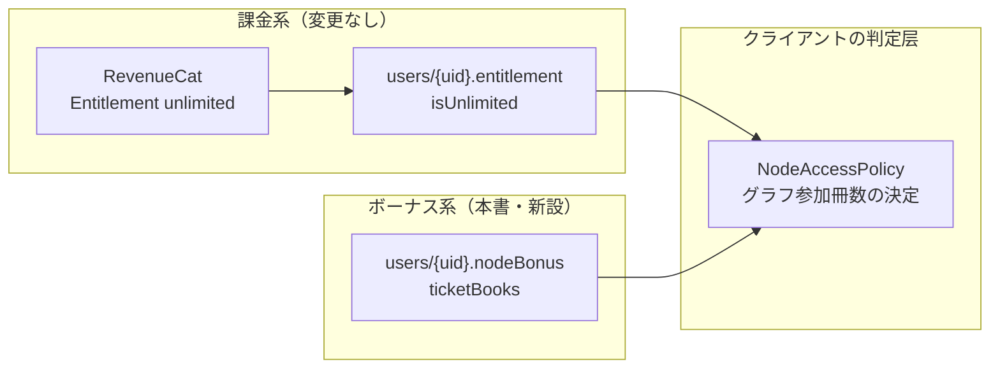
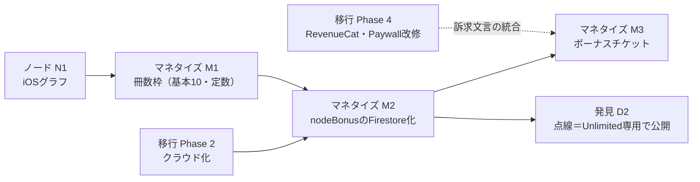

# BookBank マネタイズモデル再設計書（ノード機能を軸とした無料/Unlimited境界の再定義）

作成日: 2026-07-07
ステータス: 事前設計（実装時に不備・矛盾を発見した場合は指摘・修正すること）
関連文書:

- `docs/cloud-migration-architecture.md`（移行設計書。付録Bの機能差表を本書で置き換える）
- `docs/node-graph-feature-design.md`（ノード設計書。第9章・前提N5を本書で置き換える）
- `docs/discovery-feature-design.md`（発見設計書。第9章を本書で置き換える）

> **AI実装エージェントへ**: `docs/agent-implementation-guide.md` を先に読むこと。本書の (仮) 推奨は確定仕様として実装する（Q-B / V-B / T三位一体 / S-B）。投資額ボーナスは廃止済み（第3章）——実装しないこと。無料/Unlimited境界の正は本書第7章。

---

## 0. 確定した新方針と設計思想

### 0.1 新しい無料/Unlimited境界（確定）

| 機能 | 無料 | Unlimited |
|------|------|-----------|
| 実線ノードグラフ（本棚内のつながり） | **10冊分まで閲覧可能** | 冊数無制限 |
| 点線の発見機能（第2層/第3層) | **利用不可（Unlimited専用）** | 可 |
| ボーナスによる無料枠拡張 | チケット読み込みで**無料開放冊数が増える** | （対象外・元々無制限） |

- **ボーナスチケット**: チケットに応じた冊数を無料開放する

> **廃止の決定（2026-07-07）**: 当初案にあった「投資額連動ボーナス（登録額10万円で+100冊）」は、検討の結果**廃止**した。登録額10万円超のユーザーは最も課金しそうな優良層であり、そこへ大きな無料枠を配ることは**Unlimitedの主購買層を自ら削るカニバリゼーション**になるため（第3章に記録を残す）。

### 0.2 設計思想（方針の背景を設計原則に翻訳する）

1. **機能の魅力に自信を持つ**: ノード機能はBookBank最大の価値であり、「ITリテラシーを問わず万人が使える形」で提供することが競争優位。だから無料の間口を広げても課金価値は保たれる、という前提に立つ。**出し惜しみではなく「体験させてから枠で区切る」**モデル
2. **蓄積が解放する**: 読書の蓄積とともに機能が育っていく設計は、「読書は投資・蓄積が価値」というBookBankの思想と一致する。制限は「壁」ではなく「育てる目標」として見せる（ただし蓄積への**自動報酬**は課金層とのカニバリゼーションを招くため採らない。枠拡張は運営がコントロールできるチケット配布に限定する）
3. **発見（点線）は純粋なプレミアム**: 実線＝自分のデータの可視化は広く開放し、集合知という「BookBankにしかない資産」から生まれる発見はUnlimitedの中核価値として守る

### 0.3 補完した仮定の一覧（既存設計書と同形式）

| # | 論点 | 補完した前提 (仮) |
|---|------|------------------|
| M1 | 「冊数枠」の適用範囲 | **ノードグラフの閲覧のみ**に適用する。本の登録・本棚・通帳・統計は従来通り無制限（冊数枠は「グラフに参加できる冊数」であり、登録数の上限ではない） |
| M2 | 既存の制限軸との関係 | 口座3・読了リスト3・詳細エクスポート・カスタムカラーの既存Unlimited特典は**現状維持**（移行設計書 前提5を変更しない）。本書はノード/発見の軸を追加するだけ |
| M3 | 書籍詳細の「つながっている本」（ノード設計書N5の無料上位3件） | **廃止**し、冊数枠モデルに一本化する（枠内の本なら書籍詳細のつながりも全件見える。枠外の本は見えない。二重の無料基準を作らない） |
| M4 | ボーナスの適用先 | ボーナスはすべて「無料開放冊数」への加算に統一する（発見機能を部分開放するボーナスは作らない。境界の複雑化を防ぐ） |
| M5 | Unlimited解約後 | 冊数枠モデルに戻る（基本10＋獲得済みボーナス）。ボーナスはUnlimited期間中も失効しない |

---

## 1. 論点1: 「10冊分まで」の定義

「枠N冊」（基本10＋ボーナス）のとき、**どのN冊をグラフに参加させるか**と、**枠外の本の見せ方**、**Paywall導線**の3点を決める。

### 1.1 どのN冊か

| 案 | 定義 | 長所 | 短所 |
|----|------|------|------|
| Q-A | **登録順の最初のN冊** | 実装最易・不変で分かりやすい | グラフが化石化する。新しい本を登録しても何も起きず、「育つ」体験と正反対 |
| Q-B | **最新N冊**（登録日降順） | **本を登録するたびにグラフが動く**。「登録→グラフが育つ」ループが無料ユーザーにも毎回発生し、蓄積思想と一致。実装容易 | 古い本のつながりが枠から押し出されて消える（「あの本が消えた」という戸惑い） |
| Q-C | **ユーザーが選ぶN冊** | 自由度最大 | 「無料枠に入れる本を選ぶ」という管理UIが必要になり、万人向けの間口と逆行。選ぶ作業自体が楽しくない |
| Q-D | **最もつながりの多いN冊**（エッジ数上位） | グラフの見栄えが最良 | 選抜結果が計算依存で説明不能（「なぜこの本が消えた？」に答えられない）。辞書・ロジック改訂で枠の中身が入れ替わる |

**推奨 (仮): Q-B（最新N冊）**。理由: 無料ユーザーの体験ループ「登録する→グラフに現れてつながる」が毎回成立することが、この機能を「万人が使える形」で見せる最短経路であり、枠から押し出された本は次節の方式で「存在は見える」ため喪失感も緩和できる。

> 補足規則: 同日登録が枠境界をまたぐ場合は `registeredAt` 降順→`createdAt` 降順で安定ソートする。枠の判定はグラフ表示時に決定的に計算できるため、**「どの本が枠内か」を保存するデータは不要**（論点4のスキーマが単純になる）。

### 1.2 枠外の本（N+1冊目以降）の見せ方

| 案 | 見せ方 | 長所 | 短所 |
|----|--------|------|------|
| V-A | **完全非表示** | 実装最易・画面が静か | 「自分のグラフはもっと大きい」ことが伝わらず、アップセルの根拠が画面から消える |
| V-B | **存在は示すがぼかす**: 枠外の本は表紙なしの**ロックドット**（小さな灰色ドット＋グラフ周縁に配置。エッジは非表示）で表示 | 「この霞の全部がつながったら」という想像がPaywallの動機そのものになる。**自分のデータが人質ではなく「まだ見ぬ景色」として見える** | 枠外が多いと画面が濁る → ドットは最大表示数を絞る（例: 30個まで、超過分は「+123」の集約表示） |
| V-C | 枠外もエッジ含め全部描くが強くブラー | 見栄えのインパクトは最大 | ブラー越しに実質読めてしまう/描画コストが枠外冊数に比例して増える。「10冊分まで閲覧可能」という約束の輪郭が曖昧になる |

**推奨 (仮): V-B（ロックドットで存在だけ示す）**。発見機能の点線（未所有・破線・淡色）との視覚的区別を守るため、枠外ドットは**破線を使わない**（塗りつぶし灰色 `Color.primary.opacity(0.25)` の小ドット＋錠前なし。点線=未所有の可能性、灰ドット=所有済みだが枠外、と意味を分離）。

### 1.3 Paywall導線

| 導線 | 発火点 | 文言の方向性 |
|------|--------|-------------|
| 主導線 | 枠外ロックドットのタップ | 「この本もつながりに加えるには」＋現在の枠（例: 24冊中10冊を表示中）を明示 |
| 常設 | グラフ画面上部のステータスチップ「10 / 24冊」タップ | 枠の現状＋チケットでの拡張手段＋Unlimitedを**並列に**見せる（課金だけを出口にしない） |
| 受動 | 11冊目の登録完了直後（グラフ対象が初めて枠を超えた時)、一度だけトースト「グラフに表示しきれない本が増えてきました」 | 一度だけ。繰り返さない（うるさい制限通知は機能の品位を落とす） |

Analyticsイベント（移行設計書 9.3節の体系に追加）: `paywall_shown { trigger: "node_quota" }`・`node_quota_status_tapped`。

---

## 2. 論点2: ボーナスチケットの仕組み

### 2.1 チケットの形式

| 案 | 形式 | 長所 | 短所 |
|----|------|------|------|
| T-A | **英数コード手入力**（設定画面に入力欄） | 紙・口頭・SNSどこでも配布可能。実装が単純 | 入力の手間・打ち間違い |
| T-B | **URL（ユニバーサルリンク）** `bookbank.app/ticket/{code}` | タップだけで適用。SNS配布と相性最良 | アプリ未インストール時の遷移設計が必要（ストア誘導→インストール後の引き継ぎ） |
| T-C | **QRコード** | 書店店頭・イベント・しおり等の**物理配布**と相性最良 | 単体では読み取り後の遷移先が必要 |

**推奨 (仮): 三位一体（実体はコード1本）**。チケットの実体は**コード文字列**とし、T-B のURLはコードを内包（`?code=XXXX`）、T-C のQRはそのURLをエンコードしたもの、T-A は同じコードの手入力。**入口が3つ・検証経路は1つ**なので実装は実質T-A＋URLハンドリングのみ。コード形式は `BB-XXXX-XXXX`（英大文字+数字、紛らわしい文字 I/O/0/1 を除外した20文字アルファベット）とする。

### 2.2 付与単位・有効期限・加算

| 項目 | 推奨 (仮) | 理由 |
|------|----------|------|
| 冊数の付与単位 | チケットごとに可変（`grantBooks` フィールド）。標準は **+10冊/枚** | キャンペーンの強弱を運用で調整できる。「10冊」は基本枠と同じ単位で直感的 |
| 有効期限 | **読み込み期限あり（チケットごとに設定）／適用後の失効なし** | 「期限内に使って」はキャンペーンとして自然。一度開放した枠が減る体験は蓄積思想に反するため、**獲得済みボーナスは恒久** |
| 複数枚の加算 | **単純加算**（10＋10＋10…）。上限は設けるか → **チケット由来の合計上限200冊 (仮)** | 無限に配ると実質無料化するため天井だけ用意。上限到達は運用上ほぼ起きない想定 |
| 同一コードの再利用 | **1ユーザー1回**（ユーザーごとの適用履歴で判定） | コード自体は複数人が使える「キャンペーン共通コード」を基本とする（次節） |

### 2.3 コードの種別と不正対策の程度

方針は「不正対策は軽微でよい」（0.1節）だが、チケットは配布物なので最低限の構造だけ整える。

| 種別 | 用途 | 対策 |
|------|------|------|
| **共通コード**（1つのコードを多人数が使う） | SNSキャンペーン・雑誌掲載・イベント告知 | 読み込み期限＋総利用回数上限（例: 先着10,000回）＋1ユーザー1回 |
| **個別コード**（1コード1回きり） | 書店タイアップの購入特典・レビュー御礼など「1人に1枚」の配布 | 使用済みフラグのみ。大量発行はCSV生成の管理スクリプトで対応 |

- 検証は**Cloud Functions（callable）で行う**: コードの実在・期限・回数・ユーザーの適用履歴をAdmin SDKで検証し、`users/{uid}` のボーナスを加算する。クライアントに直接加算させない（コードリストがルール上読める構造にすると総当たりで収穫されるため）。Functionsの役割は移行設計書 2.4節のカテゴリに「**チケット適用**」を1つ追加することになる——集合知集約（発見設計書）と同様「サーバーでしか正しくできない最小限の処理」として許容する (仮)
- レート制限: 同一ユーザーの試行を1分5回程度に制限（総当たり対策はこれで十分。景品は冊数枠であり金銭価値が薄い）

### 2.4 配布シナリオの想定

| シナリオ | 形式 | 例 |
|---------|------|-----|
| リリース記念・季節キャンペーン | 共通コード＋SNS投稿のURL | 「読書の秋キャンペーン: +10冊」 |
| 書店・出版社タイアップ | 個別コードのQR（しおり・レシート・POP） | 「この書店で本を買うとBookBankの本棚が広がる」 |
| レビュー・紹介への御礼 | 個別コードのURLをDM送付 | App Storeレビュー企画等（**Appleの規約上、レビューの対価は不可**。「紹介プログラム」の形に留める） |
| 障害・不具合のお詫び | 共通コード | 運営の緩衝材として |

> **重要（Apple審査）**: チケットは**必ず無料で配布**する。チケット自体を販売したり、外部での購入の対価にすると、IAP外での機能販売（ガイドライン3.1.1違反）になる。書店タイアップも「本の購入特典として無料進呈」の建付けを守る（リスク章 6.2節）。

---

## 3. 論点3: 投資額ボーナス（廃止・決定の記録）

当初方針にあった「登録額10万円超で100冊分を無料開放する投資額連動ボーナス」は、**廃止と決定した（2026-07-07）**。将来同種の案が再浮上したときのために、判断根拠を記録として残す。

- **廃止理由（カニバリゼーション）**: 登録額10万円を超える蔵書家は、Unlimitedの**最有力購買層**そのものである。その層へ+100冊（実質、大半のユーザーのグラフ全体）を無料で恒久開放すると、課金の最大の動機「グラフ無制限」を自ら無効化してしまう。「蓄積が解放する」という思想的な美しさに対して、収益構造上の代償が大きすぎる
- **付随して消えた実装課題**: `totalValue` カウンターのJPY換算定義の確定・外貨登録の換算処理・水増し対策の要否・解放フラグのローカル→クラウド引き継ぎ。これらの検討はすべて不要になった（移行設計書 9.3節の `totalValue` は運営分析専用のままでよい）
- **思想の引き継ぎ先**: 「蓄積が機能を育てる」という体験は、冊数枠モデル自体（登録するたび最新枠でグラフが動く・論点1 Q-B）と、チケット施策の設計（読書行動に紐づくキャンペーン設計・2.4節）で表現する。**ユーザーの申告値（価格）に自動で報酬を紐づける仕組みは今後も作らない**——枠の拡張は運営が発行量をコントロールできるチケットに一本化する

---

## 4. 論点4: 冊数枠の管理（データモデル）

### 4.1 枠の合成式

```
無料開放冊数 quota =
    基本枠 10
  + ボーナスチケット合計 (ticketBooks, 上限200)

グラフに参加する本 = 登録日降順の上位 quota 冊（論点1・Q-B）
Unlimited (entitlement.isUnlimited) の場合は quota を無視して無制限
```

### 4.2 保持場所の案

| 案 | 保持方法 | 長所 | 短所 |
|----|---------|------|------|
| S-A | 都度計算のみ（保存しない） | 状態ゼロ | チケット適用は「事実の記録」が必須なので成立しない |
| S-B | **`users/{uid}` 直下の `nodeBonus` マップ＋適用履歴サブコレクション** | エンタイトルメント（`entitlement` マップ）と同じ場所・同じ読み方。クライアントは `users/{uid}` を既に購読しており**追加読み取りゼロ** | `users/{uid}` の update ルールに「`nodeBonus` はクライアント変更不可」の検証を足す必要（`entitlement` 保護と同じ手法・移行設計書 3.4節） |
| S-C | 独立サブコレクション `users/{uid}/bonus/current` | ルール分離が単純 | ドキュメント購読が1本増える。エンタイトルメントと置き場所の思想が割れる |

**推奨 (仮): S-B**。移行設計書 3.4節の末尾が「entitlementの保護はフィールド検証 or サブコレクション分離、シンプルな方を選ぶ」としているので、**`entitlement` と `nodeBonus` は同じ方式で保護する**（実装時にどちらかへ統一）。

### 4.3 Firestoreスキーマ

#### `users/{uid}` への追加フィールド（移行設計書 3.3節に追記）

```
-- ノード無料枠ボーナス（チケット適用Functionのみが書く。
--  entitlement と同じ保護方式でクライアント直接変更を禁止）--
nodeBonus          map {
  ticketBooks    number      チケット由来の合計冊数（上限200）
  updatedAt      timestamp
}
```

> 基本枠「10」はドキュメントに保存しない（アプリ定数）。将来基本枠を変える場合はアプリ側の定数変更＋Remote Config化を検討。

#### `users/{uid}/ticketRedemptions/{code}`【私有・適用履歴】

```
grantBooks    number      このコードで加算された冊数
redeemedAt    timestamp
campaignId    string?     集計用（どのキャンペーン経由か）
```

#### `bonusTickets/{code}`【グローバル・運営管理】

```
grantBooks    number      1回の適用で付与する冊数（標準10）
type          string      "shared"（共通） | "single"（個別1回きり）
campaignId    string      キャンペーン識別子
expiresAt     timestamp   読み込み期限
maxRedemptions number?    共通コードの総回数上限（nullは無制限）
redemptionCount number    現在の適用回数（Functionsがincrement）
disabled      boolean     緊急停止フラグ
createdAt     timestamp
```

#### セキュリティルール（移行設計書 3.4節への追加）

```
// 疑似コード
match /bonusTickets/{code} {
  allow read, write: if false;   // チケット適用Function（Admin SDK）のみ。
}                                 // クライアントに読ませない（コード収穫防止・2.3節）
// users/{uid}.nodeBonus は entitlement と同じ方式でクライアント変更を禁止
// users/{uid}/ticketRedemptions は本人 read のみ・write は Function のみ
```

### 4.4 オンデバイス期（クラウド移行Phase 2以前）の扱い

ノードN1（オンデバイス版）を移行Phase 2 より先に出す場合:

- 動くのは**基本枠10のみ**（アプリ定数。ローカルに保存すべき状態は無く、実装が非常に軽い）
- **ボーナスチケットはクラウド移行後（Phase 2＋Functions）まで提供しない** (仮)。ローカルだけで1ユーザー1回・回数上限を保証できず、機能の信頼性が作れないため。N1時点のステータスチップにはチケット導線を出さない（「Unlimitedで無制限」だけを見せる）
- 移行ウィザード（移行設計書 5.4節）への追加処理も不要（引き継ぐべきローカルボーナス状態が存在しない）

---

## 5. StoreKit / RevenueCat との関係

冊数解放は**課金ではない**ため、課金基盤には一切触れない。判定の合成だけを行う。



- **Unlimitedの判定系（`UnlimitedManager` → 将来RevenueCat・移行設計書 7.5節）は無変更**。`isUnlimited == true` なら `nodeBonus` を読まずに無制限
- 冊数枠の判定は新設の軽量ポリシー（例: `NodeAccessPolicy`）に集約し、**グラフ機能だけ**がこれを参照する。既存の `PassbookLimit`・読了リスト制限等のUnlimited判定コードには触れない（M2: 既存制限軸は現状維持）
- **RevenueCatのプロモーション機能（Promotional Entitlements / Offer Codes）は使わない** (仮)。それらは「Unlimited全体を期間付与する」仕組みであり、「冊数枠を+10する」という部分開放は表現できない。ボーナスは自前の `nodeBonus` で完結させ、課金系と混ぜない——**「ボーナスでUnlimitedそのものを配る」将来キャンペーンをやる時だけ**RevenueCatのPromotional Entitlementsを検討する
- Paywall（`UnlimitedPaywallView`）への影響: 訴求点に「ノードグラフ無制限」「発見機能」を追加する（移行Phase 4のPaywall改修・移行設計書 7.5節と同時に行うのが効率的）

---

## 6. 論点5: 既存3設計書への波及修正（具体差分）

### 6.1 移行設計書（`cloud-migration-architecture.md`）

| 箇所 | 修正内容 |
|------|---------|
| 付録B 機能差表 | 本書 第7章の決定版の表に**置き換える** |
| 3.3節 `users/{uid}` | `nodeBonus` マップを追加（本書 4.3節） |
| 3.4節 セキュリティルール | `bonusTickets` の全面拒否・`nodeBonus` のクライアント変更禁止を追加 |
| 2.4節 Cloud Functions一覧 | 役割に「チケット適用（callable）」を追加（Webhook受信・削除処理・解析集計・チケット適用の4つに） |
| 9.3節 Analyticsイベント | `ticket_redeemed { campaign_id, grant_books }` の追加・`paywall_shown` のtriggerに `"node_quota"` を追加 |

### 6.2 ノード設計書（`node-graph-feature-design.md`）

| 箇所 | 修正内容 |
|------|---------|
| 前提N5（無料ユーザーへの見せ方） | 「上位3件無料＋グラフはPaywall」を**廃止**し、「**冊数枠モデル: 最新quota冊はグラフ含め全機能利用可、枠外はロックドット表示**」に差し替え（本書 論点1） |
| 第9章 無料/Unlimited | 本書 第7章の表に置き換え。「ぼかしプレビュー＋Paywallシート」の記述を削除（グラフ自体は無料でも開ける） |
| 8.2節 Paywall導線 | `paywall_shown { trigger: "node_graph" }` → `trigger: "node_quota"` に変更。ステータスチップ（10/24冊）の仕様を追加 |
| 第10章 N1の内容 | 「Unlimited新特典として訴求」→「**全ユーザー向け新機能（無料10冊枠）として訴求**」に変更。N1のスコープに冊数枠判定（`NodeAccessPolicy`）を追加 |
| 第9章の計算に関する記述 | 「インデックス計算は無料ユーザーの端末でも実行する」は**そのまま維持**（枠外の本too。ロックドットの位置・「10/24冊」表示に全件のインデックスが必要なため） |

### 6.3 発見設計書（`discovery-feature-design.md`）

| 箇所 | 修正内容 |
|------|---------|
| 第9章 無料/Unlimited | 「書籍詳細の『この本の先にある本』1冊だけ無料 (仮)」を**廃止**。発見機能（点線・書籍詳細の提案とも）は**Unlimited専用**に統一。表を本書 第7章に置き換え |
| 第9章 集合知への提供 | 「無料ユーザーも集合知に貢献（オプトアウト可）」は**変更なし**（維持を明記） |
| 8.1節 レイヤートグル | 無料ユーザーには「発見」チップを**非表示ではなくロック表示**（タップでPaywall・`trigger: "discovery"`）とする詳細を追記 |
| 前提D3・第11.5節 | 貢献と受益の非対称の記述は新モデルでも成立（変更なし）。ただし「無料でも実線グラフ10冊が使える」ため非対称の度合いは緩和された旨を追記 |

> これらの差分は本書の承認後、各設計書に反映する（設計書間の記述矛盾を放置しない。反映時は各書の冒頭に「無料/Unlimitedの正は `monetization-model-design.md`」と参照を張る）。

---

## 7. 新しい無料/Unlimited機能差（決定版・3設計書の該当章を置き換える）

| 機能 | 無料 | Unlimited |
|------|------|-----------|
| 口座数 | 3まで | 無制限 |
| 読了リスト数 | 3まで | 無制限 |
| Markdownエクスポート | タイトル・著者のみ | 詳細情報含む |
| カスタムカラー | 不可 | 可 |
| クラウド保存・複数端末同期 | 可（全員開放） | 可 |
| Webアプリ利用 | 可（全員開放） | 可 |
| **実線ノードグラフ** | **最新10冊分＋ボーナス枠**（枠外はロックドット表示） | **無制限** |
| **書籍詳細の「つながっている本」** | 枠内の本のみ表示 | 全件 |
| **点線の発見機能（第2層/第3層）** | **不可（Unlimited専用）** | 可 |
| **ボーナスチケットによる枠拡張** | 可（+10冊/枚・合計上限200冊） | （不要） |
| 集合知への匿名提供 | プランに関係なく提供（オプトアウト可） | 同左 |

---

## 8. 実装フェーズ

クラウド移行Phase（0〜5）・ノードPhase（N0〜N3）・発見Phase（D0〜D3）との前後関係:



| Phase | 内容 | 前提 | 備考 |
|-------|------|------|------|
| **M1（N1と同時リリース）** | 冊数枠モデル（`NodeAccessPolicy`・最新quota冊・ロックドット・ステータスチップ・Paywall導線）。この時点の quota は基本枠10の定数のみ | ノードN1 | **N1のリリース定義を変える**（Unlimited限定→無料10冊枠つき全員開放。ノード設計書 第10章の修正・6.2節）。グラフを最初から無料で触らせることが機能の認知を最大化する |
| **M2（移行Phase 2に同乗）** | `nodeBonus` スキーマ・セキュリティルールの追加 | 移行Phase 2 | 単独リリースではなくPhase 2の仕様に含める（後から足すとルール改訂が2回になる） |
| **M3（チケット）** | `bonusTickets` コレクション・チケット適用Function（callable）・設定画面のコード入力＋URL/QRハンドリング・運営用コード発行手順 | M2完了（Functions前提・4.4節） | 最初のキャンペーンの企画と同時にリリースする（機能だけ先に出しても使われない） |
| **（同期タイミング）発見D2** | 点線リリース時、無料ユーザーには「発見」チップをロック表示（6.3節） | M2・発見D1 | 発見設計書 第10章の計画通り |
| **（同期タイミング）移行Phase 4** | Paywall改修時に「ノード無制限・発見機能」を訴求の柱に組み込む | - | 移行設計書 7.5節のPaywall改修と一体で |

---

## 9. リスクと注意点

### 9.1 無料枠拡大の収益影響

- **10冊で満足する層**: 本棚が小さいユーザーは枠内で完結する。ただしこの層はそもそも課金期待が薄く、無料で「グラフのあるBookBank」を体験して口コミの源泉になる方が期待値が高い（0.2節の思想）。**監視指標**: 枠超過ユーザーの割合・`node_quota` トリガーのPaywall転換率
- **チケットによるカニバリゼーション**: 投資額ボーナスの廃止（第3章）で自動的な大量開放の経路は消えたが、チケットの発行量次第では同じ問題を運用側から再現してしまう。**大口配布（+50冊超/枚）は原則行わず**、優良層（蔵書100冊超など）に届きやすいキャンペーン設計は転換率への影響を見ながら慎重に行う。合計上限200冊（2.2節）が最終的な天井

### 9.2 ボーナスチケットの不正・審査

- **コード総当たり**: 20文字アルファベット×8桁の空間＋Functionsのレート制限＋`bonusTickets` のクライアント読み取り禁止で実用上十分（2.3節）
- **コードの転売・売買**: 金銭価値が「グラフの冊数枠」に限られるため市場が成立しにくいが、規約の禁止事項に「コードの有償譲渡の禁止」を1行追加する（移行設計書 第10章の利用規約改訂に同乗）
- **Apple審査（3.1.1）**: チケットは無料配布に限る（2.4節）。「コード入力でアプリ内機能が解放される」仕組み自体は、無料のプロモーションである限り一般に許容されるが、**M3の審査提出時にレビューノートで「無料キャンペーンコードであり販売はしない」ことを説明**できるようにしておく
- **レビュー対価の禁止**: App Storeレビューと引き換えのチケット配布はAppleの規約違反。紹介プログラム等の形に留める（2.4節）

### 9.3 体験・整合性

- **枠の入れ替わり（Q-B最新順）の戸惑い**: 「昔の本がグラフから消えた」問い合わせに備え、ステータスチップの説明シートに「最新の10冊（＋ボーナス枠）が表示されます」を明記。FAQにも記載
- **Unlimited解約後の降格体験**: 無制限→枠ありに戻る瞬間、グラフの大半がロックドット化する。解約自体は止められないが、獲得済みチケットボーナスが生きていることをステータスチップで見せ、「ゼロに戻った」印象を防ぐ（M5）
- **3設計書の記述矛盾**: 第6章の差分反映を本書承認後すみやかに行う。特にノード設計書N5（上位3件無料）と発見設計書第9章（1冊無料）は本書と**明確に矛盾する**ため、反映漏れは実装の手戻りに直結する
- **「登録数は無制限」の明示**（M1）: 冊数枠は「グラフに表示される冊数」であり本の登録上限ではない。Paywall・ステータスチップの文言で誤解させないこと（「本の登録が10冊まで」と誤読されると登録行動自体が萎縮し、全機能の土台が痩せる）

---

## 付録A: 本書で新設・変更されるものの一覧

| 種別 | 項目 | Phase |
|------|------|-------|
| 新設（クライアント） | `NodeAccessPolicy`（quota合成・枠判定） | M1 |
| 新設（クライアント） | グラフのロックドット表示・ステータスチップ | M1 |
| 新設（スキーマ） | `users/{uid}.nodeBonus` / `users/{uid}/ticketRedemptions` / `bonusTickets` | M2〜M3 |
| 新設（Functions） | チケット適用callable | M3 |
| 変更（既存設計書） | 移行設計書 付録B・3.3・3.4・2.4・9.3節 / ノード設計書 N5・第9章・8.2節・第10章 / 発見設計書 第9章・8.1節 | 本書承認後 |
| 廃止（検討からの除外） | 投資額連動ボーナス（第3章に決定記録） | - |
| 変更なし | `UnlimitedManager`・RevenueCat設計・既存の口座/リスト/エクスポート制限・`totalValue` カウンター（運営分析専用のまま） | - |
