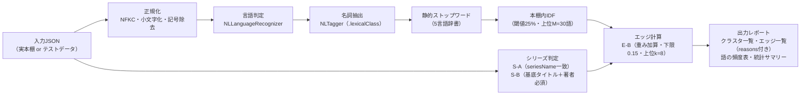

# N0スパイク 実施計画メモ（ノード機能の精度検証・リリースなし）

作成日: 2026-07-11
更新日: 2026-07-11（第6章の合否基準をオーナー確定・評価ハーネス着手承認・測定範囲限定と新規サンプル確認を追記）
ステータス: 確定・実施可（第6章の合否基準は2026-07-11にオーナー確定済み。評価ハーネス（前提2）の着手も同日承認済み）
関連文書:

- `docs/node-graph-feature-design.md`（本書の上位文書。S-A+S-B / W-C / L-A / E-B の各方式と (仮) パラメータの定義元。N0の位置づけ＝第10章）
- `docs/implementation-roadmap.md`（R5の前提としてのN0定義: 「この検証が終わるまでUI実装に着手しない」）
- `docs/agent-implementation-guide.md`（スコープ規律。数値パラメータは設計書の値をそのまま使う——N0は例外的に**そのパラメータを確定させるための検証**であり、変更はオーナー承認＋設計書更新とセットで行う）

> **AI実装エージェントへ**: N0は**アプリのリリース物を作らない**検証スパイクである。アプリ本体のコード（`dev/BookBank/`）には原則手を入れない（例外は 3.2節のエクスポート導線のみ・デバッグビルド限定）。R4（リポジトリ抽象化）と並行実施可能（接点ゼロ）。評価ハーネスの実装形態は 3.3節（2026-07-11 着手承認済み）。

---

## 0. この計画の前提（補完した仮定の一覧）

| # | 論点 | 補完した前提 (仮) | 根拠 |
|---|------|------------------|------|
| 1 | 実本棚データの取り出し方 | **デバッグビルド限定のJSONエクスポート**を使い捨てで追加し、実機からMacへ書き出す（3.2節）。App Storeリリースには含めない | 約400冊の実データは実機にのみ存在し、既存のMarkdownエクスポートでは必要フィールド（`seriesName` / `memo` / `isbn` 等）が足りないため |
| 2 | 評価ハーネスの形態 | **Mac上で動くSwiftコマンドラインツール（SwiftPMパッケージ）**。`NaturalLanguage` フレームワークはmacOSでも同一APIで動くため、シミュレータ不要で反復実行できる。このコードがN1実装の原型（純関数群）になる | 本書 3.3節。着手は2026-07-11にオーナー承認済み |
| 3 | 評価対象のパラメータ | ノード設計書の (仮) 値を初期値とする: エッジ上限 k=8・キーワード上限 M=30・IDF閾値 25%・スコア下限 0.15・S-B接頭辞条件（60%かつ4文字以上）・重み（シリーズ1.0/著者0.6/語0.15×3上限/メモ月0.05） | ノード設計書 2.2・3.2・5.2節 |
| 4 | MonthlyMemoの扱い | 検証対象に**含める**（重み0.05のメモ月一致もエッジ評価に登場するため）。ただし重みが最小でスコア下限0.15未満単独では現れず、評価の主対象はシリーズ・著者・語の3軸 | ノード設計書 前提N1・5.2節 |
| 5 | 正解データ（グラウンドトゥルース）の作り方 | シリーズ判定のみ正解ラベルを人間が作る（4.2節）。エッジの「納得感」は正解定義が主観のため、**3値の目視判定**（納得/中立/誤リンク）でサンプル評価する（第5章） | 誤リンクの定義自体がユーザー体験の問題であるため |
| 6 | 5言語テストデータの作成者 | AIエージェントが仕様（4.3節）に沿って生成し、オーナーがスポットチェックする。実在書籍のタイトル・著者を使う（現実の表記ゆれを含めるため） | 効率と現実性の両立 |
| 7 | 結果の記録先 | `docs/n0-spike-results.md` を新設し、実測値・確定パラメータ・設計書への反映内容を記録する | R2〜R4の設計メモ運用と同型 |

---

## 1. 目的とスコープ

N0はR5（ノードグラフ・v1.7.0）の前提となる検証スパイク（リリースなし・1〜2週間規模）。目的は次の2つ。

1. **方式の合否判定**: シリーズ判定（S-A+S-B）と単語抽出（W-C）が実データで「毛玉グラフ」「誤リンク」を起こさないことを、オーナーの実本棚（約400冊）＋5言語テストデータで目視評価する
2. **パラメータの確定**: (仮) のままになっている数値（k・M・IDF閾値・スコア下限・S-B接頭辞条件・重み）を実測に基づいて確定し、ノード設計書を「(仮)なし」の状態に更新する。R5実装エージェントはその確定値を定数化するだけになる

**スコープ外**: グラフUI・力学レイアウト・パフォーマンス検証（1,000冊ダミーはR5の完了条件）・W-E（埋め込み）・翻訳書リンク・M1（課金枠）。**不合格でも方式（S-B/W-C）自体を独断で差し替えない**——パラメータ調整で改善しない場合は結果を報告し、方式の再選定はオーナー判断とする（実装ガイド 第2章）。

**R4との関係**: 接点ゼロ（アプリ本体に触れないため）。R4実装と並行して進められる。唯一の例外はエクスポート導線（3.2節）で、これも `dev/BookBank/` に触れるがデバッグ専用・数十行の追加であり、R4のステップと衝突するファイルはない。

---

## 2. 検証する処理（評価ハーネスに実装する範囲）

ノード設計書のパイプラインのうち、**UIと保存を除いた計算部分のみ**をハーネスに実装する。

- 巻数パターン辞書（5言語）・静的ストップワード辞書（各言語100〜300語）はこのスパイクで**初版を作成**する（R5でそのままリソースファイルに昇格させる）
- 出力は (a) シリーズクラスタ一覧、(b) 本ごとの上位kエッジ＋reasons、(c) IDFで除外された語/残った語の頻度表、(d) 統計サマリー（エッジ総数・軸別内訳・孤立ノード数・ハブ候補）の4点。目視評価はこのレポートに対して行う

---

## 3. データ準備

### 3.1 実本棚データ（主データ・約400冊）

- 必要フィールド: `uuid` / `title` / `author` / `seriesName` / `memo` / `isbn` / `publishedYear` / `registeredAt` / 口座名（参考）＋ `MonthlyMemo`（`year` / `month` / `text`）
- R3でuuidが全行に付与済みのため、bookIdでの突合が可能（ノード設計書 第10章「Phase 0完了後が望ましい」の条件は充足済み）

### 3.2 エクスポート導線（使い捨て・デバッグ限定）(仮・前提1)

- `#if DEBUG` で囲った「本棚データをJSONで書き出し」を設定画面の最下部等に追加し、書き出したファイルを共有シート（AirDrop）でMacへ送る
- **メモは私有データ**（ノード設計書 11.4節）。書き出したJSONはリポジトリにコミットしない（`.gitignore` に追加）。評価後の削除もチェックリストに含める
- 実機での書き出し操作は人間タスク

### 3.3 評価ハーネス (仮・前提2)

- リポジトリ内 `tools/n0-spike/`（SwiftPMパッケージ）として作成。アプリターゲットには含めない
- `NLTagger` / `NLLanguageRecognizer` はmacOSで同一APIが動くため、Mac上でコマンド1発で全量再計算→レポート再生成できる。パラメータ変更→再評価の反復（第7章）が数秒で回る
- 判定ロジックは純関数として書き、代表ケースのユニットテストを付ける（巻数パターン除去・基底タイトル抽出・IDF計算）。**このコードはR5実装の原型として流用可能な品質を保つ**が、UI・キャッシュ・増分計算は含めない

### 3.4 5言語テストデータ（補助データ・約60冊）(仮・前提6)

実本棚は日本語中心と想定されるため、言語カバレッジはテストデータで補う。実在書籍で構成し、**期待されるシリーズクラスタの正解ラベルを最初から付与**しておく。

| 言語 | 冊数目安 | 必ず含めるケース |
|------|---------|-----------------|
| 日本語 | 20 | シリーズ3種以上（`第N巻`・`(N)`・丸数字・上/下の表記ゆれ混在）、同著者の非シリーズ類似タイトル（誤結合チェック用）、seriesNameあり/なし混在 |
| 英語 | 15 | `vol.N` / `#N` / `Part N`、著者名「名 姓」⇔「姓, 名」ゆれ、ミドルネームイニシャル |
| 韓国語 | 10 | `N권` 表記、助詞膠着タイトル（`NLTagger` 分割精度の実測用＝ノード設計書 4.2節の必須検証） |
| 簡体字 | 8 | `第N册/卷` 表記 |
| 繁体字 | 7 | 簡体字と同題の本は入れない（繁簡変換は行わない前提＝設計書 4.2節の確認） |

- ISBNなし（手動登録想定）・メモ付きの本を各言語に数冊ずつ混ぜる
- テストデータJSONはコミットしてよい（私有情報を含まないため）

---

## 4. 評価項目と手順

### 4.1 評価は2データセット×3観点

| 観点 | 実本棚（400冊） | 5言語テストデータ（60冊） |
|------|----------------|--------------------------|
| ① シリーズ判定 | 正解ラベル（4.2節）との突合で誤結合率・取りこぼし率を算出 | 事前付与の正解ラベルと突合（全件） |
| ② 単語抽出・毛玉度 | IDF頻度表の目視＋統計サマリー（4.3節） | 言語別に名詞抽出の質を目視（特に韓国語） |
| ③ エッジの納得感 | サンプリング目視評価（4.4節） | 全エッジ目視（60冊なら現実的な量） |

### 4.2 ①シリーズ判定の正解データと指標

- **正解ラベル作成（人間タスク）**: ハーネスがまず「著者一致の本のペア候補一覧」を出力し、オーナーはそのうち同シリーズのものに印を付ける（ゼロから400冊をラベリングするのではなく、候補チェック方式で30分〜1時間規模に抑える）
- 指標:
  - **誤結合率** = 別作品なのに同クラスタにされたペア数 ÷ 判定クラスタ内の全ペア数
  - **取りこぼし率** = 同シリーズなのに別クラスタのままのペア数 ÷ 正解シリーズペア総数
- 非対称に扱う: 誤結合はシリーズエッジ（重み1.0＝最強表示）として目立つため厳しく、取りこぼしは「著者エッジ（0.6）としては正しく繋がる」ため緩く評価する（ノード設計書 2.2節のトレードオフ設計と同じ思想）
- **取りこぼし率の測定範囲の限定（重要）**: 正解ラベルは「著者一致のペア候補一覧」へのチェック方式で作るため、**測定できるのは著者一致ペア内の取りこぼしのみ**。著者表記ゆれ（例: 日本語名⇔ローマ字名・共著の表記差）で著者一致にならないシリーズペアは候補一覧に現れず、**本指標の分母に含まれない（測定外）**。これはS-Bが著者一致を必須条件とする設計上の構造的な取りこぼしで、ノード設計書 4.2節が初期スコープ外と定めた領域。第6章の基準3はこの限定つきの数値であることに注意

### 4.3 ②単語抽出・毛玉度の指標

- IDFフィルタ通過後の語について: **上位頻出語トップ50の目視**（「ありふれた語が残っていないか」）と、**除外された語の目視**（「意味のある語が消えていないか」）
- 毛玉度の代理指標（統計サマリーで機械算出）:
  - 単語1語のみを理由とするエッジの比率
  - ハブノード（k=8本すべてが埋まり、かつ全てが単語エッジ）の数
  - 孤立ノード（エッジ0本）の比率——高すぎるのは取りこぼし側の兆候
- N<10冊のIDFスキップ（設計書 3.2節の注意）はテストデータを冊数を絞って流すことで動作確認する

### 4.4 ③エッジの納得感（サンプリング目視評価）

- サンプル: **無作為50冊＋シリーズ持ち全冊＋メモが長い上位10冊**の上位kエッジ（重複除去後、想定300〜500本）
- 各エッジをreasonsを見ながら3値で判定（人間タスク）: **納得**（つながる理由が分かる）/ **中立**（害はないが弱い）/ **誤リンク**（無関係・不快）
- **誤リンク率 = 誤リンク数 ÷ 評価エッジ総数** をこのスパイクの主要KPIとする

---

## 5. 実施手順（時系列）

| 順 | 作業 | 担当 |
|----|------|------|
| 1 | エクスポート導線の追加（3.2節）＋評価ハーネスの骨格＋巻数パターン/ストップワード辞書の初版（2章） | AI |
| 2 | 5言語テストデータの生成（3.4節・正解ラベル付き） | AI（オーナーがスポットチェック） |
| 3 | 実機でJSON書き出し→Macへ転送 | 人間 |
| 4 | テストデータで全パイプラインを流し、明白な不具合（辞書漏れ・分割失敗）を先に潰す。韓国語の分割精度判定（6.3節）もここで | AI→オーナー報告 |
| 5 | 実本棚データで全量計算→シリーズ候補一覧を出力→正解ラベル付け（4.2節） | AI＋人間 |
| 6 | レポート一式を出力し、サンプリング目視評価（4.4節） | 人間（AIが集計） |
| 7 | 合否判定（第6章）。不合格の観点はパラメータ調整（第7章）→再計算→再評価（4.4節のサンプルは固定し、比較可能にする） | 人間が判断・AIが実行 |
| 7.5 | **最終確定前の新規サンプル確認**: パラメータ確定の直前に、反復で一度も使っていない**新規の無作為サンプル**（4.4節と同規模）で目視評価を1回行い、固定サンプルへの過適合がないこと（誤リンク率が基準内に収まること）を確認する。ここで基準を外れた場合は確定せず手順7へ戻る | 人間（AIがサンプル抽出・集計） |
| 8 | 結果メモ `docs/n0-spike-results.md` 作成・ノード設計書の (仮) パラメータを確定値へ更新・実本棚JSONの削除 | AI（オーナー承認） |

反復（手順7）は2〜3周を想定。パラメータを変えても改善しない場合は、方式レベルの問題として報告し判断を仰ぐ（スコープ外の原則＝第1章）。

---

## 6. 合否基準（**確定・2026-07-11 オーナー承認**）

> 以下の数値は提案値のままオーナーが確定した（2026-07-11）。変更する場合はオーナー承認＋本章の更新をセットで行うこと。

| # | 指標 | 確定値 | 根拠 |
|---|------|--------|------|
| 1 | **誤リンク率**（4.4節・主要KPI） | **5%以下**、かつ誤リンクのうち「不快・信頼を損なう」レベル（例: メモ由来の私的な語での無関係な結合）が**1%以下** | k=8上限で1冊平均のエッジは数本。5%なら「20本眺めて1本首をかしげる」程度で、reasonsの常時表示（設計書 11.1節の緩和策a）により誤りの理由が見えるため許容できる水準。10%を超えると「信頼を一度失うと機能ごと使われなくなる」（同節）の領域に入ると判断 |
| 2 | シリーズ**誤結合率**（4.2節） | **2%以下** | シリーズエッジは重み1.0の最強表示で誤りが最も目立つため、一般エッジより厳しく。S-Bの著者一致必須条件が効いていれば実測はほぼ0%になる見込みで、2%超は接頭辞条件（60%/4文字）の緩みを疑うシグナル |
| 3 | シリーズ**取りこぼし率**（4.2節） | **25%以下**（努力目標。超えても単独では不合格にしない） | 取りこぼしは著者エッジとして繋がるため体験上の害が小さい（設計書 2.2節）。表記ゆれの多様さを考えると完璧は狙わず、巻数パターン辞書の改善余地として記録する方が健全 |
| 4 | 毛玉度: 単語1語のみのエッジ比率（4.3節） | **全エッジの30%以下** | 単語エッジ自体は機能の価値（意外なつながり）なのでゼロは目指さないが、過半が「1語の偶然」だとグラフの説得力が失われる。超過時はIDF閾値・スコア下限で絞る（第7章） |
| 5 | 韓国語の名詞抽出品質（4.3節・設計書4.2節の必須検証） | テストデータ10冊のタイトル・メモから抽出された語のうち**意味を成す名詞が8割以上**。未達なら設計書のフォールバック（韓国語は名詞抽出を諦めストップワード＋IDFのみ）を発動 | 合否というより分岐判定。フォールバック発動は「不合格」ではなく設計書が予定した縮退 |
| 6 | 孤立ノード比率（参考値・合否に使わない） | 実測を記録するのみ | 実本棚の性質（単発本が多いか）に依存するため基準化しない。R5の空状態UI・オンボーディング出し分け（設計書 11.1節）の判断材料として残す |

---

## 7. パラメータ調整の判断表（不合格時にどのつまみを動かすか）

| 症状 | 第一候補 | 第二候補 | 動かさないもの |
|------|---------|---------|---------------|
| 誤リンク率が高い（弱い偶然が多い） | スコア下限 0.15 → 0.2 | 共有語の上限3語→2語 | 重みの比率（シリーズ>著者>語の序列は方式の骨格） |
| 毛玉度が高い（ありふれた語が残る） | IDF閾値 25% → 20% | 静的ストップワード辞書に追記 | M=30（保存語数は毛玉度に直接効かない。エッジはスコア下限で切れるため） |
| 取りこぼしが多い（つながらなすぎる） | IDF閾値 25% → 30% | スコア下限 0.15 → 0.1 | k=8の引き上げ（過密対策が先に破綻する） |
| シリーズ誤結合 | S-B接頭辞条件を厳格化（60%→70% または 4文字→6文字） | 巻数パターン辞書の見直し | 著者一致必須の撤廃（絶対にしない） |
| シリーズ取りこぼし | 巻数パターン辞書に追記 | 接頭辞条件の緩和（慎重に・誤結合率と往復確認） | - |
| ハブノード（多作著者の団子） | 実測を記録し、著者仮想ノード（設計書 5.2節で見送った案）の再検討材料としてオーナーに報告 | - | N0では対処しない（R5以降の判断） |

- 調整は**1回の反復で1〜2個まで**（同時に全部動かすと因果が分からなくなる）
- 最終確定値は `docs/n0-spike-results.md` に「初期値→確定値＋変更理由」の表で記録し、ノード設計書の該当節（2.2・3.2・5.2）を更新する（実装ガイド 4.5節のドキュメント同期）

---

## 8. 成果物と完了条件

| 成果物 | 内容 |
|--------|------|
| `docs/n0-spike-results.md` | 実測値（第6章の全指標）・確定パラメータ表・目視評価の所見・R5への申し送り（ハブ対策の要否・韓国語フォールバックの発動有無・辞書の既知の穴） |
| ノード設計書の更新 | (仮) パラメータの確定値への置き換え・検証済みの旨の追記 |
| `tools/n0-spike/` | 評価ハーネス（判定ロジックの純関数＋ユニットテスト）。R5実装の原型 |
| 辞書初版 | 巻数パターン辞書・静的ストップワード辞書（5言語）。R5でリソースファイルへ昇格 |
| 削除確認 | 実本棚JSONの削除（メモ＝私有データを残置しない） |

**完了条件**: 第6章の確定済み基準を全観点で満たす（または基準5のようにフォールバック発動を判断済み）こと＋成果物一式の完成。完了をもってR5は「N0待ち」の状態を脱し、R4完了後いつでも着手可能になる。
