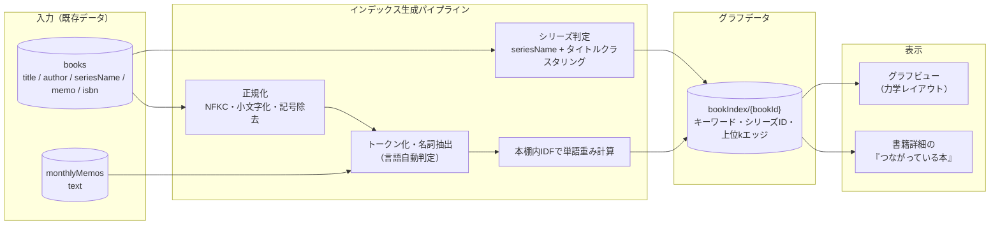
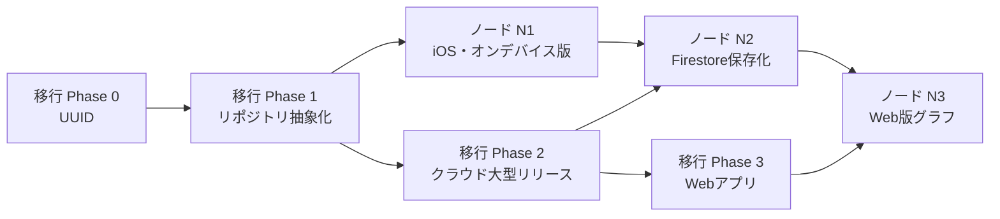

# BookBank ノード機能（本同士の自動リンク・グラフ表示）設計書

作成日: 2026-07-06
ステータス: 事前設計（実装時に不備・矛盾を発見した場合は指摘・修正すること）
関連文書: `docs/cloud-migration-architecture.md`（クラウド移行設計書）/ `DESIGN_SYSTEM.md`

---

## 0. この設計書の前提

### 0.1 目的（プロダクトビジョン）

**「本棚が思考として育つ」ことを可視化する。** 登録した本が孤立した記録ではなく、著者・シリーズ・言葉を介して互いにつながった「知のネットワーク」として見えることで、

- 自分の読書の偏り・関心の中心・意外なつながりに気づける
- 「この本の隣にある本」をたどる新しい再訪動線が生まれる（本棚を開く頻度が上がる）
- グラフが育つ体験自体が読書の動機になる（＝本を読む人口を増やすというアプリの使命に直結）

### 0.2 確定している方針

| # | 方針 |
|---|------|
| 1 | 本同士のつながりは**テキストから自動生成**する。ユーザーの手動タグ付けは不要 |
| 2 | つなぐ軸は3つ: **同じ著者**・**同じ単語**（タイトル・メモ・ログ内テキストに含まれる語）・**同じシリーズ** |
| 3 | **グラフとして可視化**し、本から本へたどれるようにする（Obsidianのグラフビューが参照イメージ） |
| 4 | ノード機能は**Unlimited特典**とする |

### 0.3 補完した仮定の一覧（クラウド移行設計書と同形式）

| # | 論点 | 補完した前提 (仮) |
|---|------|------------------|
| N1 | 「ログ内テキスト」の範囲 | 本ごとのテキスト = `title` + `seriesName` + `memo`。加えて `MonthlyMemo`（月別メモ）は「その月に登録された本」に緩く紐付くテキストとして扱う（重みは最小。第4章）。読書ログ機能が将来追加されたらそのテキストも同じパイプラインに乗せる |
| N2 | グラフの範囲 | **口座（Passbook）をまたいだ全登録本**を1つのグラフにする。口座はノードの色として表現（第7章）。口座別フィルターは提供する |
| N3 | 対象プラットフォーム | まずiOS。Web版はクラウド移行 Phase 3（Web v1.5）以降に同じ事前計算データを読むだけの実装として追加 |
| N4 | 言語 | アプリの対応5言語（日・英・韓・簡体字・繁体字）の本が1つの本棚に混在し得る前提で設計する |
| N5 | 無料ユーザーへの見せ方 | グラフ本体はUnlimited限定。ただし書籍詳細の「つながっている本」上位3件は無料でも表示し、グラフへの導線でPaywallを出す（第8章） |

---

## 1. 全体像



処理は大きく2段階に分かれる。

1. **インデックス生成（本ごと）**: 本のテキストからキーワード集合・シリーズクラスタIDを抽出する。本の追加・編集時にその本の分だけ増分実行できる
2. **エッジ計算（本のペア）**: 著者一致・シリーズ一致・キーワード共有からスコアを計算し、本ごとに上位k件のエッジを保持する。転置インデックス（キーワード→本ID）を使えば全ペア総当たり（O(N²)）を避けられる

---

## 2. 論点1: シリーズ判定

`seriesName` フィールドがある本（楽天Books APIはシリーズ・レーベル名を返すことがある）は文字列一致で判定できるが、**シリーズ名データが無い本・タイトル表記がバラバラな本**（例: 「ハリー・ポッターと賢者の石」「ハリー・ポッターと秘密の部屋」）をどう同シリーズと判定するかが難所。

### 2.1 案の比較

| 案 | 手法 | 精度 | 実装難易度 | 備考 |
|----|------|------|-----------|------|
| S-A | **`seriesName` の正規化一致のみ** | 高（ただし適用範囲が狭い） | ★☆☆ 低 | データがある本にしか効かない。手動登録本・Google Books経由の本はほぼ対象外 |
| S-B | **タイトル共通接頭辞クラスタリング**: タイトルから巻数・巻タイトルパターン（`第N巻`・`(N)`・`N`・`上/下`・`vol.N` 等）を除去した「基底タイトル」を作り、**著者一致を必須条件**として同一基底タイトルをクラスタ化 | 中〜高（著者一致必須で誤検知を大幅に抑制） | ★★☆ 中 | 「ハリー・ポッターと賢者の石」型（各巻の副題が違う）は接頭辞の共通部分抽出（最長共通接頭辞が一定文字数以上）で拾う |
| S-C | **ISBN近接**: ISBN-13の出版社記号+書名記号が近い（連番に近い）ものを同シリーズ扱い | 低 | ★★☆ 中 | 同レーベルの無関係な本が連番になるケースが多く、誤検知が構造的に多い。逆に同シリーズでも改版・出版社変更で番号が飛ぶ。**単独では使えない** |
| S-D | **外部APIでの補完**: 登録時に楽天/Google Booksへ再照会してシリーズ情報を取得・保存 | 中 | ★★★ 高 | API呼び出し増（レート制限・オフライン時不可）。Google Booksにはシリーズ情報がほぼ無く、実効性が薄い |
| S-E | **埋め込みベクトルの類似度**: タイトルをベクトル化し類似度が高いものをシリーズ候補に | 中（「シリーズ」と「似たテーマの別作品」を区別できない） | ★★★ 高 | シリーズ判定というより「関連本」の検出に向く。論点2の将来拡張として保留 |

### 2.2 推奨 (仮): S-A + S-B の2段構え

1. `seriesName` があれば正規化（NFKC・空白除去・巻数除去）して一致判定（S-A）
2. 無い本は S-B: **著者が一致する本同士に限定**して、
   - タイトルから巻数パターンを除去した基底タイトルの完全一致、または
   - 最長共通接頭辞が「短い方のタイトルの60%以上 かつ 4文字（英語は2単語）以上」
   でクラスタ化する
3. S-C（ISBN近接）は**採用しない**。ただし S-B のクラスタ内で巻順を並べる補助情報としてISBN・出版年を使う

**トレードオフの明示**: S-Bは「同著者の類似タイトルの別作品」（例: 東野圭吾の「マスカレード・ホテル」「マスカレード・ナイト」…これは実際シリーズなので正解だが）を稀に誤結合する。ただし著者一致が必須条件なので、誤結合しても「同著者リンク」としては正しく、ユーザー体験上の害が小さい。**シリーズ判定の失敗はグラフ上「エッジの重みが1段弱い」だけで済む設計**（第4章の重み設計と連動）にしてリスクを吸収する。

> 巻数パターン辞書（`第N巻`、`(N)`、`N巻`、`上・中・下`、`前編/後編`、`vol.N`、`#N`、`part N`、`1〜99` の末尾数字、丸数字①〜⑳、漢数字、ローマ数字、韓国語 `N권`、中国語 `第N冊/卷` 等）は5言語分をリソースファイルとして持ち、ユニットテストでカバーする。

---

## 3. 論点2: 「同じ単語」の精度

ありふれた語（助詞・一般語・「本」「物語」等）で全結合した「毛玉グラフ」になるのが最大の失敗パターン。Obsidianが機能するのはユーザーが意図的にリンクを張るからであり、自動生成では**「共有していたら意味がある語」だけを残すフィルタリング**が本質になる。

### 3.1 案の比較

| 案 | 手法 | 精度 | 実装難易度 | 備考 |
|----|------|------|-----------|------|
| W-A | **単純分かち書き + 静的ストップワード** | 低 | ★☆☆ 低 | 日本語は空白区切りできないため、そもそも分かち書きに形態素解析相当が必要。ストップワード辞書だけでは「一般的だが辞書に無い語」を除けない |
| W-B | **Apple NaturalLanguage framework（`NLTokenizer` + `NLTagger`）で名詞のみ抽出 + 静的ストップワード** | 中 | ★★☆ 中 | OS標準・追加依存ゼロ・オフライン動作。日中韓の単語分割に対応。品詞タグの精度は言語により差があるが「名詞に限定」目的には十分 |
| W-C | **W-B + 本棚内IDF（動的ストップワード）**: ユーザーの本棚全体で出現する本の割合が高い語ほど重みを下げ、閾値超は除外 | 高 | ★★☆ 中 | 「小説」「日本」など静的辞書で網羅しきれない語を、**そのユーザーの本棚にとってありふれているか**で自動排除できる。個人差（専門書だらけの本棚では専門語が一般語になる）にも自動適応 |
| W-D | **外部の形態素解析器（MeCab/mecab-ipadic-NEologd 等）を組み込み** | 高 | ★★★ 高 | 辞書サイズ（数百MB）がアプリに載る・ライセンス管理・5言語対応に別解析器が必要。オーバーキル |
| W-E | **埋め込みベクトル（`NLEmbedding` またはクラウドembedding API）で意味的類似度** | 高（語一致を超えた関連が出せる） | ★★★ 高 | 「なぜつながったか」をユーザーに説明しにくい（透明性の喪失）。`NLEmbedding` は対応言語が限られ（韓国語等は要検証）、クラウドAPIはコストと通信が発生。**将来の拡張枠** |

### 3.2 推奨 (仮): W-C（NaturalLanguage + 本棚内IDF）

パイプライン:

1. **正規化**: NFKC正規化 → 小文字化 → 記号・数字のみのトークン除去
2. **言語判定**: `NLLanguageRecognizer` でテキストごとに主要言語を判定
3. **トークン化 + 名詞抽出**: `NLTagger`（`.lexicalClass`）で名詞・固有名詞のみ残す。1文字の語（日本語）・2文字以下の語（英語）は捨てる
4. **静的ストップワード**: 言語別辞書（各言語100〜300語程度。「本」「物語」「入門」「book」「novel」「소설」「小说」等、書籍タイトル頻出の一般語を含む）
5. **動的フィルタ（本棚内IDF）**: 語 `w` を含む本の割合 `df(w)/N` が閾値（例: 25%）超なら除外。残った語に `idf(w) = log(N / df(w))` の重みを付与
6. 本ごとに上位M語（例: 30語）だけをキーワード集合として保存

**「なぜつながったか」を必ず説明できる**（エッジに共有語を記録する。第7章のUI「〇〇でつながっています」）ことをこの機能の信頼の柱とするため、ブラックボックスになるW-Eは初期実装では採らない。

> **注意（W-Cの限界）**: 本棚の冊数が少ない（N < 10冊程度）うちはIDFが機能しない。N < 10 では動的フィルタをスキップし静的ストップワードのみとする。また表記ゆれ（「経済learning」vs「エコノミー」）は語一致では拾えない。これはW-E導入時の改善余地として明記しておく。

---

## 4. 論点3: 多言語対応

### 4.1 案の比較

| 案 | 手法 | 精度 | 実装難易度 | 備考 |
|----|------|------|-----------|------|
| L-A | **共通パイプライン + 言語別リソース差し替え**: 処理フロー（正規化→トークン化→名詞抽出→ストップワード→IDF）は1本にし、トークナイザの言語指定・ストップワード辞書・巻数パターン辞書だけ言語別に持つ | 中〜高 | ★★☆ 中 | `NLTokenizer`/`NLTagger` が言語をパラメータとして受けるため自然に実現できる |
| L-B | **言語ごとに独立した処理系** | 高 | ★★★ 高 | 保守コスト5倍。個人開発+AI支援の体制に合わない |
| L-C | **言語非依存の文字n-gram**（形態素解析を使わず2〜3文字の部分文字列で照合） | 低〜中 | ★☆☆ 低 | 言語判定不要が利点だが、日本語で無意味な断片が大量に一致しノイズが多い。「なぜつながったか」の説明が不自然になる |

### 4.2 推奨 (仮): L-A（共通パイプライン + 言語別リソース）

- 言語判定は**テキスト単位**（本のタイトル・メモそれぞれ）で行う。「日本語の本棚に英語の原書が混ざる」ケースで、本単位の判定より正確
- 言語をまたぐリンクは**著者一致に頼る**（例: 『ノルウェイの森』と『Norwegian Wood』は著者 "村上春樹" / "Haruki Murakami" が別表記のため一致しない問題がある。著者名の正規化として、ラテン文字著者名は「名 姓」→「姓, 名」ゆれの吸収・ミドルネームイニシャルの正規化を行う。**日本語名⇔ローマ字名の同定は初期スコープ外** (仮)。翻訳書と原書のリンクは将来のISBN→書誌データベース連携やW-E埋め込みの課題として明記）
- **繁体字⇔簡体字の変換は行わない** (仮)。同一本棚に繁簡が混在するのは稀で、変換テーブルの保守コストに見合わない。混在ユーザーからの要望が出たら再検討
- 韓国語は助詞が語に膠着するため（`해리포터를` = ハリーポッター+を）、`NLTagger` の分割精度を実装時に必ず検証する。精度不足の場合、韓国語のみ「名詞抽出を諦め、ストップワード＋IDFのみ」に落とすフォールバックを用意する

---

## 5. 論点4: つながりの重み付けとグラフの過密対策

### 5.1 案の比較

| 案 | 手法 | 見え方 | 実装難易度 |
|----|------|--------|-----------|
| E-A | **重みなし（一致したら等価に1本）** | 著者で20冊が団子になり、単語リンクと区別できない毛玉になる | ★☆☆ 低 |
| E-B | **種別固定の重み + エッジ数上限**: シリーズ > 著者 > 単語 の固定重み。1ノードあたり表示エッジは上位k本 | つながりの「強さ」が線の太さ・距離で直感的に見える。過密を構造的に防げる | ★★☆ 中 |
| E-C | **学習・チューニング可能な重み**（ユーザーがスライダーで軸ごとの強さを調整） | 探索の自由度は高いが、設定項目が増えデフォルト設計から逃げているだけになりがち | ★★★ 高 |

### 5.2 推奨 (仮): E-B（固定重み + 上位kエッジ）、E-Cの「軸のON/OFF」だけ取り込む

**エッジスコアの定義 (仮)**:

```
score(A, B) = 1.0 × 同シリーズ（seriesName一致 or タイトルクラスタ一致）
            + 0.6 × 同著者（正規化著者名の一致）
            + Σ min(0.15 × idf正規化値, 0.15)  … 共有キーワードごと（上限3語 = 最大0.45）
            + 0.05 × 同じ月のMonthlyMemoに双方が言及されている場合（前提N1・最小重み）
```

- 種別は排他ではなく**加算**（同シリーズなら通常同著者でもあるので、シリーズ本同士は自然に最強のエッジになる）
- **表示ルール**:
  - 1ノードあたりエッジは**スコア上位k本（k = 8 (仮)）**まで
  - スコア下限（例: 0.15未満は保存もしない）を設け、「単語1語だけの弱い偶然」を排除
  - シリーズクラスタは描画時に**束ねる**オプション（クラスタを1ノードに畳み、タップで展開）を用意し、巻数の多いシリーズがグラフを支配するのを防ぐ
- **軸フィルター**: グラフ画面に「著者 / シリーズ / ことば」のトグルチップを置き、軸ごとに表示ON/OFFできるようにする（E-Cの良い部分だけ採用。重みの数値調整はさせない）

**ハブ対策**: 特定の著者（例: 50冊ある著者）はエッジがk本上限で間引かれるが、それだけだと「どの8冊とつながるか」が恣意的になる。同著者エッジは**シリーズ・単語の加点があるものを優先**して残し、純粋な著者一致のみのエッジは「著者ノード」を仮想ノードとして立てる案もある——が、**初期実装では仮想ノードは導入しない** (仮)（ノード=本、の直感を守る。50冊級の著者を持つユーザーが実際に現れたら再検討）。

---

## 6. 論点5: 計算をどこで行うか

### 6.1 計算量の見積もり

- 想定規模: 1ユーザー100〜1,000冊。1,000冊で全ペアは約50万組だが、**転置インデックス**（著者→本ID、シリーズクラスタ→本ID、キーワード→本ID）を作れば、実際に照合するのは同じキーを共有するペアのみで、実測は数千〜数万組に収まる
- **増分計算が自然にできる**: 本を1冊追加したとき、再計算が必要なのは「新しい本 vs 転置インデックスで引っかかる既存本」だけ（+ IDFの分母Nが変わるが、閾値を跨ぐ語だけ差分更新すればよい。月1回程度の全量再計算で歪みをリセットする運用も併用）

### 6.2 案の比較

| 案 | 計算場所 | 長所 | 短所 |
|----|---------|------|------|
| C-A | **iOS端末（オンデバイス）+ 端末内キャッシュ** | オフライン動作・追加コストゼロ・`NLTagger` はオンデバイス前提のAPIで相性が良い・クラウド移行前でもリリース可能 | Web版で同じロジックの再実装（TypeScript移植）が必要。端末間でキャッシュが共有されない（各端末で再計算） |
| C-B | **Cloud Functions（書籍の作成/更新トリガーで事前計算し Firestore に保存）** | 全クライアント（iOS/Web）が計算済みデータを読むだけ。ロジックの実装が1箇所 | クラウド移行 Phase 2 完了が前提。サーバー側に日中韓対応の形態素解析（`NLTagger` は使えないため kuromoji.js 等）が必要。Functions実行コスト・コールドスタート |
| C-C | **ハイブリッド**: 計算はクライアント（iOS）で行い、結果（`bookIndex`）を Firestore に保存。他端末・WebはFirestoreの計算済みデータを読むだけ | `NLTagger` を使える・サーバー実装不要・Web はリーダーのみ | 「最後に開いたiOS端末」がインデックスの鮮度を決める。Webだけで本を登録した場合、次にiOSを開くまで新しい本がグラフに反映されない |

### 6.3 推奨 (仮): 段階移行 C-A → C-C（C-Bは採らない）

| 時期 | 方式 |
|------|------|
| **ノードPhase N1**（クラウド移行 Phase 2 より前に出す場合） | C-A: オンデバイス計算 + 端末内キャッシュ（SwiftDataまたはファイルキャッシュ）。リポジトリ層（移行Phase 1の抽象化）越しに本を読む |
| **クラウド移行 Phase 2 以降** | C-C: 計算はiOSクライアントのまま、結果を `users/{uid}/bookIndex` に保存。iOSは起動時に「Firestoreの `graphMeta.computedAt` より新しい本の追加・編集があるか」を確認し、あれば増分計算して書き戻す |
| **Web版でグラフを出す時（移行Phase 3以降）** | Webは `bookIndex` を読んで描画するだけ。Webでの本追加は `graphMeta.staleBookIds` に追記し、iOS側が次回計算で取り込む。**Webでの登録が主流になる兆候が出たら、その時点で C-B（Functions計算）への昇格を検討** |

**C-Bを初期採用しない理由**: サーバー側の日中韓形態素解析はオンデバイスの`NLTagger`より導入・保守コストが高く、クラウド移行設計書の方針「Cloud Functionsは最小限（Webhook受信・削除処理・解析集計の3つ）」（移行設計書 2.4節）と衝突する。個人開発の運用負荷を最小に保つ。

**Firestoreコストとの整合**（移行設計書 11.2節「読み取り課金」への配慮）:

- エッジを独立ドキュメントにせず、**本ごとの `bookIndex` ドキュメントに隣接リスト（上位kエッジ）を内包**する。グラフ全体の読み取りコストが「N docs」で済む（エッジ別ドキュメントだと N + E docs になる）
- グラフ画面はリアルタイムリスナーではなく**明示的な読み込み + ローカルキャッシュ**（Firestoreオフラインキャッシュに乗る）とし、開くたびの全読み込みを避ける

---

## 7. データモデル（Firestoreスキーマ）

クラウド移行設計書 第3章の設計方針（ユーザーデータは `users/{uid}` サブコレクション・ドキュメントIDはクライアント生成UUID・リレーションはID参照）に従う。

### 7.1 コレクション構造（移行設計書 3.2節への追加）

```
users/{uid}
├── passbooks/{passbookId}               ... 既存
├── books/{bookId}                       ... 既存
├── readingLists/{listId}                ... 既存
├── monthlyMemos/{yyyy-MM}               ... 既存
├── bookIndex/{bookId}                   ... 【新規】本ごとの抽出済みインデックス + 隣接エッジ
└── graphMeta/current                    ... 【新規】グラフ全体のメタ情報（単一ドキュメント）
```

### 7.2 `users/{uid}/bookIndex/{bookId}`

ドキュメントIDは `books/{bookId}` と**同一のUUID**（1:1対応。突合・削除連動が容易）。

```
-- 抽出結果 --
lang             string          主要言語 ("ja" | "en" | "ko" | "zh-Hans" | "zh-Hant")
normalizedAuthor string?         正規化済み著者名（一致判定用キー）
seriesKey        string?         シリーズクラスタID（正規化seriesName または 基底タイトルハッシュ）
keywords         array<map> [{   上位M語（M=30）
  w: string                        正規化済みの語
  idf: number                      本棚内IDF（0..1に正規化）
}]
memoMonths       array<string>?  この本が登録された月 + メモ内で言及された月 ("2026-07" 形式)
-- 隣接エッジ（上位k件・スコア降順） --
edges            array<map> [{
  to: string                       相手の bookId
  score: number                    エッジスコア（第5章の定義）
  reasons: array<map> [{           「なぜつながったか」の説明表示用
    type: string                     "series" | "author" | "keyword" | "memo"
    value: string                    表示用の値（シリーズ名・著者名・共有語）
  }]
}]
-- 管理 --
sourceUpdatedAt  timestamp       計算元 books/{bookId}.updatedAt のコピー（鮮度判定）
computedAt       timestamp
schemaVersion    number          抽出ロジックのバージョン（ロジック改訂時の全量再計算判定用）
```

> **エッジの双方向性**: エッジは A→B と B→A の両ドキュメントに重複して持つ（読み取り効率優先・移行設計書の「逆参照の二重管理は避ける」原則の例外だが、エッジは両側とも同じ計算から機械的に生成されるため不整合リスクは低い。ズレても次回計算で自己修復する）。

### 7.3 `users/{uid}/graphMeta/current`

```
bookCount        number          計算時点の対象冊数（IDF分母）
computedAt       timestamp       最後に全量整合が取れた時刻
schemaVersion    number
staleBookIds     array<string>   未計算の本（Web等で追加され、iOSでの計算待ち）
dfTop            map<string,number>?  高頻度語の document frequency キャッシュ（増分計算の高速化用・上位数百語のみ）
```

### 7.4 セキュリティルール

既存ルール（移行設計書 3.4節）の `users/{uid}` サブコレクション包括ルールがそのまま適用され、**追加のルール変更は不要**（`bookIndex`・`graphMeta` とも本人のみ読み書き可）。

> **プライバシー注意**: `keywords` にはユーザーの**メモ由来の語**が含まれる。これは私有データであり `users/{uid}` 配下から出さないこと。将来の公開本棚（`publicShelves`）にグラフを載せる場合は、メモ由来キーワードを除外した公開用エッジを別途生成する（本設計のスコープ外・リスク章に再掲）。

### 7.5 クラウド移行前（Phase N1・オンデバイス期）のローカル保存

- SwiftDataに新モデルは**追加しない**（移行Phase 2でSwiftDataは廃止予定のため、資産を増やさない）
- 上記 `bookIndex` / `graphMeta` と同構造の `Codable` 構造体を**アプリのApplication Supportディレクトリに1ファイル（JSON）**でキャッシュする。クラウド移行後はこの構造体をそのままFirestoreに書く（スキーマが同一なので移行コストが最小）

---

## 8. グラフUI/UX方針

### 8.1 画面構成

- **エントリポイント**: 本棚タブのツールバーに「グラフ」アイコン（`point.3.connected.trianglepath.dotted` 系のSFSymbol）を追加。書籍詳細（カルーセル）にも「つながっている本」セクションを追加し、そこからグラフの該当ノードへ飛べる
- **グラフ画面**: フルスクリーン。力学（force-directed）レイアウト。実装は SwiftUI `Canvas` + 自前のシミュレーション（ばね-反発モデル）を第一候補とする（ノード数百程度なら60fpsで足りる。SpriteKitへの切替はパフォーマンス問題が出た場合の代替）

### 8.2 DESIGN_SYSTEM.md トークンとの対応

| 要素 | 適用するトークン |
|------|-----------------|
| 背景 | `Color.appGroupedBackground`（ダークは #1A1A1A 系）。グラフはダークで最も映えるため、ダークモードの見え方を基準にデザインする |
| ノード（本） | **表紙サムネイル・角丸2px・アスペクト比2:3**（本棚グリッドと同一ルール）。ズームアウト時は表紙を円形ドットに退化させ、ドット色は**所属口座のテーマカラー**（`PassbookColor`・9色）にする |
| ノード（選択中） | 表紙影 `black.opacity(0.5), radius: 20, y: 8`（「本の表紙（詳細）」の影トークン） |
| エッジ | `Color.primary.opacity(0.15〜0.4)`（スコアで太さ1〜3px・不透明度を変える）。シリーズエッジのみ実線を太く、単語エッジは細く |
| ノードタップ時 | **カルーセルポップアップ**（角丸24px・`.ultraThinMaterial`・既存 `BookCarouselView` のトークン）で本の詳細を表示。「この本を中心に見る」ボタンでグラフを再センタリング＝**本から本へたどる**中核動線 |
| エッジの説明 | エッジまたは相手ノードのタップで「`村上春樹` でつながっています」「ことば: `満洲`, `戦争`」のようにreasonsをトースト/チップ表示（トーストは既存 `ToastView` トークン: 13pt・白文字・カプセル・`glassEffect`） |
| 軸フィルター | 画面下部に「著者・シリーズ・ことば」のトグルチップ（カプセル型・選択中は `Color.primary.opacity(0.1)` 背景。既存のセカンダリボタントークン） |
| 空状態 | 既存の空状態パターン（60ptアイコン + `.headline` + `.subheadline`）。「本が3冊以上になるとつながりが見えてきます」 |
| 日付表示 | ノード詳細内の日付は `yyyy.MM.dd` 統一フォーマット |
| アニメーション | 出現・フォーカス移動は `.easeInOut(duration: 0.2)`（標準トークン）。物理シミュレーションの減衰は別途調整 |

### 8.3 UXの要点

- **初期表示は「最近登録した本」を中心にズームした状態**にする（全体をいきなり見せると毛玉に見える。中心から広がる体験が「育つ」実感を作る）
- ピンチでズーム・ドラッグでパン。ズームレベルでノードの詳細度を切替（表紙 → ドット + タイトル → ドットのみ）
- **孤立ノード（エッジ0本）も消さずに表示する**（周縁に薄く配置）。「まだつながっていない本」が見えることが、メモを書く・同著者を読む動機になる
- グラフの成長を感じさせるため、新しい本の登録直後にグラフを開いたら**新ノードが接続されるアニメーション**を入れる（Phase N2以降の磨き込み項目）

---

## 9. 無料/Unlimitedでの位置づけ

移行設計書 付録B の機能差表に1行追加する。

| 機能 | 無料 | Unlimited |
|------|------|-----------|
| **ノードグラフ（本のつながり可視化）** | **書籍詳細の「つながっている本」上位3件のみ** (仮・前提N5) | **フルグラフ + 軸フィルター + たどる操作** |

- 無料ユーザーがグラフアイコンをタップした場合: グラフのぼかしプレビュー（またはサンプルグラフ）の上にPaywallシートを出す。`paywall_shown { trigger: "node_graph" }` を Firebase Analytics のカスタムイベント（移行設計書 9.3節のイベント設計）に追加する
- **「上位3件は無料」の意図**: つながる体験を一度も見せずに課金は求めない。書籍詳細で「この本は3冊とつながっています → すべて見るにはUnlimited」が最も自然なアップセル導線になる
- インデックス計算自体は無料ユーザーの端末でも実行する（上位3件表示に必要なため）。計算コストはオンデバイスなので追加費用はない

---

## 10. 実装フェーズ分割案

クラウド移行のPhase（移行設計書 第8章: Phase 0 UUID → 1 リポジトリ抽象化 → 2 大型クラウド移行 → 3 Web → 4 RevenueCat → 5 Web課金）との前後関係を明示する。



| ノードPhase | 内容 | 前提 | リリース形態 |
|------------|------|------|-------------|
| **N0（設計スパイク）** | 実データでの精度検証: 自分の本棚 + テスト本棚（5言語混在・シリーズ多数）で、シリーズ判定S-Bと単語抽出W-Cの誤検知/取りこぼしを目視評価。重み・閾値（k, M, IDF閾値）を決める。**UIを作る前に必ず行う** | 移行Phase 0（UUID）完了後が望ましい（bookIdでの突合のため） | リリースなし（社内検証） |
| **N1** | iOS版リリース: オンデバイス計算（C-A）+ ファイルキャッシュ + グラフ画面 + 書籍詳細「つながっている本」+ Paywall導線。**リポジトリ層（移行Phase 1）越しにデータを読む**ことで、Phase 2のFirestore化の影響を受けない | 移行Phase 1 完了後 | iOSアップデート（Unlimited新特典として訴求） |
| **N2** | 計算結果のFirestore保存化（C-C）: `bookIndex` / `graphMeta` への書き込み・複数端末での鮮度管理（`staleBookIds`）。ローカルキャッシュからの移行は「初回に再計算して書き込むだけ」 | 移行Phase 2 完了後 | iOSアップデート（内部改修・見た目変化なし） |
| **N3** | Web版グラフ: `bookIndex` を読んで描画（d3-force等）。計算はしない | N2 + 移行Phase 3（Web v1以降） | Webアップデート |
| **将来** | 埋め込み（W-E）による意味的関連・翻訳書リンク、公開本棚へのグラフ掲載（メモ由来語の除外処理必須）、著者仮想ノード、読書ログ機能のテキスト取り込み | - | - |

**順序の意図**:

- N1を移行Phase 2より**前に**出せる設計（オンデバイス完結）にしたのは、Phase 2が大型でリリース時期が読みにくいため。ノード機能はUnlimitedの目玉になり得るので、クラウド移行を待たずに価値を出す
- ただし移行Phase 1（リポジトリ抽象化）だけは先行必須とする。Phase 1 前に作ると `@Query` 直依存のコードが増え、Phase 1 の工数（移行設計書が「最大工数」と明記）をさらに膨らませてしまう
- 移行Phase 2 のリリース窓と重なった場合は**N1を後回しにする**（Phase 2 のテスト集中を優先。移行設計書のリスク方針に従う）

---

## 11. リスクと注意点

### 11.1 精度・体験

- **誤リンク（無関係な本がつながる）**: ユーザーの信頼を一度失うと機能ごと使われなくなる。緩和策: (a) reasonsの常時説明表示（なぜつながったかを隠さない）、(b) スコア下限とエッジ上限kで「弱い偶然」を出さない、(c) N0スパイクで実データ検証してからUI実装に入る
- **取りこぼし（つながるべき本がつながらない）**: 翻訳書⇔原書・著者名表記ゆれは初期スコープ外（4.2節）。「つながらない」不満はFAQで仕様として説明し、将来枠（W-E）で改善
- **少冊数ユーザーの空虚感**: 3冊未満ではグラフがほぼ無意味。空状態メッセージで「育つ」期待を作る（8.2節）。オンボーディングでグラフを見せるのは10冊以上のユーザーに限る等の出し分けを検討
- **`NLTagger` の言語別精度差**: 特に韓国語の品詞タグ精度は実装時に必ず実測する（4.2節のフォールバック方針）。簡体字・繁体字の分かち書き精度も同様

### 11.2 パフォーマンス

- **初回全量計算**: 1,000冊で数秒〜十数秒かかる可能性。バックグラウンド実行 + 進捗表示（「つながりを分析中…」）とし、UIをブロックしない。2回目以降は増分のみ
- **力学レイアウトの描画負荷**: ノード500超で `Canvas` 描画が重くなったら、(a) 表示をビューポート内に間引く、(b) シミュレーションを数秒で収束・停止させる、(c) SpriteKit移行、の順で対処
- **メモリ**: 表紙画像ノードは `CachedAsyncImage` の既存キャッシュを共用し、ズームアウト時はドット化して画像を解放する

### 11.3 コスト・アーキテクチャ整合

- **Firestore読み取り課金**（移行設計書 11.2節）: `bookIndex` はN docsで読めるスキーマにした（7.2節）が、グラフを開くたびのフル読みは避け、オフラインキャッシュ + `graphMeta.computedAt` での差分判定を徹底する
- **1MBドキュメント上限**: `bookIndex` はkeywords 30語 + edges 8本で数KB。上限に対して十分な余裕があるが、`graphMeta.dfTop` は上位数百語に制限して肥大化を防ぐ
- **schemaVersionの運用**: 抽出ロジック（ストップワード辞書・巻数パターン・重み）を改訂したら `schemaVersion` を上げ、全量再計算を発火する。辞書更新のたびに再計算が走るので、辞書改訂はアプリリリースに同期させる（サーバー配信辞書は作らない）

### 11.4 プライバシー

- **メモ由来キーワードは私有データ**: `bookIndex.keywords` を `users/{uid}` 配下から出さない。公開本棚（`publicShelves`）へのグラフ掲載時はメモ・MonthlyMemo由来の語を必ず除外した別データを生成する（7.4節）
- 解析（移行設計書 第9章）にグラフ関連イベントを足す場合も、**語の内容は送らない**（`graph_opened { node_count, edge_count }` のような件数のみ）

### 11.5 スコープ管理

- 「ログ内テキスト」の解釈（前提N1）が実装前に変わった場合、第4章の重み・7.2節の `memoMonths` を見直すこと
- 本設計はUnlimited特典（前提4）だが、将来「グラフを無料開放してWeb集客に使う」戦略に変わる可能性がある。その場合も計算コストはオンデバイス/保存済みデータのため、開放はフラグ1つで済む設計になっている

---

## 付録A: 既存コードとの接点

| 既存 | ノード機能での利用 |
|------|-------------------|
| `UserBook.title / author / seriesName / memo / isbn / publishedYear` | 抽出パイプラインの入力（第2〜4章） |
| `MonthlyMemo.text / year / month` | 補助テキスト（前提N1・最小重み） |
| `Passbook`（テーマカラー） | ノードのドット色（8.2節） |
| `BookCarouselView` | ノードタップ時の詳細ポップアップ（8.2節） |
| `CachedAsyncImage` / `BookCoverImageCache` | 表紙ノードの画像表示（11.2節） |
| `UnlimitedManager.isUnlimited` | グラフ本体のゲート（第9章） |
| 移行Phase 1 のリポジトリプロトコル | 本の読み取り経路（N1がSwiftData/Firestoreどちらの背後実装でも動く） |
| `L10n` / `Localizable.xcstrings` | グラフUI文言・reasons表示の5言語対応 |
