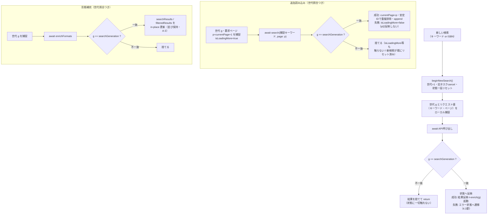

# R2 検索改修 設計メモ（検索タスクの状態遷移と世代管理）

作成日: 2026-07-07
ステータス: 実装前の設計メモ（R2着手時に本書の遷移図とコードを突き合わせ、ズレがあれば本書を更新すること）
関連文書:

- `docs/implementation-roadmap.md`（R2の項目定義。本書はロードマップ 第5章「R2の設計メモ作成」の成果物）
- `docs/bug-review-2026-07-06.md`（グループA・G-1/G-2/G-3/G-5 の症状定義）
- `docs/agent-implementation-guide.md`（スコープ規律・テスト・ローカライズ規約）
- `docs/bookshelf-search-spec.md`（本棚内検索。本書のスコープ外・第7章で相互作用のみ）

> **AI実装エージェントへ**: `docs/agent-implementation-guide.md` を先に読むこと。本書の (仮) 推奨は確定仕様として実装する。対象はロードマップR2のグループA（A-1〜A-8）＋G-1/G-2/G-3/G-5。本棚内検索（S）は別仕様書（`docs/bookshelf-search-spec.md`）が正であり、本書は状態遷移の設計のみを扱う。

---

## 0. 目的とスコープ

R2（v1.4.0）の検索改修は「バグを個別に潰す」のではなく、**検索タスクの状態遷移を1枚の設計に直してからA-1〜A-8を一括修正する**リリースである（バグレビューが8件を「まとめて対応」と指定した理由）。本書は:

1. 現状の4つの非同期フロー（キーワード検索・ISBN検索・追加読み込み・発行形態補完）が、どの状態変数をいつ書き換えるかを図示し、競合箇所を特定する
2. A-1〜A-8を遷移図上の位置に対応づける
3. 世代管理（`searchGeneration`）導入後のあるべき遷移を定義する
4. 安全な実装順序とG系の相乗り先、リグレッション観点を示す

**スコープ外**: 本棚内検索（第7章で相互作用のみ）、検索UIの見た目変更、プロバイダ追加。

---

## 1. 現状整理: 状態変数の一覧と責務

`Views/BookSearchView.swift` の検索関連 `@State`（登録・トースト系は除く）:

| 変数 | 責務 | 書き込むフロー |
|------|------|---------------|
| `searchText` | 検索キーワード。**ISBN検索が上書きする**（`searchByISBN` が検索バーにISBNを表示） | ユーザー入力・ISBN検索 |
| `searchResults` | APIから取得した生の結果（全ページ累積） | 全4フロー |
| `filteredResults` | フィルター・ソート適用後の表示用配列 | 全4フロー＋フィルター/ソート操作 |
| `totalResultCount` | APIが返す総ヒット件数 | キーワード・ISBN・追加読み込み |
| `isSearching` | 検索中インジケータ | キーワード・ISBN |
| `isSearchingByISBN` | 検索中表示の文言切替（バーコード用） | ISBNのみ |
| `hasSearched` | 空状態（0件表示）の判定 | キーワード・ISBN |
| `errorMessage` | エラー保持。**ISBN不明アラートは文字列一致で発火**（後述・第8章の指摘4） | キーワード・ISBN |
| `currentPage` | 現在のページ番号 | キーワード（=1）・追加読み込み（±1）。**ISBN検索はリセットしない** |
| `canLoadMore` | 「もっと読み込む」の表示・実行ガード | キーワード・追加読み込み。**ISBN検索はリセットしない** |
| `isLoadingMore` | 追加読み込みの再入ガード | 追加読み込みのみ。**新検索がリセットしない** |
| `isAutoLoadingForFilters` | フィルター用自動読み込みの表示・再入ガード | 追加読み込み（autoContinue）のみ。**新検索がリセットしない** |
| `selectedFormatFilter` / `showUnregisteredOnly` / `selectedSortOption` | クライアント側フィルター/ソート | ユーザー操作（`selectedFormatFilter` のみ新検索でリセット） |
| `registeredISBNs` | 登録済み判定キャッシュ | 検索開始時・登録時 |

サービス層は `BookSearchService`（設定でプロバイダ切替）→ `RakutenBooksService` / `GoogleBooksService` / `NaverBooksService`。ページングの実体は各サービスの `hasMorePages` 判定（楽天: `page < pageCount`、Google: `生件数 >= 20`、NAVER: 常に `false`）。

---

## 2. 現状の状態遷移と競合箇所

### 2.1 4フローの遷移（現状）

```mermaid
flowchart TB
    subgraph kw [キーワード検索 performSearch]
        K1["同期リセット:<br/>isSearching=true, hasSearched=true<br/>errorMessage=nil, currentPage=1<br/>canLoadMore=true, 結果クリア<br/>selectedFormatFilter=nil<br/>⚠️ isLoadingMore / isAutoLoadingForFilters /<br/>isSearchingByISBN は残る（A-7）"]
        K2["Task: search(text, page:1)"]
        K3["成功: searchResults=books<br/>canLoadMore=hasMorePages<br/>updateFilteredResults()<br/>→ enrich起動"]
        K4["失敗: errorMessage=…<br/>結果クリア<br/>⚠️ UIは『0件』表示（A-4）"]
        K1 --> K2 --> K3
        K2 --> K4
    end
    subgraph isbn [ISBN検索 searchByISBN]
        I1["同期リセット:<br/>isSearching=true, searchText=isbn<br/>結果クリア<br/>⚠️ currentPage / canLoadMore /<br/>isLoadingMore 等は残る（A-2）"]
        I2["Task: searchByISBN(isbn)"]
        I3["成功: searchResults=results<br/>1件なら自動で登録フロー<br/>→ enrich起動"]
        I1 --> I2 --> I3
    end
    subgraph more [追加読み込み loadMoreResults]
        M1["guard canLoadMore && !isLoadingMore<br/>isLoadingMore=true<br/>currentPage += 1"]
        M2["Task: search(searchText, page: currentPage)<br/>⚠️ searchText / currentPage は<br/>実行時に読む（開始時の値ではない）"]
        M3["成功: ISBN重複排除→append<br/>canLoadMore更新<br/>appendPageToFilteredResults()<br/>autoContinueなら再帰"]
        M4["失敗: currentPage -= 1<br/>isLoadingMore=false（canLoadMore維持）"]
        M1 --> M2 --> M3
        M2 --> M4
    end
    subgraph enrich [形態補完 enrichFormatsInBackground（楽天のみ）]
        E1["Task: enrichFormats(対象books)"]
        E2["searchResults を map で size 反映"]
        E3["formatフィルター中:<br/>⚠️ updateFilteredResults()＝全件再ソート（A-3）<br/>それ以外: filteredResults を in-place 更新"]
        E1 --> E2 --> E3
    end
```



### 2.2 競合が起きる箇所

どのフローにも**タスクのキャンセル・世代照合がない**。`@MainActor` 上で直列実行されるため「同時書き込み」は起きないが、**await をまたいだ古いタスクの続きが、新しい検索の状態を上書きする**。

| # | 競合シナリオ | 壊れる状態 |
|---|-------------|-----------|
| ① | キーワードAの検索中にキーワードBで再検索 → Aのタスクが遅れて完了 | `searchResults` / `filteredResults` / `canLoadMore` / `totalResultCount` がAの結果で上書き（**A-1の主症状**） |
| ② | 追加読み込みのタスクが await 中に新検索が `currentPage=1`・`searchText=B` にリセット → タスクは**実行時に**変数を読むため「Bのキーワード×古いページ操作の途中の値」でリクエストし、結果をBの結果に append | 別クエリのページ混入（A-1）。ページ番号も不整合 |
| ③ | キーワード検索直後にバーコードでISBN検索 → 直前検索の `currentPage`/`canLoadMore` が残り、ISBN結果の下に「もっと読み込む」が出る → タップすると `search(searchText=ISBN, page=旧ページ+1)` | 直前キーワードの続きにも、ISBNの続きにもならない無意味なリクエスト（**A-2**） |
| ④ | 自動読み込み（`isAutoLoadingForFilters=true`）の最中に新検索 → フラグをリセットしないため、新検索の結果画面で「絞り込み中…」表示が残り、`shouldShowLoadMore` も false のまま | 表示不整合・ボタン消失（**A-7**） |
| ⑤ | クエリAの形態補完タスクがクエリBの表示中に完了 → `searchResults`（Bの結果）への size 反映自体はISBN一致のみで実害が小さいが、formatフィルター中だと `updateFilteredResults()` がBの表示順を破壊。また補完リクエストが楽天レート制限（1req/秒）をBの検索と食い合う | 表示順（**A-3** と同じ経路）・429の誘発 |

> 補足: `RakutenBooksService.fetchDataWithRetry` は429/5xxを最大4回×0.8秒〜のバックオフで再試行するため、**古いタスクは数秒単位で生き残る**。「遅れて返る」は稀ではなく、レート制限時の通常挙動である。

---

## 3. バグA-1〜A-8の遷移上の位置

| # | 遷移図上の位置 | 現状コードの該当箇所 |
|---|---------------|---------------------|
| A-1 | 2.2節の①②⑤（全フローに世代照合がない） | `performSearch` / `loadMoreResults` / `searchByISBN` / `enrichFormatsInBackground` の各 `Task` |
| A-2 | ISBN検索の同期リセット（I1）に `currentPage` / `canLoadMore` / `isLoadingMore` / `isAutoLoadingForFilters` が欠落 | `searchByISBN` 冒頭 |
| A-3 | 形態補完の完了分岐（E3）: `selectedFormatFilter != nil` のとき `updateFilteredResults()` が全件再ソートし、「もっと読み込む」で末尾に積んだページ順序を破壊（ソートが新しい順/古い順のとき顕在化） | `enrichFormatsInBackground` 末尾の分岐 |
| A-4 | キーワード検索の失敗遷移（K4）: `errorMessage` を保持するが、空状態UIは `searchResults.isEmpty && hasSearched` しか見ないため「見つかりませんでした」と表示。再試行導線なし | `performSearch` の catch＋body の空状態分岐 |
| A-5 | 楽天のローカルキーワード絞り込みで1ページ全滅しても `hasMorePages`（`page < pageCount`）は true → 空のまま「もっと読み込む」が出続ける（自動読み込みは空5ページで停止するが、手動ボタンには上限がない） | `RakutenBooksService.performRequest` の判定＋View側の表示条件 |
| A-6 | 追加読み込みの重複排除（M3）が `searchResults` に対してISBNのみで、ISBNなし書籍は常に素通し。失敗（`currentPage -= 1`）→再試行で同一ページを再取得すると `searchResults` に二重追加され、以後の `updateFilteredResults()`（全件再構築）で表示にも重複が現れる | `loadMoreResults` の `existingISBNs` フィルタ |
| A-7 | キーワード検索の同期リセット（K1）に `isLoadingMore` / `isAutoLoadingForFilters` が欠落（A-1と同根＝リセットの一元化で解消） | `performSearch` 冒頭 |
| A-8 | Googleの `hasMorePages = 生件数 >= 20` が `totalItems` を照合せず、総件数が20の倍数ちょうどのとき空ページを1回余分に取得 | `GoogleBooksService.performRequest` |

---

## 4. あるべき状態遷移（世代管理導入後）

### 4.1 設計方針 (仮)

1. **世代カウンター `searchGeneration: Int`** を導入する。「新しい検索の開始」（キーワード検索・ISBN検索）でインクリメントし、実行中の検索タスクをキャンセルする
2. **全ての非同期フローは開始時に世代を捕捉**し、(a) リクエストに使う値（キーワード・ページ番号）は**開始時にローカルへ捕捉**（実行時に `@State` を読み直さない）、(b) **await 後の状態書き込み前に世代を照合**し、不一致なら結果を捨てて即 return する
3. **状態リセットを1つのヘルパーに一元化**する（例: `beginNewSearch()`）。キーワード検索・ISBN検索はこのヘルパーを通ることで、A-2・A-7（リセット漏れ）が構造的に再発しなくなる
4. タスクハンドルは `@State private var searchTask: Task<Void, Never>?` 等で保持し、新検索開始時に `cancel()` する。キャンセルは即時性のための補助であり、**正しさの保証は世代照合が担う**（キャンセルが間に合わなくても世代不一致で捨てられる）

```
リセットの一元化（beginNewSearch が毎回行うこと）:
  searchGeneration += 1
  searchTask?.cancel() / loadMoreTask?.cancel() / enrichTask?.cancel()
  isSearching=true, hasSearched=true, errorMessage=nil（エラー状態も新設のenumでクリア・4.3節）
  currentPage=1, canLoadMore=true（※ISBN検索は canLoadMore=false・4.4節）
  isLoadingMore=false, isAutoLoadingForFilters=false, isSearchingByISBN=false
  searchResults=[], filteredResults=[], totalResultCount=nil
  selectedFormatFilter=nil（現状踏襲。showUnregisteredOnly / selectedSortOption は意図的に維持＝現状挙動）
  updateRegisteredISBNsCache()
```

### 4.2 導入後の遷移図



遷移のポイント:

- **`currentPage` は成功時にのみ確定する**（現状の「先にインクリメント→失敗で戻す」をやめ、要求ページ `p` をローカルに持ち、成功したら `currentPage = p`）。失敗時のロールバック処理が消え、②のような中間状態が存在しなくなる
- **世代不一致時は `isLoadingMore` 等のフラグにも触らない**。フラグは新検索の `beginNewSearch()` が既にリセットしており、古いタスクが触ると逆に壊す
- `Task.cancel()` により `URLSession.data(from:)` は `CancellationError` を投げる。**catch では最初に世代照合（またはキャンセル判定）を行い、旧世代のエラーをエラーUIに反映しない**（リグレッション観点・第8章）
- 楽天の `fetchDataWithRetry` のバックオフ `Task.sleep` はキャンセルで即座に抜ける（`try? await Task.sleep` のため次のループで `URLSession` がキャンセルを投げる）。世代照合が最終防壁なので、リトライループ自体への世代注入は不要 (仮)

### 4.3 エラー状態の設計（A-4）

現状の `errorMessage: String?`＋文字列一致アラートを、検索結果の状態を表す enum に置き換える (仮):

```
検索画面の結果状態（概念）:
  idle（未検索） / searching / loaded（0件含む） / failed（エラー＋再試行可能）
```

- `failed` のときの空状態UIは「見つかりませんでした」ではなく「**検索できませんでした**（ネットワーク・混雑等）＋再試行ボタン」を表示。再試行は同一キーワードで `performSearch()` を再実行（世代が進むので安全）
- 追加読み込みの失敗は現状どおり「ボタンで再試行可能」を維持し、全画面エラーにはしない（現状の設計意図を踏襲）
- ISBN不明（0件）は**エラーではなく loaded(0件) の一種**として、現行の「手動登録に誘導するアラート」を維持。ただし発火条件を `errorMessage == "ISBN検索で本が見つかりませんでした"`（ハードコード文字列比較）から専用の状態/フラグに置き換える（第8章の指摘4）
- 新規ローカライズキー（エラー文言・再試行ボタン）は5言語同時追加（実装ガイド 4.2節）

### 4.4 ISBN検索の確定仕様（A-2）

- `beginNewSearch()` を通したうえで、ISBN検索は**ページングを持たない**（楽天のisbnjan検索・Google/NAVERのISBNクエリとも結果は実質1ページ）。`canLoadMore = false` を明示し、「もっと読み込む」を出さない
- `searchText = isbn` の上書き（検索バーへの表示）は現状維持。ISBN検索後にユーザーがそのまま Return した場合は「ISBN文字列のキーワード検索」として新世代で走る（現状と同じ挙動・仕様として明記）

### 4.5 ページング判定の補正（A-5・A-8）

> **実装時の確定事項（2026-07-08・ステップ6）**: 下記の (仮) 案（連続空ページ上限）ではなく、**A-5・A-8を統一した「累積生件数 vs 総件数」判定**を採用した（オーナー承認）。サービス層は事実（**生件数 `rawItemCount`＝重複除去・絞り込み前の取得件数**・総件数・構造的なページ有無 `hasMorePages`）のみ返し、継続可否は View 側の純関数 `SearchPagination.canLoadMore(fetchedRawCount:totalCount:providerHasMorePages:)` で決める。ルールは「累積生件数が総件数に達したら停止・未達なら継続（薄いページでも止めない）・総件数不明時とNAVER等の構造制約は `providerHasMorePages` にフォールバック」。これで A-5（薄いページで止めすぎ）と総件数到達後の空ページ余分取得（A-8）を1つの規則で解消する。境界条件（薄いページ・末尾・総件数ちょうど・超過・不明・NAVER）はユニットテストで担保。**終端の追加文言・連続空ページカウンターは導入しない**（総件数判定で不要になったため）。

- **A-8（Google）**: サービスの `hasMorePages`（`生件数 >= pageSize`）は現状維持（構造的なページ有無の事実＋総件数nil時のフォールバック）。総件数照合による停止は上記のView側判定が担う。`GoogleBooksService` は生件数 `rawItemCount` を `BookSearchPage` に載せるのみ
- **A-5（楽天）**: `page < pageCount` の生ページ判定は**意図的な設計**（絞り込みで件数が減っても途中でページングを止めないため・コードコメントに明記あり）なので、判定自体は変えない。補正はView側で行う（上記の確定事項）
  - ~~(仮) 手動の「もっと読み込む」にも連続空ページ上限を導入する案~~ → 採用せず（累積生件数 vs 総件数判定に置き換え）

### 4.6 重複排除の統一（A-6）

`RakutenBook` には**既に安定ID**（`id`: ISBNがあればISBN、なければ `title|author|salesDate`）が実装済みで、`appendPageToFilteredResults` はこれで重複排除している。一方 `loadMoreResults` の `searchResults` 側はISBNのみ。**両者を `id` ベースに統一する**だけでよく、ロードマップの「タイトル+著者+発売日ハッシュ」は新規実装不要（既存 `id` の再利用。第8章の指摘2）。

---

## 5. 実装順序の提案

依存関係: リセット一元化（A-2/A-7）は世代管理（A-1）の土台。サービス層（A-5/A-8/G系）はViewと独立。A-3/A-4/A-6はA-1の枠組みの上に載せると差分が小さい。

| 順 | 内容 | 対応バグ | 理由 |
|----|------|---------|------|
| 1 | 状態リセットの一元化（`beginNewSearch()` ヘルパー抽出。まだ世代なし） | A-2・A-7 | 同期処理のみで完結しリスク最小。既存の2箇所のリセットの和集合を取るだけで挙動差分が明確。ここでISBN検索の `canLoadMore=false`（4.4節）も入れる |
| 2 | 世代管理＋タスク保持・キャンセル（4.1〜4.2節） | A-1 | 本丸。1のヘルパーが世代インクリメントの単一の場所になる。`loadMoreResults` のページ番号ローカル捕捉もここで |
| 3 | エラー状態enum＋エラーUI（4.3節・ローカライズ追加） | A-4 | 2の「旧世代のエラーを表示しない」規則と一体で設計すべきため直後に |
| 4 | 重複排除の `id` 統一 | A-6 | 2でローカル捕捉に変えた `loadMoreResults` への小さな追加差分 |
| 5 | 形態補完の in-place 更新化（フィルター中も全件再ソートしない） | A-3 | 2で enrich にも世代照合が入った後、完了分岐だけを差し替え |
| 6 | サービス層のページング判定（Google→楽天の順） | A-8・A-5 | Viewと独立。A-8は純粋な判定修正、A-5はView側の空ページ上限（4.5節）とセット |
| 7 | G系の相乗り（第6章） | G-1/G-2/G-3/G-5 | 各ステップのファイルを触るついでに回収 |

- 各ステップ後に `xcodebuild test` を通す（実装ガイド 4.3節）。**ステップ2完了時点が最大のリグレッションポイント**なので、第8章のシナリオを手動確認してから3以降に進む
- ユニットテスト: 判定ロジックを純関数として切り出してテストする（実装ガイド 4.3節の方針）。最低限: (a) 重複排除（安定IDのマージ）、(b) Googleの `hasMorePages` 判定（総件数20の倍数ケース）、(c) `SalesDateParser` のタイムゾーン（G-2）、(d) Googleの `formattedSalesDate`（G-1のタイムスタンプ形式）。世代照合そのものはViewの `@State` に密結合のためUIテストではなく、「照合→反映」部分をヘルパー関数に切り出せる範囲で切り出す (仮)

## 6. G-1/G-2/G-3/G-5 の相乗り先

| # | 内容 | 相乗り先（第5章の順） |
|---|------|---------------------|
| G-1 | Google `publishedDate` のタイムスタンプ形式（`2009-05-15T00:00:00Z`）で `formattedSalesDate` が壊れる（`-` split で3要素目が `15T00:00:00Z` になる）→ `T` 以降を切り落としてから分解 | ステップ6（`GoogleBooksService.swift` を触るA-8と同時） |
| G-2 | `SalesDateParser.year` が `Calendar.current` を使い、JSTより西の端末で1年ずれる → パーサのフォーマッタと同じ `Asia/Tokyo` 固定のCalendarに変更 | ステップ6（サービス層バッチ。`RakutenBooksModels.swift`） |
| G-3 | 検索結果件数の `L10n.format` に `Int` を渡している（`book.search.result_count`）→ `Int64` キャスト＋`%lld` に統一 | ステップ3（結果件数まわりのUIを触るA-4と同時） |
| G-5 | `SearchDatabase.displayProviderName` が固定文字列（「楽天ブックス」等）→ ローカライズキー化（5言語） | ステップ3（A-4でローカライズキーを追加するコミットに同乗） |

---

## 7. 本棚内検索（S）との相互作用

本棚内検索は `BookshelfView` 内の**所有本のローカル絞り込み**であり、本書の対象（`BookSearchView` のAPI検索）とは画面・状態・データ源のすべてが分離している。仕様は `docs/bookshelf-search-spec.md` が正。

- **状態の共有はゼロ**: `searchGeneration` 等の新設状態は `BookSearchView` プライベートに閉じ、本棚内検索からは参照しない（させない）
- 唯一の接点は「本棚内検索で見つからない→登録検索へ」という動線が将来できた場合だが、これは仕様書のスコープ判断に従う。R2時点では動線なし
- リリース分割（ロードマップR2注記: グループAが重い場合はSを単独リリースに切り出し可）に影響する依存もない

---

## 8. リスクとリグレッション観点

### 8.1 壊してはいけない既存挙動

| 挙動 | 確認方法 |
|------|---------|
| 楽天のローカルキーワード絞り込み（正規化contains）と、生ページでのページング続行 | 絞り込みで薄くなるキーワード（例: 著者名の一部）で最終ページまで読み進められること |
| 429/5xxのバックオフ再試行（`fetchDataWithRetry`）と、追加読み込み失敗→ボタン再試行 | 機内モードON→OFFで再試行が効くこと。**キャンセル起因の `CancellationError` がエラーUIに出ない**こと（4.2節） |
| フィルター自動読み込みの上限（空5ページ・最大10ページ）と再帰の停止 | 「登録済みを除外」＋大量登録済みキーワードで無限ループしないこと |
| ソート仕様「関連度順=API順・ページは末尾に追加」（`SortOption` のコメントに明記） | A-3修正後も「もっと読み込む」の追加分が末尾に並ぶこと（新しい順/古い順でページ内のみソート） |
| ISBN検索1件時の自動登録フロー・価格手入力アラート（B-3で修正済みの検証を含む） | バーコード読取→1件→登録/手入力の一連 |
| NAVERの page>1 空返し・「もっと読み込む」非表示（既知の制限） | NAVER設定で検索し、ボタンが出ないこと |
| `showUnregisteredOnly` / `selectedSortOption` が新検索後も維持される現状挙動 | リセット一元化（4.1節）で誤ってリセットしないこと |

### 8.2 重点シナリオ（ロードマップR2の完了条件に対応）

1. かな入力途中の高速連続検索（変換確定ごとにReturn）で結果混入・件数表示の食い違いがないこと（A-1）
2. キーワード検索→即バーコード検索→「もっと読み込む」が出ない・件数が正しいこと（A-2）
3. 機内モードでキーワード検索→エラーUI＋再試行→復帰後に再試行成功（A-4）
4. 楽天/Google/NAVERの3プロバイダで最終ページまでのページング（A-5・A-8。Googleは総件数が20の倍数の検索語を意図的に用意）
5. 追加読み込み中に検索データベース設定は変えられない前提だが、`SearchDatabase.current` は**リクエストごとに読まれる**（`BookSearchService`）ため、設定画面から戻って再検索した場合に旧プロバイダの結果が残らないこと（世代管理で担保）

### 8.3 既存コードとの食い違い・実装時の注意（レビューで発見した指摘）

1. **空状態の分岐に到達不能なコードがある**: `BookSearchView.body` の `else if hasSearched && searchResults.isEmpty`（2つ目の0件分岐・647行付近）は、1つ目の分岐 `searchResults.isEmpty && hasSearched`（446行付近）と条件が同値で**永遠に実行されない**。A-4でエラーUIを実装する際は1つ目の分岐を編集し、死んでいる2つ目の分岐はA-4のコミットで削除する（放置すると二重メンテの罠になる）
2. **A-6の「安定IDハッシュ」は新規実装不要**: バグレビュー/ロードマップは「タイトル+著者+発売日ハッシュでも効かせる」と書くが、`RakutenBook.id` として**同等の安定IDが既に実装済み**（ISBNなければ `title|author|salesDate`）であり、`appendPageToFilteredResults` では使用中。修正は `loadMoreResults` の `searchResults` 側の重複排除をこの `id` に揃えるだけ（4.6節）
3. **A-5の場所の解釈**: バグレビューは場所を `RakutenBooksService.performRequest` とするが、当該の生ページ判定はコメント付きの意図的設計（途中の薄いページで止めないため）。判定を「絞り込み後件数」に変えると別のリグレッション（正当な続行の停止）を生む。→ **確定（2026-07-08）**: サービス層の生ページ判定は変えず、継続可否は View 側の純関数で「累積生件数 vs 総件数」で判定する方針を採用（4.5節の確定事項を参照）。責務は「サービス＝事実、View＝継続判断」に分離した
4. **ISBN不明アラートの発火条件が日本語文字列のハードコード比較**: `.alert(isPresented: .constant(errorMessage == "ISBN検索で本が見つかりませんでした"))`。ローカライズもされておらず、エラー状態enum化（4.3節）で必ず置き換える
5. **`isSearchingByISBN` がキーワード検索でリセットされない**: ISBN検索中にキーワード検索を開始すると、検索中表示が「バーコード検索中」のまま出得る。バグ一覧には無い小物だが、リセット一元化（ステップ1）の和集合に含めて同時解消する
