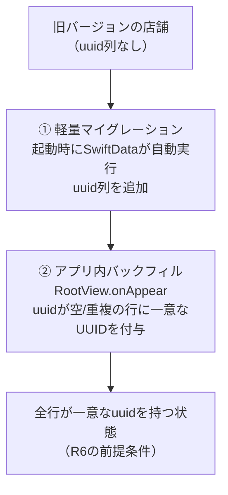

# R3 UUID導入 設計メモ（移行Phase 0・クラウド接続の土台）

作成日: 2026-07-09
更新日: 2026-07-09（データ破壊ゼロの追加要件＝4.5節を追記／実装完了・ステップ1〜3の実装状況を第7章に反映）
ステータス: 実装完了（v1.5.0・2026-07-09）。ステップ1〜3を実装・実機確認・コミット済み。残る人間タスクは 4.5節③ の TestFlight 実データ検証（リリース前）
関連文書:

- `docs/implementation-roadmap.md`（R3の項目定義。本書はその設計メモ）
- `docs/cloud-migration-architecture.md`（移行Phase 0の定義＝5.3節・Firestoreスキーマ＝第3章。本書の上位文書）
- `docs/agent-implementation-guide.md`（スコープ規律・テスト・Git規約）
- `docs/r2-search-refactor-notes.md`（形式の参照元。R3とは独立）

> **AI実装エージェントへ**: `docs/agent-implementation-guide.md` を先に読むこと。本書の (仮) 推奨は確定仕様として実装する。対象はロードマップR3の2項目（UUID追加・`ReadingList` 並び順刷新）のみ。**リポジトリ抽象化（R4）・認証・Firestore接続（R6）には一切手を出さない**。R3は「見た目・挙動が一切変わらない内部改修リリース」である。

---

## 0. この設計メモの前提（補完した仮定の一覧）

ロードマップ・移行設計書に未定義の論点を、以下の推奨案 **(仮)** として補完した。実装前に方針が変わった場合は該当章を更新すること。

| # | 論点 | 補完した前提 (仮) | 根拠 |
|---|------|------------------|------|
| 1 | `Subscription` へのUUID付与 | **付与しない**。R6で廃止されるモデル（移行設計書 前提15）であり、ロードマップR3の対象4モデルにも含まれない | ロードマップR3・移行設計書 付録A |
| 2 | `MonthlyMemo` のUUIDの役割 | 一貫性のため付与するが、**FirestoreのドキュメントIDには使わない**（docIDは `yyyy-MM`・移行設計書 3.3節）。R6での突合キーは (year, month) | 移行設計書 3.3節 |
| 3 | バックフィルの実行場所 | `RootView.onAppear` の `CurrencyMigration.migrateIfNeeded` と同じフックに、**その直前**として追加（UUIDは他のあらゆる処理の前提になるため先頭） | 既存パターン踏襲（`BookBankApp.swift` 166行） |
| 4 | uuidフィールドの形 | 移行設計書 5.3節どおり `var uuid: String = UUID().uuidString`（非オプショナル＋デフォルト式）。ただし**既存行の一意性はデフォルト式に頼らず、バックフィルで保証する**（4.2節の重複デフォルト問題） | 移行設計書 5.3節＋本書 4.2節 |
| 5 | 並び順の新フィールド | `ReadingList` に `var bookIds: [String] = []`（UUID配列）を新設。ロードマップの「UUID配列 `bookIds` へ移行」の名前をそのまま採用 | ロードマップR3 |
| 6 | 旧 `bookOrderData` の物理削除 | **R3では削除しない**（読み取り専用のレガシーとして残す）。変換失敗時のフォールバック・ロールバック余地を確保し、物理削除はSwiftData自体を削除するタイミング（R6の数バージョン後・移行設計書 5.5節）に委ねる。ロードマップの「廃止」は「読み書きの停止」として充足する | 本書 5.3節 |
| 7 | `ShareService` の共有ID | 現状の `persistentModelID` 文字列を**R3では変えない**。uuidに切り替えると同一リストの共有URLが変わる（Redisのマッピングキーが変わる）ため、R6のスコープで判断 | スコープ規律（実装ガイド 第3章） |
| 8 | マイグレーション方式 | `VersionedSchema` / `SchemaMigrationPlan` は導入せず、**軽量マイグレーション（プロパティ追加＋デフォルト値）＋アプリ内バックフィル**の2段構え。現行コードにマイグレーション計画が存在せず、追加のみの変更はカスタム計画を要しない | 本書 4.1節 |
| 9 | 移行前バックアップの保持期間 | 整合性検証（4.5節②）の通過後に**即削除** (仮)。検証通過＝移行成功が確認済みのため保全対象がなく、`.externalStorage` の画像で数百MBになり得るディスク二重消費を長期化させない | 本書 4.5節① |
| 10 | バックアップ不能時（空き容量不足等）の挙動 | バックアップを**スキップして通常起動** (仮)。バックアップは追加の防御層であり、それ自体が起動不能の原因になってはならない（スキップはOSLogに記録する） | 本書 4.5節① |

---

## 1. 目的とスコープ

R3（v1.5.0）は移行Phase 0。クラウド移行（R6）で全エンティティがFirestoreのドキュメントになるための**安定ID（UUID）を、既存ユーザーのデータを壊さずに行き渡らせる**リリースである。

1. 全対象モデルに `uuid` フィールドを追加し、新規作成分は `init` で、既存データはバックフィルで一意なUUIDを付与する
2. `ReadingList` の並び順管理を「タイトル+作成日時ハッシュ」（タイトル変更で壊れる・移行設計書 1.2節の課題2）から**UUID配列**へ刷新する
3. このUUIDがそのままFirestoreのドキュメントIDになる（移行設計書 3.1節）ため、R6の移行ウィザードの**冪等リトライ（同じUUIDへの上書き）**が成立する

**最優先の設計制約**: R3は既存ユーザーの全データに触れる初のスキーマ変更であり、**「絶対にデータを壊さない」ことを他のすべての要件（起動速度・実装の簡潔さ）より優先する**。この制約を実現する追加要件（移行前バックアップ・整合性検証・実機検証）を 4.5節 に定める。

**スコープ外**: リポジトリ抽象化（R4）・Firestore/認証（R6）・`Subscription` の廃止（R6）・共有IDのuuid化（前提7）・UIの変更全般。**R3で追加するuuidは、R3の時点ではどのViewからも参照されない「眠った土台」である**（`persistentModelID` ベースの既存UIはそのまま）。

---

## 2. 現状整理: モデルと識別子の棚卸し

### 2.1 SwiftDataモデル（5つ・`BookBankApp.swift` のスキーマ定義）

| モデル | 現在の識別子 | UUID | 備考 |
|--------|-------------|------|------|
| `Passbook` | `persistentModelID`（端末内のみ有効） | **なし** | Viewの比較・`.id()` に多用（2.2節） |
| `UserBook` | `persistentModelID` | **なし** | `coverImageData` は `.externalStorage` |
| `ReadingList` | `persistentModelID` | **なし** | 並び順は `bookOrderData`（下記） |
| `MonthlyMemo` | (year, month) の自然キー | **なし** | `MonthlyMemoRepository` が複合検索 |
| `Subscription` | - | 対象外 | 実質未使用・R6で廃止（前提1） |

### 2.2 既存の識別子とuuidの関係（混同しないこと）

| 既存の識別子 | 用途 | R3での扱い |
|-------------|------|-----------|
| `persistentModelID` | View層の同一性判定・`.id()`・選択状態（`BookshelfView`・`MainTabView`・`EditBookView` 等 十数箇所） | **変更しない**。端末内のUI用途には引き続きこれを使う。uuidへの置き換えはR4（DTO化）以降 |
| `ReadingList.stableID(for:)`＝`"\(title)_\(createdAt.timeIntervalSince1970)"` | `bookOrderData` の並び順ID | **役割を終える**（第5章）。タイトル変更で並びが壊れる現行バグの根本 |
| `RakutenBook.id`（ISBN or `title\|author\|salesDate`） | **検索結果**の重複排除（R2・`SearchResultDeduplicator`） | 無関係。検索APIの一時オブジェクトのIDであり、保存データのuuidとは別世界。触らない |
| `ShareService` の `readingListId`（`persistentModelID` 文字列） | 共有URLのRedisマッピングキー | R3では維持（前提7） |
| `MonthlyMemo` の (year, month) | 取得・保存の自然キー | 維持。uuidは付与するがキーには使わない（前提2） |

### 2.3 既存のマイグレーション基盤

- **スキーマ**: `ModelContainer(for: schema)` を素で生成（`VersionedSchema` なし）。過去のスキーマ変更（`currencyCode` 追加等）はすべて軽量マイグレーションで通してきた実績がある
- **データバックフィル**: `CurrencyMigration.migrateIfNeeded`（`RakutenBooksModels.swift` 491行）が既存パターン。UserDefaultsフラグ＋全件fetch＋書き換え＋save。**ただし save 失敗でもフラグが立つ**（try? の握りつぶし）ため、UUIDバックフィルではこの点を改善する（4.3節）

---

## 3. 対象エンティティとUUID設計

### 3.1 追加するフィールド（4モデル共通）

```swift
// 各モデルに追加（移行設計書 5.3節の形そのまま）
var uuid: String = UUID().uuidString
```

- `init` の末尾で `self.uuid = UUID().uuidString` を明示的に代入する（デフォルト式に頼らない。4.2節の理由）
- 型は `String`（`UUID` 型ではない）。FirestoreのドキュメントIDが文字列であり、突合・シリアライズで変換が不要になるため（移行設計書 3.1節の「クライアント生成のUUID」）
- インデックスや `@Attribute(.unique)` は**付けない** (仮)。`.unique` はSwiftDataのCloudKit互換制約や軽量マイグレーションの失敗要因になり得るうえ、一意性はバックフィル＋UUID v4の衝突確率（実質ゼロ）で担保できる

### 3.2 各モデルのuuidがR6で果たす役割（先取りの確認）

| モデル | R6でのFirestoreドキュメントID | uuidの使われ方 |
|--------|------------------------------|---------------|
| `Passbook` | `users/{uid}/passbooks/{passbookId}` | `passbookId = uuid` |
| `UserBook` | `users/{uid}/books/{bookId}` | `bookId = uuid`。表紙画像のStorageパス `users/{uid}/covers/{bookId}.jpg` にも使用 |
| `ReadingList` | `users/{uid}/readingLists/{listId}` | `listId = uuid`。`bookIds` 配列の中身は `UserBook.uuid` |
| `MonthlyMemo` | `users/{uid}/monthlyMemos/{yyyy-MM}` | docIDには**使わない**（前提2）。フィールドとして持つだけ |

`UserBook.passbook` のリレーションはFirestoreでは `passbookId`（uuid参照）になるが、その変換はR6の移行ウィザードの仕事。R3ではリレーションを触らない。

---

## 4. マイグレーション設計（スキーマ変更＋バックフィル）

### 4.1 2段構えの理由



- **① 軽量マイグレーション**: プロパティ追加＋デフォルト値は `VersionedSchema` 不要の軽量マイグレーションで通る（`currencyCode` 追加の実績と同型）。失敗すると `BookBankApp.init` の `fatalError` に到達するため、TestFlightでの実機アップデート検証が必須（第8章）
- **② バックフィル**: ①だけでは既存行のuuidの一意性が保証できない（4.2節）。`CurrencyMigration` と同じフックで一度だけ走らせる

### 4.2 最重要の技術的注意: デフォルト式は既存行の一意性を保証しない

`var uuid: String = UUID().uuidString` のデフォルト式は、**マイグレーション時に既存行へ一意な値を行ごとに評価してくれる保証がない**（Core Data由来の軽量マイグレーションはスキーマに静的なデフォルト値を刻む挙動があり、全既存行が同一文字列になる・または空文字になる既知の落とし穴がある）。したがって:

- 既存行のuuidは**デフォルト式の結果を信用せず、バックフィルで必ず検証・付与し直す**
- バックフィルの判定は「`uuid` が空」だけでなく「**重複している**」も対象にする（全行同一値で埋まったケースの救済）
- 新規作成分は `init` の明示代入（3.1節）で一意になるため対象外

### 4.3 バックフィルの仕様（`CurrencyMigration` パターンの改良版）

```
UUIDBackfillMigration.migrateIfNeeded(context:) の擬似コード:
  guard フラグ "didBackfillUUIDsV1" が未設定 else return
  4モデルを順に処理（Passbook → UserBook → ReadingList → MonthlyMemo）:
    全件 fetch
    seen = Set<String>()
    各行について:
      if uuid が空 || seen に既出 → uuid = UUID().uuidString（新規採番）
      seen.insert(uuid)
  変更があれば context.save()
  save 成功＋整合性検証（4.5節②の(a)(b)）通過のときだけフラグを立てる（失敗時は rollback しフラグを立てない＝次回起動で再試行）
```

- **`CurrencyMigration` からの改良点**: save失敗時にフラグを立てない（現行実装は `try? save` 後に無条件でフラグを立てており、失敗が永久に放置される）。uuidはR6の前提条件なので、失敗は次回起動時のリトライに回す。失敗は `MonthlyMemoRepository.save` と同様に OSLog へ記録する
- **冪等**: 何度走っても「空・重複だけ採番」なので安全。フラグは高速化のためのショートカットに過ぎない
- **性能**: 数千冊規模でも文字列比較＋Set構築のO(n)で、初回起動時の一回だけ。`coverImageData` は `.externalStorage` なのでfetchしても画像バイナリは遅延読み込みされる（uuidの読み書きでは実体化しない）
- 一意性チェックのコア（「既存uuid集合と行リストを受け取り、採番が必要な行を返す」判定）は**純関数に切り出してユニットテスト**する（実装ガイド 4.3節）

### 4.4 UUID生成のタイミングと衝突

| タイミング | 生成方法 | 衝突リスク |
|-----------|---------|-----------|
| 新規レコード作成 | `init` 内で `UUID().uuidString` | UUID v4の衝突確率は実質ゼロ |
| 既存レコード（アップデート時） | バックフィル（4.3節） | 同上＋重複検出で二重に防護 |
| バックアップ復元・機種変更 | ストアごと複製されるためuuidも保持される | 同一ユーザーのデータ複製であり問題なし |
| 複数端末 | R3時点では端末間同期が存在しないため衝突の機会なし。R6でも2台目のローカルデータはマージしない方針（移行設計書 5.4節）のため、端末間のuuid衝突は設計上発生しない | - |

### 4.5 データ破壊を絶対に回避するための追加要件（最優先の設計制約）

R3は既存ユーザーの全データに触れる初のスキーマ変更であるため、以下の3層の防御をマイグレーション設計に組み込む。優先順位は**データ保全 > 起動速度 > 実装の簡潔さ**。

#### ① 移行前バックアップと復元経路

R3で最も危険な瞬間は、バックフィル（加算的・低リスク）ではなく、**`BookBankApp.init` の `ModelContainer` 生成時にSwiftDataが自動実行する軽量スキーママイグレーション**である（失敗すると現行コードは `fatalError` で起動不能・データ復旧手段なし）。したがってバックアップは**バックフィル前ではなく `ModelContainer` 生成前**に取る。

```
BookBankApp.init の擬似コード（変更後）:
  if R3移行が未完了（完了フラグ未設定）&& バックアップが未存在 {
      空き容量チェック → 不足ならスキップしてOSLogに記録（前提10）
      ストアファイル一式をバックアップフォルダへコピー
  }
  do { modelContainer = try ModelContainer(...) }
  catch {
      if バックアップが存在 && 未リトライ {
          バックアップからストアを復元して1回だけ再試行
      }
      それでも失敗 → fatalError（現行同様。ただしOSLogに詳細を残す）
  }
```

- **コピー対象**: `default.store`・`-shm`・`-wal` のストアファイル一式＋ `.externalStorage`（`coverImageData`）の外部データフォルダ。実パス（Application Support配下）は実装時に確認する
- **コピーのタイミングが整合性を保証する**: `ModelContainer` 生成前＝ストアが開かれていない時点でコピーするため、WALを含むファイル一式の複製で整合したスナップショットになる（チェックポイント処理は不要）
- **バックアップは上書きしない**: 2回目以降の起動（1回目が移行途中で中断した場合など）で既存バックアップを上書きすると「移行前の無傷のスナップショット」が失われるため、存在チェックで保護する
- **復元の位置づけ（正確に理解すること）**: 復元は**決定的なマイグレーションバグ自体を直せない**（復元して同じコードで開けば同じ失敗をする）。復元の価値は「**修正版がリリースされるまでユーザーデータを無傷で保全すること**」にある。リトライは一時的要因（I/Oエラー・容量逼迫等）の救済であり、1回で十分
- **削除**: 整合性検証（②）の通過後に即削除する（前提9）
- **コスト考慮**: コピーは移行対象ユーザーの初回起動時に一度だけ発生する。`coverImageData` の外部データは蔵書によって数百MBになり得るため、**空き容量チェック（不足時はスキップ・前提10）とコピー時間（初回起動遅延）**を考慮する。既存のスプラッシュ表示内に収まるかをTestFlight（③）で確認し、収まらない場合は進捗表示の追加を検討する

#### ② マイグレーション後の整合性検証

バックフィル・並び順変換の完了フラグは、save成功だけでなく**検証の通過を条件に立てる**（検証失敗時はフラグを立てず、次回起動で全体をリトライ）:

- **(a) 件数一致**: 4モデルそれぞれの件数がマイグレーション前後で一致すること（本マイグレーションはレコードを増減させない）
- **(b) uuid充足**: 全行の `uuid` が非空かつモデル内で一意であること
- **(c) 並び順一致**: 各 `ReadingList` について、変換前（旧ロジック: `bookOrderData` のstableID照合）と変換後（新ロジック: `bookIds` のuuid照合）の `orderedBooks` の結果が一致すること
- 検証ロジックは**純関数として切り出しユニットテスト対象にする**（第7章のテスト最低ラインに含む）。検証失敗はOSLogに詳細（どのモデル・どの条件で失敗したか）を記録する

#### ③ リリース前のTestFlight実データ検証（人間タスク）

実装ガイド第5章の形式で、R3のリリース前チェックリストに以下を**必須の人間タスク**として置く:

| タスク | 合格条件 |
|--------|---------|
| **数百冊＋手動表紙画像ありの実機**で旧バージョン→R3版へTestFlightアップデート（必須） | 起動成功・全冊表示・表紙画像表示・口座/リスト/メモの内容が更新前と完全一致 |
| 読了リストの並び順確認（タイトル変更を挟む） | 並び順が更新前と一致し、タイトル変更後も並びが崩れない（旧バグ解消の確認） |
| 初回起動時間の体感確認（バックアップコピー＋バックフィル込み） | スプラッシュ表示内に収まる（収まらなければ進捗表示を検討） |
| 少量データ・新規ユーザーの実機/シミュレータ | 通常起動に劣化がない |

AIエージェントはシミュレータでの検証までを行い、実機TestFlight検証は「**人間の確認待ち**」として明示的に報告する（実装ガイド 4.3節・第5章）。

---

## 5. `ReadingList` 並び順のUUID化

### 5.1 現状の構造と問題

- `bookOrderData: String?` に `stableID`（`"\(title)_\(createdAt.timeIntervalSince1970)"`）のJSON配列を保存
- `orderedBooks` が `bookOrderData` を復元し、記載のない本は末尾に追記。`saveBookOrder` が並び替え時に書き込む
- **タイトルを変更するとstableIDが変わり、その本の並び順が末尾に落ちる**（移行設計書 1.2節の課題2）。Firestoreの `bookIds` 設計（3.3節）はこの刷新を前提にしている

### 5.2 新構造 (仮・前提5)

```swift
// ReadingList に追加
var bookIds: [String] = []   // UserBook.uuid の配列（並び順どおり）
```

- `orderedBooks` / `saveBookOrder` の**公開インターフェースは変えず**、内部の照合キーを `stableID` → `UserBook.uuid` に差し替える（呼び出し側 `ReadingListDetailView` / `BookSelectorView` / `ShareService` / `ReadingListView` は無変更）
- 「記載のない本は末尾へ」のフォールバックは現状どおり維持（本の追加が `bookIds` 更新とアトミックでないケースの安全網）
- `stableID(for:)` は変換完了後に参照ゼロになるため**削除**する（放置すると二重メンテの罠。R2メモ 8.3節の指摘1と同じ思想）

### 5.3 既存データの変換

```
ReadingListOrderMigration.migrateIfNeeded(context:) の擬似コード:
  guard フラグ "didMigrateBookOrderToUUIDV1" が未設定 else return
  前提: UUIDバックフィル（4.3節）が完了済みであること（実行順で保証）
  各 ReadingList について:
    ordered = 旧ロジックで orderedBooks を解決（bookOrderData の stableID 照合）
    bookIds = ordered.map { $0.uuid }
  context.save() 成功＋並び順一致検証（4.5節②の(c)）通過時のみフラグを立てる
```

- **変換は旧ロジック（stableID照合）を最後に一度だけ使う**。このため旧ロジックの読み取りコードは変換処理の中に残し、モデルの `orderedBooks` 本体は新ロジックに切り替える
- `bookOrderData` はR3では**物理削除しない**（前提6）。変換後は読み書きともに行われないが、変換に失敗した場合のデータ源として残る。フィールドのdocコメントに「レガシー・R3で `bookIds` へ移行済み・削除はSwiftData廃止時」と明記する
- 変換フラグが立つ前に `saveBookOrder`（新ロジック）が走った場合も、`bookIds` に正しいuuid配列が書かれるだけなので破綻しない。変換処理側は「`bookIds` が既に非空のリストはスキップ」して二重変換・巻き戻しを防ぐ

### 5.4 実行順序（起動時フック全体）

```
RootView.onAppear:
  1. UUIDBackfillMigration.migrateIfNeeded      ← 新設（最初）
  2. ReadingListOrderMigration.migrateIfNeeded  ← 新設（uuid確定後）
  3. CurrencyMigration.migrateIfNeeded          ← 既存（位置維持）
```

1→2の順序は必須（変換がuuidを参照するため）。同一の `onAppear` 内で同期的に順次呼べば保証される。

---

## 6. Firestoreスキーマとの整合（R6接続点の確認）

R3の成果物がR6でそのまま使えることの確認（移行設計書 第3章との突合）:

| 移行設計書の記述 | R3の対応 |
|-----------------|---------|
| 「ドキュメントIDにはクライアント生成のUUIDを使う（SwiftData側に導入するUUIDと同一値）」（3.1節） | `uuid: String` をそのままdocIDに使える形式（文字列）で保持 |
| `readingLists.bookIds` = 並び順どおりのbookId配列（3.3節） | `ReadingList.bookIds`（`UserBook.uuid` の配列）が同名・同構造で先行実装される。R6の移行ウィザードはこのフィールドをそのまま書き出すだけ |
| `monthlyMemos/{yyyy-MM}`（3.3節） | uuidはdocIDに使わない（前提2）。移行ウィザードは (year, month) からdocIDを組み立てる |
| 「UUID上書きなので冪等」（5.4節・移行リトライ） | 既存データ全行に一意なuuidが付与済みであることがこの冪等性の前提。R3のバックフィルがそれを保証する |
| `Subscription` は廃止（前提15） | uuid付与対象外（前提1）。スキーマ定義への残留はR6まで現状維持 |

---

## 7. 実装順序の提案

依存関係: バックアップ経路（ステップ1）はスキーマ変更（ステップ2）より**先**。バックフィル（ステップ2）は並び順変換（ステップ3）の前提。すべてR3の1リリースに同乗する。

| 順 | 内容 | 対象 | 状況 |
|----|------|------|------|
| 1 | 移行前バックアップ＋復元リトライ経路＋空き容量チェック（4.5節①） | `BookBankApp.swift`（`ModelContainer` 生成まわり）＋新規 `Utils/StoreBackupManager.swift` | ✅ 完了 (2026-07-09)。スキーマ非変更。故障注入（破損ストア→復元→再試行成功→データ無傷）まで自動テスト。コミット `7c18292` |
| 2 | 4モデルへの `uuid` 追加（フィールド＋init明示代入）＋ `UUIDBackfillMigration` 新設（整合性検証②の件数・uuid充足チェック込み）＋一意性・検証判定のユニットテスト | `Models/Passbook.swift` / `UserBook.swift` / `ReadingList.swift` / `MonthlyMemo.swift`＋新規 `Utils/UUIDBackfillMigration.swift`＋`BookBankApp.swift`（フック追加） | ✅ 完了 (2026-07-09)。空だけでなく重複も採番し直す設計・`uuid` 以外は不変・検証(a)(b)通過時のみフラグ。実機で既存データからの起動・件数維持を確認。コミット `97fa812` |
| 3 | `ReadingList.bookIds` 追加・`orderedBooks` / `saveBookOrder` のuuid化・`ReadingListOrderMigration` 新設（並び順一致検証②(c)込み）・`stableID` 削除＋変換ロジックのユニットテスト | `Models/ReadingList.swift`＋新規 `Utils/ReadingListOrderMigration.swift` | ✅ 完了 (2026-07-09)。旧 `orderedBooks` の解決順を転記するのみ（独自ソートなし）・検証(c)は順序ずれ/欠落/重複を検出・`stableID` 全参照ゼロ確認・全検証通過後にバックアップ削除を配線。実機でタイトル変更を挟む並び順維持を確認。コミット `aa856e3` |
| 4 | `xcodebuild test` 全通し＋シミュレータでのアップデートシナリオ確認。**実機TestFlight検証（4.5節③）は人間タスクとして明示報告** | - | ✅ 自動テスト green・実機アップデート確認済み。**残: リリース前のTestFlight実データ検証（4.5節③・人間タスク）** |
| 5 | ドキュメント同期（ロードマップR3の完了マーク・本書のズレ修正） | `docs/` | ✅ 完了 (2026-07-09)。ロードマップR3を完了マーク・本書ステータス/第7章を実装状況へ更新 |

- 各ステップ後に `xcodebuild test` を通す（実装ガイド 4.3節）
- ユニットテストの最低ライン: (a) バックフィルの一意性判定（空・重複・正常の3系）、(b) 並び順変換（stableID配列→uuid配列で順序一致・タイトル変更後の本も順序維持・`bookIds` 非空はスキップ）、(c) 新規モデル作成時にuuidが空でないこと、(d) 整合性検証の合否判定（件数一致・uuid充足・並び順一致。純関数化＝4.5節②）。SwiftDataの実マイグレーションはインメモリではなく**ファイルベースのストアを使うテスト**（旧スキーマ相当のストアを開けるか）が書ければ書く（難しければ実機確認で代替し「人間の確認待ち」と明示する）

---

## 8. リスクとリグレッション観点

### 8.1 最大のリスク: 既存ユーザーのデータ破壊

| リスク | 緩和策 |
|--------|--------|
| 軽量マイグレーション失敗 → `fatalError` で起動不能 | プロパティ「追加のみ」に徹する（削除・リネーム・型変更・`.unique` を入れない＝3.1節・前提6）＋**移行前バックアップ→復元1回リトライの経路**（4.5節①）で起動不能とデータ喪失の両方に保険を掛ける。TestFlightで**実データ量のストアを持つ端末のアップデート**を必ず検証（4.5節③・人間タスク） |
| 既存行のuuidが全行同一値（4.2節の落とし穴） | バックフィルが空だけでなく重複も採番し直す。ユニットテストで縛る |
| バックフィルsave失敗の放置 | フラグは save成功＋整合性検証（4.5節②）通過時のみ（`CurrencyMigration` の弱点を踏襲しない・4.3節）。失敗はOSLogに記録し次回起動で再試行 |
| save成功だがデータが不正（検証のすり抜け） | 件数一致・uuid充足・並び順一致の3点検証（4.5節②）を通過したときのみ完了フラグを立てる |
| リスト並び順の消失（変換バグ） | 変換は「旧ロジックの解決結果をそのまま写す」だけの設計にし、並べ替えロジックを新規に書かない。変換前後の一致をユニットテストで検証 |
| 変換とユーザー操作の競合（変換前に並び替え保存） | `bookIds` 非空のリストは変換をスキップ（5.3節）。新ロジックの書き込みが常に正となる |
| バックアップコピーの失敗・空き容量不足 | バックアップをスキップして通常起動（前提10）。防御層の追加がそれ自体の起動障害にならないようにする |
| バックアップの残置によるディスク二重消費 | 整合性検証の通過後に即削除（前提9）。`.externalStorage` の画像で数百MBになり得るため放置しない |

### 8.2 壊してはいけない既存挙動

| 挙動 | 確認方法 |
|------|---------|
| リストの並び順（タイトル変更を挟んでも維持） | 実機: 並び替え→アプリ再起動→順序維持。**新規挙動**: タイトル変更→順序が末尾に落ちない（旧バグの解消を確認） |
| `persistentModelID` ベースのUI（口座切替・本の選択・`.id()` による再描画） | R3ではこれらのコードに触れないこと（diffレビューで担保）。口座切替・本棚・リスト操作のスモークテスト |
| 共有URLの同一性（同じリストは同じURL） | `ShareService` に触れないこと（前提7）。共有→再共有で同一URLになること |
| 月別メモの取得・保存（(year, month) キー） | カレンダーからメモ編集→再起動→内容維持 |
| 初回起動（新規ユーザー）のオンボーディング | ストアが空でもバックフィル・変換が即完了しエラーが出ないこと |
| 起動時間 | 数百冊規模で「バックアップコピー（`ModelContainer` 生成前）＋ `onAppear` のマイグレーション3連発」が体感遅延にならないこと（初回のみ。以降はフラグ・バックアップ存在チェックで即return）。スプラッシュ表示内に収まるかを実機で確認（4.5節③） |

### 8.3 実装時の注意（コードレビューで確認した点）

1. **`init` のデフォルト式に頼らない**: 3.1節のとおり `init` 本体で `self.uuid = UUID().uuidString` を明示する。デフォルト式はマイグレーション用の保険と割り切る
2. **`CurrencyMigration` の弱点を複製しない**: 既存の `try? context.save()`＋無条件フラグの構造をコピペしないこと（4.3節）。なお `CurrencyMigration` 自体の改修はR3のスコープ外（触らない）
3. **`Subscription` に手を出さない**: スキーマ定義（`BookBankApp.swift` 51行）にも残したままにする。削除は軽量マイグレーションの別リスクを持ち込むため、R6の廃止と同時に行う
4. **テストの `Schema` 定義**: `BookBankTests/DataPersistenceTests.swift` は独自に `Schema([UserBook, Passbook, ReadingList])` を組んでいる。モデル変更後もこのテストが通ること（uuid付きで生成・保存・取得）を確認する
5. **プレビュー用コンテナ**: 各Viewのプレビューが `ModelContainer(for:)` を個別生成している（十数箇所）。プロパティ追加のみなら影響しないが、ビルド後にプレビューが壊れていないか代表数画面で確認する

---

## 9. 既存コード・設計書との対応表

| 項目 | 既存コード | 設計書の根拠 | R3での変更 |
|------|-----------|-------------|-----------|
| uuid追加（4モデル） | `Models/Passbook.swift` / `UserBook.swift` / `ReadingList.swift` / `MonthlyMemo.swift`（現状uuidなし） | 移行設計書 5.3節・ロードマップR3 | フィールド＋init代入を追加 |
| バックフィル | （新規）`CurrencyMigration`（`RakutenBooksModels.swift` 491行）が先行パターン | 移行設計書 5.3節（「軽量マイグレーションで追加」の安全な実現） | `UUIDBackfillMigration` 新設・`RootView.onAppear` にフック |
| 並び順刷新 | `ReadingList.bookOrderData` / `stableID(for:)` / `orderedBooks` / `saveBookOrder` | 移行設計書 1.2節（課題2）・3.3節（`bookIds`）・ロードマップR3 | `bookIds: [String]` 新設・照合キーをuuid化・`stableID` 削除・変換マイグレーション新設 |
| Firestore docID | - | 移行設計書 3.1〜3.3節 | R3では接続しない（R6）。形式の整合のみ担保（第6章） |
| `Subscription` | `Models/Subscription.swift`（実質未使用） | 移行設計書 前提15（廃止） | 触らない（前提1） |
| 共有ID | `Services/ShareService.swift` 113行（`persistentModelID` 文字列） | 移行設計書 6.4節（共有は当面現状維持） | 触らない（前提7） |
| View層の同一性判定 | `persistentModelID` 使用箇所（`BookshelfView` / `MainTabView` / `EditBookView` 等） | 移行設計書 5.2節（DTO化はR4） | 触らない |
| 移行前バックアップ・復元 | （新規）現状は `BookBankApp.swift` の `ModelContainer` 生成が失敗で即 `fatalError` | 本書 4.5節①（最優先制約「絶対にデータを壊さない」） | 生成**前**のバックアップ＋復元1回リトライの経路を新設 |
