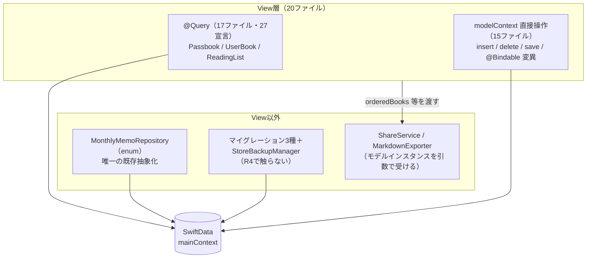
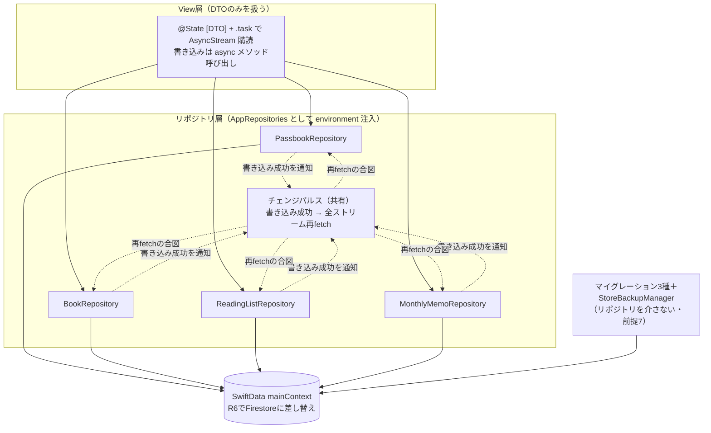

# R4 リポジトリ抽象化 設計メモ（移行Phase 1・クラウド接続の準備）

作成日: 2026-07-11
更新日: 2026-07-19（v1.5.0クラッシュ分析を反映: 8.4節「R4で解消されるべき既知問題」を新設・第7章ステップ4の確認点に削除→編集の競合スモークを追加。R3浸透確認済み・R4開始承認。第7章にステップ0＝ベースラインスクリーンショット取得と7.1節チェックリストを追加＝オーナー指示）
ステータス: 設計承認済み・着手可（本書と第7章のステップ分解は2026-07-11にオーナー承認済み。R3=v1.5.0の本番浸透は2026-07-19のクラッシュレポート分析で確認済み＝R4開始承認。着手時に本書とコードを突き合わせ、ズレがあれば本書を更新すること）
関連文書:

- `docs/implementation-roadmap.md`（R4の項目定義。本書はその設計メモ）
- `docs/cloud-migration-architecture.md`（移行Phase 1の定義＝5.2節・第8章。Firestoreスキーマ＝第3章。本書の上位文書）
- `docs/r3-uuid-migration-notes.md`（R4の前提となるUUID基盤。実装完了・v1.5.0）
- `docs/agent-implementation-guide.md`（スコープ規律・テスト・Git規約）
- `docs/r2-search-refactor-notes.md`（形式の参照元。R4とは独立）

> **AI実装エージェントへ**: `docs/agent-implementation-guide.md` を先に読むこと。本書の (仮) 推奨は確定仕様として実装する。対象はロードマップR4の3項目（プロトコル定義・View改修・検証）のみ。**認証・Firestore接続・移行ウィザード（R6）には一切手を出さない**。R4は「見た目・挙動が一切変わらない内部改修リリース」であり、バックエンドはSwiftDataのまま。実装ガイド第3章のとおり、**着手前に本書第7章のステップ分解を提示してユーザーの承認を得てから**コードに触ること。

---

## 0. この設計メモの前提（補完した仮定の一覧）

ロードマップ・移行設計書に未定義の論点を、以下の推奨案 **(仮)** として補完した。実装前に方針が変わった場合は該当章を更新すること。

| # | 論点 | 補完した前提 (仮) | 根拠 |
|---|------|------------------|------|
| 1 | リポジトリの数 | ロードマップどおり4つ（`BookRepository` / `PassbookRepository` / `ReadingListRepository` / `MonthlyMemoRepository`）。`Subscription` は対象外（実質未使用・R6で廃止＝移行設計書 前提15） | ロードマップR4・移行設計書 付録A |
| 2 | DTOの `Identifiable.id` | **R3で導入した `uuid`** を使う。View層から `persistentModelID` を排除する（R3メモ 2.2節が「uuidへの置き換えはR4（DTO化）以降」と予告した箇所の実行） | R3メモ 2.2節・移行設計書 5.2節 |
| 3 | 変更通知の実装方式 | **自前のチェンジパルス**（どのリポジトリの書き込みでも全ストリームが再fetch→差分があればyield）。`ModelContext.didSave` 通知には依存しない（4.3節の比較） | 本書 4.3節 |
| 4 | 表紙画像バイナリ | **DTOに含めない**。`coverImageData` は `loadCoverImage(bookId:)` / `updateCoverImage(bookId:data:)` としてリポジトリのメソッドに分離する（ストリームで数百MBのバイナリを複製しないため。R6ではStorage URL化されるフィールドであり、分離がそのまま接続点になる） | 本書 3.3節・移行設計書 3.3節（`coverImagePath`） |
| 5 | `ReadingListDTO` の形 | 並び順解決済みの `books: [BookDTO]` を**内包する**（現行 `orderedBooks` と等価な形で渡し、View改修の差分を最小化）。正規化（bookIdsのみ持ちView側で結合）はR6のFirestore実装内部の都合であり、DTOの形はViewの都合に合わせる | 本書 3.4節 |
| 6 | 共有ID（`ShareService`） | `ReadingListDTO` に `legacyShareId: String`（`persistentModelID` の文字列表現）を運び、共有URLの同一性を維持する。uuidへの切り替えはR6で判断（R3メモ 前提7の継続） | R3メモ 前提7 |
| 7 | マイグレーション系コード | `UUIDBackfillMigration` / `ReadingListOrderMigration` / `CurrencyMigration` / `StoreBackupManager` は**リポジトリを介さない**（生の `ModelContext` / ファイル操作のまま）。これらは抽象化の下のインフラ層であり、R6でSwiftDataごと削除される運命を共にする | 移行設計書 5.5節 |
| 8 | 実装の刻み方 | **モデル単位の段階切替**（1ステップ＝1モデルの読み・書き両方をリポジトリへ移す）。ハイブリッド期間中の不整合（@Query側の書き込みをストリームが検知できない）を「同一モデルの読み書きを必ず同時に移す」ことで構造的に回避する（7章） | 本書 4.3節・7章 |
| 9 | 注入方法 | リポジトリ4つを束ねた `AppRepositories` を `.environment` で注入（`ThemeManager` 等の既存 `@Observable` 注入パターンに合わせる）。プレビュー・テストではインメモリSwiftData実装かモックを差す | 実装ガイド 4.1節 |
| 10 | 実行コンテキスト | SwiftData実装は `@MainActor`・`container.mainContext` を使う（現行の `@Query` / `@Environment(\.modelContext)` と同一コンテキスト＝挙動差ゼロ）。プロトコルは `async throws` で定義し、R6の非同期なFirestore実装をそのまま受け入れられる形にする | 本書 4.1節 |
| 11 | 取得時のソート | リポジトリは**正準ソート**で返す（Passbook: `sortOrder` 昇順／UserBook: `registeredAt` 降順＋`createdAt` 降順／ReadingList: `updatedAt` 降順）。現行の各 `@Query` のsortの上位互換であり、口座絞り込み・お気に入り等のメモリ上フィルターは現行どおりView側の純関数に残す（5.2節） | 現行コードの棚卸し（2.2節） |
| 12 | `updatedAt` の扱い | リポジトリは**自動更新しない**（DTOの値をそのまま書く）。現行はViewが明示的に `updatedAt = Date()` を設定しており（お気に入りトグル等、更新しない操作もある）、この挙動を変えない。R6のLWW競合解決（移行設計書 前提10）が `updatedAt` に依存するため、更新漏れの是正はR6着手時の論点として申し送る | 本書 8.3節 |
| 13 | 検証方法 | 全画面のスクリーンショット比較は**人間タスク**（シミュレータでの目視比較）。AIエージェントはユニットテスト・既存テスト全通し・シミュレータでの操作スモークまでを担当する | ロードマップR4・実装ガイド 第5章 |

### 0.1 オーナーのR4理解とコード・設計書の突合

依頼文の理解（リポジトリ層を挟む／R4はSwiftDataのまま抽象化のみ／見た目不変／段階的・非破壊）は、ロードマップR4・移行設計書 5.2節/第8章Phase 1と**一致しており、食い違いはない**。補足が2点:

1. **「R6でリポジトリ実装の差し替えだけで済む」の正確な範囲**: R4が保証するのは「**View層が無変更で済む**」こと。R6ではリポジトリ差し替えに加えて、認証（`AuthManager`）・移行ウィザード用の読み取りコンポーネント（`LocalDataReader`）・ログインウォール等の新規実装が別途必要になる（移行設計書 5.2節・第8章Phase 2）。R4はそのうち最大工数の「View層とデータストアの分離」を先に済ませるフェーズである
2. **`MonthlyMemoRepository` という名前は既に存在する**: 現行コードに `enum MonthlyMemoRepository`（`Models/MonthlyMemo.swift` 内・static関数群）があり、R4のプロトコルと名前が衝突する。R4では現行enumを新しいプロトコル準拠の実装に**置き換える**（3.2節）

---

## 1. 目的とスコープ

R4（v1.6.0）は移行Phase 1。現状アプリ各所（17ファイル・27箇所の `@Query`、18ファイルの `modelContext`）がSwiftDataへ直接アクセスしている構造に**リポジトリ層を挟み、R6でバックエンドをFirestoreに差し替えるときView層を無変更で済ませる**リリースである。

1. 4つのリポジトリプロトコルとプレーンなDTO（`BookDTO` 等）を定義する（`observe〜` は `AsyncStream`）
2. 全Viewの `@Query` / `modelContext` 直接操作をリポジトリ経由に置き換える。View層はDTOのみを扱い、`@Model` / `persistentModelID` に依存しない
3. R4時点の背後は**暫定のSwiftData実装**（`SwiftDataBookRepository` 等）。クラウド接続はしない
4. **見た目・挙動を一切変えないリリース**として検証する（全画面スクリーンショット比較＋既存テスト全通し）

**最優先の設計制約**: 既存ユーザーのデータ・機能を壊さないこと。R4は**スキーマを一切変更しない**（マイグレーションなし・R3のような移行前バックアップは不要）ため、リスクの主戦場はデータ破壊ではなく**書き込み経路の書き換えミスによる機能リグレッション**（保存されない・削除が伝播しない・並び順が壊れる）である。これを「モデル単位の段階切替＋各ステップでの全テスト通過」で抑え込む（第7章）。

**スコープ外**: 認証・Firestore・Storage（R6）・`Subscription` の廃止（R6）・共有IDのuuid化（前提6）・マイグレーション系コードの改修（前提7）・UIの変更全般・新機能。**R5（ノード）はR4完了が前提**（ロードマップの注記: `@Query` 直依存のコードを増やさないため）。

---

## 2. 現状整理: データアクセスの棚卸し

### 2.1 全体像（現状）



### 2.2 `@Query` の使われ方（要点）

- **`#Predicate` / Query側filterは全編未使用**。口座絞り込み（`type == .custom && isActive`）・お気に入り・検索などは、全件取得後に**View側のメモリ上フィルター**で行っている → リポジトリは「全件＋正準ソート」を返せば現行挙動を完全再現できる（前提11）
- ソートは3パターンのみ: Passbook＝`sortOrder`、UserBook＝`registeredAt` 降順（`PassbookDetailView` のみ第2キー `createdAt` 降順あり＝C-4）、ReadingList＝`updatedAt` 降順。ソート指定のない `@Query`（`AccountListView.allBooks` 等）は順序に依存しない集計用途
- `MonthlyMemo` は `@Query` 未使用（既存repoの `fetch(year:month:)` のみ）。`Subscription` はスキーマ登録のみで読み書きゼロ

### 2.3 書き込み経路（リポジトリが引き受けるべき操作の全量）

| 操作 | 現在の場所 | 備考 |
|------|-----------|------|
| Passbook 作成 | `OnboardingView` / `AddPassbookView` | insert＋save。`sortOrder` は既存最大値+1 |
| Passbook 更新 | `EditPassbookView`（`@Bindable`） | 名前・色等 |
| Passbook 削除 | `PassbookListView`（**cascade任せ**）／`EditPassbookView`（**所属本を明示delete後に削除**） | 2経路で削除方式が不統一。最終状態は同一（4.4節で統一） |
| UserBook 作成 | `BookSearchView`（API検索から）／`AddBookView`（手動・表紙画像つき） | insert＋save |
| UserBook 更新 | `EditBookView`（`@Bindable`・`updatedAt` 明示更新）／`UserBookDetailView`（お気に入り・メモ。`updatedAt` 更新なし） | 前提12 |
| UserBook 削除 | `UserBookDetailView` | delete＋save |
| ReadingList 作成/削除 | `AddReadingListView`（空リストのrollback削除含む）／`ReadingListView` / `ReadingListDetailView` | |
| ReadingList メタ更新 | `EditReadingListView`（`@Bindable`・`updatedAt` 明示更新） | |
| リストへの本の追加/除去/並び替え | `BookSelectorView`（追加＋`saveBookOrder`）／`ReadingListDetailView`（除去）／`ReorderBooksView`（`bookIds` 保存） | R3で `bookIds`（uuid配列）化済み |
| MonthlyMemo 保存/削除 | `BookshelfView` → 既存 `MonthlyMemoRepository.save`（空文字でdelete） | |

### 2.4 `persistentModelID` の使用箇所（DTO化で置き換わるもの）

View層の同一性判定・`.id()`・選択状態に十数箇所（`BookshelfView` / `MainTabView` / `PassbookDetailView` / `EditBookView` / `BookSelectorView` / `AccountListView` / `EditPassbookView` / `BookSearchView` / `ReadingListDetailView` / `Utils/PassbookColor.swift`）。すべて**同一プロセス内の一時的な同一性判定**であり、`uuid`（R3で全行に一意付与済み）への置き換えで意味論は変わらない。例外は `ShareService` の共有IDのみ（前提6・永続的な外部キーとして使われている唯一の箇所）。

---

## 3. リポジトリプロトコルとDTO設計

### 3.1 プロトコル定義（概念コード）

移行設計書 5.2節の概念コードを4モデルへ展開する。`observe〜` は `AsyncStream`（購読開始時に現在値を即yieldし、以後変更のたびにyield）。

```swift
// 概念コード（シグネチャの粒度は実装時に本書と突き合わせる）
protocol PassbookRepository {
    func observePassbooks() -> AsyncStream<[PassbookDTO]>          // 正準ソート: sortOrder 昇順
    func addPassbook(_ passbook: PassbookDTO) async throws
    func updatePassbook(_ passbook: PassbookDTO) async throws
    func deletePassbook(id: String) async throws                   // 所属する本も明示削除（4.4節）
}

protocol BookRepository {
    func observeBooks() -> AsyncStream<[BookDTO]>                  // 正準ソート: registeredAt 降順・createdAt 降順
    func addBook(_ book: BookDTO, coverImageData: Data?) async throws
    func updateBook(_ book: BookDTO) async throws
    func deleteBook(id: String) async throws
    func loadCoverImage(bookId: String) async -> Data?             // 前提4: バイナリはDTO外
    func updateCoverImage(bookId: String, data: Data?) async throws
}

protocol ReadingListRepository {
    func observeReadingLists() -> AsyncStream<[ReadingListDTO]>    // 正準ソート: updatedAt 降順
    func addReadingList(_ list: ReadingListDTO) async throws
    func updateReadingList(_ list: ReadingListDTO) async throws    // メタ情報＋bookIds（並び順・所属）を一括反映
    func deleteReadingList(id: String) async throws
}

protocol MonthlyMemoRepository {
    func observeMemo(year: Int, month: Int) -> AsyncStream<MonthlyMemoDTO?>
    func saveMemo(year: Int, month: Int, text: String) async throws   // 空文字は削除（現行挙動維持）
}
```

- `observeBooks(passbookId:)` のような**フィルター引数は設けない** (仮)。現行の口座絞り込みはView側のメモリ上フィルターであり（2.2節）、リポジトリに移すと挙動差の検証点が増えるだけで益がない。R6でFirestoreの読み取りコストが問題になった場合に、その時点のデータ量を見て検討する
- リストへの本の追加・除去・並び替えは、`ReadingListDTO.bookIds` を書き換えて `updateReadingList` を呼ぶ**1系統に集約**する (仮)。現行の3経路（`BookSelectorView` / `ReadingListDetailView` / `ReorderBooksView`）はいずれも「`books` リレーションと `bookIds` を書いてsave」で等価であり、Firestoreの `readingLists.bookIds` 単一フィールド更新（移行設計書 3.3節）とも一対一に対応する

### 3.2 既存 `MonthlyMemoRepository`（enum）との関係

現行の `enum MonthlyMemoRepository`（`fetch` / `fetchOrCreate` / `save`・`ModelContext` 引数渡し）は、**同名プロトコル＋`SwiftDataMonthlyMemoRepository` に置き換えて廃止**する。空文字保存＝削除・save失敗時のrollback・OSLog記録という現行の挙動をそのまま実装へ移す。呼び出し元は `BookshelfView` のみで影響範囲が最小のため、段階切替の先頭に置く（第7章 ステップ2）。

### 3.3 DTO設計（Firestoreスキーマを写す）

DTOは `Identifiable`（`id = uuid`）・`Equatable`・`Sendable` なプレーン構造体。**フィールド構成は移行設計書 3.3節のFirestoreドキュメント定義に揃える**。これによりR6の `FirestoreBookRepository` は「Firestoreドキュメント ⇔ DTO」の素直なマッピングだけで済む。

| DTO | フィールド（要点） | Firestoreドキュメントとの差分 |
|-----|-------------------|------------------------------|
| `PassbookDTO` | `id(uuid)` / `name` / `type` / `sortOrder` / `isActive` / `colorIndex` / `customColorHex` / `createdAt` / `updatedAt` | なし（完全一致） |
| `BookDTO` | 書誌（`title` / `author` / `isbn` / `publisher` / `publishedYear` / `seriesName` / `price` / `imageURL` / `bookFormat` / `pageCount` / `source`）＋ユーザー属性（`memo` / `isFavorite` / `priceAtRegistration` / `currencyCode` / `registeredAt` / `createdAt` / `updatedAt`）＋`passbookId: String?`（Passbookのuuid参照）＋`hasCoverImage: Bool` | `coverImageData` を含めない（前提4）。Firestore側の `coverImagePath` に相当する情報は R4では `hasCoverImage` として抽象化 |
| `ReadingListDTO` | `id(uuid)` / `title` / `description` / `colorIndex` / `bookIds: [String]` / `books: [BookDTO]`（並び順解決済み・前提5）/ `createdAt` / `updatedAt` / `legacyShareId: String`（前提6） | `books` と `legacyShareId` はR4のView都合の付加物。Firestoreドキュメント自体は `bookIds` のみ持つ（R6実装が組み立てる） |
| `MonthlyMemoDTO` | `year` / `month` / `text` / `updatedAt` | なし |

- **リレーションの表現**: `UserBook.passbook`（SwiftDataリレーション）→ `BookDTO.passbookId`（uuid文字列参照）。`ReadingList.books` ⇔ `UserBook.readingLists` の相互参照 → `ReadingListDTO.bookIds` の**片方向参照に一本化**（移行設計書 3.3節の設計メモ「逆参照はFirestoreでは持たない」をDTO層で先行実現）。「この本が入っているリスト」が必要な画面は現状存在しない（棚卸しで確認済み）
- **表示ロジックの移設**: `UserBook.displayAuthor` / `displayAmount(in:exchangeRates:)` / `[UserBook].totalDisplayAmount` などの計算プロパティは、同一実装のまま `BookDTO` の extension へ移す（純関数なのでユニットテストも移設・流用できる）
- **`ReadingListDTO.books` の順序**: 現行 `orderedBooks` と同じ規則（`bookIds` 順に解決し、記載のない本は末尾へ追記）でSwiftData実装が組み立てる。この解決ロジックは `ReadingList.orderedBooks` からリポジトリ実装内の純関数へ移し、既存のユニットテストを引き継ぐ

### 3.4 `@Model` とDTOの変換

- 変換（`@Model` → DTO）はSwiftData実装内の純関数（`BookDTO(model:)` 等）に閉じ込め、**`@Model` 型がリポジトリの外へ出ないこと**をレビュー基準にする
- 逆方向（DTO → `@Model` への反映）は「uuidで既存行をfetchしてフィールドを上書き」。uuidはR3のバックフィルで全行一意が保証済みであり、突合キーとして安全
- `coverImageData` は `.externalStorage` のため、DTO変換で `hasCoverImage`（nil判定）だけを読む分には画像バイナリは実体化しない（R3メモ 4.3節で確認済みの遅延読み込み挙動）

---

## 4. SwiftData実装（R4の暫定バックエンド）

### 4.1 実行コンテキスト

- 4実装（`SwiftDataPassbookRepository` 等）はすべて `@MainActor` で `container.mainContext` を使う（前提10）。現行の `@Query` / `@Environment(\.modelContext)` と同一のコンテキスト・同一のautosave挙動であり、**スレッディング起因の挙動差が原理的に出ない**
- `ModelActor` による背景コンテキスト化は**行わない** (仮)。性能問題は現状観測されておらず、R6でSwiftData実装ごと退役するコードに並行性の複雑さを持ち込まない

### 4.2 全体像（R4完了後）



### 4.3 変更通知の方式（`observe〜` の実装）

`@Query` が担っていた「変更の自動反映」を何で置き換えるかがR4最大の技術論点。

| 案 | 内容 | 評価 |
|----|------|------|
| **A: 自前チェンジパルス（推奨・前提3）** | 4つのSwiftData実装が単一の変更通知オブジェクトを共有し、**どのリポジトリでも書き込みが成功したら全アクティブストリームが再fetch**する。DTOは `Equatable` なので、前回yield値と同じなら再yieldしない（無駄な再描画を抑止） | 依存ゼロ・決定的・テスト容易。カスケード削除や リレーション変更などの**モデル横断の波及**（本の削除→リスト内容の変化）も「全ストリーム再fetch」で漏れなく拾える。弱点は「リポジトリを介さない書き込みを検知できない」ことだが、R4完了時点で書き込みは全てリポジトリ経由になるため成立する。移行期間中の穴は「同一モデルの読み書きを同時に切り替える」刻み方（前提8・第7章）で塞ぐ |
| B: `ModelContext.didSave` 通知 | SwiftDataの保存通知を購読して再fetch | mainContextで発火しない既知のOSバージョン差（iOS 17系）があり、**通知が来ない＝画面が更新されない**という発見しにくいリグレッションの温床になる。不採用 |
| C: `@Query` を内部に持つブリッジView | `@Query` の自動更新を流用してストリームへ転送 | View階層に依存する仕掛けで、リポジトリが自己完結しない。R6のFirestore実装と構造が乖離する。不採用 |

- 再fetchのコスト: パルス1回あたり「アクティブなストリームの数×全件fetch」。数千冊規模・書き込みはユーザー操作起因（毎秒発生しない）なので問題にならない。`coverImageData` はDTOに載せないため実体化しない（3.4節）
- R6の `FirestoreBookRepository` は同じ `observe〜` シグネチャをFirestoreの**スナップショットリスナー**で実装する。プロトコルが `AsyncStream` である理由はこの差し替えを無変更で受けるため（移行設計書 5.2節）

### 4.4 書き込みセマンティクスの明示化（カスケードの廃止準備）

現行のPassbook削除は「cascade任せ」（`PassbookListView`）と「所属本を明示delete」（`EditPassbookView`）の2経路が混在している（2.3節）。`deletePassbook` は**「所属する本を明示的に削除してから口座を削除する」に統一**する (仮)。

- 最終状態は現行と完全に同一（cascadeの結果と等価）
- **R6への接続点**: Firestoreにカスケード削除は存在しないため、R6の実装は必ず明示削除になる。R4でセマンティクスを「リポジトリが明示的に責任を持つ」形に寄せておくことで、R6差し替え時の挙動差を消す
- 本の削除がリストから消える挙動（`ReadingList.books` リレーションの自動整理）も同様に、`deleteBook` が「本の削除＋所属リストの `bookIds` からの除去」を明示的に行う形へ寄せる

### 4.5 エラーの扱い

- 現行Viewの save 失敗処理は `try?`（握りつぶし）と do/catch＋DEBUGログの混在で、いずれも**ユーザーにエラーを見せない**。リポジトリのメソッドは `async throws` だが、View側の呼び出しは現行と同じ「失敗を静かに飲む」挙動を維持する。エラーUIの新設は「見た目・挙動を変えない」制約に反するためR4ではしない
- ただしリポジトリ実装内では失敗を**OSLogに記録**する（`MonthlyMemoRepository.save` の現行パターンを全リポジトリへ展開）。R6でエラーハンドリングを設計する際の観測点になる

---

## 5. View改修方針

### 5.1 読み取り: `@Query` → ストリーム購読

```swift
// 置き換えの定型（概念コード）
// before: @Query(sort: \Passbook.sortOrder) private var passbooks: [Passbook]
// after:
@Environment(AppRepositories.self) private var repos
@State private var passbooks: [PassbookDTO] = []
// body に付与:
.task { for await value in repos.passbooks.observePassbooks() { passbooks = value } }
```

- 定型変換であり、20ファイルへ機械的に適用する。**ステップごとに対象モデルを限定**する（第7章）
- 初期表示: ストリームは購読開始時に現在値を即yieldするため、`@Query` と同様に最初のフレームからデータが出る。ただし `.task` の実行タイミングは `onAppear` 相当であり、**初回bodyは空配列で評価される**。空状態UI（オンボーディング判定・「本がありません」表示等）が一瞬出ないか、切替対象の画面ごとに確認する（8.2節のリグレッション観点）

### 5.2 View側フィルターの維持

口座絞り込み（`custom && isActive`）・お気に入り・メモあり・本棚内検索（`ShelfSearchMatcher`）・統計の年別集計などのメモリ上フィルターは、**入力の型を `[UserBook]` → `[BookDTO]` に変えるだけで現行ロジックを維持**する。並び・件数・表示の正が変わらないことをこの層で担保する。

### 5.3 書き込み: `@Bindable` 変異 → DTO編集＋明示保存

- `EditBookView` / `EditPassbookView` / `EditReadingListView` の `@Bindable` は、**DTOのローカルコピー（`@State`）を編集し、保存ボタンで `update〜` を呼ぶ**形へ変える。現行も「編集→保存ボタンでsave」の構造であり、コミットのタイミングは変わらない
- `UserBookDetailView` のお気に入りトグルのような即時反映操作は、トグルのたびに `updateBook` を呼ぶ（現行の「変異＋save」と同じ粒度）
- `updatedAt` は現行どおりViewが設定する箇所でのみDTOに設定する（前提12）

### 5.4 `persistentModelID` → `uuid` の置き換え

- `.id()` / 選択状態 / `Hashable` 適合 / `PassbookColor.theme(for:)` のインデックス解決など十数箇所を、DTOの `id`（uuid）に置き換える（2.4節）
- uuidはR3で全行に一意付与済みのため意味論は同一。**`.id()` に渡る値そのものは変わる**が、これはビューの再構築トリガーであり表示内容には影響しない（アプリ再起動をまたいでも安定になるぶん、むしろ堅牢化する）
- `ShareService` だけは例外で、`legacyShareId`（前提6）を使い共有URLの同一性を守る

### 5.5 View以外の呼び出し規約

- `ShareService.shareReadingList` / `MarkdownExporter` / `BookshelfCalendarView` は現在もモデルインスタンスを**引数で受け取る**設計のため、引数型をDTOに変えるだけでよい（データアクセスの追加はない）
- プレビュー（`PreviewSupport`＋各Viewの `#Preview`・十数箇所）は、インメモリSwiftData実装のリポジトリ束を注入する形に揃える。プレビュー専用のモック定義は増やさない (仮)

---

## 6. R6（Firestore）への接続点の確認

R4の成果物がR6でそのまま使えることの確認（移行設計書との突合）:

| 移行設計書の記述 | R4の対応 |
|-----------------|---------|
| 「`FirestoreBookRepository` 等への差し替え（R4のプロトコルの背後実装を交換）」（ロードマップR6） | プロトコル4つ＋DTOがそのまま契約になる。`observe〜` はスナップショットリスナー、CRUD は `users/{uid}` 配下への書き込みで実装 |
| DTO ⇔ Firestoreドキュメントの対応（移行設計書 3.3節） | DTOのフィールド構成をドキュメント定義に揃えた（3.3節）。`BookDTO.passbookId` / `ReadingListDTO.bookIds` は同名・同構造 |
| `coverImagePath`（Storage移行・移行設計書 3.3節）とF-4の根本解決 | 画像バイナリをDTOから分離済み（前提4）。R6は `loadCoverImage` の実装をStorage取得＋キャッシュへ差し替えるだけ。共有ページへの手動書影反映（F-4）もこの差し替えで解決する |
| Firestoreにカスケード削除はない | 削除セマンティクスをR4で明示化済み（4.4節）。R6実装は同じ手順を `WriteBatch` で書くだけ |
| 移行ウィザードはSwiftDataを読む（`LocalDataReader`・移行設計書 5.2節） | リポジトリとは**別物**。R6でSwiftDataの読み取り専用コンポーネントを新設する（R4のSwiftData実装を流用できる可能性はあるが、R6の設計判断に委ねる） |
| LWW競合解決は `updatedAt` 比較（前提10） | R4は `updatedAt` の書き込み挙動を変えない（前提12）。**現行はお気に入りトグル等で `updatedAt` が更新されない**ため、R6着手時にLWWの観点で更新規則を見直すこと（申し送り事項） |
| `Subscription` は廃止（前提15） | リポジトリを作らない（前提1）。スキーマ定義への残留はR6まで現状維持（R3メモと同方針） |

---

## 7. 実装順序の提案

方針: **1ステップ＝1モデルの読み・書き両方を切り替える**（前提8）。各ステップ完了時点でアプリは完全動作し（ハイブリッド状態＝一部モデルは `@Query`、一部はリポジトリ）、単独でコミット・検証できる。ステップ間に依存があるため順序は固定。

| 順 | 内容 | 対象 | リスク・確認点 |
|----|------|------|---------------|
| 0 | **ベースラインスクリーンショット取得（人間タスク・着手前）**: 現行ビルド（v1.5.0系）で全画面をライト/ダーク・状態バリエーション込みで撮影し保全。ステップ7の比較の基準画像とする。チェックリストは 7.1節 | - | R4着手はこの撮影完了報告後。撮影は現行ビルドで行う（着手後は基準が変わるため） |
| 1 | **基盤**: DTO4種＋プロトコル4種＋SwiftData実装4種＋チェンジパルス＋`AppRepositories` 環境注入。**Viewは未接続**（挙動完全不変）。DTO変換・正準ソート・`orderedBooks` 相当の解決・ストリームのユニットテスト | 新規 `Repositories/`（DTO・プロトコル・SwiftData実装）＋`BookBankApp.swift`（注入のみ） | 挙動変化ゼロのステップ。テストで契約（ソート順・変換・パルス）を固める |
| 2 | **MonthlyMemo切替**（最小・肩慣らし）: 既存enum `MonthlyMemoRepository` をプロトコル実装へ置換。`BookshelfView` のメモ読み書きを差し替え | `Models/MonthlyMemo.swift`・`Views/BookshelfView.swift` | 空文字＝削除・rollback・OSLogの現行挙動維持。カレンダーのメモ表示・編集・再起動後の保持 |
| 3 | **Passbook切替**: 全Viewの `@Query`（passbooks）と作成/更新/削除をリポジトリへ。削除セマンティクスの明示化（4.4節）。`PassbookColor.theme(for:)` のDTO化 | `OnboardingView` / `AddPassbookView` / `EditPassbookView` / `PassbookListView` ほかpassbooksを読む全View・`Utils/PassbookColor.swift` | 口座削除で所属本が消える（2経路とも）・口座色の解決・並び順（sortOrder）・オンボーディングの初回口座作成 |
| 4 | **UserBook切替**（最大工数）: 本の一覧・登録・編集・削除・お気に入り・表紙画像の分離（`loadCoverImage`）。`BookshelfCalendarView` / `MarkdownExporter` の引数DTO化 | `BookshelfView` / `BookSearchView` / `AddBookView` / `EditBookView` / `UserBookDetailView` / `PassbookDetailView` / `AccountListView` / `StatisticsView` ほか | 登録直後の一覧反映（パルス）・手動表紙画像の表示/変更・本棚内検索/フィルター/統計の結果不変・C-4の第2キーソート維持・**本の削除→直後に編集操作の競合スモーク**（`UserBookDetailView` で削除確定の直後・dismiss完了前に編集シートを開こうとしてもクラッシュしないこと。8.4節のv1.5.0クラッシュの再現操作） |
| 5 | **ReadingList切替**: リストCRUD・本の追加/除去/並び替え（`updateReadingList` へ集約＝3.1節）・`ShareService` の引数DTO化（`legacyShareId`） | `ReadingListView` / `AddReadingListView` / `ReadingListDetailView`（内包View含む）/ `BookSelectorView`・`Services/ShareService.swift` | 並び順の保存/復元（タイトル変更を挟んでも維持＝R3の成果の非破壊）・**共有URLの同一性**（同じリスト→同じURL） |
| 6 | **残渣掃除**: `@Query` / `@Environment(\.modelContext)` の残存ゼロ確認（マイグレーション系＝前提7を除く）・`@Model` の計算プロパティのうちDTOへ移設済みのものの削除・未使用 `modelContext` 宣言（`PassbookDetailView` / `StatisticsView`）の削除・プレビューのリポジトリ注入統一 | 全体 | 「View層が `@Model` に依存しない」をgrepで機械的に確認（レビュー基準＝3.4節）。**計算プロパティの削除は、実行前にマイグレーション3種＋`StoreBackupManager` からの参照ゼロをgrepで確認し、結果を報告してから行う**（設計メモ作成時点=2026-07-11の確認では参照ゼロ。万一参照が見つかった場合はマイグレーション側を直さず＝前提7、該当プロパティを削除せず残す） |
| 7 | **検証＋ドキュメント同期**: `xcodebuild test` 全通し・シミュレータ操作スモーク・**全画面スクリーンショット比較（人間タスク）**・ロードマップR4の完了マーク・本書のズレ修正 | - | ロードマップR4の完了条件。実機確認・TestFlightは人間タスクとして明示報告 |

- 各ステップ後に `xcodebuild test` を通す（実装ガイド 4.3節）。**ステップ4完了時点が最大のリグレッションポイント**（書き込み経路が最多）なので、8.2節のシナリオを手動確認してから5以降へ進む
- ユニットテストの最低ライン: (a) DTO変換の往復（`@Model`→DTO→反映で全フィールド保存）、(b) 正準ソートの再現（C-4の第2キー含む）、(c) `ReadingListDTO.books` の並び順解決（`bookIds` 順＋記載なしは末尾＝既存 `orderedBooks` テストの移設）、(d) チェンジパルス（書き込み→ストリームが新値をyield・等値ならyieldしない）、(e) 削除の波及（口座削除→本も消える／本削除→リストの `bookIds` から消える）。SwiftData実装のテストはインメモリコンテナで行う（`DataPersistenceTests` の既存パターン）

### 7.1 ステップ0: ベースラインスクリーンショット チェックリスト（人間タスク・2026-07-19 追加）

R4は「見た目・挙動が一切変わらないリリース」（前提13・ステップ7）。着手前に**現行ビルドの基準画像**を撮っておき、ステップ7で1枚ずつ突き合わせる。以下は撮影対象と状態バリエーション。**各画面をライト/ダーク両方**で撮る（＝下表の枚数×2）。撮影は現行ビルド（R4未着手の状態）で行うこと。

**撮影の共通条件**
- 端末: 実機1台（普段の端末）で統一。可能なら iPhone 実機＋ダーク切替はコントロールセンター/設定から
- データ状態は「本あり（数百冊の実データ）」を主とし、**空状態が存在する画面は空バリエーションも別途撮る**（下表の「空」列）
- 言語は日本語で統一（多言語はR4のスコープ外）。動的タイプ（文字サイズ）は既定のまま

| # | 画面 | 状態バリエーション | 空状態も撮る |
|---|------|------------------|:---:|
| 1 | 起動直後のルート/タブ初期表示 | 通常起動（空状態が一瞬瞬かないことの確認用＝5.1節） | — |
| 2 | 本棚（BookshelfView） | 本あり／フィルター適用中（口座・お気に入り）／本棚内検索の入力中＋結果／検索0件の導線 | ✓（空の本棚） |
| 3 | 本棚カレンダー（BookshelfCalendarView） | 同日複数冊の日セル＋一覧シート（D-4）／メモのある月 | ✓ |
| 4 | 書籍詳細（UserBookDetailView） | 表紙画像あり（API取得）／手動登録の表紙画像／表紙なしプレースホルダ／メモあり・なし | — |
| 5 | 書籍編集（EditBookView） | 編集シート表示（各フィールド入力済み） | — |
| 6 | 書籍登録（AddBookView / BookSearchView） | 検索結果一覧／登録済みバッジ表示／登録フォーム | ✓（検索前） |
| 7 | 通帳一覧（PassbookListView） | 複数口座／並び順（sortOrder） | ✓（口座なし＝オンボーディング前） |
| 8 | 通帳詳細（PassbookDetailView） | 本あり（第2キーソートC-4が効く同秒登録を含む） | ✓ |
| 9 | 口座作成/編集（AddPassbookView / EditPassbookView） | 口座色選択中／各テーマ色 | — |
| 10 | 読了リスト一覧（ReadingListView） | 複数リスト（updatedAt降順） | ✓ |
| 11 | 読了リスト詳細（ReadingListDetailView） | 並び替え可能状態／本の追加（BookSelectorView）／共有シート | ✓ |
| 12 | 統計（StatisticsView） | 本あり（年切替あり）／グラデーション数字のダーク表示（v1.5.0で調整した箇所） | ✓（対象年に本なし） |
| 13 | オンボーディング（OnboardingView） | 新規ユーザーの初回口座作成フロー | 該当（初回のみ） |
| 14 | アプリメニュー/設定（AppMenuView） | 通常（Unlimited状態・非Unlimited状態の両方があれば両方） | — |
| 15 | Paywall（UnlimitedPaywallView） | プラン表示（口座/リスト上限到達時のトリガー） | — |
| 16 | 空状態UI各種 | 本棚・通帳・リスト・統計の空表示（上の各「✓」をまとめて撮ってもよい） | 該当 |

- **状態を撮る理由**: ステップ3で口座削除→所属本の消え方、ステップ4で登録直後の即時反映・手動表紙、ステップ5で並び順維持・共有URL、ステップ7の全体比較——これらの回帰は「状態が変わる瞬間」に出るため、静止画は各状態の代表を押さえる
- 撮影後、`R4-baseline-screenshots/`（リポジトリ外・私有端末に保全でよい）等にまとめておく。ステップ7でAIが変更点を挙げ、人間が基準画像と目視突合する
- **この撮影の完了報告をもってステップ1に着手する**

---

## 8. リスクとリグレッション観点

### 8.1 最大のリスク: 書き込み経路の書き換えミス

R4はスキーマ非変更・データ移行なしのため、R3型の「起動不能・データ喪失」リスクは低い。代わりに**書き込みの取りこぼし**（保存したつもりが永続化されない・削除の波及漏れ・並び順の巻き戻り）が主リスクになる。

| リスク | 緩和策 |
|--------|--------|
| リポジトリ経由の書き込みが `@Query` 画面に反映されない（ハイブリッド期間） | `@Query` はmainContextの変更を自動検知するため、**リポジトリ（mainContext使用・前提10）の書き込みは既存 `@Query` に必ず映る**。逆方向（直接書き込み→ストリーム）だけが穴であり、「同一モデルの読み書きを同時に切り替える」刻み方（前提8）で構造的に塞ぐ |
| 削除の波及漏れ（口座→本・本→リスト） | 削除セマンティクスの明示化（4.4節）＋波及のユニットテスト（第7章(e)）＋チェンジパルスが全ストリームを再fetchするため、モデル横断の画面反映も漏れない |
| 並び順の巻き戻り（リスト・口座） | `bookIds` の書き込みを `updateReadingList` に集約（3.1節）。R3の検証観点（タイトル変更を挟んだ並び維持）を再実施 |
| DTOコピーの編集競合（編集中に他画面で同じ対象が更新される） | 単一端末・単一ユーザーの逐次操作であり実害なし。「最後に保存した編集が勝つ」は現行の `@Bindable`＋saveと同じ意味論 |
| ストリーム購読のライフサイクル（画面破棄後のyield・多重購読） | `.task` はViewの消滅で自動キャンセルされる。`AsyncStream` の `onTermination` で購読解除を実装し、リークをテストで確認 |

### 8.2 壊してはいけない既存挙動

| 挙動 | 確認方法 |
|------|---------|
| 起動シーケンス（バックアップ→マイグレーション3種→バックアップ削除） | R4で触らない（前提7）。`RootView.onAppear` の順序が不変であることをdiffレビューで担保 |
| 本の登録→本棚・通帳・統計への即時反映 | 検索から登録→タブ切替で件数・金額が即反映（パルス経路の実機スモーク） |
| 手動登録の表紙画像（表示・変更・削除） | `loadCoverImage` 分離後も詳細・一覧・編集で表示されること。画像なし本のプレースホルダ |
| 読了リストの並び順（R3の成果） | 並び替え→再起動→維持。タイトル変更を挟んでも崩れない |
| 共有URLの同一性（同じリストは同じURL） | `legacyShareId`（前提6）。共有→再共有で同一URL。**R4リリース前後をまたいでも同一URL**であること（旧バージョンで共有→R4版で再共有） |
| 通帳ソートの第2キー（C-4） | 同秒登録の本の並びが安定（正準ソートに `createdAt` 降順を含める＝前提11） |
| 月別メモ（空文字で削除・再起動後保持） | カレンダーからの編集往復 |
| 無料/Unlimited制限（口座3・リスト3） | `UnlimitedManager` はデータアクセス非依存のため無関係だが、口座/リスト作成の上限判定がDTO件数ベースでも同値であること |
| 空状態UI・オンボーディング判定 | 初回bodyが空配列で評価される件（5.1節）。起動直後・タブ初回表示で空状態が一瞬瞬いて見えないこと |
| リスト・一覧の更新アニメーション | `@Query` 差し替えで挿入/削除アニメーションの見え方が変わらないこと（変わる場合は `withAnimation` で現行に合わせる） |
| 初回起動（新規ユーザー）のオンボーディング→口座作成 | ステップ3の切替後に一連を通す |

### 8.3 実装時の注意（棚卸しで確認した点）

1. **`updatedAt` の更新箇所は現行どおりに**: `EditBookView`・リスト系3箇所のみが明示更新しており、お気に入りトグル等は更新しない。リポジトリで一律更新すると「更新日時順のリスト並び」が変わる（`ReadingListView` は `updatedAt` 降順）。前提12を厳守し、R6への申し送り（第6章）を残す
2. **`PassbookDetailView` / `StatisticsView` の未使用 `modelContext`**: 宣言のみで未参照のデッドコード。ステップ6で削除する（それまでは触らない）
3. **`AddReadingListView` のrollback削除**: 空リスト作成→キャンセルでdeleteする現行フローがある。DTO化では「保存確定まで `addReadingList` を呼ばない」形に直せるが、挙動（キャンセルでリストが残らない）が同一であることをテストで確認
4. **`Passbook.bookCount` / `totalValue` 等の計算プロパティ**: リレーション経由の集計。View側は現状 `allBooks` のメモリ上フィルターで集計している箇所が主のため、DTOには**持たせず**、集計はViewの純関数に統一する（Firestoreドキュメントにもこれらのフィールドはない。`users/{uid}` のカウンターはR6のCloud Functions管轄＝移行設計書 3.3節） 
5. **プレビューの個別 `ModelContainer` 生成（十数箇所）**: ステップ6で `PreviewSupport` のリポジトリ束に統一。それまでは各ステップで壊れていないか代表数画面を確認（R3メモ 8.3節と同じ観点）
6. **`BookSearchView` の登録済み判定（`registeredISBNs`）**: `allUserBooks` から構築するキャッシュ。DTO化後も構築タイミング（検索開始時・登録時）を変えないこと（R2の世代管理との相互作用に注意。検索の状態機械そのものには触らない）

### 8.4 R4で解消されるべき既知問題（v1.5.0クラッシュレポートより・2026-07-19 追記）

v1.5.0リリース1週間後のクラッシュレポート分析（2026-07-19・オーナー承認済み）で、R4のDTO化が恒久対策となるクラッシュが1件確認された。R4はこれを**構造的に解消する責務を負う**。

- **シグネチャ**: `SwiftData: _KKMDBackingData.getValue<A>(forKey:)` の assertion failure（`EXC_BREAKPOINT`）。クラッシュポイントID `CTwXFveyAZl6Ax7rDQx2L0`・Incident `193FA5C5-EECA-45E0-9008-EDF663020795`（2026-07-13・v1.5.0 (7)・iOS 26.5・1件）
- **発生条件（推定）**: `EditBookView` のシート表示トランジション開始時（`presentationTransitionWillBegin`）に body が評価され、`isManual` → `UserBook.source` の getter で**削除済み（バッキングデータ無効化済み）の `@Model` インスタンス**を読んだ。`UserBookDetailView` の削除確定（`context.delete` → `dismiss()`）と編集シート提示のレースが再現条件と推定される
- **R3との関係**: なし。読まれたのは `source`（R3以前からのフィールド）で、発生も起動11分後の操作中。マイグレーション失敗系（起動時 `fatalError`）の報告はゼロであり、R3浸透確認の反証にはならない（2026-07-19 分析）
- **DTO化が対策になる根拠**: 根本原因は `@Bindable var book: UserBook` で**生の PersistentModel をViewが保持し、削除後もgetterが走り得る**構造にある。R4完了後はViewが保持するのは値型の `BookDTO` のコピーであり、元レコードが削除されてもDTOの読み取りは常に安全（最悪でも古い値が表示されるだけでトラップしない）。3.4節「`@Model` 型がリポジトリの外へ出ない」レビュー基準が守られれば、このクラッシュはクラス丸ごと構造的に消滅する
- **R4完了後の確認（人間タスク）**: リリース後、Xcode Organizer で同一シグネチャ（`_KKMDBackingData.getValue`）の**再発ゼロ**を確認すること。第7章ステップ4の競合スモーク（削除→直後に編集操作）も再発防止の確認点として実施する

なお同分析で報告された他2件（SwiftUI Environment assertion＝`UIKitBarItemHost` 経路・malloc freelist破損）はいずれもR3・R4と無関係の単発事象で、**静観・監視**（`docs/bug-review-2026-07-06.md` グループH参照）。Environment の防御策（`@Environment(Type.self)` のオプショナル取得）は**R4に含めない**（再発が積み上がった時点で判断・オーナー決定 2026-07-19）。

---

## 9. 既存コード・設計書との対応表

| 項目 | 既存コード | 設計書の根拠 | R4での変更 |
|------|-----------|-------------|-----------|
| リポジトリプロトコル | （新規）先行パターンは `enum MonthlyMemoRepository` のみ | 移行設計書 5.2節・ロードマップR4 | 4プロトコル＋DTO＋SwiftData実装を新設 |
| `@Query` 置き換え | 17ファイル・27宣言（2.2節） | ロードマップR4「全Viewの `@Query` をリポジトリ経由に」 | ストリーム購読＋`@State [DTO]` の定型変換（5.1節） |
| 書き込み経路 | 15ファイルの `modelContext` 直接操作（2.3節） | 同上 | リポジトリの `async throws` CRUDへ集約 |
| `persistentModelID` | View層の同一性判定 十数箇所（2.4節） | R3メモ 2.2節（「uuidへの置き換えはR4以降」） | DTOの `id`（uuid）へ置き換え。`ShareService` のみ `legacyShareId` で現状維持（前提6） |
| `MonthlyMemoRepository`（enum） | `Models/MonthlyMemo.swift` | - | 同名プロトコル＋実装に置換・廃止（3.2節） |
| `orderedBooks` / `saveBookOrder` | `Models/ReadingList.swift`（R3でuuid化済み） | R3メモ 5.2節 | 解決ロジックをリポジトリ実装内の純関数へ移設。DTOは解決済み `books` を内包（前提5） |
| カスケード削除 | `PassbookListView`（cascade）／`EditPassbookView`（明示delete）の混在 | 移行設計書 3.3節（Firestoreに外部キー・カスケードなし） | `deletePassbook` で明示削除に統一（4.4節） |
| `coverImageData` | `UserBook`（`.externalStorage`） | 移行設計書 3.3節（`coverImagePath`）・11.1節 | DTOから分離し `loadCoverImage` / `updateCoverImage` へ（前提4）。R6でStorage実装に差し替え＝F-4の根本解決経路 |
| マイグレーション系 | `UUIDBackfillMigration` / `ReadingListOrderMigration` / `CurrencyMigration` / `StoreBackupManager` | 移行設計書 5.5節（SwiftData退役時に一括削除） | 触らない（前提7）。起動シーケンス不変 |
| `Subscription` | `Models/Subscription.swift`（読み書きゼロ） | 移行設計書 前提15（R6で廃止） | リポジトリを作らない（前提1）。スキーマ残留は現状維持 |
| `ShareService` / `MarkdownExporter` | モデルインスタンスを引数で受ける | 移行設計書 6.4節（共有は当面現状維持） | 引数型のDTO化のみ（5.5節）。共有IDは `legacyShareId` |
| R5（ノード）との関係 | - | ロードマップR4注記・ノード設計書 第10章 | R5はR4完了が前提。ノードのデータ読み取りはリポジトリ経由で設計できるようになる |
