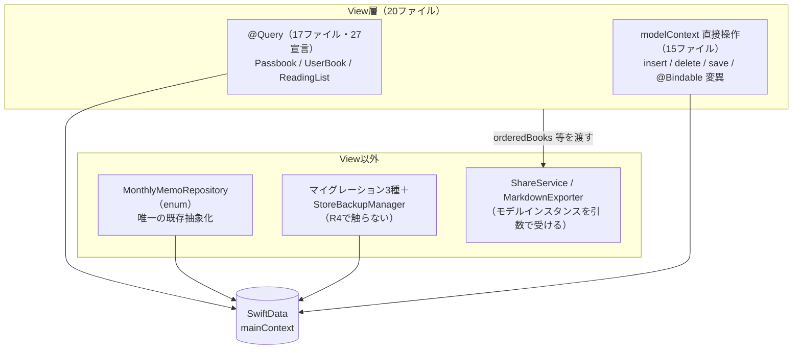
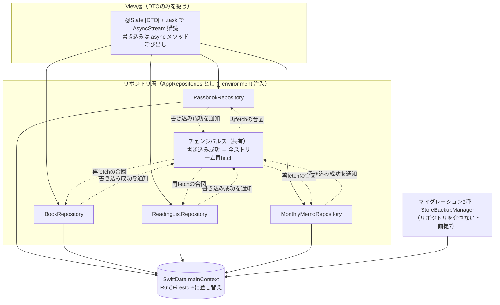

# R4 リポジトリ抽象化 設計メモ（移行Phase 1・クラウド接続の準備）

作成日: 2026-07-11
更新日: 2026-08-06（**ステップ6の1コミット目**——`primeLocalCoverCache` の static 化で 4.6節の解体対象増分を取り消し〈8.3節-22〉／`legacyShareId` の再起動またぎテストを追加したところ落ち、**共有IDが再起動をまたぐと変わるという既存の問題を検出**〈新規 8.3節-25。旧実装も同一の式でR4の後退ではないが、8.2節の「リリース前後をまたいで同一URL」は達成不能な要求だったため表と前提6を訂正〉／`Views/` の `import SwiftData` を10ファイルから除去し `AppMenuView` のみ恒久例外として据え置き〈8.4節・8.3節-2〉／プレビュー整理を完了し `PreviewSupport` の `@Model` 直接生成は構造的制約として対象外に〈8.3節-5〉／計算プロパティ削除の前提7ゲートを確認〈参照ゼロ・削除はオーナー承認待ち〉）／2026-08-06（**ステップ5検収（Claude Code / Codex の2系統）の反映**——8.4節の見出し消失を修復・「未コミット」表記と V-2 の「新規混入」表記の矛盾を解消・8.3節-17 の「最大4回」を購読者数3に整合・7章ステップ5①の「全件fetch→`#Predicate` に変更」という事実誤認を訂正／4.5節に参照解決の not-found 契約を追記／8.3節 20〜24 を追加〈エクスポート順の挙動差分・`latestSnapshot` 非空前提・ステップ6送り2件・`bookIds` 正規化がローカル専用ストア前提であることのR6制約〉／8.3節-18 の同型箇所のうち `ReadingListView` の削除アラートを前提13の範囲内で解消し、残り2件に更新／検収修正後の実機確認5項目の結果と担保範囲を7章ステップ5行と8.3節-21へ記録）／2026-08-06（8.3節-19 に作成フロー完了時のリスト名入力画面の露出＝既知UX問題を追加・8.3節-18 の「ステップ5で混入した理由」を訂正〈旧実装にも Optional 束縛はあり、外れたのは `context.save()` という偶然のマスクだった〉）／2026-08-05（ステップ5実装反映・8.3節-3 をドラフト方式で確定・8.3節 13〜18 を追加・8.3節-18 に V-2＝作成フローの真っ白画面の原因と修正、および「ログ挿入では観測できない」調査上の制約を記録・その反証を受けて 8.3節-12 の判別軸を片側のみ有効に下方修正・8.3節-17 の購読者数を4→3に訂正・8.4節のリスト系解消・4.6節の参照Viewを更新）
ステータス: 設計承認済み・**ステップ6進行中（2026-08-06）**——`@Query` ゼロ／未使用 `modelContext` ゼロ／`import SwiftData` 除去／プレビュー整理／`primeLocalCoverCache` static 化／再起動またぎテストは完了。**残りは `@Model` 計算プロパティの削除のみ（前提7ゲートの報告済み・オーナー承認待ち）**。ステップ5は `0745077`〜`b72ec42` でコミット済み（2系統レビュー＋実機ゲート通過・検収完了）。ステップ4は 656db5e。ユニットテストは**136件全通過**（ステップ5時点の135件＋1件）（ステップ0のベースラインスクショは2026-07-23オーナー完了報告済み）
関連文書:

- `docs/implementation-roadmap.md`（R4の項目定義。本書はその設計メモ）
- `docs/cloud-migration-architecture.md`（移行Phase 1の定義＝5.2節・第8章。Firestoreスキーマ＝第3章。本書の上位文書）
- `docs/r3-uuid-migration-notes.md`（R4の前提となるUUID基盤。実装完了・v1.5.0）
- `docs/agent-implementation-guide.md`（スコープ規律・テスト・Git規約）
- `docs/r2-search-refactor-notes.md`（形式の参照元。R4とは独立）

> **AI実装エージェントへ**: `docs/agent-implementation-guide.md` を先に読むこと。本書の (仮) 推奨は確定仕様として実装する。対象はロードマップR4の3項目（プロトコル定義・View改修・検証）のみ。**認証・Firestore接続・移行ウィザード（R6）には一切手を出さない**。R4は「見た目・挙動が一切変わらない内部改修リリース」であり、バックエンドはSwiftDataのまま。実装ガイド第3章のとおり、**着手前に本書第7章のステップ分解を提示してユーザーの承認を得てから**コードに触ること。

---

## 0. この設計メモの前提（補完した仮定の一覧）

ロードマップ・移行設計書に未定義の論点を、以下の推奨案 **(仮)** として補完した。実装前に方針が変わった場合は該当章を更新すること。

| # | 論点 | 補完した前提 (仮) | 根拠 |
|---|------|------------------|------|
| 1 | リポジトリの数 | ロードマップどおり4つ（`BookRepository` / `PassbookRepository` / `ReadingListRepository` / `MonthlyMemoRepository`）。`Subscription` は対象外（実質未使用・R6で廃止＝移行設計書 前提15） | ロードマップR4・移行設計書 付録A |
| 2 | DTOの `Identifiable.id` | **R3で導入した `uuid`** を使う。View層から `persistentModelID` を排除する（R3メモ 2.2節が「uuidへの置き換えはR4（DTO化）以降」と予告した箇所の実行） | R3メモ 2.2節・移行設計書 5.2節 |
| 3 | 変更通知の実装方式 | **自前のチェンジパルス**（どのリポジトリの書き込みでも全ストリームが再fetch→差分があればyield）。`ModelContext.didSave` 通知には依存しない（4.3節の比較） | 本書 4.3節 |
| 4 | 表紙画像バイナリ | **DTOに含めない**。`coverImageData` は `loadCoverImage(bookId:)` / `updateCoverImage(bookId:data:)` としてリポジトリのメソッドに分離する（ストリームで数百MBのバイナリを複製しないため。R6ではStorage URL化されるフィールドであり、分離がそのまま接続点になる） | 本書 3.3節・移行設計書 3.3節（`coverImagePath`） |
| 5 | `ReadingListDTO` の形 | 並び順解決済みの `books: [BookDTO]` を**内包する**（現行 `orderedBooks` と等価な形で渡し、View改修の差分を最小化）。正規化（bookIdsのみ持ちView側で結合）はR6のFirestore実装内部の都合であり、DTOの形はViewの都合に合わせる | 本書 3.4節 |
| 6 | 共有ID（`ShareService`） | `ReadingListDTO` に `legacyShareId: String`（`persistentModelID` の文字列表現）を運び、共有URLの同一性を維持する。uuidへの切り替えはR6で判断（R3メモ 前提7の継続）。**⚠ 2026-08-06 実測: この文字列は再起動をまたぐと変わる（`NSManagedObjectID` のポインタ値を含むため）。旧実装も同一の式なのでR4の後退ではないが、「同一性の維持」が守るのは同一プロセス内に限られる。uuid化の判断材料としてこの実測を踏まえること＝8.3節-25** | R3メモ 前提7 |
| 7 | マイグレーション系コード | `UUIDBackfillMigration` / `ReadingListOrderMigration` / `CurrencyMigration` / `StoreBackupManager` は**リポジトリを介さない**（生の `ModelContext` / ファイル操作のまま）。これらは抽象化の下のインフラ層であり、R6でSwiftDataごと削除される運命を共にする | 移行設計書 5.5節 |
| 8 | 実装の刻み方 | **モデル単位の段階切替**（1ステップ＝1モデルの読み・書き両方をリポジトリへ移す）。ハイブリッド期間中の不整合（@Query側の書き込みをストリームが検知できない）を「同一モデルの読み書きを必ず同時に移す」ことで構造的に回避する（7章） | 本書 4.3節・7章 |
| 9 | 注入方法 | リポジトリ4つを束ねた `AppRepositories` を `.environment` で注入（`ThemeManager` 等の既存 `@Observable` 注入パターンに合わせる）。プレビュー・テストではインメモリSwiftData実装かモックを差す。**格納型は具象の `SwiftData*Repository` とする（2026-07-23 ステップ1実装・オーナー承認）**: R4時点で実装は1系統のみであり、existential（`any`）格納は間接化の益がなくコンパイラ最適化とSendable検査を弱めるだけのため。プロトコル4種は定義済みで各実装が準拠しており、**View層はプロトコルのメソッドシグネチャのみに依存する**ため、R6でFirestore実装へ差し替える際は `AppRepositories` の格納型を差し替える（または existential／ファクトリへ広げる）だけでViewは無変更。**⚠ 既知の例外（ステップ4・2026-07-25 オーナー承認）: `latestSnapshot` はプロトコルに載せておらず、9つのViewが具象 `SwiftDataBookRepository` / `SwiftDataPassbookRepository` に直接依存している。したがって「R6でViewは無変更」は `latestSnapshot` を参照するViewには当てはまらず、R6着手時に解体が要る（4.6節）。プロトコル外に置いたのは意図的で、差し替え時に必ずコンパイルエラーになり解体漏れを機械的に検出できるようにするため** | 実装ガイド 4.1節・本書 6章 |
| 10 | 実行コンテキスト | SwiftData実装は `@MainActor`・`container.mainContext` を使う（現行の `@Query` / `@Environment(\.modelContext)` と同一コンテキスト＝挙動差ゼロ）。プロトコルは `async throws` で定義し、R6の非同期なFirestore実装をそのまま受け入れられる形にする | 本書 4.1節 |
| 11 | 取得時のソート | リポジトリは**正準ソート**で返す（Passbook: `sortOrder` 昇順／UserBook: `registeredAt` 降順＋`createdAt` 降順／ReadingList: `updatedAt` 降順）。現行の各 `@Query` のsortの上位互換であり、口座絞り込み・お気に入り等のメモリ上フィルターは現行どおりView側の純関数に残す（5.2節） | 現行コードの棚卸し（2.2節） |
| 12 | `updatedAt` の扱い | リポジトリは**自動更新しない**（DTOの値をそのまま書く）。現行はViewが明示的に `updatedAt = Date()` を設定しており（お気に入りトグル等、更新しない操作もある）、この挙動を変えない。R6のLWW競合解決（移行設計書 前提10）が `updatedAt` に依存するため、更新漏れの是正はR6着手時の論点として申し送る | 本書 8.3節 |
| 13 | 検証方法 | 全画面のスクリーンショット比較は**人間タスク**（シミュレータでの目視比較）。AIエージェントはユニットテスト・既存テスト全通し・シミュレータでの操作スモークまでを担当する | ロードマップR4・実装ガイド 第5章 |

### 0.1 オーナーのR4理解とコード・設計書の突合

依頼文の理解（リポジトリ層を挟む／R4はSwiftDataのまま抽象化のみ／見た目不変／段階的・非破壊）は、ロードマップR4・移行設計書 5.2節/第8章Phase 1と**一致しており、食い違いはない**。補足が2点:

1. **「R6でリポジトリ実装の差し替えだけで済む」の正確な範囲**: R4が保証するのは「**View層が無変更で済む**」こと。R6ではリポジトリ差し替えに加えて、認証（`AuthManager`）・移行ウィザード用の読み取りコンポーネント（`LocalDataReader`）・ログインウォール等の新規実装が別途必要になる（移行設計書 5.2節・第8章Phase 2）。R4はそのうち最大工数の「View層とデータストアの分離」を先に済ませるフェーズである
2. **`MonthlyMemoRepository` という名前は既に存在する**: 現行コードに `enum MonthlyMemoRepository`（`Models/MonthlyMemo.swift` 内・static関数群）があり、R4のプロトコルと名前が衝突する。R4では現行enumを新しいプロトコル準拠の実装に**置き換える**（3.2節）

---

## 1. 目的とスコープ

R4（v1.6.0）は移行Phase 1。現状アプリ各所（17ファイル・27箇所の `@Query`、18ファイルの `modelContext`）がSwiftDataへ直接アクセスしている構造に**リポジトリ層を挟み、R6でバックエンドをFirestoreに差し替えるときView層を無変更で済ませる**リリースである。

1. 4つのリポジトリプロトコルとプレーンなDTO（`BookDTO` 等）を定義する（`observe〜` は `AsyncStream`）
2. 全Viewの `@Query` / `modelContext` 直接操作をリポジトリ経由に置き換える。View層はDTOのみを扱い、`@Model` / `persistentModelID` に依存しない
3. R4時点の背後は**暫定のSwiftData実装**（`SwiftDataBookRepository` 等）。クラウド接続はしない
4. **見た目・挙動を一切変えないリリース**として検証する（全画面スクリーンショット比較＋既存テスト全通し）

**最優先の設計制約**: 既存ユーザーのデータ・機能を壊さないこと。R4は**スキーマを一切変更しない**（マイグレーションなし・R3のような移行前バックアップは不要）ため、リスクの主戦場はデータ破壊ではなく**書き込み経路の書き換えミスによる機能リグレッション**（保存されない・削除が伝播しない・並び順が壊れる）である。これを「モデル単位の段階切替＋各ステップでの全テスト通過」で抑え込む（第7章）。

**スコープ外**: 認証・Firestore・Storage（R6）・`Subscription` の廃止（R6）・共有IDのuuid化（前提6）・マイグレーション系コードの改修（前提7）・UIの変更全般・新機能。**R5（ノード）はR4完了が前提**（ロードマップの注記: `@Query` 直依存のコードを増やさないため）。

---

## 2. 現状整理: データアクセスの棚卸し

### 2.1 全体像（現状）


```mermaid
flowchart TB
    subgraph views [View層（20ファイル）]
        Q["@Query（17ファイル・27宣言）<br/>Passbook / UserBook / ReadingList"]
        MC["modelContext 直接操作（15ファイル）<br/>insert / delete / save / @Bindable 変異"]
    end
    subgraph nonview [View以外]
        MMR["MonthlyMemoRepository（enum）<br/>唯一の既存抽象化"]
        MIG["マイグレーション3種＋StoreBackupManager<br/>（R4で触らない）"]
        SS["ShareService / MarkdownExporter<br/>（モデルインスタンスを引数で受ける）"]
    end
    SD[(SwiftData<br/>mainContext)]
    Q --> SD
    MC --> SD
    MMR --> SD
    MIG --> SD
    views -->|orderedBooks 等を渡す| SS
```

### 2.2 `@Query` の使われ方（要点）

- **`#Predicate` / Query側filterは全編未使用**。口座絞り込み（`type == .custom && isActive`）・お気に入り・検索などは、全件取得後に**View側のメモリ上フィルター**で行っている → リポジトリは「全件＋正準ソート」を返せば現行挙動を完全再現できる（前提11）
- ソートは3パターンのみ: Passbook＝`sortOrder`、UserBook＝`registeredAt` 降順（`PassbookDetailView` のみ第2キー `createdAt` 降順あり＝C-4）、ReadingList＝`updatedAt` 降順。ソート指定のない `@Query`（`AccountListView.allBooks` 等）は順序に依存しない集計用途
- `MonthlyMemo` は `@Query` 未使用（既存repoの `fetch(year:month:)` のみ）。`Subscription` はスキーマ登録のみで読み書きゼロ

### 2.3 書き込み経路（リポジトリが引き受けるべき操作の全量）

| 操作 | 現在の場所 | 備考 |
|------|-----------|------|
| Passbook 作成 | `OnboardingView` / `AddPassbookView` | insert＋save。`sortOrder` は既存最大値+1 |
| Passbook 更新 | `EditPassbookView`（`@Bindable`） | 名前・色等 |
| Passbook 削除 | `PassbookListView`（**cascade任せ**）／`EditPassbookView`（**所属本を明示delete後に削除**） | 2経路で削除方式が不統一。最終状態は同一（4.4節で統一） |
| UserBook 作成 | `BookSearchView`（API検索から）／`AddBookView`（手動・表紙画像つき） | insert＋save |
| UserBook 更新 | `EditBookView`（`@Bindable`・`updatedAt` 明示更新）／`UserBookDetailView`（お気に入り・メモ。`updatedAt` 更新なし） | 前提12 |
| UserBook 削除 | `UserBookDetailView` | delete＋save |
| ReadingList 作成/削除 | `AddReadingListView`（空リストのrollback削除含む）／`ReadingListView` / `ReadingListDetailView` | |
| ReadingList メタ更新 | `EditReadingListView`（`@Bindable`・`updatedAt` 明示更新） | |
| リストへの本の追加/除去/並び替え | `BookSelectorView`（追加＋`saveBookOrder`）／`ReadingListDetailView`（除去）／`ReorderBooksView`（`bookIds` 保存） | R3で `bookIds`（uuid配列）化済み |
| MonthlyMemo 保存/削除 | `BookshelfView` → 既存 `MonthlyMemoRepository.save`（空文字でdelete） | |

### 2.4 `persistentModelID` の使用箇所（DTO化で置き換わるもの）

View層の同一性判定・`.id()`・選択状態に十数箇所（`BookshelfView` / `MainTabView` / `PassbookDetailView` / `EditBookView` / `BookSelectorView` / `AccountListView` / `EditPassbookView` / `BookSearchView` / `ReadingListDetailView` / `Utils/PassbookColor.swift`）。すべて**同一プロセス内の一時的な同一性判定**であり、`uuid`（R3で全行に一意付与済み）への置き換えで意味論は変わらない。例外は `ShareService` の共有IDのみ（前提6・永続的な外部キーとして使われている唯一の箇所）。

---

## 3. リポジトリプロトコルとDTO設計

### 3.1 プロトコル定義（概念コード）

移行設計書 5.2節の概念コードを4モデルへ展開する。`observe〜` は `AsyncStream`（購読開始時に現在値を即yieldし、以後変更のたびにyield）。

```swift
// 概念コード（シグネチャの粒度は実装時に本書と突き合わせる）
protocol PassbookRepository {
    func observePassbooks() -> AsyncStream<[PassbookDTO]>          // 正準ソート: sortOrder 昇順
    func addPassbook(_ passbook: PassbookDTO) async throws
    func updatePassbook(_ passbook: PassbookDTO) async throws
    func deletePassbook(id: String) async throws                   // 所属する本も明示削除（4.4節）
}

protocol BookRepository {
    func observeBooks() -> AsyncStream<[BookDTO]>                  // 正準ソート: registeredAt 降順・createdAt 降順
    func addBook(_ book: BookDTO, coverImageData: Data?) async throws
    func updateBook(_ book: BookDTO, cover: CoverImageUpdate) async throws   // 書誌＋表紙を1トランザクション（ステップ4）
    func deleteBook(id: String) async throws
    func loadCoverImage(bookId: String) async -> Data?             // 前提4: バイナリはDTO外
    func updateCoverImage(bookId: String, data: Data?) async throws
}

protocol ReadingListRepository {
    func observeReadingLists() -> AsyncStream<[ReadingListDTO]>    // 正準ソート: updatedAt 降順
    func addReadingList(_ list: ReadingListDTO) async throws
    func updateReadingList(_ list: ReadingListDTO) async throws    // メタ情報＋bookIds（並び順・所属）を一括反映
    func deleteReadingList(id: String) async throws
}

protocol MonthlyMemoRepository {
    func observeMemo(year: Int, month: Int) -> AsyncStream<MonthlyMemoDTO?>
    func saveMemo(year: Int, month: Int, text: String) async throws   // 空文字は削除（現行挙動維持）
}
```

- **ステップ4での追補（2026-07-25・レビュー S4-12）**: `updateBook` に `cover: CoverImageUpdate`（`.unchanged` / `.replace(Data?)`）を足した。旧実装は表紙と書誌を1回の `save()` で書いていたため、`updateCoverImage` → `updateBook` の2トランザクションに割ると部分永続化（表紙だけ書かれる）が起きる。表紙に触れない更新は `extension BookRepository` の `updateBook(_:)`（`.unchanged` 既定）で呼ぶ。`updateCoverImage` は表紙単独更新のAPIとして残す（前提4のR6接続点）。あわせて、口座が引けないときに `passbook: nil` で保存しないよう `RepositoryError.passbookNotFound` を導入した（レビュー S4-11・4.5節）。**2026-07-26 追加**: 更新対象の本が見つからない場合の `RepositoryError.bookNotFound` も導入し、`updateBook` / `updateCoverImage` の log+return を log+throw に変更した（更新系の not-found は常に throw・削除系の return は冪等削除の例外＝4.5節）
- `observeBooks(passbookId:)` のような**フィルター引数は設けない** (仮)。現行の口座絞り込みはView側のメモリ上フィルターであり（2.2節）、リポジトリに移すと挙動差の検証点が増えるだけで益がない。R6でFirestoreの読み取りコストが問題になった場合に、その時点のデータ量を見て検討する
- リストへの本の追加・除去・並び替えは、`ReadingListDTO.bookIds` を書き換えて `updateReadingList` を呼ぶ**1系統に集約**する (仮)。現行の3経路（`BookSelectorView` / `ReadingListDetailView` / `ReorderBooksView`）はいずれも「`books` リレーションと `bookIds` を書いてsave」で等価であり、Firestoreの `readingLists.bookIds` 単一フィールド更新（移行設計書 3.3節）とも一対一に対応する

### 3.2 既存 `MonthlyMemoRepository`（enum）との関係

現行の `enum MonthlyMemoRepository`（`fetch` / `fetchOrCreate` / `save`・`ModelContext` 引数渡し）は、**同名プロトコル＋`SwiftDataMonthlyMemoRepository` に置き換えて廃止**する。空文字保存＝削除・save失敗時のrollback・OSLog記録という現行の挙動をそのまま実装へ移す。呼び出し元は `BookshelfView` のみで影響範囲が最小のため、段階切替の先頭に置く（第7章 ステップ2）。→ **ステップ2で実施済み（2026-07-23。挙動差分は第7章の表を参照）**

### 3.3 DTO設計（Firestoreスキーマを写す）

DTOは `Identifiable`（`id = uuid`）・`Equatable`・`Sendable` なプレーン構造体。**フィールド構成は移行設計書 3.3節のFirestoreドキュメント定義に揃える**。これによりR6の `FirestoreBookRepository` は「Firestoreドキュメント ⇔ DTO」の素直なマッピングだけで済む。

| DTO | フィールド（要点） | Firestoreドキュメントとの差分 |
|-----|-------------------|------------------------------|
| `PassbookDTO` | `id(uuid)` / `name` / `type` / `sortOrder` / `isActive` / `colorIndex` / `customColorHex` / `createdAt` / `updatedAt` | なし（完全一致） |
| `BookDTO` | 書誌（`title` / `author` / `isbn` / `publisher` / `publishedYear` / `seriesName` / `price` / `imageURL` / `bookFormat` / `pageCount` / `source`）＋ユーザー属性（`memo` / `isFavorite` / `priceAtRegistration` / `currencyCode` / `registeredAt` / `createdAt` / `updatedAt`）＋`passbookId: String?`（Passbookのuuid参照）＋`hasCoverImage: Bool` | `coverImageData` を含めない（前提4）。Firestore側の `coverImagePath` に相当する情報は R4では `hasCoverImage` として抽象化 |
| `ReadingListDTO` | `id(uuid)` / `title` / `description` / `colorIndex` / `bookIds: [String]` / `books: [BookDTO]`（並び順解決済み・前提5）/ `createdAt` / `updatedAt` / `legacyShareId: String`（前提6） | `books` と `legacyShareId` はR4のView都合の付加物。Firestoreドキュメント自体は `bookIds` のみ持つ（R6実装が組み立てる） |
| `MonthlyMemoDTO` | `year` / `month` / `text` / `updatedAt` | なし |

- **リレーションの表現**: `UserBook.passbook`（SwiftDataリレーション）→ `BookDTO.passbookId`（uuid文字列参照）。`ReadingList.books` ⇔ `UserBook.readingLists` の相互参照 → `ReadingListDTO.bookIds` の**片方向参照に一本化**（移行設計書 3.3節の設計メモ「逆参照はFirestoreでは持たない」をDTO層で先行実現）。「この本が入っているリスト」が必要な画面は現状存在しない（棚卸しで確認済み）
- **表示ロジックの移設**: `UserBook.displayAuthor` / `displayAmount(in:exchangeRates:)` / `[UserBook].totalDisplayAmount` などの計算プロパティは、同一実装のまま `BookDTO` の extension へ移す（純関数なのでユニットテストも移設・流用できる）
- **`ReadingListDTO.books` の順序**: 現行 `orderedBooks` と同じ規則（`bookIds` 順に解決し、記載のない本は末尾へ追記）でSwiftData実装が組み立てる。この解決ロジックは `ReadingList.orderedBooks` からリポジトリ実装内の純関数へ移し、既存のユニットテストを引き継ぐ

### 3.4 `@Model` とDTOの変換

- 変換（`@Model` → DTO）はSwiftData実装内の純関数（`BookDTO(model:)` 等）に閉じ込め、**`@Model` 型がリポジトリの外へ出ないこと**をレビュー基準にする
- **この基準に対する既知の違反 → ✅ ステップ5で解消（2026-08-05）**: `ReadingListDetailView` / `EditReadingListView` / `ReorderBooksView` / `SharePreviewSheet` はいずれも `ReadingListDTO` を受け取る形になり、本の一覧は `readingList.books`（解決済み `[BookDTO]`・前提5）から得る。`detailDTO(for:)` と `ModelDTOMapping` 直呼び4箇所は削除済み。**アプリ側の `Views/` から `ModelDTOMapping` の参照はゼロ**（残る参照は `Repositories/` 4ファイルと `Utils/PreviewSupport.swift`。後者はプレビュー用ヘルパーで、リポジトリ束への統一はステップ6の 8.3節-5 の範囲）。以下は解消前の記録: `ReadingListDetailView` の3構造体（`ReadingListDetailView` / `SharePreviewSheet` 内の行ビュー）が `ModelDTOMapping.bookDTO(from:)` を**View層から直接呼んで** `@Model` → DTO 変換を行っている（`UserBookDetailView(book:)` と `BookPriceText(book:)` の呼び出し境界・計4箇所、うち2箇所は `detailDTO(for:)` 経由）。この画面は `ReadingList` がまだ `@Query`／`@Bindable` のままで（ステップ5の対象）、本の一覧を `readingList.orderedBooks`（`[UserBook]`）から得ているための過渡的な措置である。**ステップ5で `ReadingListDTO.books`（解決済み `[BookDTO]`・前提5）に置き換われば、この4箇所と `detailDTO(for:)` はまるごと消える**。ステップ3が `UserBookDetailView` / `EditBookView` で `ModelDTOMapping.passbookDTO(from:)` を呼んでいたのと同型の緊張であり、そちらはステップ4で解消済み（8.3節-7）
- 逆方向（DTO → `@Model` への反映）は「uuidで既存行をfetchしてフィールドを上書き」。uuidはR3のバックフィルで全行一意が保証済みであり、突合キーとして安全
- `coverImageData` は `.externalStorage` のため、DTO変換で `hasCoverImage`（nil判定）だけを読む分には画像バイナリは実体化しない（R3メモ 4.3節で確認済みの遅延読み込み挙動）
- **訂正（ステップ4・2026-07-25・レビュー S4-6）**: 上記は「DTO変換だけを見れば」の話であり、**ステップ4実装の実態とは異なる**。見た目不変（前提13）のため `SwiftDataBookRepository.fetchSorted()` が `primeLocalCoverCache()` で**未キャッシュの表紙バイナリを実際に読み出して `LocalCoverDataCache` へ同期投入する**（4.6節）。したがってfetch時に「バイナリは一切実体化しない」は成り立たない。実体化するのは**ローカル表紙を持つ本のうち未キャッシュのものだけ**で、量は NSCache（50MB・LRU）で上限が切られている。DTO・ストリームにバイナリを載せない（前提4）という不変条件は維持されている

---

## 4. SwiftData実装（R4の暫定バックエンド）

### 4.1 実行コンテキスト

- 4実装（`SwiftDataPassbookRepository` 等）はすべて `@MainActor` で `container.mainContext` を使う（前提10）。現行の `@Query` / `@Environment(\.modelContext)` と同一のコンテキスト・同一のautosave挙動であり、**スレッディング起因の挙動差が原理的に出ない**
- `ModelActor` による背景コンテキスト化は**行わない** (仮)。性能問題は現状観測されておらず、R6でSwiftData実装ごと退役するコードに並行性の複雑さを持ち込まない

### 4.2 全体像（R4完了後）


```mermaid
flowchart TB
    subgraph views [View層（DTOのみを扱う）]
        V["@State [DTO] + .task で AsyncStream 購読<br/>書き込みは async メソッド呼び出し"]
    end
    subgraph repos [リポジトリ層（AppRepositories として environment 注入）]
        P[PassbookRepository]
        B[BookRepository]
        L[ReadingListRepository]
        M[MonthlyMemoRepository]
        Pulse["チェンジパルス（共有）<br/>書き込み成功 → 全ストリーム再fetch"]
    end
    SD[(SwiftData mainContext<br/>R6でFirestoreに差し替え)]
    MIG["マイグレーション3種＋StoreBackupManager<br/>（リポジトリを介さない・前提7）"]
    V --> P & B & L & M
    P & B & L & M --> SD
    P & B & L & M -.->|書き込み成功を通知| Pulse
    Pulse -.->|再fetchの合図| P & B & L & M
    MIG --> SD
```

### 4.3 変更通知の方式（`observe〜` の実装）

`@Query` が担っていた「変更の自動反映」を何で置き換えるかがR4最大の技術論点。

| 案 | 内容 | 評価 |
|----|------|------|
| **A: 自前チェンジパルス（推奨・前提3）** | 4つのSwiftData実装が単一の変更通知オブジェクトを共有し、**どのリポジトリでも書き込みが成功したら全アクティブストリームが再fetch**する。DTOは `Equatable` なので、前回yield値と同じなら再yieldしない（無駄な再描画を抑止） | 依存ゼロ・決定的・テスト容易。カスケード削除や リレーション変更などの**モデル横断の波及**（本の削除→リスト内容の変化）も「全ストリーム再fetch」で漏れなく拾える。弱点は「リポジトリを介さない書き込みを検知できない」ことだが、R4完了時点で書き込みは全てリポジトリ経由になるため成立する。移行期間中の穴は「同一モデルの読み書きを同時に切り替える」刻み方（前提8・第7章）で塞ぐ |
| B: `ModelContext.didSave` 通知 | SwiftDataの保存通知を購読して再fetch | mainContextで発火しない既知のOSバージョン差（iOS 17系）があり、**通知が来ない＝画面が更新されない**という発見しにくいリグレッションの温床になる。不採用 |
| C: `@Query` を内部に持つブリッジView | `@Query` の自動更新を流用してストリームへ転送 | View階層に依存する仕掛けで、リポジトリが自己完結しない。R6のFirestore実装と構造が乖離する。不採用 |

- 再fetchのコスト: パルス1回あたり「アクティブなストリームの数×全件fetch」。数千冊規模・書き込みはユーザー操作起因（毎秒発生しない）なので問題にならない。`coverImageData` は**DTO・ストリームには載せない**（前提4）。ただし**ステップ4以降、fetch時に未キャッシュの表紙バイナリの読み出しは発生する**（`primeLocalCoverCache`＝4.6節。訂正は3.4節・レビュー S4-6）。読むのはローカル表紙を持つ本のうち未キャッシュ分のみで、2回目以降のfetchはキャッシュヒットでゼロになる
- R6の `FirestoreBookRepository` は同じ `observe〜` シグネチャをFirestoreの**スナップショットリスナー**で実装する。プロトコルが `AsyncStream` である理由はこの差し替えを無変更で受けるため（移行設計書 5.2節）
- **マイグレーションはパルス外（2026-07-25 追記）**: チェンジパルスはリポジトリ経由の書き込みしか拾わない。前提7により**マイグレーション3種と `StoreBackupManager` は恒久的にパルス外**であり、起動時マイグレーションの書き込みは購読済みストリームに反映されない。`@Query` はmainContextのsaveを自動検知して自己修復していたが、ストリームは検知しない。起動シーケンスの末尾で `AppRepositories.notifyExternalChange()` を1回叩くことでこの穴を塞ぐ（R6でも同じ配線が必要）

### 4.4 書き込みセマンティクスの明示化（カスケードの廃止準備）

現行のPassbook削除は「cascade任せ」（`PassbookListView`）と「所属本を明示delete」（`EditPassbookView`）の2経路が混在している（2.3節）。`deletePassbook` は**「所属する本を明示的に削除してから口座を削除する」に統一**する (仮)。

- 最終状態は現行と完全に同一（cascadeの結果と等価）
- **R6への接続点**: Firestoreにカスケード削除は存在しないため、R6の実装は必ず明示削除になる。R4でセマンティクスを「リポジトリが明示的に責任を持つ」形に寄せておくことで、R6差し替え時の挙動差を消す
- 本の削除がリストから消える挙動（`ReadingList.books` リレーションの自動整理）も同様に、`deleteBook` が「本の削除＋所属リストの `bookIds` からの除去」を明示的に行う形へ寄せる
- **スキーマ上の cascade は残置**: `Passbook.userBooks` の `deleteRule: .cascade` は R4 ではスキーマ非変更制約のため無変更。明示削除は意味論の宣言であり、cascade はバックストップとして効いたままである
- **ステップ3時点の非対称（ステップ4送り・2026-07-25）**: `deletePassbook` は所属本を明示削除するが、`deleteBook` が行う `ReadingList.bookIds` の掃除は行っていない。現行挙動からの回帰ではない（旧 cascade / 明示delete も掃除していなかった）が、リポジトリ層の内側に削除経路ごとのセマンティクス差が再生産されている。**→ ✅ ステップ4で解消済み（2026-07-25）**: 削除手順を `SwiftDataBookRepository.deleteBooks(_:)` に一本化し、`deletePassbook` はそれを呼ぶ形にした（`deleteBooks` が `ReadingList` を fetch して `bookIds` から所属本のuuidを除去し、削除したidを返す。呼び出し側が `saveAndNotify()` の成功後に `invalidateCoverCache(ids:)` を叩く）。これで口座削除経路と本削除経路のセマンティクス差は消えた。担保テストは `testDeletingPassbookRemovesItsBooksFromReadingListBookIds`（口座に属していた本のuuidだけが `bookIds` から消え、無関係な本は順序ごと残る）と `testDeletingPassbookDropsCoverImagesOfItsBooks`（表紙キャッシュも取り残されない）の2本。既存の `testDeletingPassbookAlsoDeletesItsBooks` は `books.isEmpty` / `passbooks.isEmpty` しか見ないため、この非対称の検出には使えない。あわせて申し送っていた `PassbookModelLookup` 失敗時のユーザー向け扱い（ステップ3では OSLog のみで保存を黙ってスキップ）も、**→ ✅ 決着済み**。`PassbookModelLookup` 自体は本の作成・編集が `passbookId` ベースになって参照ゼロとなりステップ4で削除した。「引けなかったときに黙って別の状態で保存しない」という論点は、**not-found の契約**として 4.5節へ移した（S4-11＝口座not-foundは `RepositoryError.passbookNotFound` で throw・2026-07-26＝本not-foundは `RepositoryError.bookNotFound` で throw、削除系の return は冪等削除の例外、「閉じてよいか」のUX判断は View の catch が持つ）。エラーUIは新設しない（前提13）

### 4.5 エラーの扱い

- 現行Viewの save 失敗処理は `try?`（握りつぶし）と do/catch＋DEBUGログの混在で、いずれも**ユーザーにエラーを見せない**。リポジトリのメソッドは `async throws` だが、View側の呼び出しは現行と同じ「失敗を静かに飲む」挙動を維持する。エラーUIの新設は「見た目・挙動を変えない」制約に反するためR4ではしない
- ただしリポジトリ実装内では失敗を**OSLogに記録**する（`MonthlyMemoRepository.save` の現行パターンを全リポジトリへ展開）。R6でエラーハンドリングを設計する際の観測点になる
- **「失敗を静かに飲む」の適用範囲（ステップ4で明確化・2026-07-25・レビュー S4-11〜S4-13/S4-17）**: この方針は**save失敗のログ方針**であって、**失敗を成功に見せる許可ではない**。旧実装は `do { try save(); dismiss() } catch { ログ }` の形で「失敗したら閉じない・成功として振る舞わない」を守っていた。ステップ4はこれを維持する:
  - 保存・削除が throw したら **`dismiss()` も `onSave?()` も呼ばない**（`AddBookView` / `EditBookView` / `UserBookDetailView.deleteBook` / `BookSearchView.saveBook`）
  - **楽観更新（お気に入り・メモ）は失敗時にロールバックする**（レビュー S4-18の対応方針）。`@State` の DTO を先に書き換えて即時反映し、`updateBook` が throw したら直前の値へ戻す。永続化されなかった値が画面に残る＝「保存されたように見える」を避けるため
  - **ロールバックには鮮度ガードを必ず入れる（規約・2026-07-26）**: 書き戻す前に「現在値がまだ自分の楽観値のままか」を `BookDTO` の等値比較で確認し、**一致しない場合は書き戻さない**（`OptimisticUpdate.rollbackValue(current:optimistic:previous:)`）。失敗の応答を待つ間に `observeBooks()` のyieldや別操作が同じ `@State` を更新しうるため、無条件の書き戻しは**自分より新しい値を踏み潰す**。`updateBook` は `ModelDTOMapping.apply` 経由で全フィールドを上書きするため（8.1節）、踏み潰しの影響は1フィールドに閉じない。なお Task の直列化・キャンセルは行わない（オーナー判断 2026-07-26）。鮮度ガードが保証するのは「自分より新しい値を壊さない」ことだけである
  - **not-found の契約（2026-07-26 オーナー判断）**:
    - **更新系は常に throw する**——`updateBook` / `updateCoverImage` の本not-found は `RepositoryError.bookNotFound`、`addBook` / `updateBook` の口座not-found は `RepositoryError.passbookNotFound`。not-found は「並行削除」を保証せず（uuid不整合など本物の異常でも出る）、リポジトリが log+return で握り潰すと**本物の失敗を成功に見せる**ため。口座側を S4-11 で throw にした非対称もこれで解消する
    - **削除系（`deleteBook` / `deletePassbook`）の not-found → return は据え置く**。冪等削除として妥当な例外
    - **参照解決の not-found は落として続行する（ステップ5で明確化・2026-08-06・レビュー S5-5。ただし「落とす」が成立するのはローカル専用ストアだからであり、R6では再定義が要る＝8.3節-24）**——上2項は「**更新対象そのもの**が引けない場合」の規定であり、「更新対象に**紐づく参照**が引けない場合」は別扱いになる。`updateReadingList` が `bookIds` から本を引けないとき（削除済み・uuid不整合）は、その id を落として残りで保存を続ける（OSLogには記録する）。リストの所属は本の実在に従属するため、「削除済みの本がリストから消える」がユーザーの期待する見えであり、旧 `BookModelLookup` の挙動とも一致する。**口座（S4-11 の `passbookNotFound`）を throw にしたのと非対称だが、これは意図した非対称**——本の `passbook` は「どの口座に属するか」という本体の属性なので、引けないまま `nil` で保存すると本の所属が黙って変わる。リストの `books` は集合のメンバーシップなので、引けない要素を落としても残りの意味は変わらない
    - **「閉じてよいか」のUX判断はリポジトリではなく View の catch が持つ**。`EditBookView.saveChanges` は `bookNotFound` のみ catch して静かに `dismiss()` し（並行削除時の見た目は現行と同一）、それ以外の throw では閉じない。楽観更新（お気に入り・メモ）では `bookNotFound` を特別扱いせず他エラーと同じくロールバックする（8.4節の「削除後は最後に観測した値を保持」を維持）
  - **エラーUIは新設しない**（前提13）。失敗時の可視な結果は「シートが閉じない／トグルが元に戻る」だけである

---

### 4.6 R6で解体が必要な暫定配置（ステップ4で追加・2026-07-25）

「見た目・挙動を一切変えない」（前提13）を守るために、**SwiftData期にしか成立しない同期読みの仕掛け**を2つ入れた。どちらもR6のFirestore/Storage実装では同じ形では成立しないため、**R6着手時に解体すること**。

| 仕掛け | 何のためか | なぜR4限定か | R6での扱い |
|--------|-----------|-------------|-----------|
| `LocalCoverDataCache`＋`SwiftDataBookRepository.primeLocalCoverCache` | `loadCoverImage` は `async`（R6のStorage取得を受けるため）なので、Viewから呼ぶと**初回フレームだけ表紙が出ない**。`fetchSorted()` がDTOを組み立てる同じターンで表紙バイナリをキャッシュへ同期投入し、Viewは `init` で同期ヒットできるようにした。**ステップ5で `SwiftDataReadingListRepository.fetchSorted()` からも呼ぶ**（リスト系Viewは `observeBooks()` を購読しないため、リスト経由でしか表示されない本の表紙が同期ヒットしない）。ステップ5時点では同リポジトリが `SwiftDataBookRepository` を保持しており R6の解体対象がひとつ増えていたが、**ステップ6で `primeLocalCoverCache` を static 化して保持も配線も削除したため、この増分は取り消された**（2026-08-06・8.3節-22）。したがって解体対象は「`LocalCoverDataCache` と、それを埋める static メソッドの呼び出し2箇所」に戻っている | Firestore/Storage は `fetchSorted` 相当の中で表紙を同期読みできない | 「非同期ロード＋プレースホルダ」を**正式な見え**として設計し直す。ステップ0のベースライン画像はこの時点で基準として使えなくなる |
| `SwiftDataBookRepository.latestSnapshot` / `SwiftDataPassbookRepository.latestSnapshot` / `SwiftDataReadingListRepository.latestSnapshot`（ステップ5で追加） | `.task` のストリーム購読は最初のbody評価より後に走るため、一覧・空状態UI・件数が**初回フレームだけ0件**で描かれる（5.1節の穴）。Viewは `loaded ?? latestSnapshot` の形で初回フレームを埋める | Firestoreのスナップショットリスナーは初回配信前に値を持たない | 同期スナップショットは提供できない。ローディング状態の設計が必要 |

- **`latestSnapshot` は意図的にプロトコルへ載せていない**（オーナー承認 2026-07-25）。プロトコルに載せると R6 でコンパイルは通る一方、初回フレームの空表示が全画面で静かに復活する。具象型依存のままにしておけば**差し替えた瞬間にコンパイルエラーになり、解体漏れを機械的に検出できる**。前提9 の「View層はプロトコルのシグネチャのみに依存する」に対する既知の例外として前提9の項にも明記した
- 参照している View（ステップ5時点で **13箇所**）: `BookshelfView` / `PassbookDetailView` / `StatisticsView` / `AccountListView` / `EditPassbookView` / `AddReadingListView` / `BookSearchView` / `BookSelectorView`（books＝8）、`UserBookDetailView` / `EditBookView`（passbooks＝2）、`ReadingListView` / `AddReadingListView` / `MainTabView`（readingLists＝3・ステップ5で追加）
- **`latestSnapshot` の不変条件**（R6実装がこの契約を破ると初回フレームの見えが壊れる）:
  1. **順序は `observe〜` が yield するもの（正準ソート）と完全に一致する**。`fetchSorted()` が `return` する配列をそのまま代入しており、間に並べ替えを挟まない
  2. **読み出しは副作用のない同期プロパティ参照**である（fetchしない）。View の computed property から body 評価ごとに読まれるため、ここで fetch すると再描画ごとの全件取得になる
  3. **非空を保証しない**。一度も fetch していない時点では空配列であり、その場合 View は 5.1節どおり初回フレームが空になるだけで正しさは損なわれない（`loadedX != nil` による空状態ガードと併用する＝レビュー S4-2）
  4. 更新は `fetchSorted()` の内部のみ。外部から代入できない（`private(set)`）
- **`LocalCoverDataCache` はプロセス共有シングルトン**であり、テスト間で状態を持ち越す。ステップ4では `removeAll()` を生やして `tearDown` で呼ぶことで対処した。**脱シングルトン化（DI化）はステップ6またはR6の解体時に行う**（レビュー S4-5）

## 5. View改修方針

### 5.1 読み取り: `@Query` → ストリーム購読

```swift
// 置き換えの定型（概念コード）
// before: @Query(sort: \Passbook.sortOrder) private var passbooks: [Passbook]
// after:
@Environment(AppRepositories.self) private var repos
@State private var passbooks: [PassbookDTO] = []
// body に付与:
.task { for await value in repos.passbooks.observePassbooks() { passbooks = value } }
```

- 定型変換であり、20ファイルへ機械的に適用する。**ステップごとに対象モデルを限定**する（第7章）
- 初期表示: ストリームは購読開始時に現在値を即yieldするため、`@Query` と同様に最初のフレームからデータが出る。ただし `.task` の実行タイミングは `onAppear` 相当であり、**初回bodyは空配列で評価される**。空状態UI（オンボーディング判定・「本がありません」表示等）が一瞬出ないか、切替対象の画面ごとに確認する（8.2節のリグレッション観点）

### 5.2 View側フィルターの維持

口座絞り込み（`custom && isActive`）・お気に入り・メモあり・本棚内検索（`ShelfSearchMatcher`）・統計の年別集計などのメモリ上フィルターは、**入力の型を `[UserBook]` → `[BookDTO]` に変えるだけで現行ロジックを維持**する。並び・件数・表示の正が変わらないことをこの層で担保する。

### 5.3 書き込み: `@Bindable` 変異 → DTO編集＋明示保存

- `EditBookView` / `EditPassbookView` / `EditReadingListView` の `@Bindable` は、**DTOのローカルコピー（`@State`）を編集し、保存ボタンで `update〜` を呼ぶ**形へ変える。現行も「編集→保存ボタンでsave」の構造であり、コミットのタイミングは変わらない
- `UserBookDetailView` のお気に入りトグルのような即時反映操作は、トグルのたびに `updateBook` を呼ぶ（現行の「変異＋save」と同じ粒度）
- `updatedAt` は現行どおりViewが設定する箇所でのみDTOに設定する（前提12）

### 5.4 `persistentModelID` → `uuid` の置き換え

- `.id()` / 選択状態 / `Hashable` 適合 / `PassbookColor.theme(for:)` のインデックス解決など十数箇所を、DTOの `id`（uuid）に置き換える（2.4節）
- uuidはR3で全行に一意付与済みのため意味論は同一。**`.id()` に渡る値そのものは変わる**が、これはビューの再構築トリガーであり表示内容には影響しない（アプリ再起動をまたいでも安定になるぶん、むしろ堅牢化する）
- `ShareService` だけは例外で、`legacyShareId`（前提6）を使い共有URLの同一性を守る

### 5.5 View以外の呼び出し規約

- `ShareService.shareReadingList` / `MarkdownExporter` / `BookshelfCalendarView` は現在もモデルインスタンスを**引数で受け取る**設計のため、引数型をDTOに変えるだけでよい（データアクセスの追加はない）
- プレビュー（`PreviewSupport`＋各Viewの `#Preview`・十数箇所）は、インメモリSwiftData実装のリポジトリ束を注入する形に揃える。プレビュー専用のモック定義は増やさない (仮)

---

## 6. R6（Firestore）への接続点の確認

R4の成果物がR6でそのまま使えることの確認（移行設計書との突合）:

| 移行設計書の記述 | R4の対応 |
|-----------------|---------|
| 「`FirestoreBookRepository` 等への差し替え（R4のプロトコルの背後実装を交換）」（ロードマップR6） | プロトコル4つ＋DTOがそのまま契約になる。`observe〜` はスナップショットリスナー、CRUD は `users/{uid}` 配下への書き込みで実装 |
| DTO ⇔ Firestoreドキュメントの対応（移行設計書 3.3節） | DTOのフィールド構成をドキュメント定義に揃えた（3.3節）。`BookDTO.passbookId` / `ReadingListDTO.bookIds` は同名・同構造 |
| `coverImagePath`（Storage移行・移行設計書 3.3節）とF-4の根本解決 | 画像バイナリをDTOから分離済み（前提4）。R6は `loadCoverImage` の実装をStorage取得＋キャッシュへ差し替えるだけ。共有ページへの手動書影反映（F-4）もこの差し替えで解決する |
| Firestoreにカスケード削除はない | 削除セマンティクスをR4で明示化済み（4.4節）。R6実装は同じ手順を `WriteBatch` で書くだけ |
| 移行ウィザードはSwiftDataを読む（`LocalDataReader`・移行設計書 5.2節） | リポジトリとは**別物**。R6でSwiftDataの読み取り専用コンポーネントを新設する（R4のSwiftData実装を流用できる可能性はあるが、R6の設計判断に委ねる） |
| LWW競合解決は `updatedAt` 比較（前提10） | R4は `updatedAt` の書き込み挙動を変えない（前提12）。**現行はお気に入りトグル等で `updatedAt` が更新されない**ため、R6着手時にLWWの観点で更新規則を見直すこと（申し送り事項） |
| `Subscription` は廃止（前提15） | リポジトリを作らない（前提1）。スキーマ定義への残留はR6まで現状維持（R3メモと同方針） |

---

## 7. 実装順序の提案

方針: **1ステップ＝1モデルの読み・書き両方を切り替える**（前提8）。各ステップ完了時点でアプリは完全動作し（ハイブリッド状態＝一部モデルは `@Query`、一部はリポジトリ）、単独でコミット・検証できる。ステップ間に依存があるため順序は固定。

| 順 | 内容 | 対象 | リスク・確認点 |
|----|------|------|---------------|
| 0 | **ベースラインスクリーンショット取得（人間タスク・着手前）** ✅ 完了 (2026-07-23) | - | ステップ7比較用の基準画像 |
| 1 | **基盤** ✅ 完了 (2026-07-23): DTO4種＋プロトコル4種＋SwiftData実装4種＋チェンジパルス＋`AppRepositories` 環境注入。**Viewは未接続**（挙動完全不変）。既存enumはプロトコル名衝突回避のため `LegacyMonthlyMemoRepository` にリネーム（ステップ2で廃止） | 新規 `Repositories/`＋`BookBankApp.swift`（注入のみ）＋`BookshelfView` のenum参照2箇所のみリネーム | 契約テスト（変換・ソート・並び解決・パルス・削除波及）グリーン |
| 2 | **MonthlyMemo切替**（最小・肩慣らし）✅ 完了 (2026-07-23): 既存enum（一時名 `LegacyMonthlyMemoRepository`）をプロトコル実装へ置換・廃止。`BookshelfView` のメモ読み書きを差し替え | `Models/MonthlyMemo.swift`・`Views/BookshelfView.swift`（＋`PreviewSupport` にリポジトリ注入・5.5節の先行実施） | 空文字＝削除・rollback は維持を確認（空文字削除はテスト実測、rollbackはコード等価）。再起動後の保持はコンテナ再生成テスト（`testMonthlyMemoPersistsAcrossContainerReload`）で確認。**挙動差分2点（承認済み 2026-07-23）**: ① OSLogはsubsystem・category・メッセージとも維持だが、エラー内容に `privacy: .public` を付与（旧はリリースビルドで `<private>` に伏字。診断性の改善方向の意図的変更であり「現行挙動維持」には含めない） ② メモシートの表示が `Task` 経由の非同期になり1ランループ分遅延（体感差なし） |
| 3 | **Passbook切替** ✅ 完了（外部レビュー・修正済み 2026-07-25）: 全Viewの `@Query`（passbooks）と作成/更新/削除をリポジトリへ。削除セマンティクスの明示化（4.4節）。`PassbookColor.color(for:in:)` のDTO化。UserBook作成時は `PassbookModelLookup` で @Model を解決（ハイブリッド）。`MarkdownExporter.generatePassbookMarkdown` の第1引数DTO化は5.5節ではステップ4/5想定だったが先行実施。単一引数版 `PassbookColor.color(for: Passbook)`（sortOrder基準）は参照ゼロのため削除 | `OnboardingView` / `AddPassbookView` / `EditPassbookView` / `PassbookListView` ほかpassbooksを読む全View・`Utils/PassbookColor.swift`・`Utils/MarkdownExporter.swift`・`Repositories/PassbookModelLookup.swift` | **テストで担保**: `resolvedDefaultColorIndex`（空→nil／位置index／設定済み→nil）＋非0位置の `updatePassbook` 読み戻し・`notifyExternalChange` でuuid更新がストリームに載る・複数口座連続削除＋未知ID冪等・既存の口座削除→本消滅／sortOrder昇順。**コードレビューで担保**: View→`deletePassbook` 結線（List/Edit）・オンボーディング/`addPassbook`・3口座上限・選択状態のuuid化（MainTab/AddBook/BookSearch）。**目視スモーク送り（ステップ7）**: テーマ色の1フレーム差（書籍詳細の青→正色・`colorIndex==nil` 時の未ロード `.gray`）は静止画比較では検出不能。口座色のリスト位置フォールバックはDTO単体では解けず口座リスト全体が要る |
| 4 | **UserBook切替**（最大工数）✅ 完了（2026-07-25・`656db5e` でコミット済み）: 本の一覧・登録・編集・削除・お気に入り・表紙画像の分離（`loadCoverImage`）。`UserBookDetailView` / `EditBookView` の `@Bindable var book: UserBook` を `BookDTO` 保持へ（8.4節の構造対策）。`BookshelfCalendarView` / `MarkdownExporter`（本側引数）/ `BookCoverView` / `BookPriceText` のDTO化。`RakutenBook.toUserBook` → `toBookDTO(passbookId:)`。申し送り2件を処理: ① `deletePassbook` は `SwiftDataBookRepository.deleteBooks(_:)` を再利用して `bookIds` も掃除（4.4節の非対称を解消）② `PassbookModelLookup` は参照ゼロになったため**削除**。代わりにステップ5までの暫定として `BookModelLookup`（`ReadingList.books` への追記用・入力id順を保持・fetch失敗と該当なしをOSLogで区別）を新設。見た目不変のため `LocalCoverDataCache` と `latestSnapshot` を導入（**R6で解体が要る＝4.6節**）。**挙動差分2点（承認済み 2026-07-25）**: ① `EditPassbookView` のエクスポート順が SwiftData既定順（不定・実質古い順）→ `registeredAt` 降順（上が新しい）に確定。通帳画面の表示順と揃う（8.3節-8）② `BookSearchView` の登録済みトーストが `await addBook` 完了後になり1ランループ遅れる。保存失敗時に成功トーストを出さない意味論を優先（8.3節-11） | `BookshelfView` / `BookSearchView` / `AddBookView` / `EditBookView` / `UserBookDetailView` / `PassbookDetailView` / `AccountListView` / `StatisticsView` / `EditPassbookView` / `AddReadingListView` / `BookSelectorView` / `BookCoverView` / `BookshelfCalendarView` / `ReadingListDetailView`（呼び出し境界のみ）/ `Components/AppMenuButton` / `Utils/MarkdownExporter` / `Services/RakutenBooksModels` / 新規 `Repositories/BookModelLookup`・`Repositories/LocalCoverDataCache`・`Views/Components/LocalCoverImage` | **テストで担保**: 口座削除→所属本の `bookIds` 掃除／`notifyExternalChange` で UserBook ストリームが新値をyield（`CurrencyMigration` 経路）／`BookModelLookup` の入力順保持／表紙3件（`updateCoverImage` の設定・削除の読み戻しと `hasCoverImage` 追従／本削除でキャッシュも消える／口座削除で所属本のキャッシュも消える）／`toBookDTO` の全フィールド等価／保存失敗の意味論4件（`addBook`・`updateBook` の口座not-foundで throw＋無保存・旧値維持／`passbookId == nil` は正常系／書誌と表紙が1トランザクション／`.unchanged` で表紙が消えない）。**コードレビューで担保**: 8Viewの `observeBooks()` 結線とView側フィルター（口座絞り込み・お気に入り・メモあり・本棚内検索・年別集計）の維持／登録・編集・お気に入り・メモ・削除の書き込み結線と失敗時に閉じない挙動／`updatedAt` を更新しない箇所（前提12）／`latestSnapshot` による初回フレーム補完と `loadedX != nil` の空状態ガード／`registeredISBNs` の再構築タイミング／`ReadingListDetailView` の境界変換（ステップ5送り）。**目視スモーク／実機送り（ステップ7）**: **本の削除→直後に編集操作の競合スモーク**（`UserBookDetailView` で削除確定の直後・dismiss完了前に編集シートを開こうとしてもクラッシュしないこと。8.4節のv1.5.0クラッシュの再現操作。**自動テスト化は行わない**）／登録直後の一覧・通帳・統計への即時反映（パルス）／手動表紙の表示・変更・削除とLRU退避後の1フレーム差（8.3節-9）／`registeredAt` 同値時の並び（8.3節-10）／空状態UIが瞬かないこと |
| 5 | **ReadingList切替** ✅ 完了（2026-08-05実装・2026-08-06検収完了・`0745077`〜でコミット済み）: リストCRUD・本の追加/除去/並び替えを `updateReadingList` へ集約（3.1節）。`ShareService.shareReadingList` / `generateReadingListMarkdown` の引数を `ReadingListDTO` 化し、共有IDは `legacyShareId`（前提6）。`@Query(ReadingList)` 残り3箇所と、リスト系4Viewの `modelContext` を撤去。**ステップ4からの申し送り4件を処理**: ① `BookModelLookup` は参照ゼロになったため**削除**（順序保持と not-found ログは `SwiftDataReadingListRepository.resolveBooks` が引き継ぐ。**`#Predicate` 絞り込みは S4-19 の時点で既にその形であり、ステップ5は同じ述語を移設しただけ**——「全件fetch→`#Predicate` に変更」と記載していたのは事実誤認・2026-08-06 訂正）② `detailDTO(for:)` と `ModelDTOMapping` 直呼び4箇所を削除（3.4節違反の解消）③ リスト系4Viewを `coverUIImage` → `LocalCoverImage` 化（8.4節の対策を全画面へ）④ `observeReadingLists()` の購読者が3View（一覧・詳細・MainTab）になり、ReadingList書き込みがパルスに載るようになった（8.3節-17）。**作成フローはドラフト方式へ変更**（オーナー承認済み 2026-08-05・8.3節-3）: 旧 rollback（空リストを insert+save → キャンセルで delete）を廃し、本が選ばれるまで永続化しない。ユーザーから見た最終状態は同じで、消えるのは「本の選択中に空リストがディスクに実在する窓」。not-found の契約（4.5節）に合わせて `updateReadingList` を throw 化（`RepositoryError.readingListNotFound`）。`latestSnapshot` と表紙キャッシュのプライムをリスト側にも導入（4.6節・R6の解体対象が増加）。**実機でリグレッション1件を検出・修正**（V-2・8.3節-18）: 書籍400件超の端末で本の選択画面が全画面真っ白になっていた。`fullScreenCover` の中身を Optional 束縛（`if let draftList`）で包んでいたのが機序だが、**この束縛は旧実装（`if let createdList`）にもあり、ステップ5が作った構造ではない**。ドラフト方式が直前の `try context.save()` を取り除いたことで、偶然のマスクが外れて潜在バグが露出したもの（8.3節-18 の訂正を参照）。中身を Optional 束縛から外して解消 | `ReadingListView` / `AddReadingListView` / `ReadingListDetailView`（`EditReadingListView`・`ReorderBooksView`・`SharePreviewSheet` を含む）/ `BookSelectorView` / `MainTabView`・`Services/ShareService.swift`・`Utils/MarkdownExporter.swift`・`Repositories/ReadingListDTO.swift`・`Repositories/SwiftDataReadingListRepository.swift`・削除: `Repositories/BookModelLookup.swift` | **テストで担保**（実装時に11件・検収で2件＝**13件追加・計137 tests グリーン**。実装時点は135 tests / 154 runs）: `bookIds` が `books` を網羅していないリストのメタ編集で所属が消えないこと／その救済が本の除去を無効化していないこと（S5-1・以上2件は検収で追加）／並び替え→コンテナ再生成→順序維持／タイトル変更を挟んでも順序が崩れない／`legacyShareId` が `persistentModelID` と一致し編集後も不変／作成フロー（本を選べば作られる・キャンセルで残らない）／`updateReadingList` の not-found throw と `deleteReadingList` の冪等／本をリストから外しても本自体は残る／リストfetchで表紙キャッシュがプライムされる／ReadingList書き込みがストリームにyieldする／`latestSnapshot` がストリームと同順。**コードレビューで担保**: `updatedAt` の更新箇所（前提12・8.3節-13）／楽観更新の鮮度ガード／`EditReadingListView` のフルスナップショット上書きで `bookIds` が保たれること。**実機で確認済み（2026-08-05・書籍400件超の端末）**: 作成フローで真っ白にならないこと（V-2・8.3節-18）。**検収修正後の実機確認（2026-08-06・オーナー実施・全項目問題なし）**: ① 削除アラートにリスト名が出て削除が効く（S5-6 の置き換え）② リストから本を外して戻ってこない（S5-1 の救済が除去を無効化していない）③ タイトル編集後に本が全部残っている（S5-1）④ 並び替えの順序が保存される ⑤ 4本目のリスト作成でペイウォールが出る（S5-9）。**②③については担保範囲に注意**——実機データは R3 の `ReadingListOrderMigration` を通っており `bookIds` が全件を網羅しているため、S5-1 が本来対象とする「`bookIds` が `books` を網羅していない」病的ケースは踏んでいない。実機で確認できたのは**正規化が正常系を壊していないこと**までで、病的ケースの救済そのものは `testTitleEditKeepsBooksWhenBookIdsDoNotCoverThem` が担保する。**目視スモーク／実機送り（ステップ7）**: 作成フローの `fullScreenCover` dismiss 直後の見え（8.3節-14）・リスト一覧の空状態が瞬かないこと・共有プレビューの表紙・同型の Optional 束縛が残る2箇所（8.3節-18。3件目の `ReadingListView` 削除アラートは2026-08-06 に解消済み）・**4本目のリスト作成でペイウォールが出ること**（8.3節-21）・削除確認アラートのメッセージにリスト名が出て削除が効くこと（上記の置き換え確認）。**検収（2026-08-06・Claude Code / Codex の2系統）で2件を追加修正**: ① **S5-1【重】所属の正の非対称**——読み（`ReadingListOrdering`）は `bookIds` に無い `books` を末尾へ足す寛容さを持つのに、書き（`resolveBooks`）は `bookIds` だけを見て `model.books` を全置換していたため、`bookIds` が `books` を網羅していないリストをメタ編集すると差分が確定的に消えていた（`bookIds` が空なら所属が丸ごと消える）。旧実装はリレーションが所属の正だったためこの経路が無く、**構造の後退**だった。`resolveMembership` を新設して DTO の `bookIds` と `books` の和で解決し、`bookIds` は確定した所属から書き戻す（正規化）。**救済の相手を永続側の `model.books` にすると本の除去が永久に効かなくなる**ため、DTO の `books` を見るのが要点（テスト2件で両方向を固定）② **S5-2 fetch失敗の観測点**——旧 `BookModelLookup` が区別して記録していた「fetch失敗」が新実装で無記録になっていた（4.5節違反）。`resolveBooks` / `find` に復活させ、not-found 側にも欠落件数を併記 |
| 6 | **残渣掃除**: `@Query` / `@Environment(\.modelContext)` の残存ゼロ確認（マイグレーション系＝前提7を除く）・`@Model` の計算プロパティのうちDTOへ移設済みのものの削除・未使用 `modelContext` 宣言の削除・プレビューのリポジトリ注入統一。※`PassbookDetailView` / `StatisticsView` の未使用 `modelContext` 削除はステップ3で先行実施済み（8.3節-2）。**ステップ5検収からの送り（2026-08-06）**: ① `primeLocalCoverCache` の static 化（`SwiftDataReadingListRepository.init(books:)` と `AppRepositories` の配線が消え、4.6節の解体対象が1つ減る＝8.3節-22）② `legacyShareId` の再起動またぎテスト追加（8.3節-23）③ `Utils/PreviewSupport.swift` は `@Model` 4種を直接生成し `FetchDescriptor` と `ModelDTOMapping` も直接使う（3.4節の基準に対する既知の例外・8.3節-5 の範囲）④ **`Views/` 配下に `import SwiftData` が11ファイル残存**（`AccountListView` / `BookshelfView` / `AddBookView` / `BookCoverView` / `BookSearchView` / `AppMenuView` / `StatisticsView` / `EditPassbookView` / `UserBookDetailView` / `PassbookDetailView` / `EditBookView`）。ステップ5対象の6ファイルは除去済み。`@Model` 型と `@Query` の参照はゼロなので、宣言だけが残っている状態。**進捗（2026-08-06・1コミット目）**: ①②③④のうち **①②④とプレビュー整理は完了**。`@Query` は既にゼロ、`@Environment(\.modelContext)` は `BookBankApp`（前提7）と `AppMenuView`（N0スパイクのエクスポート）の2箇所のみで**未使用宣言はゼロ**——`AppMenuView` は恒久例外として据え置き（オーナー判断・8.4節の追記）。`import SwiftData` は `AppMenuView` を除く**10ファイルから除去**（`AppMenuView` は `@Environment(\.modelContext)` のため必要）。③は「掃除できる残渣ではなく構造的な制約」と判断して対象から外した（8.3節-5）。②は**テストが落ちて既存の問題を検出**（8.3節-25＝共有IDが再起動をまたいで変わる）。**残り: `@Model` の計算プロパティ削除**（下記ゲートの報告済み・オーナー承認待ち） | 全体 | 「View層が `@Model` に依存しない」をgrepで機械的に確認（レビュー基準＝3.4節）。**計算プロパティの削除は、実行前にマイグレーション3種＋`StoreBackupManager` からの参照ゼロをgrepで確認し、結果を報告してから行う**（設計メモ作成時点=2026-07-11の確認では参照ゼロ。万一参照が見つかった場合はマイグレーション側を直さず＝前提7、該当プロパティを削除せず残す）。**ゲートの確認結果（2026-08-06）**: `UUIDBackfillMigration` / `ReadingListOrderMigration` / `CurrencyMigration`（`Services/RakutenBooksModels.swift` 内）／`StoreBackupManager` の4ファイルから、候補13プロパティすべてについて**参照ゼロ**。したがって前提7との衝突はない。削除自体はオーナー承認待ちで未実施 |
| 7 | **検証＋ドキュメント同期**: `xcodebuild test` 全通し・シミュレータ操作スモーク・**全画面スクリーンショット比較（人間タスク）**・ロードマップR4の完了マーク・本書のズレ修正 | - | ロードマップR4の完了条件。実機確認・TestFlightは人間タスクとして明示報告 |

- 各ステップ後に `xcodebuild test` を通す（実装ガイド 4.3節）。**ステップ4完了時点が最大のリグレッションポイント**（書き込み経路が最多）なので、8.2節のシナリオを手動確認してから5以降へ進む
- **テスト実行先はOS未指定で統一する**（`-destination 'platform=iOS Simulator,name=iPhone 17'`＝最新ランタイムが選択される）。**既知事象（2026-07-23）**: iOS 26.2 シミュレータランタイムでは、テストのteardownで `AppRepositories` を解放する際にSwift Concurrencyのisolated deinit経路（`swift_task_deinitOnExecutorImpl` → TaskLocal解放）でmallocエラーが発生し、`RepositoryFoundationTests` が全件テストホストごとクラッシュする。ステップ1コミット済みのHEADでも再現するため本実装の不具合ではなくランタイム起因（26.5では全件グリーン）。26.2での失敗は合否判定に用いない
- ユニットテストの最低ライン: (a) DTO変換の往復（`@Model`→DTO→反映で全フィールド保存）、(b) 正準ソートの再現（C-4の第2キー含む）、(c) `ReadingListDTO.books` の並び順解決（`bookIds` 順＋記載なしは末尾＝既存 `orderedBooks` テストの移設）、(d) チェンジパルス（書き込み→ストリームが新値をyield・等値ならyieldしない）、(e) 削除の波及（口座削除→本も消える／本削除→リストの `bookIds` から消える）。SwiftData実装のテストはインメモリコンテナで行う（`DataPersistenceTests` の既存パターン）

### 7.1 ステップ0: ベースラインスクリーンショット チェックリスト（人間タスク・2026-07-19 追加）

R4は「見た目・挙動が一切変わらないリリース」（前提13・ステップ7）。着手前に**現行ビルドの基準画像**を撮っておき、ステップ7で1枚ずつ突き合わせる。以下は撮影対象と状態バリエーション。**各画面をライト/ダーク両方**で撮る（＝下表の枚数×2）。撮影は現行ビルド（R4未着手の状態）で行うこと。

**撮影の共通条件**
- 端末: 実機1台（普段の端末）で統一。可能なら iPhone 実機＋ダーク切替はコントロールセンター/設定から
- データ状態は「本あり（数百冊の実データ）」を主とし、**空状態が存在する画面は空バリエーションも別途撮る**（下表の「空」列）
- 言語は日本語で統一（多言語はR4のスコープ外）。動的タイプ（文字サイズ）は既定のまま

| # | 画面 | 状態バリエーション | 空状態も撮る |
|---|------|------------------|:---:|
| 1 | 起動直後のルート/タブ初期表示 | 通常起動（空状態が一瞬瞬かないことの確認用＝5.1節） | — |
| 2 | 本棚（BookshelfView） | 本あり／フィルター適用中（口座・お気に入り）／本棚内検索の入力中＋結果／検索0件の導線 | ✓（空の本棚） |
| 3 | 本棚カレンダー（BookshelfCalendarView） | 同日複数冊の日セル＋一覧シート（D-4）／メモのある月 | ✓ |
| 4 | 書籍詳細（UserBookDetailView） | 表紙画像あり（API取得）／手動登録の表紙画像／表紙なしプレースホルダ／メモあり・なし | — |
| 5 | 書籍編集（EditBookView） | 編集シート表示（各フィールド入力済み） | — |
| 6 | 書籍登録（AddBookView / BookSearchView） | 検索結果一覧／登録済みバッジ表示／登録フォーム | ✓（検索前） |
| 7 | 通帳一覧（PassbookListView） | 複数口座／並び順（sortOrder） | ✓（口座なし＝オンボーディング前） |
| 8 | 通帳詳細（PassbookDetailView） | 本あり（第2キーソートC-4が効く同秒登録を含む） | ✓ |
| 9 | 口座作成/編集（AddPassbookView / EditPassbookView） | 口座色選択中／各テーマ色 | — |
| 10 | 読了リスト一覧（ReadingListView） | 複数リスト（updatedAt降順） | ✓ |
| 11 | 読了リスト詳細（ReadingListDetailView） | 並び替え可能状態／本の追加（BookSelectorView）／共有シート | ✓ |
| 12 | 統計（StatisticsView） | 本あり（年切替あり）／グラデーション数字のダーク表示（v1.5.0で調整した箇所） | ✓（対象年に本なし） |
| 13 | オンボーディング（OnboardingView） | 新規ユーザーの初回口座作成フロー | 該当（初回のみ） |
| 14 | アプリメニュー/設定（AppMenuView） | 通常（Unlimited状態・非Unlimited状態の両方があれば両方） | — |
| 15 | Paywall（UnlimitedPaywallView） | プラン表示（口座/リスト上限到達時のトリガー） | — |
| 16 | 空状態UI各種 | 本棚・通帳・リスト・統計の空表示（上の各「✓」をまとめて撮ってもよい） | 該当 |

- **状態を撮る理由**: ステップ3で口座削除→所属本の消え方、ステップ4で登録直後の即時反映・手動表紙、ステップ5で並び順維持・共有URL、ステップ7の全体比較——これらの回帰は「状態が変わる瞬間」に出るため、静止画は各状態の代表を押さえる
- 撮影後、`R4-baseline-screenshots/`（リポジトリ外・私有端末に保全でよい）等にまとめておく。ステップ7でAIが変更点を挙げ、人間が基準画像と目視突合する
- **この撮影の完了報告をもってステップ1に着手する**

---

## 8. リスクとリグレッション観点

### 8.1 最大のリスク: 書き込み経路の書き換えミス

R4はスキーマ非変更・データ移行なしのため、R3型の「起動不能・データ喪失」リスクは低い。代わりに**書き込みの取りこぼし**（保存したつもりが永続化されない・削除の波及漏れ・並び順の巻き戻り）が主リスクになる。

| リスク | 緩和策 |
|--------|--------|
| リポジトリ経由の書き込みが `@Query` 画面に反映されない（ハイブリッド期間） | `@Query` はmainContextの変更を自動検知するため、**リポジトリ（mainContext使用・前提10）の書き込みは既存 `@Query` に必ず映る**。逆方向（直接書き込み→ストリーム）だけが穴であり、「同一モデルの読み書きを同時に切り替える」刻み方（前提8）で構造的に塞ぐ |
| 削除の波及漏れ（口座→本・本→リスト） | 削除セマンティクスの明示化（4.4節）＋波及のユニットテスト（第7章(e)）＋チェンジパルスが全ストリームを再fetchするため、モデル横断の画面反映も漏れない |
| 並び順の巻き戻り（リスト・口座） | `bookIds` の書き込みを `updateReadingList` に集約（3.1節）。R3の検証観点（タイトル変更を挟んだ並び維持）を再実施 |
| DTOコピーの編集競合（編集中に他画面で同じ対象が更新される） | 単一端末・単一ユーザーの逐次操作であり実害なし。「最後に保存した編集が勝つ」は現行の `@Bindable`＋saveと同じ意味論。**Passbook追記（2026-07-25）**: `EditPassbookView.savePassbook` は旧実装が `name`/`customColorHex`/`colorIndex` のみ書き戻していたのに対し、新実装は `updatePassbook`→`ModelDTOMapping.apply` 経由で **`type`/`sortOrder`/`isActive`/`createdAt`/`updatedAt` も含む全フィールドをスナップショット値で上書き**する。編集シートを開いたまま並び替え等が起きれば `sortOrder` が巻き戻る——上記「実害なし」の適用範囲が Passbook では `sortOrder` にまで広がった。`updatedAt` を据え置く点は前提12どおりで正しい |
| DTOコピーの編集競合・**UserBook 追記（ステップ4・2026-07-25・レビュー S4-8）** | Passbook と同じ構造が UserBook にも生じた。`EditBookView.saveChanges` / `UserBookDetailView` のお気に入り・メモ更新は `updateBook`→`ModelDTOMapping.apply` 経由で **DTOスナップショットの全フィールドを上書き**する（旧 `@Bindable` は触ったプロパティだけを書き戻していた）。書籍詳細を開いたまま別経路で同じ本が更新されると、詳細画面が保持する（ストリーム到達前の）値で `title`/`author`/`price`/`registeredAt`/`passbookId`/`createdAt` まで巻き戻りうる。単一端末の逐次操作では実害が出ないが、「最後に保存した編集が勝つ」の適用範囲が UserBook でも全フィールドに広がった点は R6 の LWW 設計（前提10・第6章）の入力として申し送る。なお `UserBookDetailView` は `observeBooks()` で追従しているため、ストリーム到達後は最新値ベースになる |
| ストリーム購読のライフサイクル（画面破棄後のyield・多重購読） | `.task` はViewの消滅で自動キャンセルされる。`AsyncStream` の `onTermination` で購読解除を実装し、リークをテストで確認 |

### 8.2 壊してはいけない既存挙動

| 挙動 | 確認方法 |
|------|---------|
| 起動シーケンス（バックアップ→マイグレーション3種→バックアップ削除） | R4で触らない（前提7）。`RootView.onAppear` の順序が不変であることをdiffレビューで担保 |
| 本の登録→本棚・通帳・統計への即時反映 | 検索から登録→タブ切替で件数・金額が即反映（パルス経路の実機スモーク） |
| 手動登録の表紙画像（表示・変更・削除） | `loadCoverImage` 分離後も詳細・一覧・編集で表示されること。画像なし本のプレースホルダ |
| 読了リストの並び順（R3の成果） | 並び替え→再起動→維持。タイトル変更を挟んでも崩れない |
| 共有URLの同一性（同じリストは同じURL） | `legacyShareId`（前提6）。**同一プロセス内で共有→再共有すれば同一URL**であること。~~R4リリース前後をまたいでも同一URL~~ → **この要求は達成不能だった（2026-08-06 実測・8.3節-25）**: `"\(persistentModelID)"` の description には `NSManagedObjectID` のポインタ値が含まれるため、**アプリを再起動すると同じリストでも別文字列になる**。旧実装も同一の式なのでR4の後退ではないが、「リリース前後をまたいで同一」は元から成立していない。R4が保証するのは「同一プロセス内で旧実装と全く同じ文字列を送ること」まで |
| 通帳ソートの第2キー（C-4） | 同秒登録の本の並びが安定（正準ソートに `createdAt` 降順を含める＝前提11） |
| 月別メモ（空文字で削除・再起動後保持） | カレンダーからの編集往復 |
| 無料/Unlimited制限（口座3・リスト3） | `UnlimitedManager` はデータアクセス非依存のため無関係だが、口座/リスト作成の上限判定がDTO件数ベースでも同値であること |
| 空状態UI・オンボーディング判定 | 初回bodyが空配列で評価される件（5.1節）。起動直後・タブ初回表示で空状態が一瞬瞬いて見えないこと |
| リスト・一覧の更新アニメーション | `@Query` 差し替えで挿入/削除アニメーションの見え方が変わらないこと（変わる場合は `withAnimation` で現行に合わせる） |
| 初回起動（新規ユーザー）のオンボーディング→口座作成 | ステップ3の切替後に一連を通す |

### 8.3 実装時の注意（棚卸しで確認した点）

1. **`updatedAt` の更新箇所は現行どおりに**: `EditBookView`・リスト系3箇所のみが明示更新しており、お気に入りトグル等は更新しない。リポジトリで一律更新すると「更新日時順のリスト並び」が変わる（`ReadingListView` は `updatedAt` 降順）。前提12を厳守し、R6への申し送り（第6章）を残す
2. **未使用 `modelContext` の削除 → ✅ ステップ6で完了（2026-08-06）**: 当初はステップ6で削除する予定だったが、`PassbookDetailView` / `StatisticsView` については**ステップ3で `AppRepositories` 置換に伴い先行削除済み（2026-07-25 追認）**。機能的には無害。他画面の未使用宣言はステップ6で掃除
   - **ステップ6での確認結果（2026-08-06）**: `@Environment(\.modelContext)` の宣言は `BookBankApp`（マイグレーション3種＝前提7）と `AppMenuView`（N0スパイクのエクスポート）の2箇所のみで、**どちらも実際に使われている＝未使用宣言はゼロ**。`AppMenuView` は恒久例外として据え置く（オーナー判断・理由は 8.4節の追記を参照）。したがって `AppMenuView` は `import SwiftData` も必要であり、`Views/` 配下で唯一 SwiftData を import するファイルとして残る
3. **`AddReadingListView` のrollback削除 → ✅ ステップ5でドラフト方式へ変更（2026-08-05・オーナー承認済み）**: 「空リストを作成 → キャンセル時に delete」する旧フローを廃止し、**本が1冊以上選ばれるまで `addReadingList` を呼ばない**形に置き換えた。確定判定は `ReadingListDTO.confirmedCreation(draft:pickedBooks:now:)` の純関数へ切り出してある（`draft == nil` または `pickedBooks.isEmpty` なら `nil` を返す＝作らない）。View側は `@State private var draftList: ReadingListDTO?` を持ち、`fullScreenCover` の `onDismiss` でこの関数に問い合わせて、結果が `nil` でなければ初めて `addReadingList` する
   - **ユーザーから見た最終状態は旧実装と同じ**。旧 `BookSelectorView` のヘッダーには ×（キャンセル）と「追加」しかなく、「追加」は `.disabled(selectedBookIDs.isEmpty)` で選択ゼロでは押せない。`fullScreenCover` は対話的なスワイプ却下もされないため、**0冊で先へ進む操作はそもそも存在しなかった**。0冊の唯一の出口である × でも旧 `onDismiss` の `if list.books.isEmpty { context.delete(list) }` が走り、空リストは残らなかった（2026-08-05 に旧コードで実測確認）
   - **消えたのは「窓」のほう**: 旧実装は「作成」押下の時点で `context.insert(newList)` + `context.save()` を実行してから本選択画面を出していたため、**本を選んでいる間ずっと空リストがディスクに実在した**。この窓の間にアプリが落ちれば空リストが残り、`MainTabView` がリスト数の上限判定（ペイウォール）に使う件数も一時的に +1 されていた。ドラフト方式は永続化を確定時まで遅らせるのでこの窓ごと無くなる。なお旧実装の削除は `try? context.save()` で失敗を握り潰していたため、保存失敗時にも空リストが残り得た
   - **テストで担保**: `testConfirmedCreationOnlyProducesListWhenBooksArePicked`（純関数の確定判定）/ `testCancelledCreationLeavesNoList`（キャンセル相当でストアに何も残らない）
4. **`Passbook.bookCount` / `totalValue` 等の計算プロパティ**: リレーション経由の集計。View側は現状 `allBooks` のメモリ上フィルターで集計している箇所が主のため、DTOには**持たせず**、集計はViewの純関数に統一する（Firestoreドキュメントにもこれらのフィールドはない。`users/{uid}` のカウンターはR6のCloud Functions管轄＝移行設計書 3.3節） 
5. **プレビューの個別 `ModelContainer` 生成（十数箇所）→ ✅ ステップ6で完了（2026-08-06）**: ステップ6で `PreviewSupport` のリポジトリ束に統一。それまでは各ステップで壊れていないか代表数画面を確認（R3メモ 8.3節と同じ観点）。**ステップ3で確認された後退（2026-07-25）**: (a) `EditBookView` の `#Preview("手動登録の本")` / `#Preview("API取得の本")` がどちらも「1冊目をfetch」の同一内容になり `source` 差分を見る目的が失われている。(b) `BookSelectorView` プレビューはローカル `ModelContainer` と `PreviewSupport.repositories`（別コンテナ）を混在注入しており、口座リストと本のリストが別ストアを向く——5.5節未達。ステップ6で是正
   - **ステップ6での確認結果（2026-08-06）**: 個別 `ModelContainer` 生成は**アプリ側にゼロ**（`ModelContainer(` の生成箇所は `BookBankApp` と `StoreBackupManager` のみで、どちらもプレビューではない）。(b) の混在注入も**ステップ5で `BookSelectorView` を書き直した時点で解消済み**（`#Preview` は `bookBankPreviewEnvironment()` だけを使う）。残っていたのは (a) のみ
   - **(a) の是正（2026-08-06）**: `PreviewSupport` のシードに `source: .api` の本（ISBN・出版社・`imageURL` あり）を1冊追加し、`firstBook()` を `book(source:)` へ置き換えた。`EditBookView` の2つの `#Preview` はそれぞれ `.manual` / `.api` を引くようになり、**`source` によって入力欄の出方が変わる差分を再びプレビューで見られる**。他の呼び出し（`UserBookDetailView` / `BookCoverView`）は `.manual` を明示して従来と同じ見え。`sampleReadingList()` は2冊入りになった
   - **`PreviewSupport` 自体の `@Model` 直接生成は残す（恒久例外・2026-08-06 判断）**: 同ファイルは `@Model` 4種を直接生成し、`FetchDescriptor` と `ModelDTOMapping` も直接使う（3.4節「`@Model` はリポジトリ実装内に閉じる」に対する既知の例外）。これは**掃除できる残渣ではなく、プレビューストアが SwiftData である限り構造的に避けられない**: シードは `static let` の同期文脈で作る必要があるのに対しリポジトリの書き込みAPIは全て `async` であり、`await` できない。DTOを手で組み立てればマッピングを二重定義してドリフトを招くため `ModelDTOMapping` を使うのが安全。**R6でプレビューストアをインメモリのFirestoreエミュレータ相当へ差し替える時に一緒に消える**性質のものとして、ステップ6の対象から外す
6. **`BookSearchView` の登録済み判定（`registeredISBNs`）**: `allUserBooks` から構築するキャッシュ。DTO化後も構築タイミング（検索開始時・登録時）を変えないこと（R2の世代管理との相互作用に注意。検索の状態機械そのものには触らない）
7. **書籍詳細のテーマ色フォールバックと8.4節の緊張（2026-07-25・レビュー#3）→ ✅ ステップ4で解消済み（2026-07-25）**: ステップ3では `UserBookDetailView` / `EditBookView` がストリーム未到達の初回フレームに `book.passbook`（@Model）からテーマ色を解決していた。**ステップ4で両Viewが `BookDTO` 保持になり、`@Model` 参照は消滅**。初回フレームの色は `SwiftDataPassbookRepository.latestSnapshot`（同期スナップショット・4.6節）で埋める形に置き換えた。`colorIndex == nil` 口座のリスト位置フォールバックも、スナップショットに口座全件が入っているため未ロード時でも解決できる。**残る差は「アプリ起動直後にどのストリームも一度も fetch していない状態で書籍詳細へ到達した場合」に限られる**（起動シーケンスはスプラッシュに覆われるため実機で踏むのは困難）——ステップ7の目視スモーク項目としては残す
8. **`EditPassbookView` のエクスポート順（ステップ4・挙動差分・オーナー承認済み 2026-07-25）**: 同Viewの `@Query private var allBooks: [UserBook]` は **sort 指定なし**（SwiftData既定順＝不定・実質挿入順＝古い順）で、件数・合計のほかに `generatePassbookMarkdown(books:)` / `sampleBooks: prefix(4)` / `sampleDetailedBook: first` へ流れていた。リポジトリ経由では正準ソート（`registeredAt` 降順）になり、**出力Markdownの本の並びとプレビューのサンプル4冊が「上が新しい・下が古い」に確定する**。旧順は仕様上не決定的で忠実な再現先が存在しないこと、および**通帳画面（`PassbookDetailView`）の表示順と揃うこと**を理由に、この変更で確定とする（オーナー承認済み）。順序に依存しない他の未指定 `@Query`（`AccountListView` / `StatisticsView` / `BookSearchView` / `AddReadingListView`）は影響なし
9. **ローカル表紙の取得タイミング（ステップ4・2026-07-25・オーナー承認済み）**: `loadCoverImage` が `async` になったことで初回フレームに表紙が出ない問題は、`LocalCoverDataCache` への同期投入（4.6節）で潰した。**LRU退避後の再描画のみ**非同期フォールバックが走り、その1フレームだけ表紙が出ない。対象は手動登録＋写真登録の本のみ（API登録本は従来どおり `CachedAsyncImage`＝リモート取得のタイミング不変）。ステップ7の目視スモーク送り
10. **`registeredAt` 完全一致時の並び（ステップ4・2026-07-25）**: `BookshelfView` / `BookSelectorView` の旧 `@Query` は第1キー `registeredAt` 降順のみで、同値時の順序は不定だった。正準ソートで第2キー `createdAt` 降順が加わり順序が確定する（前提11の上位互換・8.2節のC-4観点）。`PassbookDetailView` は旧 `@Query` が既に第2キー付きで**完全一致**のため不変
11. **`BookSearchView` の登録済みトーストが1ランループ遅れる（ステップ4・挙動差分・オーナー承認済み 2026-07-25）**: 旧実装は `context.save()` の直後（同一フレーム）にトースト表示・`registeredISBNs` 更新・「登録済みを除外」中の行削除を行っていた。新実装は `await repos.books.addBook(...)` の完了後に同じ処理を行うため、**1ランループ分遅れる**。保存失敗時にのみ副作用を起こさない（＝旧 do/catch と同じ意味論）を優先した結果であり、「保存に失敗したのに成功トーストが出る」ことは起きない。トーストは `withAnimation` 付きで体感差はなく、ステップ2の「メモシート表示が `Task` 経由で1ランループ遅延」と同種の差分
12. **通帳シートが口座カプセル列に重なる（V-1・2026-08-05・原因未特定・ステップ7送り）**: 総合口座の通帳（`PassbookDetailView`）で、入金履歴シート（`PassbookDepositSheet`）が口座カプセル列（`overallAccountPassbookLinks`）に覆いかぶさる。**アプリ起動後の初回表示時に発生**。実機ゲート（本節の 0〜2 相当＝起動・登録の即時反映・表紙）は通過済みで、機能影響（保存・削除・反映）は確認されなかったため、**ステップ4では修正せずステップ7の目視スモークへ送る**（オーナー判断 2026-08-05）
   - **実機確認（2026-08-05 / iPhone 17 / iOS 26.5）**: (a) ベースライン（2026-07-23＝R4未着手）では発生していない。口座数・カプセル列の高さ／行数はベースラインと同一 (b) シートを手で引き上げて戻しても解消しない（＝ドラッグ位置の問題ではなく、シートの**下限位置そのもの**が上がっている） (c) 別口座へ切り替えて総合口座へ戻しても解消しない
   - **原因（未確定）**: コード上は次の2点が候補として読める。**いずれも実測で確証は取っていない**。① **高さ計測の自己参照ロック**——`accountInfoSection` は `.frame(height: accountSectionHeight > 0 ? accountSectionHeight : nil)` を**適用した後段**に `.onGeometryChange { proxy.size.height }` を置いている。したがって一度 `accountSectionHeight` に値が入ると、以後の計測対象は「固定した frame 自身の高さ」になり `abs(accountSectionHeight - height) > 0.5` が二度と成立しない。内容が後から伸びても frame は clip しないためオーバーフローし、直下のシートと重なる ② **初回フレームの口座ゼロ件**——同Viewの口座は `@State private var allPassbooks: [PassbookDTO] = []` で、書籍側の `loadedUserBooks ?? repos.books.latestSnapshot` に相当する初回補完が無い。`.task` の購読は初回 body 評価より後に走るため（5.1節）、最初のフレームは `customPassbooks.isEmpty == true` で **`overallAccountPassbookLinks` ブロックが `.padding(.top, 32)` ごと存在しない**＝実際より低い高さで計測される
   - **先行 Ask セッションの仮説とのズレ**: 同セッションは②を原因とし「口座を切り替えれば解消する」と予測したが、実機(c)では解消しなかった。`MainTabView` が `PassbookDetailView` に `.id("passbook-\(displayPassbookID)")` を付けており、**口座切替では View が作り直されて `@State` が初期化される**（＝再び空配列から同じ経路を辿る）ため、そもそも切替は回復操作にならない。仮説側がこの `.id()` を見落としていた。実機(b)(c) はいずれも①②の組み合わせと矛盾しないが、**「①の再計測が本当に走らないか」は未検証**であり原因は未確定のままとする
   - **ステップ3／4のどちらで入ったかは未切り分け**: 口座のストリーム化はステップ3、書籍のストリーム化はステップ4。ベースラインが R4 着手前（2026-07-23）のため、比較だけでは切り分けられない
   - **修正方針（未実施・仮説ベースのため要再調査）**: ① 口座も `repos.passbooks.latestSnapshot` で初回フレームを埋める（`EditBookView` / `UserBookDetailView` と同型）② `customPassbooks` の件数変化時に `accountSectionHeight` をリセットして再計測。ただし②は上記①（自己参照ロック）が真因であればリセット後に同じ経路を辿るだけで効かない可能性があり、その場合は**計測を `.frame` 適用前へ移す**（背景の計測用オーバーレイ等）方が筋。着手前に「再計測が走らない理由」の確認を先に行うこと
   - **位置づけとトレードオフ**: 8.3節-7（起動直後の口座色）・8.3節-9（LRU退避後の表紙1フレーム）と同根の「**初回フレームにデータが無い**」問題であり、ステップ7でまとめて調査・対処する候補。なお修正方針①は **4.6節の暫定配置（`latestSnapshot`＝R6で解体予定）を口座側へさらに広げる**変更であり、R6の解体対象が増える点をトレードオフとして引き受けることになる
   - **切り分けの判別軸「再レイアウトで直るか」（2026-08-05 追加・同日 下方修正）**: 「初回フレームで正しく描けない」症状に対し、当初は「強制的に再レイアウトさせて直れば**レイアウトパス系**（計測が一度きりで確定してしまうもの＝本項の仮説①）、直らなければ**データ欠落系**（8.3節-7・8.3節-9・本項の仮説②）」と機械的に判別できると考えた。強制手段はアプリスイッチャーのジェスチャ（画面下から持ち上げて戻す）が手軽で、`layoutSubviews` を含む一巡を確実に起こせる
   - **ただしこの判別軸は片側しか使えない（V-2 で反証・8.3節-18）**: V-2 は再レイアウトで直ったがレイアウトパス系ではなく、**状態反映の順序**（`fullScreenCover` の中身が Optional 束縛で空になっていた）が原因だった。「再レイアウトで直る」から言えるのは**再評価の時点では値が揃っていた**ということまでで、初回に描けなかった理由がレイアウト計測なのか状態反映の遅れなのかは区別できない。したがって **「直らない＝データ欠落系」の側だけが有効**で、「直る＝レイアウトパス系」とは結論できない
   - **ステップ7の調査項目（上記の判別軸の適用）**: V-1 の再現中に**アプリスイッチャーのジェスチャで再レイアウトを強制し、重なりが解消するかを観察する**。**解消しなければ**仮説②（初回フレームの口座ゼロ件）側に絞れる。**解消した場合は仮説①に確定できない**（上記の下方修正）——`accountSectionHeight` という状態の反映順序も候補に残るため、その場合は計測が本当に再実行されないかを別途確認する必要がある
13. **`updatedAt` を「誰が」書くかがView側に残った（ステップ5・2026-08-05）**: 前提12どおりリポジトリは `updatedAt` を自動更新しないため、リスト系の更新は**View が `Date()` を入れた DTO を渡す**形になった（本の追加＝`ReadingListDetailView.addBooks` / 本の除去＝`removeBookFromList` / 並び替え保存＝`ReorderBooksView.saveChanges` / 名前・説明・色の編集＝`EditReadingListView.saveChanges`）。旧実装が `updatedAt = Date()` を書いていた箇所と**同じ4箇所**であり、`ReadingListView` の `updatedAt` 降順の並びは変わらない。リポジトリで一律更新すると「本を1冊外しただけでリストが先頭へ飛ぶ」等の差が出るため入れていない。R6のLWW競合解決で更新規則を見直す際の入口はこの4箇所
14. **作成フローの完了タイミング（ステップ5・挙動差分・軽微）**: `AddReadingListView` は `fullScreenCover` の `onDismiss` から `0.5秒`後に完了処理を走らせる構造を維持しているが、旧実装がその中で同期的に `context.save()`／`delete` していたのに対し、新実装は `await repos.readingLists.addReadingList(...)` の完了後に `dismiss()` する。したがって**作成の確定が1ランループ分遅れる**（8.3節-11・ステップ2の「メモシートが1ランループ遅延」と同種）。保存に失敗した場合は `dismiss()` せずエラー表示に留まる（4.5節の「失敗を成功に見せない」）。0.5秒の遅延に隠れるため体感差はない想定だが、ステップ7の目視スモーク対象
15. **`EditReadingListView` のフルスナップショット上書き（ステップ5・既知の緊張）**: タイトル・説明・色しか編集しない画面だが、`updateReadingList` は `ModelDTOMapping.apply` で全フィールドを上書きするため（8.1節）、シート表示時のスナップショットが持つ `bookIds` ごと書き戻される。**シートを開いている間に別経路で本が追加/並び替えされると、保存でそれを踏み潰す**。ステップ4の「`updateBook` の踏み潰しは1フィールドに閉じない」（4.5節）と同型の緊張であり、R4では現行挙動（旧実装も `@Bindable` 経由で同じスナップショットを持っていた）と等価なため是正しない。R6のLWW／フィールド単位更新の設計時に回収する
16. **ドラフト中の `ReadingListDTO` は `legacyShareId` が空文字（ステップ5・2026-08-05）**: `AddReadingListView.startBookSelection()` が組み立てるドラフトDTOは `legacyShareId: ""` で、実際の値は `addReadingList` で永続化された後に `ModelDTOMapping.readingListDTO(from:)` が `"\(model.persistentModelID)"` から再解決する。したがって**ドラフトDTOを `ShareService.shareReadingList` へ渡すと空の共有IDでリクエストが飛ぶ**。ステップ5時点の作成フローに共有への導線は無いため前提6（共有URLの同一性）には影響しないが、**「まだ永続化されていない＝共有IDが未確定のDTO」を型が表現していないため、この取り違えは実行時まで検出できない**。R6でDTOをレイヤーを跨いで扱う（ローカル→Firestore、未同期→同期済み）際の注意点として残す
17. **パルス1回のコストが購読者数に比例して膨らむ（ステップ5・2026-08-05・R4では是正せずR6送り）**: ステップ5で `observeReadingLists()` の購読者が **3つ**になった（`MainTabView` / `ReadingListView` / `ReadingListDetailView`）。`AddReadingListView` も当初は購読していたが、用途がデフォルトタイトルの連番（`existingLists.count + 1`）だけで**件数を数えるのに全リストfetch＋所属本のプリフェッチ＋表紙のディスク読みを走らせるのは過剰**だったため、`repos.readingLists.latestSnapshot` の直読みへ変更した（V-2 の切り分け中に発見・8.3節-18。V-2 の原因ではなかったが戻す理由が無いため残した）。`RepositoryChangePulse.notify()` は全オブザーバを**同期で直列に**回し、`makeEquatingStream` はそのたびに `fetch()` を呼ぶ。`SwiftDataReadingListRepository.fetchSorted()` は `relationshipKeyPathsForPrefetching = [\.books]` に加えて `primeLocalCoverCache` を呼ぶため、**リスト書き込み1回ごとに「全リストfetch＋所属本のプリフェッチ＋未キャッシュ表紙のディスク読み」が最大3回（＝購読中のView数）、メインアクタ上で直列に走る**（表紙は `.externalStorage` の実ファイル読み＝3.4節の訂正・4.6節）。加えて `MainTabView` の yield は同Viewの `body`（`mainTabContent`＝アプリ全体のタブツリー）を再評価させるため、リスト書き込みのたびに全画面ツリーの再評価が乗る
    - **ステップ5で新たに壊れたのではなく、パルス方式（前提3・4.3節 案A「どの書き込みでも全ストリームが再fetch」）の当然の帰結**である。同じ性質は books / passbooks の購読者にも既にあり、リスト側は購読者が増えたぶん係数が上がっただけ。ステップ4まで `observeReadingLists()` の購読者がゼロだったため顕在化していなかった
    - **R4では是正しない**（見た目・挙動を変えない改修という制約＝前提13の外であり、実測での体感悪化も確認していない）。**R6の検討対象として残す**: ① パルスに「どのモデルが変わったか」を載せて不要な再fetchを止める ② 購読を集約する（親で1回購読して子へ配る）③ `primeLocalCoverCache` を fetch から切り離す。③ は 4.6節でR6の解体対象に挙げているため、そこで一緒に片付くのが自然
18. **作成フローの `fullScreenCover` が真っ白になる（V-2・ステップ5で露出・構造自体は R4着手前から存在・2026-08-05 修正済み）**: リスト作成でリスト名を入力して「作成」を押すと、本の選択画面が**全画面真っ白**で出る。アプリスイッチャーのジェスチャで再レイアウトを強制すると白が消えて正常表示になり、戻る瞬間も一瞬白くなる。クラッシュもエラーログも出ない。**書籍400件超の実機では100%再現し、数件の実機では再現しない**（データ量依存）
    - **原因（確定）**: `fullScreenCover` の中身を `if let draft = draftList { BookSelectorView(...) }` と **Optional 束縛で包んでいた**。`startBookSelection()` は `draftList` の代入と `showBookSelector = true` を続けて行うが、提示のきっかけと `draftList` の反映がずれた瞬間に**中身が空のまま全画面が提示され、空の全画面＝真っ白として残る**。再レイアウトで body が再評価されるとその時点では `draftList` が入っているため正常に描かれる（＝「同じデータのまま復帰する」の正体は「データはあるが提示時のスナップショットには無かった」）。メインアクタ上の同期処理量が閾値を越えるとずれが顕在化するため、400件超でのみ再現した
    - **ステップ5で混入した理由（2026-08-06 訂正）**: 当初「旧実装には Optional 束縛が無かった」と記録したが、**これは誤り**。旧実装（`0745077^`）も `if let list = createdList { BookSelectorView(readingList: list) }` であり、`createdList = newList` → `showBookSelector = true` の順序も同じで、**束縛の構造はステップ5の前後で変わっていない**。実際に変わったのは**その直前に `try context.save()` があったこと**——旧 `createReadingList()` は `context.insert` の直後に同期の `save()` を挟んでから2つの `@State` を代入していた。ドラフト方式（8.3節-3）はこの `save()` を取り除いた。すなわち**旧実装は `save()` が偶然のマスクとして働いており、ステップ5はバグを作ったのではなく、隠していた重石を外して潜在バグを露出させた**。`print` 1行でも消えること（下記）と整合し、400件超でのみ再現することとも整合する。訂正前の説明はコミット `5298de3` のメッセージ本文にも入っているが、履歴の改変は行わず本項を正とする
    - **この訂正が持つ含意**: 「同型のコードが残っている2箇所」（下記）は、**旧実装と同じく偶然のマスクで顕在化していないだけ**と読むべきで、当初書いた「提示直前の同期処理が軽いため」よりリスクは高い。マスクの有無は無関係な変更で簡単に外れる
    - **修正**: 中身を Optional 束縛で包むのをやめ、`BookSelectorView` に必要な唯一の値（ヘッダーのリスト名）を**常に値のある `title`** から直接渡す（`title.isEmpty` ではボタンが `.disabled` かつ `startBookSelection()` が `guard` で弾くため空にならない）。提示タイミングをずらす対処ではなく、**中身が空になりうる構造そのものを除去**している。`draftList` は `finishCreation()` 用の記録として残る
    - **調査方法についての知見（重要）**: この現象は **`print` 1行を挿すだけで消える**（ハイゼンバグ）。バイセクトで確認した——ログを全撤去したビルドでは再現し、`print` のみを戻したビルドでは消えた。`.onGeometryChange` / `.onAppear` といった**構造の追加は無関係**で、メインスレッドに仕事を挿すこと自体がタイミングをずらす。したがって**コードによる観測（ログ挿入）はこの系統の症状には使えない**。使うべきは**因果の切除**——疑わしい処理を1つずつ外して再現するかを見る方法で、V-2 はこの方法（2手目でコード再読により命中）で決着した。V-1 の調査でも同じ制約が効く可能性が高い
    - **同系統の症状との関係**: 8.3節-12（V-1）の判別軸「再レイアウトで直るか」は V-2 を材料に作ったものだが、V-2 の真因が**レイアウト計測ではなく状態反映の順序**だったため判別軸は片側しか使えないことが分かった（8.3節-12 に下方修正を記録済み）。また 8.3節-7・8.3節-9 と V-2 は「初回フレームに値が無い」という点では同根だが、V-2 は**ストリーム未到達ではなく同一関数内で代入した `@State` が提示に間に合わない**ケースであり、`latestSnapshot` による補完では防げない。**提示（sheet / fullScreenCover）の中身を Optional な `@State` で条件分岐させない**という別の予防策が要る
    - **同型のコードが残っている2箇所（R4着手前から存在・ステップ7の点検項目）**: ① `ReadingListDetailView` の共有プレビュー——`shareURL = url; showSharePreview = true` を同一 `MainActor.run` で行い、中身は `if let url = shareURL`（155行付近／661行付近）② `BookSearchView` の手動登録——`.sheet(isPresented: $isShowingManualEntry) { if let targetPassbook = selectedPassbook { … } }`（740行付近）。**どちらもステップ5の変更ではなく、V-2 と同じ「空のシートが出うる」構造**。顕在化していないのは条件が揃っていないだけで、上記の訂正どおり**マスクの有無は無関係な変更で外れうる**（V-2 は `save()` の除去で外れた）。`title` のような常に値のある代替が無いため、修正には `.sheet(item:)` 化（`URL` / `PassbookDTO` を `Identifiable` な包みに入れる）が必要で、前提13（見た目・挙動を変えない）の範囲を超える判断が要るためR4では触らない
    - **3件目は解消済み（2026-08-06・レビュー S5-6）**: `ReadingListView` の削除アラートも同型だった——`listToDelete = list; showDeleteAlert = true` に対し、ボタンとメッセージの両方が `if let list = listToDelete` で包まれていた。全画面ではないので白画面にはならないが、間に合わなければ**メッセージが空になり削除ボタンが無反応**になる。ここだけは**常に値のある代替を要さず**、`.alert(_:isPresented:presenting:)` の `presenting:` に載せるだけで中身が空になりえなくなるため、**前提13の範囲内で修正した**（オーナー判断 2026-08-06）。あわせて `showDeleteAlert` フラグを廃し、`isPresented` を `listToDelete != nil` から導出して**提示の有無と対象値の単一の源**にしている（フラグを併走させる限り、ずれる余地は残るため）。見た目・ボタン構成・メッセージは不変。上記①②は型の追加（`.sheet(item:)` 化）が要るため据え置き
19. **作成フローの完了時にリスト名入力画面が約1秒露出する（UX・R4着手前から存在・リグレッションではない・R4スコープ外）**: 本の選択画面で「追加」を押したあと、`AddReadingListView`（リスト名入力画面）が一瞬見えてから閉じる。オーナー報告 2026-08-06
    - **発生機序（実コードで確認）**: ① `BookSelectorView.addSelectedBooks()` が `Task { try await onAdd(picked); dismiss() }` を実行し、`onAdd`（作成フローでは `pendingBooks = picked` のみ）の直後に `fullScreenCover` を閉じる ② **閉じるアニメーションの間、下の `AddReadingListView` が露出する。この時点で `isCompleting` はまだ `false`** なので、見えているのはスピナーではなく**リスト名入力UI（テキストフィールドと「作成」ボタン）そのもの** ③ `onDismiss` が発火して `isCompleting = true` になり、表示が `ProgressView` に切り替わる ④ その `onDismiss` が仕掛けた `DispatchQueue.main.asyncAfter(deadline: .now() + 0.5)` の**0.5秒後**に `finishCreation()` が走り、`await addReadingList(...)` の完了後に `dismiss()` してシートが閉じる。露出は「カバーの解除アニメーション＋0.5秒＋永続化＋1ランループ」でおよそ1秒
    - **オーナーの見立てとの差分**: 「カバーが閉じてから `dismiss()` までの間に下が露出している」という見立ては正しい。ただし主因は**偶発的な隙間ではなく意図的な0.5秒の待ち**であり、かつ露出の**前半は入力UIがそのまま見えている**（`isCompleting` の切替が `onDismiss` まで来ないため）。キャンセル（`BookSelectorView` の ✕）でも同じ経路を通るので、同じ露出とスピナーが出る
    - **R4着手前から存在する**: `0745077^`（ステップ5直前）の `AddReadingListView` にも `isCompleting` / `onDismiss` / `0.5秒 asyncAfter` が同形で存在する。ステップ5のドラフト方式はこの構造を維持しただけでリグレッションではない
    - **0.5秒が待つ理由を失っている可能性（8.3節-14 の続き）**: 旧実装はこの0.5秒の中で `context.delete(list)` + `try? context.save()` を実行していた。**同期のSwiftData書き込みをカバーの解除アニメーションの後ろへ逃がす**という読みが成り立ち、それなら遅延に理由がある。**ドラフト方式では削除するものが無く**（キャンセル時は何も作らない）、確定時の書き込みも `await repos.readingLists.addReadingList(...)` に移ったため、**この0.5秒は理由を失っている可能性がある**。ただし遅延はスピナーを見せる時間そのものでもあり、単に縮めると今度はスピナーが瞬く。露出時間の短縮と合わせて設計として決め直す必要がある
    - **R4では是正しない**: 前提13（見た目・挙動を変えない改修）に抵触する。完了演出の尺と `isCompleting` の切替点はどちらもユーザーに見える挙動であり、R4の検収基準（旧実装と同じ見え方）から外れる
    - **ステップ7／R6の検討対象**: 対処の方向は3つ。① `isCompleting` を `onDismiss` ではなく `BookSelectorView` の「追加」押下時点で立てて、露出の前半に入力UIが見えないようにする ② 0.5秒の `asyncAfter` を撤去し、`await addReadingList(...)` の完了で `dismiss()` する（上記のとおり待つ理由が失われているなら最短。ただしスピナーの瞬きを確認すること）③ そもそも作成フローを2画面（シート → 全画面カバー）の入れ子にせず1つの遷移にまとめる。①②は小さく、③はR6の画面設計の話
20. **読了リストのエクスポート順が変わった（ステップ5・承認済み挙動差分・2026-08-06・レビュー S5-8）**: `MarkdownExporter.generateReadingListMarkdown` の本の並びが、旧実装の `ReadingList.books`（**SwiftDataリレーション順＝仕様上不定**。`orderedBooks` ではない）から、`ReadingListDTO.books`（`bookIds` 順＝**画面の表示順**）へ変わった。呼び出しは `ReadingListDetailView` の2箇所（274行付近／898行付近）。`ExportSheetView` に渡す `sampleBooks: prefix(4)` と `sampleDetailedBook: first` も同じ影響を受ける
    - **8.3節-8（`EditPassbookView` のエクスポート順）とまったく同型**であり、同じ理由で**承認**とする——旧順は仕様上非決定的で忠実な再現先が無く、新順は画面の表示順と揃うため説明可能である。ステップ5の記録から漏れていたものを検収で拾った
21. **`latestSnapshot` の非空前提に寄りかかった箇所が2つ増えた（ステップ5・2026-08-06・レビュー S5-9）**: 4.6節 不変条件3 は「`latestSnapshot` は非空を保証しない」と明記しているが、次の2箇所は事実上それに依存している。① `MainTabView` のリスト上限判定（`readingLists.count >= 3 && !unlimitedManager.isUnlimited`・400行付近）② `AddReadingListView` の `existingLists`（購読せず `latestSnapshot` 直読み・8.3節-17）。**一度も fetch していない状態ではペイウォールが素通りし、デフォルト名の連番も 1 に戻る**
    - 旧 `@Query` は初回 body から正しい件数を持っていたため、**性質としては後退**である。ただし実際には `MainTabView` の `.task` が起動時から購読しており、＋ボタンのタップまでには必ず yield が届くため実害は考えにくい。「空状態UIが1フレーム瞬く」類（8.3節-7・8.3節-9）と違い、こちらは**課金導線の判定**に効くぶん外し方が悪いので、8.3節-14 と同じくステップ7の目視で押さえる
    - **ステップ7の目視項目**: 3本リストがある状態で4本目の作成を試み、**ペイウォールが出ること**。あわせてデフォルト名の連番が既存件数＋1になっていること。**2026-08-06 にオーナーが実機で先行確認済み（ペイウォールが出る）**。ただし確認できたのは通常の操作経路（タブを開いてから＋を押す）だけで、この項目の本質である「一度も fetch していない初回フレームで押した場合」は狙って作れないため、ステップ7でも項目として残す
22. **`primeLocalCoverCache` は static 化できる → ✅ ステップ6で実施（2026-08-06・レビュー S5-3）**: `SwiftDataBookRepository.primeLocalCoverCache` は `LocalCoverDataCache.shared` しか触らず、`SwiftDataBookRepository` のインスタンス状態（`context` / `pulse` / `latestSnapshot`）を一切使っていない。**static 化すれば `SwiftDataReadingListRepository.init(books:)` と `AppRepositories` の配線が両方消える**
    - 引数型が `[UserBook]`（`@Model`）なので、**この依存は原理的にプロトコル化できない**。クロージャ注入にしてもシグネチャに `@Model` が残るだけで解体対象は減らない。static 化なら 4.6節が「リスト側の導入で**R6の解体対象がひとつ増えた**」と数えた分を**そのまま取り消せる**
    - **実施内容（2026-08-06）**: `static func` へ変更し、呼び出しを `Self.primeLocalCoverCache(models)`（自リポジトリ内）と `SwiftDataBookRepository.primeLocalCoverCache(...)`（リスト側）に。`SwiftDataReadingListRepository` の `private let books` と `init(books:)` を削除し、`AppRepositories` とテスト setUp の配線も削除。**ステップ5が増やした解体対象は取り消され、4.6節の増分はゼロに戻った**
    - なお `LocalCoverDataCache` 側の static メソッドや自由関数にはしなかった。引数が `[UserBook]`（`@Model`）である以上、そちらへ移すと**現在 `@Model` に依存していない `LocalCoverDataCache`（Viewの `LocalCoverImage` が参照する型）に `import SwiftData` を持ち込む**ことになり、層としては後退する。「`@Model` を受け取るのはリポジトリ実装」（3.4節）に沿ってリポジトリ側に置いた
23. **`legacyShareId` のテストが再起動をまたいでいない → ✅ ステップ6で追加（2026-08-06・レビュー S5-4）**: `testLegacyShareIdMatchesPersistentModelIDAndSurvivesEdits` は算出方法が `uuid` に変わる回帰は拾えるが（`XCTAssertNotEqual(list.legacyShareId, list.id)`）、**8.2節が要求している本命——プロセス／ストア再オープンをまたいだ安定性は検証していない**。同一セッション内で `"\(model.persistentModelID)"` を再計算して比較しているだけであり、`persistentModelID` の description は SwiftData の内部表現なので、リスクはまさにそこにある
    - 同ファイルの `testReorderedBookOrderPersistsAcrossContainerReload` にコンテナ再生成のハーネスがあるので、それを流用して「1回目の起動で得た `legacyShareId` == 2回目の起動で得た `legacyShareId`」を固定するのが本筋。既存資産の再利用で済む
    - **実施内容と結果（2026-08-06）**: テストを書いたところ**落ちた**。`legacyShareId` は再起動をまたいで一致しない。詳細と対処は 8.3節-25 に独立項目として記録した。テストは事実に合わせて `testLegacyShareIdCarriesStablePersistentIdentityAcrossReload` として残し、「文字列は変わるが、内側の永続識別子（`x-coredata://…`）は不変」を固定している
24. **`bookIds` の正規化は「ローカル専用ストア」を前提にしている（ステップ5検収・2026-08-06・R6の制約・レビュー S5-1 の対処に付随）**: S5-1 の対処で `updateReadingList` は、確定した所属（解決できた `UserBook`）から `model.bookIds` を書き戻すようにした。**解決できなかった id はこの時点で落ちる**（削除済みの本のダングリング id が溜まらない＝自己修復）
    - **これが安全なのは、ストアがローカル専用で「いま引けない＝存在しない」と断言できるから**である。`BookBankApp` の `ModelConfiguration` は `cloudKitDatabase` を指定しておらず（R4時点でCloudKit同期なし）、`resolveBooks` が引けない id は削除済みか uuid 不整合のいずれかに限られる
    - **R6でクラウド同期（Firestore・複数端末）を入れると、この前提は崩れる**。「本はまだ同期到達していないが、リストの `bookIds` には載っている」という**正常な過渡状態**が生まれ、そこで正規化すると**まだ届いていない本の所属を端末側が確定的に消してしまう**（しかもその削除が同期で他端末へ伝播する）。R6では次のいずれかが要る: ① 正規化をやめ、`bookIds` は宣言された所属としてそのまま保持し、解決できない id は「未到達」として表示側で無視する ② 「未到達」と「削除済み」を区別できる情報（tombstone・同期状態）を持たせてから落とす
    - **したがって R6 で `resolveMembership` / `ModelDTOMapping.apply(_:to:books:)` を移植する際は、正規化の1行（`model.bookIds = books.map(\.uuid)`）を無検討で持ち込まないこと**。同じ理由で 4.5節の「参照解決の not-found は落として続行」も、R6では「落とす」の意味を再定義する必要がある
25. **共有IDは再起動をまたいで変わる（ステップ6で実測・R4着手前から同じ・2026-08-06・8.3節-23 の帰結）**: 8.3節-23 のテストを書いたところ落ちた。`legacyShareId`（＝`"\(persistentModelID)"`）は**同じレコードでもプロセスごとに別文字列になる**。実測値（同一ストアを2つのコンテナで順に開いた場合）:
    - 1回目: `PersistentIdentifier(id: …managedObjectID(0xa311642dffa84a`**`c1`**` <x-coredata://5680AAFA-…/ReadingList/p1>))`
    - 2回目: `PersistentIdentifier(id: …managedObjectID(0xa311642dffa84a`**`d1`**` <x-coredata://5680AAFA-…/ReadingList/p1>))`
    - **差は先頭の16進値（`NSManagedObjectID` のポインタ）だけで、内側のURI `x-coredata://<ストアUUID>/ReadingList/p1` は完全に一致する**。つまり永続識別子そのものは安定しており、不安定なのは description の装飾部分である
    - **R4の後退ではない**: 旧実装（`0745077^` の `ShareService.swift:114`）も `let readingListId = "\(readingList.persistentModelID)"` と同一の式であり、この不安定さはR4着手前から同じ。ステップ5が変えたのは「どこで文字列化するか」（View直前 → `ModelDTOMapping` でDTOに載せる）だけで、値の算出式は不変
    - **したがって 8.2節の「R4リリース前後をまたいでも同一URL」は、そもそも達成不能な要求だった**（表の記述を訂正済み）。R4が保証できるのは「**同一プロセス内で旧実装と全く同じ文字列を送る**」までで、これは `testLegacyShareIdMatchesPersistentModelIDAndSurvivesEdits` が担保している
    - **実害の見積り（サーバ側は本リポジトリ外のため未検証）**: `readingListId` はシェアAPIへ POST され、サーバがURLを返す。サーバがこのIDをキーに upsert しているなら、**アプリを再起動してから同じリストを再共有すると別ページが作られる**（前のURLは残るが内容が更新されない）。R4着手前から同じ挙動なので、ユーザーから見た変化はない
    - **前提6の維持理由が弱まる（R6のオーナー判断待ち）**: 前提6は「uuidへ切り替えると同じリストが別URLになる」ことを理由に `persistentModelID` の維持を選んだ。しかし**IDが再起動で変わるなら、すでに再共有のたびに別URLになっている**。安定性という観点では uuid の方が正しく、R6で切り替える際の「既存URLを壊す」コストも、想定より小さい（そもそも起動をまたぐと壊れている）。R6で共有IDを uuid 化するかは、この実測を踏まえて判断する
    - **テスト**: `testLegacyShareIdCarriesStablePersistentIdentityAcrossReload`。文字列の不一致を assert すると将来 SwiftData 側が安定化したときに偽の失敗になるため、**内側のURIが再起動をまたいで一致すること**だけを固定した。description の形式自体が変わった場合は `XCTUnwrap` が落ちて気づける

### 8.4 R4で解消されるべき既知問題（v1.5.0クラッシュレポートより・2026-07-19 追記）

v1.5.0リリース1週間後のクラッシュレポート分析（2026-07-19・オーナー承認済み）で、R4のDTO化が恒久対策となるクラッシュが1件確認された。R4はこれを**構造的に解消する責務を負う**。

- **シグネチャ**: `SwiftData: _KKMDBackingData.getValue<A>(forKey:)` の assertion failure（`EXC_BREAKPOINT`）。クラッシュポイントID `CTwXFveyAZl6Ax7rDQx2L0`・Incident `193FA5C5-EECA-45E0-9008-EDF663020795`（2026-07-13・v1.5.0 (7)・iOS 26.5・1件）
- **発生条件（推定）**: `EditBookView` のシート表示トランジション開始時（`presentationTransitionWillBegin`）に body が評価され、`isManual` → `UserBook.source` の getter で**削除済み（バッキングデータ無効化済み）の `@Model` インスタンス**を読んだ。`UserBookDetailView` の削除確定（`context.delete` → `dismiss()`）と編集シート提示のレースが再現条件と推定される
- **R3との関係**: なし。読まれたのは `source`（R3以前からのフィールド）で、発生も起動11分後の操作中。マイグレーション失敗系（起動時 `fatalError`）の報告はゼロであり、R3浸透確認の反証にはならない（2026-07-19 分析）
- **DTO化が対策になる根拠**: 根本原因は `@Bindable var book: UserBook` で**生の PersistentModel をViewが保持し、削除後もgetterが走り得る**構造にある。R4完了後はViewが保持するのは値型の `BookDTO` のコピーであり、元レコードが削除されてもDTOの読み取りは常に安全（最悪でも古い値が表示されるだけでトラップしない）。3.4節「`@Model` 型がリポジトリの外へ出ない」レビュー基準が守られれば、このクラッシュはクラス丸ごと構造的に消滅する
- **ステップ4時点で対策が及ぶ範囲（2026-07-25・レビュー S4-9）**: クラッシュの直接の再現経路である **`UserBookDetailView` と `EditBookView` に限る**。両者は `@Bindable var book: UserBook` を廃し `BookDTO` の値コピー保持へ移行済み（`UserBookDetailView` は `observeBooks()` で id 解決して追従し、削除後は最後に観測した値を保持する）。**リスト系（`ReadingListDetailView` / `ReorderBooksView` / `SharePreviewSheet` / `ReadingListView`）は `readingList.books` 経由で生の `UserBook` を読み続けており、ステップ5まで同種の構造が残る**（例: 一覧表示中に別経路で本が削除されると `book.coverUIImage` / `book.title` の getter が無効化済みバッキングデータに触れうる）。v1.5.0のクラッシュレポートはこれらの画面では観測されていないため優先度は下げるが、「R4完了時点で構造的に消滅した」と言えるのはステップ5完了後である
- **ステップ5で全画面に及んだ（2026-08-05）**: リスト系4Viewはいずれも `ReadingListDTO` / `BookDTO` の値コピーのみを読む形になり、`book.coverUIImage` の呼び出しは `LocalCoverImage`（`LocalCoverDataCache` の同期ヒット＋非同期フォールバック）へ置き換えた。`ReadingListDetailView` は `initialList` を初期値に `@State` を持ち、`observeReadingLists()` から id で解決し直して追従する（`UserBookDetailView` と同型）ため、**表示中にリスト自体が削除されても最後に観測した値を読むだけでトラップしない**。**`Views/` 配下から `@Model` 型（`UserBook` / `Passbook` / `ReadingList` / `MonthlyMemo`）の参照はゼロ**になり（`rg` で機械的に確認・2026-08-05）、本クラッシュはクラス丸ごと構造的に消滅した（残る確認は下記の人間タスク）。なお `@Environment(\.modelContext)` 自体は `AppMenuView`（N0スパイクのエクスポートが `context:` を要求）と `BookBankApp`（マイグレーション3種＝前提7）に残っている。**ステップ6でこの2箇所はいずれも恒久例外として据え置くことをオーナーが判断した（2026-08-06）**: `generateN0SpikeExportJSON(context:)` は `UserBook` / `Passbook` を全件fetchしてJSON化する**開発・検証用の経路**であり、アプリの通常の実行経路には出ない。R4のためにリポジトリ経由へ書き換えると、DTOに載っていないフィールドを運ぶための専用APIをリポジトリ側に増やすことになり（＝R6の解体対象が増える）、前提7のマイグレーション系を触らないのと同じ理由で得がない。**R6でSwiftDataが退役する時にエクスポート自体を設計し直す**。ただしどちらも `@Model` インスタンスをViewが保持する形ではないため、本節のクラッシュ経路には当たらない
- **R4完了後の確認（人間タスク）**: リリース後、Xcode Organizer で同一シグネチャ（`_KKMDBackingData.getValue`）の**再発ゼロ**を確認すること。第7章ステップ4の競合スモーク（削除→直後に編集操作）も再発防止の確認点として実施する

なお同分析で報告された他2件（SwiftUI Environment assertion＝`UIKitBarItemHost` 経路・malloc freelist破損）はいずれもR3・R4と無関係の単発事象で、**静観・監視**（`docs/bug-review-2026-07-06.md` グループH参照）。Environment の防御策（`@Environment(Type.self)` のオプショナル取得）は**R4に含めない**（再発が積み上がった時点で判断・オーナー決定 2026-07-19）。

---

## 9. 既存コード・設計書との対応表

| 項目 | 既存コード | 設計書の根拠 | R4での変更 |
|------|-----------|-------------|-----------|
| リポジトリプロトコル | （新規）先行パターンは `enum MonthlyMemoRepository` のみ | 移行設計書 5.2節・ロードマップR4 | 4プロトコル＋DTO＋SwiftData実装を新設 |
| `@Query` 置き換え | 17ファイル・27宣言（2.2節） | ロードマップR4「全Viewの `@Query` をリポジトリ経由に」 | ストリーム購読＋`@State [DTO]` の定型変換（5.1節） |
| 書き込み経路 | 15ファイルの `modelContext` 直接操作（2.3節） | 同上 | リポジトリの `async throws` CRUDへ集約 |
| `persistentModelID` | View層の同一性判定 十数箇所（2.4節） | R3メモ 2.2節（「uuidへの置き換えはR4以降」） | DTOの `id`（uuid）へ置き換え。`ShareService` のみ `legacyShareId` で現状維持（前提6） |
| `MonthlyMemoRepository`（enum） | `Models/MonthlyMemo.swift` | - | 同名プロトコル＋実装に置換・廃止（3.2節） |
| `orderedBooks` / `saveBookOrder` | `Models/ReadingList.swift`（R3でuuid化済み） | R3メモ 5.2節 | 解決ロジックをリポジトリ実装内の純関数へ移設。DTOは解決済み `books` を内包（前提5） |
| カスケード削除 | `PassbookListView`（cascade）／`EditPassbookView`（明示delete）の混在 | 移行設計書 3.3節（Firestoreに外部キー・カスケードなし） | `deletePassbook` で明示削除に統一（4.4節） |
| `coverImageData` | `UserBook`（`.externalStorage`） | 移行設計書 3.3節（`coverImagePath`）・11.1節 | DTOから分離し `loadCoverImage` / `updateCoverImage` へ（前提4）。R6でStorage実装に差し替え＝F-4の根本解決経路 |
| マイグレーション系 | `UUIDBackfillMigration` / `ReadingListOrderMigration` / `CurrencyMigration` / `StoreBackupManager` | 移行設計書 5.5節（SwiftData退役時に一括削除） | 触らない（前提7）。起動シーケンス不変 |
| `Subscription` | `Models/Subscription.swift`（読み書きゼロ） | 移行設計書 前提15（R6で廃止） | リポジトリを作らない（前提1）。スキーマ残留は現状維持 |
| `ShareService` / `MarkdownExporter` | モデルインスタンスを引数で受ける | 移行設計書 6.4節（共有は当面現状維持） | 引数型のDTO化のみ（5.5節）。共有IDは `legacyShareId` |
| R5（ノード）との関係 | - | ロードマップR4注記・ノード設計書 第10章 | R5はR4完了が前提。ノードのデータ読み取りはリポジトリ経由で設計できるようになる |
